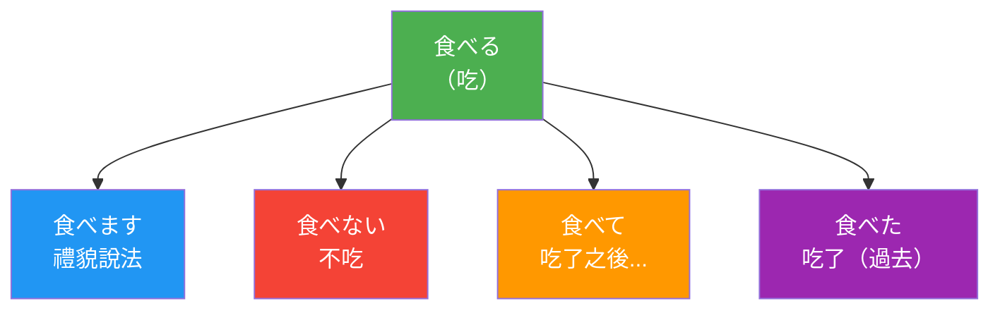
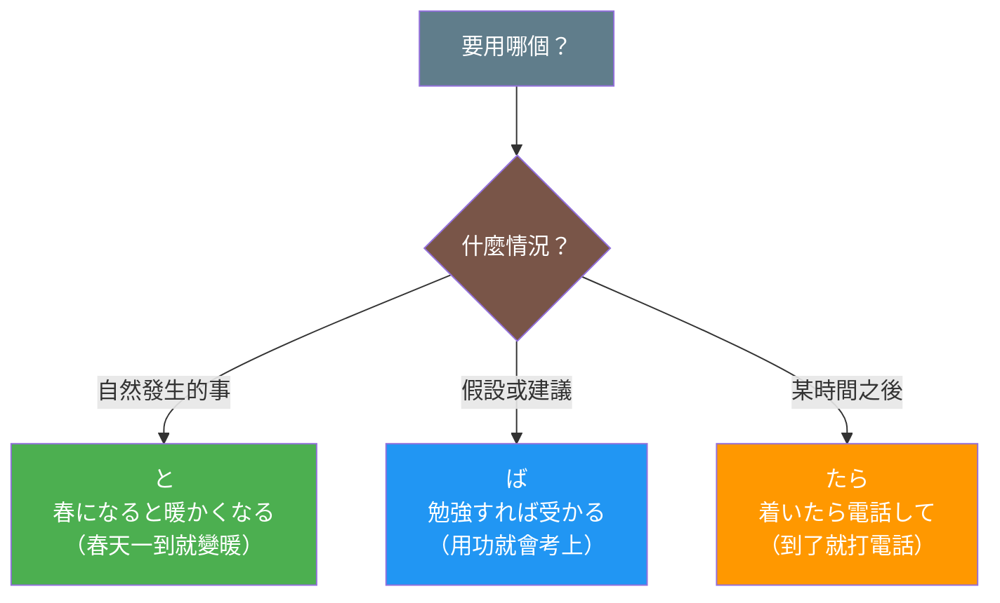
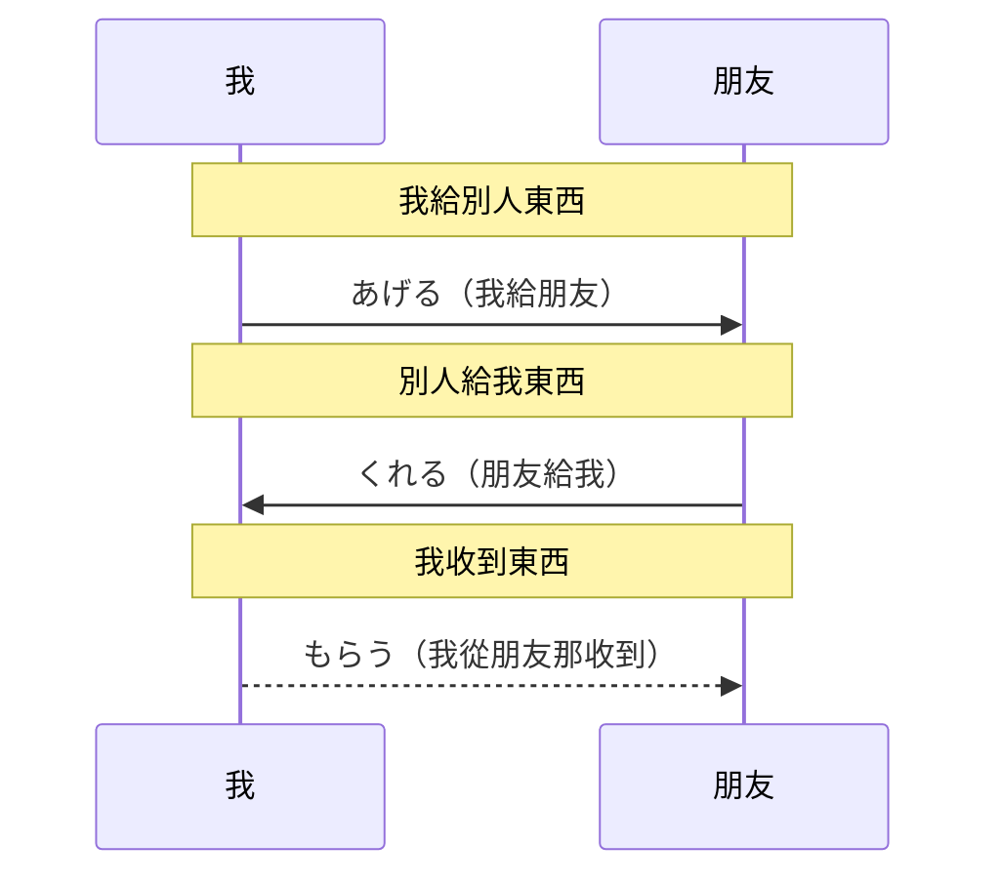
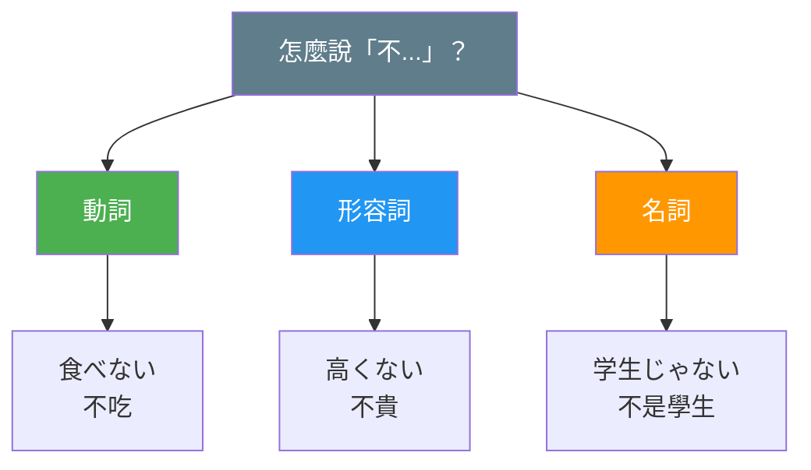
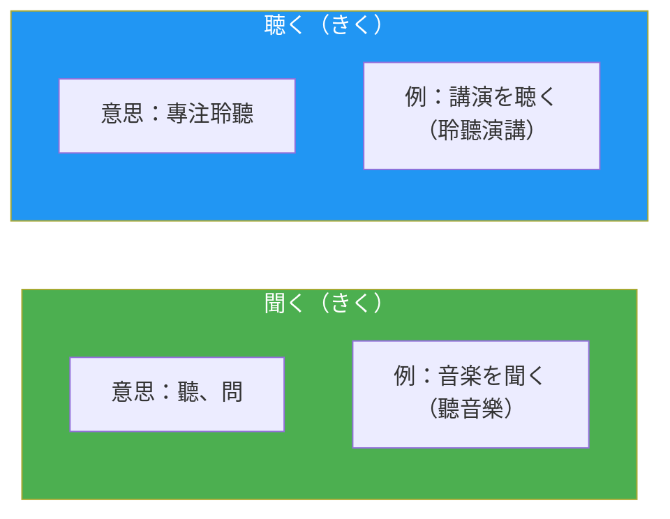

# 圖表設計指南

本指南定義了日文學習卡片中 Mermaid 圖表的設計規範，確保所有圖表符合「自解釋」原則。

---

## 核心原則

> **圖表應該獨立自解釋** - 讀者看圖就能理解概念，不需要再看文字說明

### 目標讀者

國小學生 - 詞彙量有限，需要視覺輔助理解

---

## 設計四原則

### 1. 自解釋性（Self-Explanatory）

| 要做 | 不要做 |
|------|--------|
| 節點包含日文 + 中文意思 | 只有專業術語 |
| 箭頭標籤說明關係 | 沒有標籤的箭頭 |
| 圖表獨立完整 | 依賴周圍文字 |

### 2. 國小生友善（Kid-Friendly）

| 要做 | 不要做 |
|------|--------|
| 使用簡單詞彙 | 使用專業術語 |
| 節點數量 ≤ 7 個 | 節點過多複雜 |
| 顏色區分概念 | 單色無區分 |

### 3. 視覺層次（Visual Hierarchy）

| 要做 | 不要做 |
|------|--------|
| 重要概念放起始位置 | 重要資訊隱藏在中間 |
| 流程方向清晰 | 箭頭交叉混亂 |
| 顏色區分重要性 | 顏色隨意使用 |

### 4. 具體範例（Concrete Examples）

| 要做 | 不要做 |
|------|--------|
| 每個節點有具體例子 | 只有抽象概念 |
| 例句貼近生活 | 例句過於學術 |

---

## 顏色規則

使用一致的顏色傳達語義：

| 顏色 | 用途 | 色碼 | 使用場景 |
|------|------|------|---------|
| 綠色 | 原形/基本/肯定 | #4CAF50 | 動詞原形、基本概念 |
| 藍色 | 禮貌形/正式 | #2196F3 | ます形、敬語 |
| 紅色 | 否定/禁止 | #f44336 | ない形、禁止表達 |
| 橘色 | 連接形/進行 | #FF9800 | て形、ている |
| 紫色 | 過去形 | #9C27B0 | た形、過去時態 |
| 青色 | 可能形/能力 | #00BCD4 | れる/られる |
| 灰色 | 說明/問題 | #607D8B | 問題提示、說明文字 |
| 棕色 | 判斷/條件 | #795548 | 判斷節點、條件分支 |

---

## 圖表類型選擇

根據內容特性選擇適當的圖表類型：

| 內容特性 | 推薦圖表 | 說明 |
|---------|---------|------|
| 選擇判斷（A or B or C） | flowchart | 有條件分支的決策流程 |
| 狀態變化（A → B → C） | flowchart | 形態變化、活用形 |
| 人物互動（A ↔ B） | sequenceDiagram | 授受表現、對話 |
| 分類層級（A 包含 B, C） | flowchart | 品詞分類、概念層級 |
| 對比關係（A vs B） | flowchart LR | 左右對比 |

---

## 圖表模板庫

### 模板 1：動詞活用

適用於：一段動詞、五段動詞的變化形展示



**使用說明**：
- 中心放原形（綠色）
- 各變化形放射狀排列
- 控制在 5-6 個節點

---

### 模板 2：選擇判斷

適用於：條件形選擇、助詞選擇、相似語法比較



**使用說明**：
- 問題放最上方（灰色）
- 判斷節點用菱形（棕色）
- 選項用不同顏色區分
- 每個選項包含具體例句

---

### 模板 3：授受表現

適用於：あげる/くれる/もらう、敬語授受



**使用說明**：
- 左邊固定放「我」
- 箭頭方向表示給予方向
- Note 說明每個區塊的意義

---

### 模板 4：分類層級

適用於：品詞分類、語法體系、概念分類



**使用說明**：
- 問題或總概念放最上方
- 分類用不同顏色
- 每個分類下給具體例子

---

### 模板 5：對比關係

適用於：相似詞比較、用法差異



**使用說明**：
- 左右並排對比
- 用 subgraph 分組
- 每組包含意思和例句

---

## 禁止事項

### 1. 不要使用純專業術語

```mermaid
# 壞的
flowchart TD
    A[辞書形] --> B[ます形]
    A --> C[ない形]

# 好的
flowchart TD
    A["食べる（吃）"] --> B["食べます（禮貌說法）"]
    A --> C["食べない（不吃）"]
```

### 2. 不要節點過多

- 最多 7 個節點
- 超過就拆分成多個圖表

### 3. 不要沒有顏色

- 每個節點都要設定顏色
- 顏色要有語義

### 4. 不要使用 emoji

- 會造成認知負擔
- 用顏色和文字傳達意義

### 5. 不要圖表放文章最後

- 圖表應引導閱讀
- 放在內容區塊之前

---

## 節點標籤格式

### 標準格式

```
日文<br/>（中文意思）
```

### 範例

```mermaid
A["食べる<br/>（吃）"]
B["書きます<br/>禮貌說法"]
C["春になると暖かくなる<br/>（春天一到就變暖）"]
```

### 例句格式（較長）

```mermaid
A["と<br/>春になると暖かくなる<br/>（春天一到就變暖）"]
```

---

## 檢查清單

設計圖表前，確認以下項目：

- [ ] 每個節點有日文 + 中文
- [ ] 節點數量 ≤ 7
- [ ] 使用適當的顏色
- [ ] 沒有專業術語（或已解釋）
- [ ] 流程方向清晰
- [ ] 沒有使用 emoji
- [ ] 圖表獨立可理解

---

## 更新記錄

- 2025-12-18：初版建立
