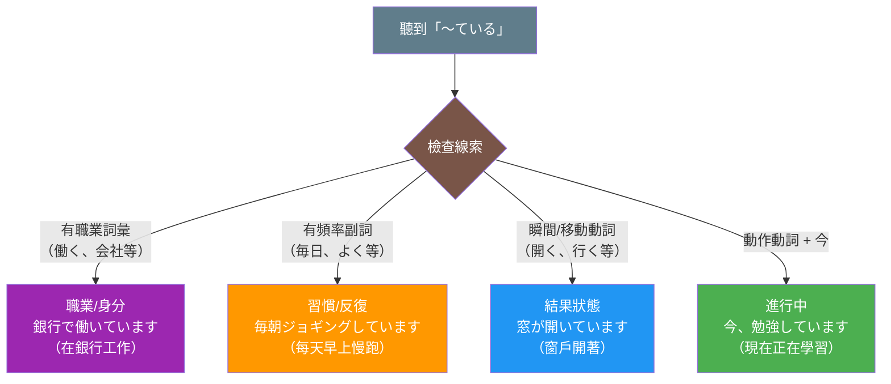

## 日文

**〜ている形の多義性**

「〜ている」は日本語で最も重要な文法パターンの一つですが、動詞の種類や文脈によって異なる意味を持ちます。主に4つの意味に分類できます：**進行中**、**結果状態の継続**、**習慣・反復**、**職業・身分**。

この多義性を理解することは、日本語を正確に理解し使用するために不可欠です。特に、同じ動詞でも文脈によって意味が変わることがあるため、注意が必要です。

## 英文解釋

**Multiple Meanings of 〜ている**

The 〜ている pattern is one of the most important yet complex grammar structures in Japanese. Its meaning varies significantly depending on the verb type and context. The four primary meanings are: **progressive action** (ongoing), **resultant state** (consequence of a completed action), **habitual action** (repeated behavior), and **occupation/status** (current role or position).

Understanding these distinctions is crucial for accurate Japanese comprehension and production, as the same verb can express different meanings depending on context.

## 中文解釋

**〜ている的多重意義**

「〜ている」是日文中最重要但也最複雜的文法結構之一。它的意義會根據動詞類型和語境產生顯著變化。四個主要意義是：**進行中的動作**（正在發生）、**結果狀態**（動作完成後的持續狀態）、**習慣性動作**（重複行為）、以及**職業/身分**（當前角色或位置）。

理解這些區別對於準確理解和使用日文至關重要，因為同一個動詞在不同語境下可以表達不同的意思。

---

## 圖解



**判斷四步驟**：
1. 職業相關詞彙（如：働く、仕事、会社）→ 職業/身分（紫色）
2. 頻率副詞（如：毎日、いつも、よく）→ 習慣/反復（橘色）
3. 瞬間/移動/狀態變化動詞 → 結果狀態（藍色）
4. 動作動詞 + 「今」或當下情境 → 進行中（綠色）

---

## 四種主要意義詳解

### 1. 動作進行中（Progressive Action）

**定義**：表示說話當下正在進行的動作

**適用動詞類型**：動作動詞（action verbs）
- 食べる（吃）、飲む（喝）、書く（寫）
- 走る（跑）、泳ぐ（游泳）、勉強する（學習）

**判斷標準**：
- ✓ 可以加時間副詞「今」（現在）、「今ちょうど」（正好現在）
- ✓ 問「何をしていますか」（在做什麼）時的回答
- ✓ 動作可以被中斷或停止
- ✗ 不用於瞬間動詞或狀態動詞

**例句**：

```
1. 今、何をしていますか。
   Ima, nani wo shite imasu ka.
   What are you doing now?
   你現在在做什麼？
   [進行中：詢問當下的動作]
```

```
2. 子どもたちが公園で遊んでいます。
   Kodomo-tachi ga kouen de asonde imasu.
   The children are playing in the park.
   孩子們正在公園玩耍。
   [進行中：觀察到正在發生的動作]
```

```
3. 今ちょうど夕飯を作っています。
   Ima choudo yuuhan wo tsukutte imasu.
   I'm making dinner right now.
   我正好現在在做晚飯。
   [進行中：強調當下時刻]
```

---

### 2. 結果狀態的持續（Resultant State）

**定義**：表示某個動作已完成，且其結果狀態持續到現在

**適用動詞類型**：
- 瞬間動詞（instantaneous verbs）：死ぬ（死）、壊れる（壞）、開く（開）
- 移動動詞（movement verbs）：行く（去）、来る（來）、帰る（回）
- 狀態變化動詞（change-of-state verbs）：結婚する（結婚）、太る（變胖）

**判斷標準**：
- ✓ 表示「已經～的狀態」
- ✓ 動作本身已完成，但結果持續
- ✗ 不能加「今」表示正在進行
- ✓ 可以用「もう」（已經）強調狀態

**例句**：

```
1. 窓が開いています。
   Mado ga aite imasu.
   The window is open.
   窗戶是開著的。
   [結果狀態：開窗的動作已完成，窗戶保持開著]
```

```
2. 彼はもう日本に行っています。
   Kare wa mou Nihon ni itte imasu.
   He has already gone to Japan (and is there now).
   他已經去日本了（現在在那裡）。
   [結果狀態：去的動作已完成，人在日本]
```

```
3. 田中さんは結婚しています。
   Tanaka-san wa kekkon shite imasu.
   Mr. Tanaka is married.
   田中先生已婚。
   [結果狀態：結婚的動作已完成，持續已婚狀態]
```

```
4. この本は古くなっています。
   Kono hon wa furuku natte imasu.
   This book has become old (is in an old state).
   這本書已經變舊了。
   [結果狀態：變舊的過程已完成，持續舊的狀態]
```

**特殊案例**：知覺動詞

```
知っている（知道）、覚えている（記得）、忘れている（忘記）
這些動詞只能用結果狀態形式，不能用進行形式。

× 今、知っています（錯誤：不能說「正在知道」）
○ 彼のことを知っています（正確：知道他的事）
```

---

### 3. 習慣・反復動作（Habitual Action）

**定義**：表示習慣性、反復性的動作

**適用動詞類型**：動作動詞（與進行中相同）

**判斷標準**：
- ✓ 必須有頻率副詞或時間表達
  - 毎日（每天）、毎朝（每天早上）、いつも（總是）
  - よく（經常）、時々（有時）、たまに（偶爾）
- ✓ 表示定期重複的行為
- ✓ 可以理解為「習慣上～」

**例句**：

```
1. 毎朝ジョギングしています。
   Maiasa jogingu shite imasu.
   I jog every morning.
   我每天早上慢跑。
   [習慣：定期重複的運動習慣]
```

```
2. 週末はよく映画を見ています。
   Shuumatsu wa yoku eiga wo mite imasu.
   I often watch movies on weekends.
   週末我經常看電影。
   [習慣：經常性的休閒活動]
```

```
3. 最近、日本語を勉強しています。
   Saikin, Nihongo wo benkyou shite imasu.
   I've been studying Japanese lately.
   最近我一直在學日文。
   [習慣：近期持續進行的活動]
```

**區別進行中 vs 習慣**：

```
進行中：今、走っています。（Now running - at this moment）
習慣：　毎日走っています。（Run every day - habitual）
```

---

### 4. 職業・身分（Occupation/Status）

**定義**：表示職業、工作或社會身分

**適用動詞類型**：
- する（做）+ 職業名詞
- 働く（工作）
- 勤める（就職）

**判斷標準**：
- ✓ 回答「何の仕事をしていますか」（做什麼工作）
- ✓ 表示當前的職業狀態
- ✓ 通常用「〜で働いている」或「〜をしている」

**例句**：

```
1. 銀行で働いています。
   Ginkou de hataraite imasu.
   I work at a bank.
   我在銀行工作。
   [職業：當前的工作地點]
```

```
2. 今、何の仕事をしていますか。
   Ima, nan no shigoto wo shite imasu ka.
   What work do you do (currently)?
   你做什麼工作？
   [職業：詢問當前職業，這裡的「今」不是「現在這一刻」]
```

```
3. 大学で日本語を教えています。
   Daigaku de Nihongo wo oshiete imasu.
   I teach Japanese at a university.
   我在大學教日文。
   [職業：當前的職業活動]
```

```
4. 会社を経営しています。
   Kaisha wo keiei shite imasu.
   I run a company.
   我經營一家公司。
   [職業：當前的職業身分]
```

---

## 判斷流程圖

```
聽到「〜ている」時，如何判斷意義？

1. 檢查是否有職業相關詞彙（働く、仕事、会社等）
   → YES：職業/身分

2. 檢查是否有頻率副詞（毎日、いつも、よく等）
   → YES：習慣/反復

3. 檢查動詞類型：
   - 瞬間動詞/移動動詞/狀態變化動詞
     → 結果狀態
   - 動作動詞 + 「今」或當下情境
     → 進行中
```

---

## 常見混淆點與錯誤

### 混淆1：進行中 vs 結果狀態

**錯誤理解**：

```
× 窓が開いています = The window is opening (正在開)
○ 窓が開いています = The window is open (已經開著)
```

**原因**：「開く」是瞬間動詞，不能表示進行中，只能表示結果狀態。

**相似例子**：
- 電気がついている（燈是開著的）← 不是「正在開」
- ドアが閉まっている（門是關著的）← 不是「正在關」

---

### 混淆2：移動動詞的特殊性

**「行く」vs「来る」的ている形式**：

```
行っている = has gone (去了，不在這裡)
来ている = has come (來了，在這裡)

例：
父は会社に行っています。
(Father has gone to the office - he's not here)
父親去公司了（不在這裡）。

友達が家に来ています。
(A friend has come to my house - they're here)
朋友來我家了（在這裡）。
```

---

### 混淆3：「知っている」不能用進行式理解

**錯誤理解**：

```
× 知っています = I'm knowing (正在知道)
○ 知っています = I know (我知道)
```

**原因**：「知る」是瞬間動詞，「知っている」只能表示「已經知道的狀態」。

**相似動詞**：
- 覚えている（記得）
- 忘れている（忘記了）
- 似ている（相似）

---

### 混淆4：同一動詞的多重意義

某些動詞可以根據語境表示不同意義：

```
走っている：

1. 進行中：
   今、走っています。(I'm running now)

2. 習慣：
   毎日走っています。(I run every day)
```

```
働いている：

1. 進行中：
   今、働いています。(I'm working right now)

2. 習慣：
   毎日8時間働いています。(I work 8 hours every day)

3. 職業：
   トヨタで働いています。(I work at Toyota)
```

**區別關鍵**：看語境和副詞！

---

## 動詞分類與意義對應表

| 動詞類型 | 主要意義 | 典型例子 | 判斷標準 |
|---------|---------|---------|---------|
| 動作動詞 | 進行中 / 習慣 | 食べている、書いている | 加「今」→進行；加頻率副詞→習慣 |
| 瞬間動詞 | 結果狀態 | 死んでいる、壊れている | 不能表示進行中 |
| 移動動詞 | 結果狀態 | 行っている、来ている | 強調位置的結果 |
| 狀態變化動詞 | 結果狀態 | 太っている、痩せている | 變化已完成 |
| 所有/穿著動詞 | 結果狀態 | 持っている、着ている | 強調持續的狀態 |
| 知覺動詞 | 結果狀態（唯一） | 知っている、覚えている | 只能用結果狀態 |

---

## 學習建議

### 初學者策略：

1. **先掌握進行中**：最常用、最直觀
2. **記憶結果狀態動詞清單**：知る、住む、持つ、着る等
3. **注意語境線索**：副詞是關鍵判斷標準

### 進階學習：

1. 理解動詞分類（動作 vs 狀態 vs 瞬間）
2. 練習判斷語境和說話者意圖
3. 注意同一動詞在不同語境的意義變化

### 常用測試題型：

```
問：下列「〜ている」表示什麼意義？

1. 雨が降っています。→ 進行中
2. 彼は大阪に住んでいます。→ 結果狀態
3. 毎日新聞を読んでいます。→ 習慣
4. 先生をしています。→ 職業
```

---

## Related Links

### 文法卡片
- [〜ている](../grammar/022_te_iru.md) - 主要文法卡片
- [て形](../grammar/001_te_form.md) - ている形的基礎
- [動詞分類](../grammar/005_verb_classification.md) - 理解動詞類型

### 動詞卡片
- [いる](../verb-irr/003_iru.md) - ている中的助動詞
- [知る](../verb-u/015_shiru.md) - 典型結果狀態動詞
- [住む](../verb-u/023_sumu.md) - 結果狀態動詞

### 比較卡片
- [ている vs た](../comparison/005_te_iru_vs_ta.md) - 完成式比較
- [進行形 vs 狀態形](../comparison/006_progressive_vs_state.md) - 動詞體系比較

---

## Footnotes

[^aspect]: Aspect（相/體）指動作的內部時間結構，與 Tense（時態）不同。日文的ている主要表示 aspect，不是 tense。

[^verb-classification]: 日文動詞可分為：動作動詞（たべる）、狀態動詞（ある）、瞬間動詞（死ぬ）、移動動詞（行く）等。分類影響ている的意義。

[^habitual-marker]: 習慣意義必須依靠頻率副詞（毎日、よく等）來明確表達，否則可能被理解為進行中。

---

**Card Type**: Comparison - Grammar Pattern
**Difficulty**: Intermediate (JLPT N5 pattern, but N3-N2 level understanding)
**Study Priority**: Critical - Essential for accurate Japanese comprehension
