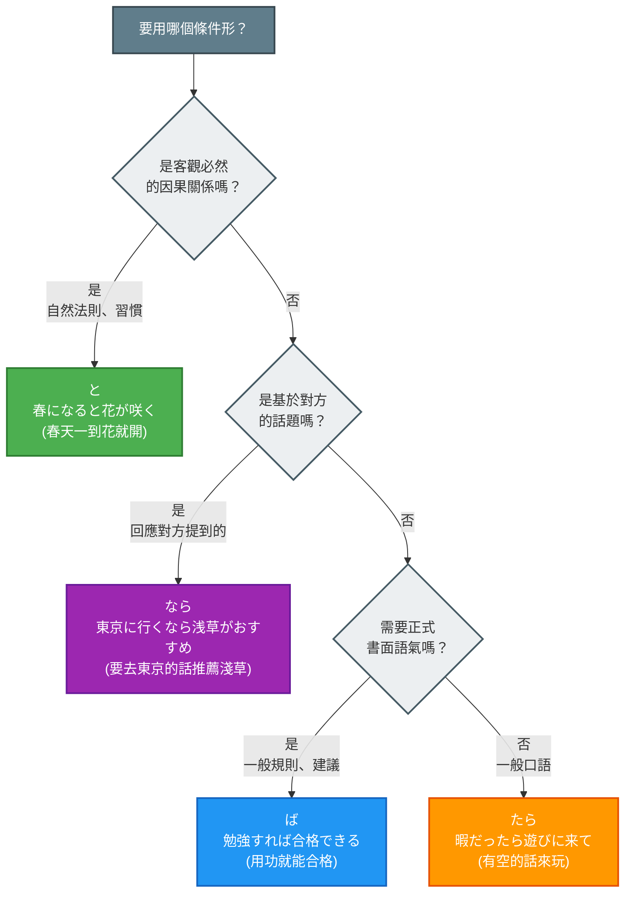

## 日文

日本語の四大条件形比較

**羅馬拼音**：Nihongo no yon-dai jōken-kei hikaku

### 四種條件形概覽

日語有四種主要的條件表達方式，每種都有其獨特的用法和語感：

| 條件形 | 形成方式 | 核心語意 | 使用場景 |
|--------|----------|----------|----------|
| **と** | 辞書形/た形 + と | 自然因果、恆常關係 | 自然法則、習慣、發現 |
| **たら** | た形 + ら | 假定條件、完成後 | 假設、完成順序、建議 |
| **ば** | 假定形 + ば | 假定條件、一般條件 | 建議、規則、比例關係 |
| **なら** | 辞書形/名詞 + なら | 話題條件、前提 | 基於已知資訊的建議 |

### 視覺化：條件形選擇流程圖



**圖表說明**：
- 綠色（と）：客觀必然的因果關係
- 藍色（ば）：正式書面的條件表達
- 橘色（たら）：最萬用的口語條件形
- 紫色（なら）：基於話題的條件建議

## 日文解釋

日本語には四つの主要な条件形（と、たら、ば、なら）があり、それぞれ異なる用法と語感を持っています。これらの違いを理解することは、日本語学習において重要なポイントです。

**「と」条件形**は、客観的な因果関係や恆常的な関係を表します。自然現象、機械の動作、習慣的な行動など、前件が成立すれば必ず後件が成立する関係を述べる際に使用します。後件には意志・命令・依頼表現を使えないという制限があります。

**「たら」条件形**は、最も汎用性が高く、口語でよく使われる条件形です。仮定条件を表すほか、前件の動作が完了した後で後件が起きる時間的な順序も表現できます。後件に制限がほとんどなく、意志・命令・依頼表現を自由に使えます。

**「ば」条件形**は、やや書面的で論理的な印象を与える条件形です。一般的な条件や仮定を表し、「〜ば〜ほど」のような比例関係の表現にも使われます。後件に過去形は使えませんが、意志・命令表現は使用可能です。

**「なら」条件形**は、相手が述べた話題や既知の情報を前提として、それに基づいた条件や提案を述べる際に使います。「もし〜なら」という形で、特定の状況や話題に対する条件付きの意見や提案を表現します。

## 英文解釋

Japanese has four main conditional forms (と, たら, ば, なら), each with distinct usage and nuances. Understanding these differences is crucial for Japanese language learners.

**The "to" conditional** expresses objective cause-and-effect relationships or habitual occurrences. It's used for natural phenomena, mechanical operations, and habitual actions where the consequent inevitably follows the antecedent. It has restrictions: cannot use volitional, imperative, or request expressions in the consequent.

**The "tara" conditional** is the most versatile and commonly used in spoken language. Besides expressing hypothetical conditions, it can also indicate temporal sequence (after completing the antecedent). It has almost no restrictions on the consequent, allowing volitional, imperative, and request expressions freely.

**The "ba" conditional** carries a slightly formal and logical nuance. It expresses general conditions or hypotheticals and is used in proportional expressions like "〜ば〜ほど" (the more... the more...). While it cannot use past tense in the consequent, volitional and imperative expressions are allowed.

**The "nara" conditional** is used to state conditions or suggestions based on topics raised by others or known information. In the form "moshi ~ nara," it expresses conditional opinions or suggestions regarding specific situations or topics.

## 中文解釋

日語有四種主要的條件形（と、たら、ば、なら），各自有不同的用法和語感。理解這些差異是日語學習的重要環節。

**「と」條件形**表達客觀的因果關係或恆常關係。用於自然現象、機械運作、習慣性行動等，前項成立時後項必然成立的關係。有限制：後項不能使用意志、命令、請求表達。

**「たら」條件形**是最萬用、在口語中最常使用的條件形。除了表示假定條件外，也可以表示前項動作完成後才發生後項的時間順序。後項幾乎沒有限制，可以自由使用意志、命令、請求表達。

**「ば」條件形**帶有較為書面化、邏輯性的語感。表達一般性條件或假設，也用於「〜ば〜ほど」（越...越...）等比例關係表達。後項不能使用過去式，但可使用意志、命令表達。

**「なら」條件形**用於基於對方提出的話題或已知資訊，陳述條件或建議。以「もし〜なら」的形式，表達針對特定情況或話題的條件性意見或建議。

## 詳細對比

### 對比 1：形成方式

| 條件形 | 動詞 | い形容詞 | な形容詞 | 名詞 |
|--------|------|----------|----------|------|
| **と** | 辞書形 + と | 高い + と | 静かだ + と | 学生だ + と |
| **たら** | た形 + ら | 高かったら | 静かだったら | 学生だったら |
| **ば** | e段 + ば | 高ければ | 静かであれば | 学生であれば |
| **なら** | 辞書形 + なら | 高いなら | 静かなら | 学生なら |

### 對比 2：後件限制

| 條件形 | 意志表達 | 命令形 | 依頼表達 | 過去形 | 發現用法 |
|--------|----------|--------|----------|--------|----------|
| **と** | ✗ | ✗ | ✗ | ✓（發現） | ✓ |
| **たら** | ✓ | ✓ | ✓ | ✓ | ✓ |
| **ば** | ✓ | ✓ | ✓ | ✗ | ✗ |
| **なら** | ✓ | ✓ | ✓ | ✗ | ✗ |

### 對比 3：核心語意差異

#### 例句對比：「春」（春天）

**と（客觀必然）**
```
春になると、花が咲く。
When spring comes, flowers bloom. (natural law)
春天一到，花就會開。（自然規律）
```

**たら（假設/完成後）**
```
春になったら、花見に行こう。
When spring comes, let's go flower viewing.
春天來了的話，我們去賞花吧。（提議）
```

**ば（一般條件）**
```
春になれば、暖かくなる。
If spring comes, it will get warm.
春天來的話，就會變暖和。（一般性陳述）
```

**なら（基於話題）**
```
春なら、桜がきれいですよ。
If it's spring, the cherry blossoms are beautiful.
如果是春天的話，櫻花很漂亮哦。（基於對方提到春天）
```

### 對比 4：使用場景總結

#### と：客觀事實、自然法則、習慣

**適用**：
- 自然現象的必然結果
- 機械操作的固定反應
- 說話者的習慣性行動
- 發現或意外的結果（後件用過去式）

**例句**
```
ボタンを押すと、ドアが開く。
When you press the button, the door opens.
按按鈕的話，門就會開。
```

#### たら：假定條件、建議、完成後

**適用**：
- 對未來的假設
- 提議和建議
- 表達完成後的行動
- 過去的假設（與事實相反）

**例句**
```
時間があったら、手伝ってください。
If you have time, please help me.
如果有時間的話，請幫我。
```

#### ば：一般規則、建議、比例關係

**適用**：
- 一般性的條件陳述
- 給予建議和忠告
- 比例關係（〜ば〜ほど）
- 較正式的條件表達

**例句**
```
もっと勉強すれば、合格できます。
If you study more, you can pass.
如果再多唸點書的話，就能合格。
```

#### なら：基於話題的條件、建議

**適用**：
- 基於對方提出的話題
- 針對已知情況的建議
- 「如果是...的話」的前提
- 對比或選擇的情境

**例句**
```
東京に行くなら、浅草がおすすめです。
If you're going to Tokyo, I recommend Asakusa.
如果要去東京的話，推薦淺草。
```

## 選擇條件形的決策樹

### Step 1：確認是否為客觀必然關係

**是** → 使用「と」
- 自然法則、機械運作、必然結果
- 例：春になると、花が咲く

**否** → 進入 Step 2

### Step 2：確認是否基於對方的話題

**是** → 使用「なら」
- 基於對方提出的情況或話題
- 例：東京なら、よく知っています

**否** → 進入 Step 3

### Step 3：確認語氣和使用場景

**需要正式、書面、比例關係** → 使用「ば」
- 一般規則、建議、〜ば〜ほど
- 例：練習すれば、上手になります

**一般口語、最萬用** → 使用「たら」
- 假設、建議、完成後
- 例：暇だったら、遊びに来てください

## 常見錯誤

### 錯誤 1：と + 意志表達

❌ 誤：暇だと、映画を見よう。
✅ 正：暇だったら、映画を見よう。
說明：「と」不能用於意志表達，應使用「たら」。

### 錯誤 2：ば + 過去式

❌ 誤：時間があれば、行きました。
✅ 正：時間があったら、行きました。
說明：「ば」的後件不能用過去式，應使用「たら」。

### 錯誤 3：混淆なら和たら

❌ 不自然：日本語を勉強したら、日本語の先生になりたいです。
✅ 自然：日本語を勉強するなら、日本語の先生になりたいです。
說明：表達「如果要...的話」的前提時，「なら」更自然。

### 錯誤 4：過度使用たら

雖然「たら」最萬用，但在特定情境下其他條件形更恰當：
- 自然法則 → 用「と」
- 正式建議 → 用「ば」
- 基於話題 → 用「なら」

## 學習要點

1. **と：客觀必然**
   - 關鍵詞：自然法則、習慣、必然結果
   - 限制：後件不能用意志、命令、依頼

2. **たら：最萬用**
   - 關鍵詞：假設、完成後、建議
   - 特點：後件幾乎無限制

3. **ば：正式邏輯**
   - 關鍵詞：一般規則、建議、比例關係
   - 限制：後件不能用過去式

4. **なら：基於話題**
   - 關鍵詞：對方的話題、已知情況、前提
   - 特點：帶有「如果是...的話」的語感

5. **實用建議**
   - 不確定時，用「たら」最安全（最萬用）
   - 陳述客觀事實、自然規律時，用「と」
   - 正式場合或書面語，優先考慮「ば」
   - 回應對方話題時，考慮「なら」

---

## 相關連結

### 四大條件形卡片
- [と條件形](../grammar/052_to-jouken.md) - 客觀因果、恆常關係
- [たら條件形](../grammar/056_tara-jouken.md) - 假定條件、完成後
- [ば條件形](../grammar/047_ba-jouken.md) - 假定條件、一般條件
- [なら條件形](../grammar/054_nara.md) - 話題條件（如有此卡片）

### 相關動詞形式
- [辞書形](../grammar/041_jishokei.md) - 條件形的基礎（如有此卡片）
- [た形](../grammar/045_ta-kei.md) - たら的基礎形式（如有此卡片）

### 相關概念
- [日語的時態和體](../concept/tense-aspect.md) - 理解條件形的時間概念（如有此卡片）
