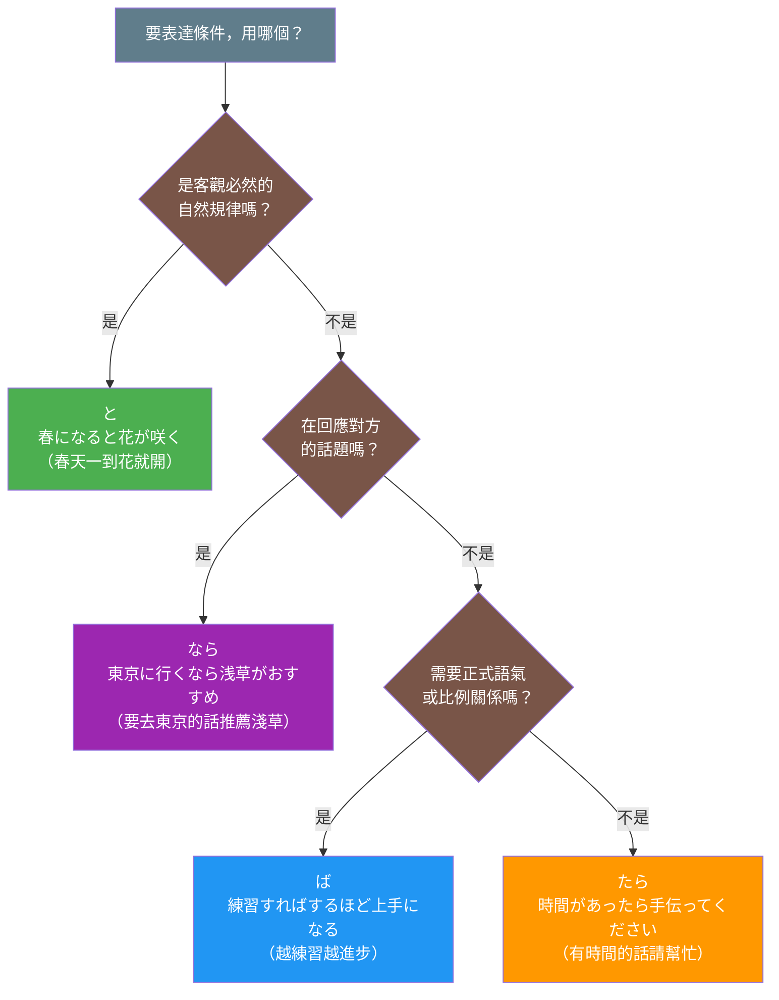

## 日文

日本語の四大条件形総対比

**羅馬拼音**：Nihongo no yon-dai jōken-kei sō-taihi

## 概述

日語的條件表達是學習者公認的重要文法點之一。日語有四種主要的條件形式：と、たら、ば、なら，每種都有其獨特的語義、語感和使用限制。掌握這四種條件形的區別，是從中級邁向高級日語的關鍵。

## 核心區別表

| 條件形 | 核心語義 | 形成方式 | 語氣特徵 | 後項限制 | 主要用途 |
|--------|----------|----------|----------|----------|----------|
| **と** | 自然因果、恆常關係 | 辞書形/た形 + と | 客觀、必然 | 不可用意志・命令・依頼 | 自然法則、習慣、發現 |
| **たら** | 假定條件、完成後 | た形 + ら | 中性、通用 | 幾乎無限制 | 假設、建議、時間順序 |
| **ば** | 假定條件、一般規則 | 假定形 + ば | 正式、邏輯 | 不可用過去式 | 建議、規則、比例關係 |
| **なら** | 話題條件、前提 | 辞書形/名詞 + なら | 主觀、回應 | 可用過去式 | 基於話題的建議 |

## と條件形

### 日文解釋

「と」条件形は、前件が成立すれば必ず後件が成立するという客観的で必然的な因果関係を表します。自然現象[^shizen-genshou]、機械の動作、習慣的な行動など、主観的な意志が入らない恆常的な関係を述べる際に使用されます。

この条件形の最大の特徴は、後件に意志表現[^ishi-hyougen]、命令形[^meirei-kei]、依頼表現[^irai-hyougen]を使えないという制限です。これは「と」が客観的・必然的な関係を表すためで、話し手の主観的な意志や行動を表現する場合は、他の条件形を使う必要があります。

また、後件に過去形を使った場合、「発見」の意味になります。つまり、前件の動作を行った結果、予期しなかった状況を発見したことを表現します。

### 英文解釋

The "to" conditional expresses an objective, inevitable cause-and-effect relationship where the consequent necessarily follows when the antecedent is realized. It describes natural phenomena, mechanical operations, and habitual actions—situations where subjective will does not factor in.

The key characteristic of this form is its restriction: you cannot use volitional expressions, imperative forms, or request expressions in the consequent. This is because "to" expresses objective and inevitable relationships. When expressing the speaker's subjective will or actions, other conditional forms must be used.

When the consequent uses past tense, it expresses "discovery"—finding an unexpected situation as a result of performing the action in the antecedent.

### 中文解釋

「と」條件形表達前項成立時，後項必然成立的客觀因果關係。用於描述自然現象、機械運作、習慣性行動等不涉及主觀意志的恆常關係。

這個條件形最大的特徵是限制：後項不能使用意志表達、命令形、請求表達。這是因為「と」表達客觀、必然的關係。若要表達說話者的主觀意志或行動，需使用其他條件形。

當後項使用過去式時，表示「發現」之意——即執行前項動作後，發現了意外的狀況。

### 核心用法

**例句 1**（自然法則）
```
春になると、桜が咲きます。
When spring comes, cherry blossoms bloom.
春天來臨時，櫻花就會開。
```

**例句 2**（機械操作）
```
このボタンを押すと、ドアが開きます。
When you press this button, the door opens.
按這個按鈕，門就會開。
```

**例句 3**（發現用法）
```
家に帰ると、誰もいなかった。
When I got home, no one was there.
回到家時，發現沒有人在。
```

## たら條件形

### 日文解釋

「たら」条件形は、日本語の条件表現の中で最も汎用性が高く、口語[^kougo]でよく使われる形式です。仮定条件[^katei-jouken]を表すだけでなく、前件の動作が完了した後で後件が起きる時間的な順序も表現できます。

この条件形の最大の利点は、後件にほとんど制限がないことです。意志表現、命令形、依頼表現を自由に使えるため、提案や勧告を表現する際に非常に便利です。また、過去形を使った反実仮想[^han-jitsu-kasou]の表現も可能です。

四つの条件形の中で、どれを使うべきか迷った場合、「たら」を選択すれば大抵の場合は問題ありません。ただし、特定の状況では他の条件形の方がより自然で適切な場合もあります。

### 英文解釋

The "tara" conditional is the most versatile conditional form in Japanese and is commonly used in spoken language. Beyond expressing hypothetical conditions, it can also indicate temporal sequence—the consequent occurring after the antecedent is completed.

The greatest advantage of this form is that it has almost no restrictions on the consequent. Volitional expressions, imperatives, and requests can be used freely, making it extremely convenient for expressing proposals and recommendations. It can also express counterfactual conditionals using past tense.

Among the four conditional forms, when unsure which to use, choosing "tara" will generally work in most situations. However, in specific contexts, other conditional forms may be more natural and appropriate.

### 中文解釋

「たら」條件形是日語條件表達中最萬用的形式，在口語中常被使用。除了表示假定條件外，還可以表示時間順序——前項動作完成後才發生後項。

這個條件形最大的優勢是後項幾乎沒有限制。可以自由使用意志表達、命令形、請求表達，因此在表達提議或勸告時非常方便。也可以使用過去式表達與事實相反的假設。

在四種條件形中，若不確定該用哪個，選擇「たら」通常不會有問題。不過，在特定情況下，其他條件形可能更自然恰當。

### 核心用法

**例句 4**（假定條件）
```
時間があったら、手伝ってください。
If you have time, please help me.
如果有時間的話，請幫我。
```

**例句 5**（完成後）
```
家に帰ったら、すぐ電話します。
When I get home, I'll call you right away.
回到家後，我會馬上打電話。
```

**例句 6**（反實假想）
```
もっと勉強したら、合格できたのに。
If I had studied more, I could have passed.
如果當時更用功的話，就能合格了。
```

## ば條件形

### 日文解釋

「ば」条件形は、やや書面的[^shomen-teki]で論理的な印象を与える条件表現です。一般的な条件や仮定を表し、アドバイスや規則を述べる際によく使われます。口語でも使われますが、「たら」と比べるとやや改まった感じがあります。

この条件形の特徴的な用法として、「〜ば〜ほど」という比例関係[^hirei-kankei]の表現があります。これは「越...越...」という意味で、ある事柄が増えるほど別の事柄も増える関係を表します。

後件には意志表現や命令形を使えますが、過去形は使えません。これは「ば」が未実現の仮定を表すためです。既に起きたことを述べる場合は「たら」や因果関係を表す「ので」「から」を使います。

### 英文解釋

The "ba" conditional carries a slightly formal and logical nuance. It expresses general conditions or hypotheticals and is often used when stating advice or rules. While used in spoken language, it feels somewhat more formal compared to "tara."

A characteristic usage of this form is the proportional expression "~ba~hodo" (the more... the more...). This indicates that as one thing increases, another thing also increases.

While volitional expressions and imperatives can be used in the consequent, past tense cannot. This is because "ba" expresses unrealized hypotheticals. For events that have already occurred, use "tara" or causal connectors like "node" or "kara."

### 中文解釋

「ば」條件形帶有較為書面化、邏輯性的語感。表達一般性條件或假設，常用於陳述建議或規則時。雖然在口語中也使用，但相比「たら」感覺稍微正式一些。

這個條件形的特徵用法是「〜ば〜ほど」的比例關係表達，意思是「越...越...」，表示某事物增加時，另一事物也隨之增加的關係。

後項可以使用意志表達或命令形，但不能使用過去式。這是因為「ば」表達尚未實現的假設。若要陳述已發生的事，應使用「たら」或因果關係的「ので」「から」。

### 核心用法

**例句 7**（一般條件）
```
もっと勉強すれば、合格できます。
If you study more, you can pass.
如果再多唸點書的話，就能合格。
```

**例句 8**（比例關係）
```
練習すればするほど、上手になります。
The more you practice, the better you become.
越練習就越進步。
```

**例句 9**（建議）
```
わからなければ、質問してください。
If you don't understand, please ask questions.
如果不明白的話，請提問。
```

## なら條件形

### 日文解釋

「なら」条件形は、相手が述べた話題[^wadai]や既知の情報[^kichi-jouhou]を前提として、それに基づいた条件や提案を述べる際に使います。「もし〜なら」という形で、特定の状況や話題に対する条件付きの意見や提案を表現します。

この条件形の特徴は、話し手が相手の発言や状況を受けて反応する際に使われることです。つまり、話題の流れの中で使われるため、文脈依存性[^bunmyaku-izon-sei]が高い条件形と言えます。

また、四つの条件形の中で唯一、後件に過去形を使うことができます。これは、相手が述べた過去の事実を前提として、それについて尋ねたり確認したりする際に使われます。

### 英文解釋

The "nara" conditional is used to state conditions or suggestions based on topics raised by others or known information. In the form "moshi~nara," it expresses conditional opinions or suggestions regarding specific situations or topics.

The characteristic of this form is that it's used when the speaker responds to the other person's statement or situation. In other words, since it's used within the flow of conversation, it's a highly context-dependent conditional form.

Additionally, among the four conditionals, only "nara" can use past tense in the consequent. This is used when asking about or confirming something based on a past fact stated by the other person.

### 中文解釋

「なら」條件形用於基於對方提出的話題或已知資訊，陳述條件或建議。以「もし〜なら」的形式，表達針對特定情況或話題的條件性意見或建議。

這個條件形的特徵是，在說話者對對方的發言或狀況作出回應時使用。換句話說，因為是在話題流程中使用，可說是高度依賴語境的條件形。

此外，在四種條件形中，只有「なら」可以在後項使用過去式。這是在以對方陳述的過去事實為前提，對此進行詢問或確認時使用。

### 核心用法

**例句 10**（基於話題）
```
東京に行くなら、浅草がおすすめです。
If you're going to Tokyo, I recommend Asakusa.
如果要去東京的話，推薦淺草。
```

**例句 11**（建議前提）
```
時間がないなら、タクシーで行きましょう。
If you don't have time, let's take a taxi.
如果沒時間的話，搭計程車去吧。
```

**例句 12**（後項過去式）
```
京都に行ったなら、金閣寺を見ましたか。
If you went to Kyoto, did you see Kinkakuji?
如果你去了京都，有看到金閣寺嗎？
```

## 詳細對比分析

### 對比 1：形成方式

| 條件形 | 動詞 | い形容詞 | な形容詞 | 名詞 |
|--------|------|----------|----------|------|
| **と** | 辞書形 + と | 高い + と | 静か**だ** + と | 学生**だ** + と |
| **たら** | た形 + ら | 高**かった**ら | 静か**だった**ら | 学生**だった**ら |
| **ば** | 仮定形 + ば | 高**ければ** | 静か**であれば** | 学生**であれば** |
| **なら** | 辞書形 + なら | 高いなら | 静か**なら** | 学生**なら** |

### 對比 2：後項限制比較

| 條件形 | 意志表達 | 命令形 | 依頼表達 | 過去形 | 發現用法 |
|--------|----------|--------|----------|--------|----------|
| **と** | ✗ | ✗ | ✗ | ✓（發現） | ✓ |
| **たら** | ✓ | ✓ | ✓ | ✓ | ✓ |
| **ば** | ✓ | ✓ | ✓ | ✗ | ✗ |
| **なら** | ✓ | ✓ | ✓ | ✓ | ✗ |

### 對比 3：語感差異

**同一情境的四種表達**：

**と（客觀必然）**
```
春になると、花が咲く。
When spring comes, flowers bloom. (natural law)
春天一到，花就會開。（自然規律）
```

**たら（假設/完成後）**
```
春になったら、花見に行こう。
When spring comes, let's go flower viewing.
春天來了的話，我們去賞花吧。（提議）
```

**ば（一般條件）**
```
春になれば、暖かくなる。
If spring comes, it will get warm.
春天來的話，就會變暖和。（一般性陳述）
```

**なら（基於話題）**
```
春なら、桜がきれいですよ。
If it's spring, the cherry blossoms are beautiful.
如果是春天的話，櫻花很漂亮哦。（基於對方提到春天）
```

## 選擇條件形的決策流程

### 步驟 1：確認是否為客觀必然關係

**問**：是否為自然法則、機械運作、必然結果？

**是** → 使用「と」
- 例：水を熱すると、沸騰する（加熱水就會沸騰）

**否** → 進入步驟 2

### 步驟 2：確認是否基於對方的話題

**問**：是否回應對方提出的情況或話題？

**是** → 使用「なら」
- 例：日本に行くなら、京都がおすすめです（要去日本的話，推薦京都）

**否** → 進入步驟 3

### 步驟 3：確認語氣和使用場景

**需要正式、書面、比例關係** → 使用「ば」
- 例：練習すればするほど、上手になる（越練習越進步）

**一般口語、最萬用** → 使用「たら」
- 例：時間があったら、遊びに来てください（有時間的話，請來玩）

## 常見錯誤

### 錯誤 1：と + 意志表達

❌ 誤：暇だと、映画を見よう。
✅ 正：暇だったら、映画を見よう。
說明：「と」表示客觀必然關係，不能用於意志表達。應使用「たら」。

### 錯誤 2：ば + 過去式

❌ 誤：時間があれば、行きました。
✅ 正：時間があったら、行きました。
說明：「ば」的後項不能用過去式。若要表達過去的假設，應使用「たら」。

### 錯誤 3：混淆なら和たら的語感

❌ 不自然：日本語を勉強したら、先生になりたいです。
✅ 自然：日本語を勉強するなら、先生になりたいです。
說明：表達「如果要...的話」這種前提時，「なら」更自然。「たら」強調時間順序。

### 錯誤 4：過度依賴たら

雖然「たら」最萬用，但在特定情境下其他條件形更恰當：
- 自然法則 → 用「と」（春になると花が咲く）
- 正式建議 → 用「ば」（勉強すれば合格できる）
- 基於話題 → 用「なら」（行くなら一緒に行こう）

## 學習要點

1. **と：客觀必然**
   - 關鍵詞：自然法則、習慣、必然結果
   - 限制：後項不能用意志、命令、依頼
   - 特殊：後項過去式表示「發現」

2. **たら：最萬用**
   - 關鍵詞：假設、完成後、建議
   - 特點：後項幾乎無限制
   - 用途：不確定時的安全選擇

3. **ば：正式邏輯**
   - 關鍵詞：一般規則、建議、比例關係
   - 限制：後項不能用過去式
   - 句型：〜ば〜ほど（越...越...）

4. **なら：基於話題**
   - 關鍵詞：對方的話題、已知情況、前提
   - 特點：帶有「如果是...的話」的語感
   - 特殊：唯一可在後項用過去式詢問

5. **實用建議**
   - 不確定時，用「たら」最安全
   - 陳述客觀事實、自然規律時，用「と」
   - 正式場合或書面語，優先考慮「ば」
   - 回應對方話題時，考慮「なら」

---

## 圖解

### 四種條件形選擇流程圖



**圖表說明**：
- **綠色（と）**：客觀必然關係，自然法則
- **橘色（たら）**：最萬用，不確定時的安全選擇
- **藍色（ば）**：正式語氣，書面化表達
- **紫色（なら）**：基於對方話題的條件

---

## 註解

[^shizen-genshou]: **自然現象** - 不受人類意志影響的客觀規律，如季節變化、天氣現象等。詳見相關概念卡片（待建立）

[^ishi-hyougen]: **意志表達** - 表示說話者或他人的意志、打算的表達方式，如「〜よう」「〜つもりだ」「〜たい」等。

[^meirei-kei]: **命令形** - 動詞的命令形態，如「行け」「食べろ」，以及禮貌的命令「〜なさい」。

[^irai-hyougen]: **依頼表達** - 表示請求或拜託的表達方式，如「〜てください」「〜てくれませんか」等。

[^kougo]: **口語** - 日常會話中使用的語言，相對於書面語（書き言葉）。口語通常較為隨意、自然。

[^katei-jouken]: **假定條件** - 假設某種情況成立時的條件表達，可能是對未來的假設或與事實相反的假設。

[^han-jitsu-kasou]: **反實假想** - 與事實相反的假設，通常用過去式表達「如果當時...的話」的意思。

[^shomen-teki]: **書面的** - 適合用於書面語或較正式場合的表達方式，相對於口語表達較為正式、邏輯性強。

[^hirei-kankei]: **比例關係** - 一個事物的變化與另一個事物的變化成正比或反比的關係。

[^wadai]: **話題** - 對話或文章中討論的主題。「なら」常用於承接對方提出的話題。

[^kichi-jouhou]: **既知的資訊** - 對話雙方都已經知道的資訊，相對於新資訊（新情報）。

[^bunmyaku-izon-sei]: **文脈依存性** - 表達的意義高度依賴前後文或對話情境，無法脫離語境理解。

---

## 相關連結

### 四大條件形個別卡片
- [と條件形](../grammar/052_to-jouken.md) - 客觀因果、恆常關係
- [たら條件形](../grammar/030_tara.md) - 假定條件、完成後
- [ば條件形](../grammar/047_ba-jouken.md) - 假定條件、一般條件
- [なら條件形](../grammar/054_nara.md) - 話題條件

### 相關動詞形式
- [辞書形](../grammar/041_jishokei.md) - 動詞基本形（待確認）
- [た形](../grammar/045_ta-kei.md) - 動詞過去形（待確認）
- [仮定形](../grammar/katei-kei.md) - 動詞假定形（待建立）

### 相關概念
- [條件形理論](../concept/037_conditional_forms.md) - 條件形的語言學分析（待確認）
- [時態與體](../concept/023_aspect_theory.md) - 理解條件形的時間概念（待確認）
- [語用學](../concept/pragmatics.md) - 條件形的語境使用（待建立）

---

**建立日期**: 2025-11-03
**最後更新**: 2025-11-03
**字數**: ~5,200
**例句數**: 12
