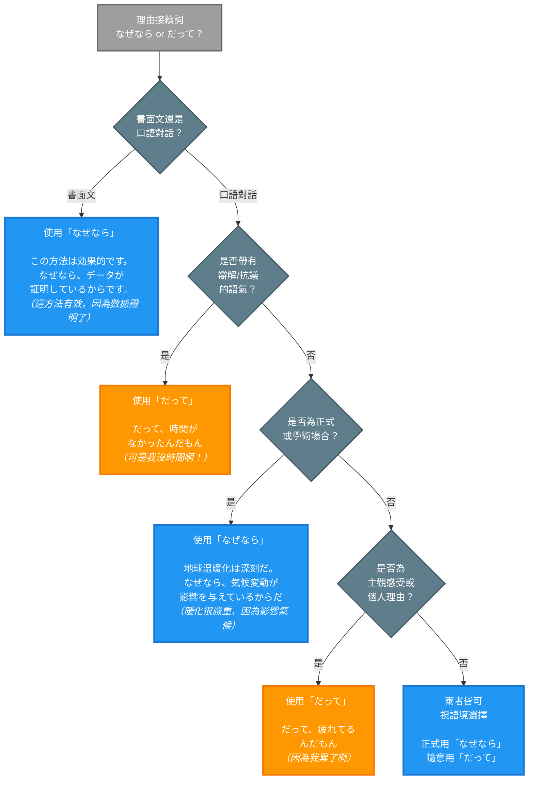

## 概述

「なぜなら」和「だって」都是用來表達理由的接續詞，但它們的使用場合、語氣正式度和語用功能有明顯差異。「なぜなら」偏向書面語，用於邏輯性的說明；「だって」則是口語表達，常帶有辯解或主觀情緒。本卡片將詳細比較這兩個理由接續詞的核心區別、使用情境和常見陷阱。

## 核心區別表

| 特徵 | なぜなら | だって |
|-----|---------|--------|
| **正式度** | 書面語、正式 | 口語、非正式 |
| **使用場合** | 說明文、論述文、學術文章 | 日常對話、辯解 |
| **位置** | 句首，獨立使用 | 句首或句中 |
| **語氣** | 客觀、邏輯性 | 主觀、情緒性 |
| **後接** | 必須接完整句子，以「からだ」「のだ」結尾 | 可接各種句型 |
| **功能** | 解釋原因（說明性） | 辯解、反駁、說明（防禦性） |
| **語用** | 提供理由證據 | 表達個人立場或反對 |

## なぜなら（Why? Because...）

### 日文解釋

「なぜなら」は書き言葉で使われる接続詞です。前に述べた事柄の理由や根拠を論理的に説明する際に用います。文章や改まった場面で使用し、客観的な説明を表します。

### 英文解釋

"nazenara" is a formal conjunction used primarily in written language. It introduces a logical explanation or reason for a previously stated fact or assertion. It appears at the beginning of a sentence and is typically followed by a complete explanation ending with "kara da" or "no da."

### 中文解釋

「なぜなら」是書面語接續詞，用於邏輯性地說明前面所述事項的理由或根據。常用於文章或正式場合，表達客觀的解釋。通常放在句首，後面必須接完整的解釋句，並以「からだ」或「のだ」結尾。

### なぜなら 的核心用法

#### 1. 提供邏輯性理由（書面語）

用於說明文、論述文中，提供客觀的理由說明：

**例句 1**
```
日本語
彼は優秀な学生です。なぜなら、毎日努力しているからです。

English
He is an excellent student. This is because he works hard every day.

繁體中文
他是個優秀的學生。因為他每天都很努力。
```

**例句 2**
```
日本語
この方法は効果的です。なぜなら、データがそれを証明しているからです。

English
This method is effective. This is because the data proves it.

繁體中文
這個方法很有效。因為數據證明了這一點。
```

#### 2. 學術或正式說明

在學術論文、正式報告中使用：

**例句 3**
```
日本語
地球温暖化は深刻な問題だ。なぜなら、気候変動が生態系に影響を与えているからだ。

English
Global warming is a serious problem. This is because climate change is affecting ecosystems.

繁體中文
全球暖化是個嚴重的問題。因為氣候變遷正在影響生態系統。
```

**例句 4**
```
日本語
この理論は重要である。なぜなら、多くの現象を説明できるからである。

English
This theory is important. This is because it can explain many phenomena.

繁體中文
這個理論很重要。因為它能解釋許多現象。
```

#### 3. 論證結構中的理由陳述

在論證結構中，清晰地標示理由部分：

**例句 5**
```
日本語
私はこの提案に反対です。なぜなら、コストが高すぎるからです。

English
I oppose this proposal. This is because the cost is too high.

繁體中文
我反對這個提案。因為成本太高了。
```

**例句 6**
```
日本語
運動は健康に良い。なぜなら、心臓機能を向上させるからだ。

English
Exercise is good for health. This is because it improves heart function.

繁體中文
運動對健康有益。因為它能改善心臟功能。
```

## だって（But... / Because...）

### 日文解釋

「だって」は話し言葉で使われる接続詞です。相手の言葉に反対したり、相手の反対を予想したりして、そうなった事情を説明する時に用います。言い訳や弁解のニュアンスを含むことが多く、主観的な理由を表します。

### 英文解釋

"datte" is a colloquial conjunction used in spoken language. It expresses opposition to what someone said or anticipates disagreement, providing a reason or excuse. It often carries a defensive or emotional tone, expressing subjective reasons or justifications.

### 中文解釋

「だって」是口語接續詞，用於反對對方的話或預期對方的反對，說明發生某事的原因。常帶有辯解或防禦的語氣，表達主觀的理由。在日常對話中頻繁使用，有時會給人孩子氣的印象。

### だって 的核心用法

#### 1. 辯解或抗議（口語）

表達防禦性的理由，常用於辯解：

**例句 7**
```
日本語
A: なんで宿題をやらなかったの？
B: だって、時間がなかったんだもん。

English
A: Why didn't you do your homework?
B: But I didn't have time!

繁體中文
A: 你為什麼沒做作業？
B: 可是我沒有時間啊！
```

**例句 8**
```
日本語
A: 遅刻しないでよ。
B: だって、電車が遅れたんだよ。

English
A: Don't be late!
B: But the train was delayed!

繁體中文
A: 不要遲到啊。
B: 可是電車誤點了啊！
```

#### 2. 表達主觀理由

說明個人的主觀感受或理由：

**例句 9**
```
日本語
だって、そんなこと知らなかったんだもん。

English
But I didn't know about that!

繁體中文
可是我不知道那件事啊！
```

**例句 10**
```
日本語
行きたくない。だって、疲れてるんだもん。

English
I don't want to go. I'm tired, you know.

繁體中文
我不想去。因為我很累啊。
```

#### 3. 反駁或不服

表達對對方說法的不服或反駁：

**例句 11**
```
日本語
A: 君は怠け者だね。
B: だって、体調が悪かったんだよ。

English
A: You're lazy, aren't you?
B: But I wasn't feeling well!

繁體中文
A: 你很懶惰耶。
B: 可是我身體不舒服啊！
```

**例句 12**
```
日本語
A: もっと頑張らないと。
B: だって、もう限界なんだよ。

English
A: You need to try harder.
B: But I'm already at my limit!

繁體中文
A: 你要更努力才行。
B: 可是我已經到極限了啊！
```

#### 4. 孩子氣的語氣

常用於孩童或撒嬌的語氣：

**例句 13**
```
日本語
だって、ママがいいって言ったもん。

English
But Mom said it was okay!

繁體中文
可是媽媽說可以啊！
```

**例句 14**
```
日本語
だって、みんなやってるんだもん。

English
But everyone else is doing it!

繁體中文
可是大家都在做啊！
```

## 關鍵對比情境

### 情境 1：正式 vs 非正式場合

**正式場合（なぜなら）**
```
日本語
この計画は実行すべきです。なぜなら、長期的な利益が期待できるからです。

English
This plan should be implemented. This is because long-term benefits can be expected.

繁體中文
應該執行這個計畫。因為可以期待長期的利益。
```

**非正式場合（だって）**
```
日本語
やりたくないよ。だって、面倒くさいんだもん。

English
I don't want to do it. Because it's too much trouble!

繁體中文
我不想做。因為很麻煩啊！
```

### 情境 2：客觀說明 vs 主觀辯解

**客觀說明（なぜなら）**
```
日本語
喫煙は健康に悪い。なぜなら、様々な病気の原因となるからだ。

English
Smoking is bad for health. This is because it causes various diseases.

繁體中文
吸菸對健康有害。因為它會導致各種疾病。
```

**主觀辯解（だって）**
```
日本語
A: タバコやめたら？
B: だって、ストレス解消になるんだもん。

English
A: Why don't you quit smoking?
B: But it helps me relieve stress!

繁體中文
A: 你不要抽菸了吧？
B: 可是這能幫我紓壓啊！
```

### 情境 3：書面文 vs 口語對話

**書面文（なぜなら）**
```
日本語
環境保護は重要である。なぜなら、未来の世代のためだからである。

English
Environmental protection is important. This is because it is for future generations.

繁體中文
環境保護很重要。因為這是為了未來的世代。
```

**口語對話（だって）**
```
日本語
A: なんでゴミを分別しないの？
B: だって、めんどくさいんだもん。

English
A: Why don't you sort your trash?
B: But it's such a hassle!

繁體中文
A: 你為什麼不分類垃圾？
B: 可是很麻煩啊！
```

### 情境 4：論文 vs 日常抱怨

**論文（なぜなら）**
```
日本語
この研究は意義深い。なぜなら、新しい視点を提供しているからだ。

English
This research is significant. This is because it provides a new perspective.

繁體中文
這項研究很有意義。因為它提供了新的視角。
```

**日常抱怨（だって）**
```
日本語
やってられないよ。だって、給料安いんだもん。

English
I can't keep doing this. My salary is too low!

繁體中文
我做不下去了。因為薪水太低了啊！
```

## 常見陷阱與錯誤

### 陷阱 1：在正式場合誤用「だって」

❌ 誤：（論文中）この理論は重要である。だって、多くの証拠があるからだ。
✅ 正：この理論は重要である。なぜなら、多くの証拠があるからだ。
說明：論文等正式文章應使用「なぜなら」。

### 陷阱 2：在口語對話中過度使用「なぜなら」

❌ 誤：（日常對話）行きたくない。なぜなら、疲れているからだ。
✅ 正：行きたくない。だって、疲れてるんだもん。
說明：日常對話中「なぜなら」顯得過於生硬，不自然。

### 陷阱 3：「なぜなら」後未以「からだ/のだ」結尾

❌ 誤：なぜなら、忙しい。
✅ 正：なぜなら、忙しいからです。
說明：「なぜなら」後必須接完整句子，並以「からだ」或「のだ」結尾。

### 陷阱 4：誤解「だって」的防禦語氣

❌ 誤：（在商務報告中）だって、予算が足りなかったんです。
✅ 正：（商務報告中）予算が不足していたため、実行できませんでした。
說明：「だって」帶有辯解語氣，不適合用於商務報告等需要專業表達的場合。

## 判斷流程圖



**圖表說明**：
- 🔵 藍色方框：使用「なぜなら」（書面語、正式）
- 🟠 橙色方框：使用「だって」（口語、辯解）
- ⚫ 灰色方框：判斷節點（決策點）

## 學習要點

1. **なぜなら = 書面語、邏輯性**：用於正式文章、學術論述、客觀說明
2. **だって = 口語、情緒性**：用於日常對話、辯解、主觀理由
3. **結尾不同**：「なぜなら」後必須以「からだ/のだ」結尾
4. **語氣差異**：「なぜなら」客觀中立，「だって」帶有防禦或撒嬌
5. **場合選擇**：正式場合用「なぜなら」，輕鬆對話用「だって」
6. **不可混用**：論文中用「だって」或對話中用「なぜなら」都不自然

## 常見問題 (FAQ)

**Q1: 「だって」是否不夠禮貌？**
A: 「だって」本身不是不禮貌，但帶有孩子氣或撒嬌的語氣，在對上司、長輩等正式場合應避免使用。與朋友或家人對話時則沒問題。

**Q2: 商務場合可以用「だって」嗎？**
A: 一般不建議。商務場合應使用更中性的理由表達，如「〜ため」「〜ので」等。「だって」可能給人不專業或幼稚的印象。

**Q3: 「なぜなら」一定要放在句首嗎？**
A: 是的。「なぜなら」必須放在句首，作為獨立的接續詞使用，不能放在句中。

**Q4: 除了「からだ」，「なぜなら」還能以什麼結尾？**
A: 常見的結尾形式包括：「からです」「からだ」「からである」「のです」「のだ」等，都是表示理由的結束形式。

## 相關連結

### 理由表達系列
- [kara](../particle/kara.md) - から助詞（基本理由）
- [node](../particle/node.md) - ので助詞（客觀理由）
- [tame](../grammar/tame.md) - ため表達（目的與理由）

### 接續詞系列
- [dakara](../conjunction/dakara.md) - だから（因此、所以）
- [soredewa](../conjunction/soredewa.md) - それでは（那麼）

### 語氣比較
- [formal_vs_casual_reasoning](../comparison/formal_vs_casual_reasoning.md) - 正式與隨意理由表達對比（待建立）
- [objective_vs_subjective_reasons](../comparison/objective_vs_subjective_reasons.md) - 客觀與主觀理由表達（待建立）
