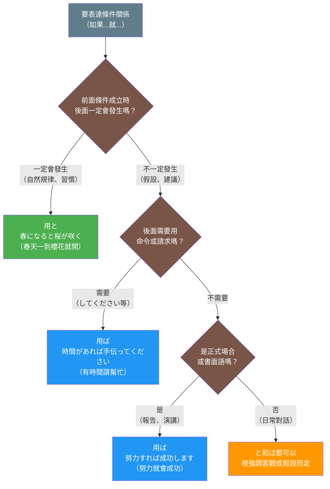
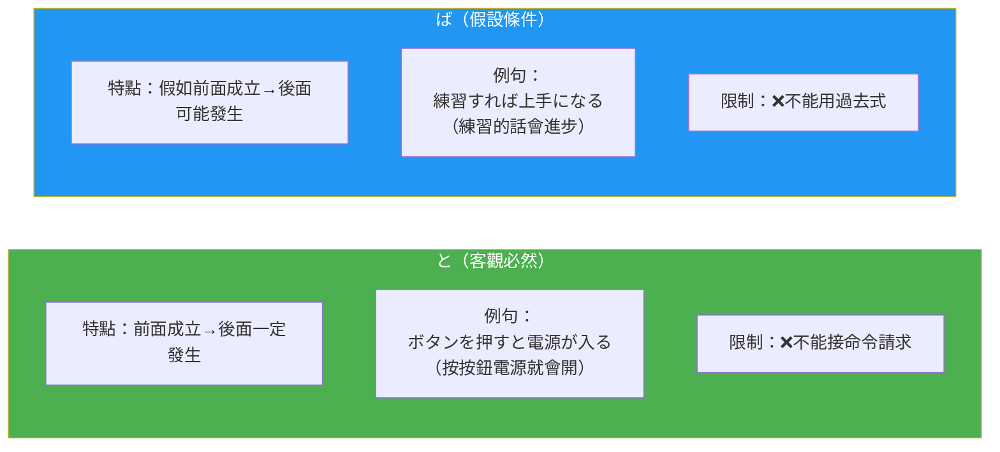

## 概述

「ば」條件形和「と」條件形是日語中兩種重要的條件表達方式，雖然都表示「如果...」的意思，但在語意、用法和使用場景上有顯著差異。「と」強調客觀必然的因果關係，而「ば」則表達一般性的假定條件。理解這兩者的區別，對於精確表達條件關係至關重要。

## 核心區別表

| 特徵 | ば條件形 | と條件形 |
|-----|---------|---------|
| **核心語意** | 假定條件、一般性條件 | 客觀因果、必然關係 |
| **形成方式** | 假定形（e段）+ ば | 辞書形/た形 + と |
| **使用語域** | 較正式、書面化 | 中性、口語和書面皆可 |
| **後件意志表達** | ✓ 可用 | ✗ 不可用 |
| **後件命令形** | ✓ 可用 | ✗ 不可用 |
| **後件請求表達** | ✓ 可用 | ✗ 不可用 |
| **後件過去式** | ✗ 不可用 | ✓ 可用（發現用法）|
| **比例關係** | ✓ 〜ば〜ほど | ✗ 不適用 |
| **主觀建議** | ✓ 適合 | ✗ 不適合 |
| **客觀事實** | △ 可用但不自然 | ✓ 最適合 |

## 圖解

### 如何選擇ば或と？



### 關鍵差異視覺化



## ば條件形

### 日文解釋

「ば」条件形は、仮定条件や一般的な条件を表す条件形です。動詞や形容詞の仮定形（e段）に「ば」を付けて作ります。

この条件形の特徴は、やや書面的で論理的な印象を与えることです。一般的な規則や原則を述べる際、アドバイスや提案を行う際、また「〜ば〜ほど」のような比例関係を表現する際に使用されます。後件には意志表現や命令形を使うことができますが、過去形は使えないという制限があります。

「ば」条件形は、話し手が一般論として条件を述べる際に使われ、「もし〜であれば」という論理的な条件提示のニュアンスを持ちます。

### 英文解釋

The "ba" conditional form expresses hypothetical or general conditions, formed by adding "ba" to the hypothetical form (e-stem) of verbs and adjectives.

This conditional form carries a somewhat formal and logical impression. It's used when stating general rules or principles, giving advice or suggestions, and expressing proportional relationships like "〜ば〜ほど" (the more... the more...). While it allows volitional expressions and imperative forms in the consequent, it cannot use past tense.

The "ba" conditional is used when the speaker presents a condition as a general proposition, carrying the nuance of "if it were the case that..."

### 中文解釋

「ば」條件形表達假定條件或一般性條件，由動詞或形容詞的假定形（e段）加上「ば」構成。

這種條件形帶有較為書面化、邏輯性的語感。用於陳述一般規則或原則、給予建議或提案，以及表達「〜ば〜ほど」（越...越...）等比例關係時。後項可以使用意志表達和命令形，但不能使用過去式。

「ば」條件形用於說話者以一般性論述來陳述條件時，帶有「如果是...的話」的邏輯性條件提示語感。

### 核心用法

**例句 1**（一般性條件）
```
早く起きれば、朝ごはんを食べられます。
If you wake up early, you can eat breakfast.
如果早起的話，就能吃早餐。
```

**例句 2**（建議）
```
もっと練習すれば、上手になりますよ。
If you practice more, you'll get better.
如果再多練習的話，就會進步哦。
```

**例句 3**（比例關係）
```
勉強すればするほど、知識が増える。
The more you study, the more knowledge you gain.
越學習，知識就越增加。
```

## と條件形

### 日文解釋

「と」条件形は、客観的な因果関係や恆常的な関係を表す条件形です。辞書形や名詞に「と」を付けて作ります。

この条件形の最大の特徴は、前件が成立すれば必ず後件が成立するという必然的な関係を表すことです。自然現象、機械的な動作、習慣的な行動など、普遍的な真理や規則的に起こる事柄を述べる際に使用されます。

重要な制限として、後件に意志表現、命令形、依頼表現を使うことができません。ただし、過去形は使用可能で、特に「〜と、〜した」という形で発見や意外な結果を表すことができます。「と」は話し手の主観を排除した、客観的な条件提示を行います。

### 英文解釋

The "to" conditional form expresses objective cause-and-effect relationships or habitual occurrences, formed by adding "to" to the dictionary form or nouns.

The defining characteristic of this conditional is that it expresses an inevitable relationship where the consequent necessarily follows if the antecedent is fulfilled. It's used for natural phenomena, mechanical operations, habitual actions, and other universal truths or regular occurrences.

An important restriction is that volitional expressions, imperative forms, and request expressions cannot be used in the consequent. However, past tense is allowed, particularly in the form "〜と、〜した" to express discovery or unexpected results. "To" presents conditions objectively, excluding the speaker's subjective intentions.

### 中文解釋

「と」條件形表達客觀的因果關係或恆常關係，由辞書形或名詞加上「と」構成。

這種條件形的最大特徵是表達前項成立時後項必然成立的關係。用於自然現象、機械性動作、習慣性行動等普遍真理或規律性發生的事物。

重要的限制是後項不能使用意志表達、命令形、請求表達。但過去式可以使用，特別是以「〜と、〜した」的形式表達發現或意外結果。「と」排除說話者的主觀意圖，進行客觀的條件提示。

### 核心用法

**例句 4**（自然現象）
```
春になると、桜が咲く。
When spring comes, cherry blossoms bloom.
春天一到，櫻花就會開。
```

**例句 5**（機械性動作）
```
このボタンを押すと、電源が入る。
When you press this button, the power turns on.
按這個按鈕的話，電源就會開啟。
```

**例句 6**（發現用法）
```
家に帰ると、誰もいなかった。
When I got home, no one was there.
回到家時，發現沒有人在。
```

## 對比情境

### 情境 1：給予建議

**ば（適合，可以提供主觀建議）**
```
野菜を食べれば、健康になります。
If you eat vegetables, you'll become healthy.
如果吃蔬菜的話，就會變健康。
```

**と（不適合，過於客觀，缺乏建議語氣）**
```
❌ 野菜を食べると、健康になります。
（聽起來像陳述事實，而非建議）
```

### 情境 2：陳述自然法則

**と（最適合，強調必然性）**
```
水を熱すると、蒸発する。
When you heat water, it evaporates.
加熱水的話，就會蒸發。
```

**ば（可用但不自然，過於假設性）**
```
△ 水を熱せば、蒸発する。
（文法正確但不自然，自然現象用「と」更好）
```

### 情境 3：習慣性行動

**と（最適合，表達習慣的必然性）**
```
朝起きると、コーヒーを飲む。
When I wake up in the morning, I drink coffee.
早上起床時，我會喝咖啡。
```

**ば（可用但語感不同，較像一般性陳述）**
```
朝起きれば、コーヒーを飲む。
If I wake up in the morning, I drink coffee.
如果早上起床的話，我會喝咖啡。
```

### 情境 4：命令或請求

**ば（可用）**
```
時間があれば、手伝ってください。
If you have time, please help me.
如果有時間的話，請幫我。
```

**と（不可用）**
```
❌ 時間があると、手伝ってください。
（文法錯誤：と不能接請求表達）
```

## 常見陷阱與錯誤

### 陷阱 1：混淆客觀與假定

❌ 誤：雨が降れば、道が濡れる。（自然現象用ば不自然）
✅ 正：雨が降ると、道が濡れる。
說明：自然現象的必然結果應使用「と」，「ば」過於假設性。

### 陷阱 2：と接意志表達

❌ 誤：時間があると、旅行しよう。
✅ 正：時間があれば、旅行しよう。
說明：「と」不能接意志表達（〜しよう），應使用「ば」或「たら」。

### 陷阱 3：ば接過去式

❌ 誤：早く来れば、間に合いました。
✅ 正：早く来ると、間に合いました。（發現用法）
✅ 正：早く来れば、間に合います。（改為非過去式）
說明：「ば」的後項不能用過去式，「と」可用於發現或意外結果。

### 陷阱 4：忽略語域差異

❌ 不自然：友達との会話で「そうすれば、問題ない」（過於正式）
✅ 自然：友達との会話で「そうしたら、問題ない」
說明：「ば」較正式，日常會話中「たら」更自然。但並非錯誤，視情境而定。

## 判斷流程

### 決策樹

```
要表達條件關係時
    ↓
問：是客觀必然的因果關係嗎？
    ├─ 是（自然現象、機械動作、必然結果）
    │   → 使用「と」
    │   例：春になると、花が咲く
    │
    └─ 否 ↓
        問：後項需要用意志、命令、請求表達嗎？
            ├─ 是
            │   → 使用「ば」（或「たら」）
            │   例：時間があれば、手伝ってください
            │
            └─ 否 ↓
                問：是正式場合或書面語嗎？
                    ├─ 是
                    │   → 優先考慮「ば」
                    │   例：努力すれば、成功します
                    │
                    └─ 否
                        → 「と」和「ば」都可，
                          視強調客觀性或假設性而定
```

### 快速判斷要點

1. **必然性**：前項成立時後項必然發生 → 用「と」
2. **建議性**：給予建議或提案 → 用「ば」
3. **後項限制**：需要意志/命令/請求 → 只能用「ば」
4. **自然現象**：普遍真理、科學事實 → 用「と」
5. **比例關係**：〜ば〜ほど結構 → 只能用「ば」

## 學習要點

1. **と的核心：客觀必然性**
   - 關鍵概念：因果關係、恆常性、必然性
   - 限制：後項不能用意志、命令、依頼表達
   - 典型用法：自然法則、習慣、發現

2. **ば的核心：假定條件**
   - 關鍵概念：假設、一般性條件、邏輯推論
   - 限制：後項不能用過去式
   - 典型用法：建議、一般規則、比例關係

3. **語域差異**
   - と：中性，口語和書面皆可
   - ば：較正式，書面語或鄭重場合

4. **實用選擇標準**
   - 陳述客觀事實、自然規律 → 用「と」
   - 給予建議、提出條件 → 用「ば」
   - 不確定時，「たら」最萬用（口語）

5. **記憶技巧**
   - と = Truth（客觀真理）
   - ば = Basis（假定基礎）
   - と強調「必然發生」，ば強調「假如成立」

---

## 相關連結

### 條件形系列
- [047_ba-jouken.md](../grammar/047_ba-jouken.md.md) - ば條件形詳細說明（待建立）
- [052_to-jouken.md](../grammar/052_to-jouken.md.md) - と條件形詳細說明（待建立）
- [056_tara-jouken.md](../grammar/056_tara-jouken.md.md) - たら條件形（待建立）
- [054_nara.md](../grammar/054_nara.md.md) - なら條件形（待建立）

### 相關比較
- [005_conditional-comparison.md](005_conditional-comparison.md.md) - 四種條件形總對比
- [tara_vs_ba.md](../comparison/tara_vs_ba.md.md) - たら vs ば 對比（待建立）
- [to_vs_tara.md](../comparison/to_vs_tara.md.md) - と vs たら 對比（待建立）

### 相關概念
- [037_conditional_forms.md](../concept/037_conditional_forms.md.md) - 條件形概念（待建立）
- [causality.md](../concept/causality.md.md) - 因果關係表達（待建立）
- [modality.md](../concept/modality.md.md) - 語氣和情態（待建立）

### 動詞形式
- [041_jishokei.md](../grammar/041_jishokei.md.md) - 辞書形（待建立）
- [katei-kei.md](../grammar/katei-kei.md.md) - 假定形（待建立）

---

**建立日期**: 2025-11-03
**最後更新**: 2025-11-03
**字數**: ~3,200
**例句數**: 6
