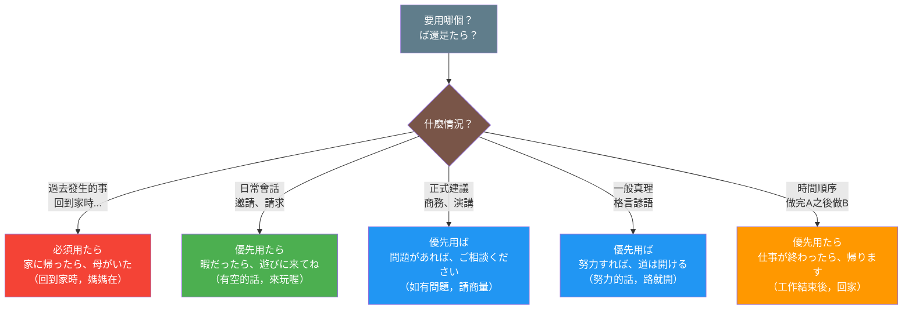

## 概述

「ば」和「たら」都是日文中表達條件的重要形式，但它們在語義、語用和使用場景上有明顯差異。「ば」偏向假設性和邏輯推論，帶有正式或書面的語氣；而「たら」則更加靈活口語，可表達假設、發現和時間先後等多種意義，是日常會話中的首選。

## 圖解



## 核心區別表

| 特徵 | ば | たら |
|-----|----|----|
| **語氣** | 正式、書面 | 口語、日常 |
| **條件性質** | 假設、潛在可能 | 假設、發現、時間先後 |
| **靈活性** | 中等 | 非常靈活 |
| **時態限制** | 主要用於現在/未來 | 可用於過去（發現） |
| **主觀意志** | 可用 | 可用 |
| **使用頻率** | 書面語較多 | 日常會話最常用 |
| **語域** | 較正式、論理的 | 中性、通用 |
| **典型場景** | 書面文章、正式建議 | 日常對話、邀請請求 |

## ば條件形

### 日文解釋

「ば」は仮定条件を表す文法形式で、やや改まった印象を与えます。主に「もし〜ならば」という論理的な条件関係を表現し、書面語や改まった会話でよく使用されます。

この形式は可能性や潜在的な条件を示し、前件が成立すれば後件が起こるという論理的な推論を表します。「努力すれば成功する」のように、一般的な真理や因果関係を述べる際にも使われます。

文語的で格調高い印象があるため、書面文章、フォーマルなスピーチ、諺などで好まれます。日常会話では「たら」に比べて使用頻度が低いですが、論理的な説得や助言の場面では効果的です。

### 英文解釋

"Ba" (ば) is a conditional form that expresses hypothetical conditions with a somewhat formal tone. It primarily conveys logical conditional relationships akin to "if...would" and is commonly used in written language and formal conversations.

This form indicates possibilities or potential conditions, expressing logical inference where the consequent would occur if the antecedent is fulfilled. It's often used to state general truths or causal relationships, as in "If you make efforts, you will succeed."

Due to its literary and refined impression, it is preferred in written texts, formal speeches, and proverbs. While less frequently used in daily conversation compared to "tara", it is effective in logical persuasion and advice-giving contexts.

### 中文解釋

「ば」是表達假設條件的文法形式，給人略微正式的印象。它主要表達邏輯性的條件關係，相當於「如果...就會」，常用於書面語和正式會話。

這個形式表示可能性或潛在條件，表達前件成立則後件發生的邏輯推論。它也用於陳述一般真理或因果關係，例如「如果努力就會成功」。

由於具有文語性和格調高雅的印象，因此在書面文章、正式演講和諺語中較受青睞。雖然在日常會話中使用頻率低於「たら」，但在邏輯說服和建議的場合很有效果。

### 形成規則

**動詞ば形**
- 一段動詞：去る + れば → 食べれば、見れば
- 五段動詞：語尾變為え段 + ば → 書く→書けば、行く→行けば
- 不規則動詞：する→すれば、来る→来れば

**い形容詞**
- 去い + ければ → 高い→高ければ、良い→良ければ

**な形容詞・名詞**
- + であれば / なら（ば） → 静かであれば、学生であれば

### 核心用法

**例句 1：假設條件（潛在可能）**
```
時間があれば、手伝います。
If I have time, I will help.
如果有時間的話，我會幫忙。
```

**例句 2：一般真理・因果關係**
```
努力すれば、必ず道は開ける。
If you make efforts, a path will surely open.
如果努力的話，道路必定會打開。
```

**例句 3：正式建議**
```
この本を読めば、理解が深まると思います。
If you read this book, I believe your understanding will deepen.
如果讀這本書的話，我認為理解會加深。
```

## たら條件形

### 日文解釋

「たら」は日本語の条件形の中で最も柔軟で使いやすい形式です。仮定条件だけでなく、発見や時間的な前後関係も表現でき、日常会話で最も頻繁に使用されます。

この形式の特徴は多義性と柔軟性です。「もし〜たら」という純粋な仮定、「〜たら、〜していた」という過去の発見、「〜たら、すぐに〜する」という時間的順序など、文脈によって様々な意味を表現できます。

口語的で自然な印象を与えるため、日常会話、カジュアルな文章、依頼や提案の表現で最も好まれます。正式な場面でも使用可能ですが、「ば」に比べるとやや砕けた印象です。

### 英文解釋

"Tara" (たら) is the most flexible and versatile conditional form in Japanese. Beyond hypothetical conditions, it can express discoveries and temporal sequences, making it the most frequently used conditional form in daily conversation.

The distinctive features of this form are its polysemy and flexibility. It can express pure hypothetical situations ("if..."), past discoveries ("when I...I found that..."), temporal sequences ("after...then..."), and more, depending on context.

Its colloquial and natural impression makes it the preferred choice in daily conversations, casual writing, requests, and suggestions. While it can be used in formal situations, it carries a slightly more casual tone compared to "ba".

### 中文解釋

「たら」是日文條件形中最靈活、最好用的形式。除了假設條件外，它還能表達發現和時間先後關係，是日常會話中使用最頻繁的條件形式。

這個形式的特點是多義性和靈活性。它可以表達純粹的假設（「如果...的話」）、過去的發現（「...時發現」）、時間順序（「...之後，馬上...」）等，根據語境可以表達各種意義。

由於給人口語化和自然的印象，因此在日常會話、輕鬆的文章、請求和建議的表達中最受青睞。雖然在正式場合也可使用，但相比「ば」顯得略微隨意一些。

### 形成規則

**動詞たら形**
- 動詞た形 + ら
- 食べた→食べたら、書いた→書いたら、した→したら

**い形容詞**
- 去い + かったら → 高い→高かったら、良い→良かったら

**な形容詞・名詞**
- だった + ら → 静かだったら、学生だったら

### 核心用法

**例句 1：假設條件**
```
暇だったら、遊びに来てください。
If you're free, please come visit.
如果有空的話，請來玩。
```

**例句 2：過去的發現**
```
家に帰ったら、母が料理を作っていた。
When I got home, my mother was cooking.
回到家時，媽媽正在做飯。
```

**例句 3：時間先後關係**
```
この仕事が終わったら、一緒に食事に行きましょう。
After this work is done, let's go eat together.
這個工作結束後，一起去吃飯吧。
```

**例句 4：建議・邀請**
```
疲れたら、休んでくださいね。
If you get tired, please rest, okay?
累了的話，請休息喔。
```

## 對比情境

### 情境 1：表達建議（語氣差異）

**例句（ば - 較正式、論理的）**
```
問題があれば、すぐに相談してください。
If there are any problems, please consult immediately.
如果有問題的話，請馬上商量。
```

**例句（たら - 較口語、親切）**
```
困ったら、いつでも連絡してね。
If you have trouble, contact me anytime.
遇到困難的話，隨時聯絡我喔。
```

**說明**：相同的建議場景，「ば」顯得更正式和邏輯化，適合上司對下屬；「たら」則更親切自然，適合朋友之間。

### 情境 2：不同的時態應用

**例句（ば - 主要用於現在/未來）**
```
明日晴れれば、ピクニックに行きましょう。
If it's sunny tomorrow, let's go on a picnic.
明天如果天晴的話，去野餐吧。
```

**例句（たら - 可用於過去發現）**
```
外を見たら、雪が降っていた。
When I looked outside, it was snowing.
看向外面時，正在下雪。
```

**說明**：「ば」通常不用於過去的發現或實際發生的事；「たら」可以靈活用於過去、現在、未來。

### 情境 3：表達一般真理

**例句（ば - 更適合格言諺語）**
```
人間は考えれば考えるほど賢くなる。
The more humans think, the wiser they become.
人越思考就越聰明。
```

**例句（たら - 也可用但較少見）**
```
練習したら、上手になる。
If you practice, you'll get better.
如果練習的話，就會進步。
```

**說明**：表達一般真理或格言時，「ば」因其文語性更常見；「たら」雖然也可以，但較口語化。

### 情境 4：日常會話邀請

**例句（ば - 略顯生硬）**
```
時間があれば、一緒に映画を見ませんか。
If you have time, shall we watch a movie together?
如果有時間的話，要不要一起看電影？
```

**例句（たら - 自然流暢）**
```
暇だったら、映画でも見に行かない？
If you're free, want to go see a movie or something?
有空的話，要不要去看個電影？
```

**說明**：日常邀請中「たら」更自然；「ば」雖然文法正確，但顯得過於正式。

## 常見陷阱與錯誤

### 陷阱 1：過度使用ば導致不自然

❌ 誤：コンビニへ行けば、一緒に来る？
✅ 正：コンビニへ行くけど、一緒に来る？ / コンビニ行くけど、来る？

**說明**：日常輕鬆的邀請不需要用條件形，直接用「けど」連接更自然。過度使用「ば」會讓對話顯得生硬和不自然。

### 陷阱 2：用ば表達過去發現

❌ 誤：家に帰れば、誰もいなかった。
✅ 正：家に帰ったら、誰もいなかった。

**說明**：「ば」不適合表達已發生的事實或過去的發現。這種情況必須用「たら」。「ば」主要用於假設性的未來或一般性的條件。

### 陷阱 3：混淆正式度導致語氣不當

❌ 誤：お母さん、お腹が空けば、ご飯を作ってください。（過於正式僵硬）
✅ 正：お母さん、お腹空いたら、ご飯作って。

**說明**：對家人說話時用「ば」顯得過於正式和疏遠。「たら」更符合家庭內部的親密語氣。

### 陷阱 4：在需要正式建議時用たら

❌ 誤：ご質問がありましたら、遠慮なくお尋ねください。（可接受，但較口語）
✅ 正：ご質問がございましたら、遠慮なくお尋ねください。（更正式）
⭕ 更佳：ご不明な点がございましたら、お気軽にお問い合わせください。

**說明**：在非常正式的商務或公文場合，「ば」形式（配合適當的敬語）會更恰當。但「たら」也不算錯誤，只是略顯輕鬆。

### 陷阱 5：誤用ば於時間順序

❌ 誤：会議が終われば、報告書を書きます。（語意模糊）
✅ 正：会議が終わったら、報告書を書きます。

**說明**：表達「完成A之後做B」的時間順序時，「たら」更明確自然。「ば」雖然文法正確，但容易被理解為假設條件而非時間先後。

## 判斷流程

選擇「ば」或「たら」的決策流程：

```
表達條件時
    ↓
問：是否表達過去的發現或已發生的事？
    ├─ 是 → 必須使用「たら」
    └─ 否 ↓
        問：是否在非常正式的場合（商務文書、演講）？
            ├─ 是 → 優先使用「ば」
            └─ 否 ↓
                問：是否表達一般真理或格言？
                    ├─ 是 → 「ば」較適合
                    └─ 否 ↓
                        問：是日常會話還是書面語？
                            ├─ 日常會話 → 使用「たら」（最自然）
                            └─ 書面語 → 根據語氣選擇
                                ├─ 論理的、改まった → 「ば」
                                └─ 一般的、説明的 → 「たら」也可
```

## 學習要點

1. **靈活性差異**：「たら」是萬用條件形，可用於假設、發現、時間；「ば」主要用於假設條件
2. **語氣層次**：「ば」較正式、書面，「たら」較口語、日常
3. **時態限制**：「ば」不用於過去發現，「たら」可用於所有時態
4. **使用頻率**：日常會話中「たら」遠多於「ば」
5. **文體選擇**：書面文章、格言諺語傾向用「ば」；會話、輕鬆文章傾向用「たら」
6. **多義性**：「たら」具有假設、發現、時間三種意義；「ば」主要表假設
7. **正式建議**：給建議時「ば」顯得更理性邏輯，「たら」顯得更親切溫和
8. **避免過度使用**：日常會話中不要過度使用「ば」，容易顯得生硬；「たら」更自然通用

## 相關連結

### 基礎文法
- [conditional_ba](../grammar/conditional_ba.md) - ば條件形詳解（待建立）
- [conditional_tara](../grammar/conditional_tara.md) - たら條件形詳解（待建立）

### 相關比較
- [to_vs_tara](to_vs_tara.md) - と與たら的區別（待建立）
- [nara_vs_tara](nara_vs_tara.md) - なら與たら的區別（待建立）
- [ba_vs_to](ba_vs_to.md) - ば與と的區別（待建立）

### 概念卡片
- [conditional_forms](../concept/conditional_forms.md) - 條件形總覽（待建立）
- [hypothetical](../concept/hypothetical.md) - 假設性表達（待建立）
- [formality_levels](../concept/formality_levels.md) - 日文的正式度層次（待建立）

### 延伸說明
- [conditional_usage](../extension/conditional_usage.md) - 條件形的實際應用（待建立）
- [spoken_vs_written](../extension/spoken_vs_written.md) - 口語與書面語的選擇（待建立）

---

**建立日期**: 2025-10-31
**最後更新**: 2025-10-31
**字數**: ~4500
**例句數**: 14
