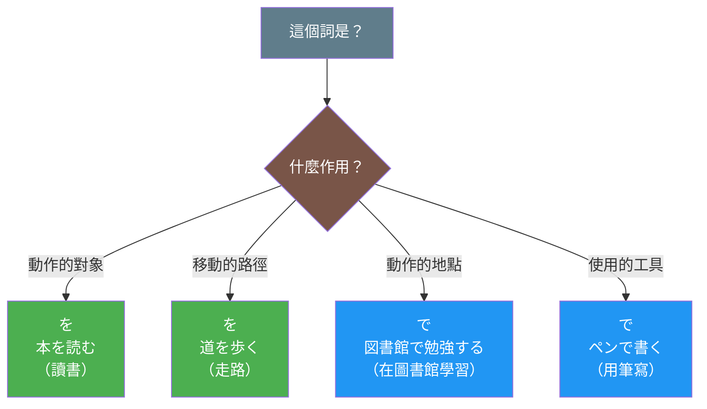

## 概述

「を」和「で」是日語中最基礎且最常用的兩個助詞，但它們的功能截然不同。「を」主要標示動作的直接賓語和移動的經過點，而「で」則表示動作發生的場所、手段、方法等。理解這兩個助詞的區別對於建立正確的日語句子結構至關重要。

## 圖解

### を vs で 功能分類圖



**圖表說明**：
- 綠色節點：を 的兩種用法（動作對象、移動路徑）
- 藍色節點：で 的兩種用法（動作地點、使用工具）
- 判斷方法：問自己「這個詞在句子裡是什麼作用？」

## 核心區別表

| 特徵 | を | で |
|-----|----|----|
| **基本功能** | 賓語標記（Object Marker）<br>經過點標記（Route Marker） | 場所標記（Location Marker）<br>手段標記（Means Marker） |
| **標示對象** | 動作的直接對象<br>移動的路徑 | 動作發生的場所<br>動作的手段、工具 |
| **配合動詞** | 他動詞（如：食べる、読む）<br>移動動詞（如：歩く、飛ぶ） | 動作動詞（如：勉強する、遊ぶ）<br>所有動詞（手段用法） |
| **問句** | 何を？（做什麼？）<br>どこを？（經過哪裡？） | どこで？（在哪裡做？）<br>何で？（用什麼？） |
| **語義焦點** | 動作作用於什麼對象<br>動作經過什麼地方 | 動作在哪裡發生<br>動作如何進行 |
| **典型搭配** | を + 他動詞<br>を + 移動動詞 | で + 動作動詞（場所）<br>で + 任何動詞（手段） |

## を（賓語標記 / 經過點標記）

### 日文解釋

「を」は格助詞の一つで、主に二つの重要な機能を持っています。第一に、他動詞の直接目的語を標示する機能です。動作が何に対して行われるかを明示します。第二に、移動動詞と共に使われ、移動の経路や通過点を表します。この助詞は日本語の基本的な文構造において不可欠な要素であり、動作と対象の関係を明確にする役割を果たします。

### 英文解釋

"wo" (を) is a case-marking particle with two primary functions. First, it marks the direct object of transitive verbs, indicating what the action is performed on. Second, when used with movement verbs, it indicates the route or path of movement. This particle is fundamental to Japanese sentence structure, clarifying the relationship between actions and their objects or paths.

### 中文解釋

「を」是格助詞，主要有兩個重要功能。第一，標示他動詞的直接賓語，表明動作作用於什麼對象。第二，與移動動詞搭配時，表示移動的路徑或經過點。這個助詞是日語基本句型結構中不可或缺的元素，用於明確動作與對象或路徑之間的關係。

### を 的核心用法

#### 1. 標示直接賓語

表示動作作用的直接對象：

**例句 1**
```
朝ごはんを食べます。
I eat breakfast.
我吃早餐。
```

**例句 2**
```
本を読みます。
I read a book.
我讀書。
```

**例句 3**
```
水を飲みます。
I drink water.
我喝水。
```

#### 2. 標示移動的經過點

表示移動時經過或穿越的地方：

**例句 4**
```
道を歩きます。
I walk along the road.
我走在路上。
```

**例句 5**
```
空を飛びます。
(A bird) flies through the sky.
（鳥）在天空飛。
```

**例句 6**
```
公園を散歩します。
I take a walk through the park.
我在公園散步。
```

## で（場所標記 / 手段標記）

### 日文解釋

「で」は格助詞の一つで、非常に多様な用法を持つ重要な助詞です。主な機能は二つあります。第一に、動作が行われる場所を示します。これは存在の場所を示す「に」とは異なり、動作や活動が実際に行われる場所を表します。第二に、動作の手段や方法を示します。道具、交通手段、材料、方法など、動作がどのように行われるかを明示する際に使用されます。この助詞は日常会話において極めて頻繁に使用され、文脈に応じて柔軟に機能します。

### 英文解釋

"de" (で) is a versatile case-marking particle with multiple important functions. First, it indicates the location where an action takes place, distinct from "ni" (に) which marks existence. Second, it marks the means or method by which an action is performed, including tools, transportation, materials, or methods. This particle is extremely common in daily conversation and adapts flexibly to various contexts.

### 中文解釋

「で」是格助詞，具有多種重要用法。第一，標示動作發生的場所，這與表示存在場所的「に」不同，「で」強調動作或活動實際進行的地點。第二，標示動作的手段或方法，包括工具、交通工具、材料或方式等。這個助詞在日常對話中使用頻率極高，能夠根據語境靈活運用。

### で 的核心用法

#### 1. 標示動作場所

表示動作或活動發生的地點：

**例句 7**
```
図書館で勉強します。
I study at the library.
我在圖書館學習。
```

**例句 8**
```
レストランで食事をします。
I have a meal at a restaurant.
我在餐廳吃飯。
```

**例句 9**
```
公園で遊びます。
I play in the park.
我在公園玩。
```

#### 2. 標示手段或工具

表示進行動作的工具或方法：

**例句 10**
```
箸で食べます。
I eat with chopsticks.
我用筷子吃。
```

**例句 11**
```
ペンで書きます。
I write with a pen.
我用筆寫。
```

**例句 12**
```
電車で行きます。
I go by train.
我搭電車去。
```

## 關鍵對比情境

### 情境 1：「を」作為賓語 vs 「で」作為場所

這是最常見的對比情境，兩者在同一句中可以同時出現：

**例句 13**
```
図書館で本を読みます。
I read a book at the library.
我在圖書館讀書。
```

**分析**：
- 「で」標示場所（圖書館 = 動作發生的地方）
- 「を」標示賓語（本 = 動作的對象）

**例句 14**
```
レストランでパスタを食べます。
I eat pasta at a restaurant.
我在餐廳吃義大利麵。
```

**分析**：
- 「で」= 場所（餐廳）
- 「を」= 賓語（義大利麵）

### 情境 2：「を」的經過點用法 vs 「で」的場所用法

**例句 15（經過點 - を）**
```
公園を散歩します。
I take a walk through the park.
我穿過公園散步。
```

**例句 16（動作場所 - で）**
```
公園で散歩します。
I take a walk in the park.
我在公園散步。
```

**區別說明**：
- 「公園を散歩する」= 穿過公園、以公園為路徑
- 「公園で散歩する」= 在公園內散步、以公園為活動範圍

### 情境 3：移動動詞的複雜組合

**例句 17**
```
道を電車で行きます。
I go along the road by train.
我搭電車沿著這條路去。
```

**分析**：
- 「を」= 經過的路徑（道路）
- 「で」= 手段（電車）

### 情境 4：「を」無法用於非他動詞

**例句 18（正確）**
```
ここで待ちます。
I wait here.
我在這裡等。
```

**例句 19（錯誤）**
```
❌ ここを待ちます。
（「待つ」不是移動動詞，不能用「を」）
```

**說明**：「を」只能與他動詞（標示賓語）或移動動詞（標示經過點）搭配，不能與其他類型的動詞（如「待つ」）搭配。

### 情境 5：「で」的手段用法

**例句 20**
```
何で来ましたか。
How did you come? / What did you come by?
你怎麼來的？
```

**例句 21**
```
電車で来ました。
I came by train.
我搭電車來的。
```

**注意**：此處「で」表示手段（交通工具），與場所用法不同。

## 常見陷阱與錯誤

### 陷阱 1：混淆「を」的賓語用法和「で」的場所用法

❌ 誤：図書館を勉強します。
✅ 正：図書館で勉強します。
說明：「勉強する」需要場所標記（で），不能用賓語標記（を）。「を」只能標示「何を勉強するか」（學習什麼）。

**正確組合**：
```
図書館で日本語を勉強します。
I study Japanese at the library.
我在圖書館學日語。
```

### 陷阱 2：誤用「を」標示非移動的場所

❌ 誤：教室を座ります。
✅ 正：教室で座ります。（雖然「座る」通常用「に」）
更佳：椅子に座ります。
說明：「座る」不是移動動詞，不能用「を」標示經過點。

### 陷阱 3：忘記「を」的經過點用法

❌ 欠佳：公園に散歩します。
✅ 較佳：公園を散歩します。
✅ 也對：公園で散歩します。
說明：
- 「を」強調「穿過公園」的路徑
- 「で」強調「在公園內」的活動範圍
- 兩者語義略有不同，但都是正確的

### 陷阱 4：「で」的手段用法與場所用法混淆

**例句 22（手段）**
```
バスで行きます。
I go by bus.
我搭公車去。
```

**例句 23（場所）**
```
バスで寝ます。
I sleep on the bus.
我在公車上睡覺。
```

**區別**：
- 「バスで行く」= 搭公車去（手段）
- 「バスで寝る」= 在公車上睡覺（場所）

### 陷阱 5：多個助詞的順序錯誤

❌ 誤：本を図書館で読みます。（語序不自然）
✅ 正：図書館で本を読みます。
說明：日語中通常「場所（で）」在前，「賓語（を）」在後。

## 判斷流程圖

```
┌─────────────────────────────┐
│ 需要使用助詞標示？          │
└─────────┬───────────────────┘
          │
          ▼
    是標示動作對象嗎？
          │
    ┌─────┴─────────┐
    │                 │
   是                否
    │                 │
    ▼                 ▼
  使用「を」    是標示場所嗎？
  （賓語）            │
                ┌─────┴─────┐
                │             │
               是            否
                │             │
                ▼             ▼
          是存在場所？    是手段/方法嗎？
                │             │
          ┌─────┴─────┐     │
          │             │     │
         是            否     是
          │             │     │
          ▼             ▼     ▼
        使用「に」  使用「で」 使用「で」
        （存在）    （動作場所）（手段）
                      │
                      ▼
                是移動經過點？
                      │
                ┌─────┴─────┐
                │             │
               是            否
                │             │
                ▼             ▼
              使用「を」  保持「で」
              （經過點）  （動作場所）
```

## 記憶技巧

### 技巧 1：助詞功能記憶口訣

**を的記憶**：
- **目的語**：「何**を**？」（做什麼？）
- **經過點**：「どこ**を**？」（經過哪裡？）

**で的記憶**：
- **場所**：「どこ**で**？」（在哪裡？）
- **手段**：「何**で**？」（用什麼？）

### 技巧 2：問句測試法

當不確定使用哪個助詞時，用問句測試：

```
質問：何を食べますか。
回答：りんごを食べます。
（を = 賓語）

質問：どこで食べますか。
回答：レストランで食べます。
（で = 場所）

質問：何で行きますか。
回答：電車で行きます。
（で = 手段）
```

### 技巧 3：動詞類型聯想

**他動詞 → を（賓語）**
- 食べる（吃）→ りんごを食べる
- 読む（讀）→ 本を読む
- 書く（寫）→ 手紙を書く

**動作動詞 + 場所 → で**
- 勉強する → 図書館で勉強する
- 遊ぶ → 公園で遊ぶ
- 働く → 会社で働く

**移動動詞 + 經過點 → を**
- 歩く → 道を歩く
- 走る → 廊下を走る
- 飛ぶ → 空を飛ぶ

### 技巧 4：視覺化記憶

想像一個場景：

**を（賓語）**：動作的箭頭指向對象
```
私 ──→ りんご（を）食べる
（我吃蘋果 = 動作指向蘋果）
```

**で（場所）**：動作發生在某個空間內
```
図書館【で】→ 勉強する
（在圖書館這個空間內學習）
```

**で（手段）**：使用工具或方法
```
箸【で】→ 食べる
（使用筷子作為工具）
```

## 學習要點

1. **を = 賓語 + 經過點**：標示動作對象或移動路徑
2. **で = 場所 + 手段**：標示動作發生地或使用方法
3. **可以同時使用**：「図書館で本を読む」（場所 + 賓語）
4. **動詞類型決定用法**：他動詞配「を」，動作動詞配「で」（場所）
5. **問句測試最準確**：「何を」vs「どこで」vs「何で」

## 常見問題 (FAQ)

**Q1: 為什麼「公園を散歩する」和「公園で散歩する」都對？**
A: 兩者語義略有不同：
- 「公園を散歩する」= 穿過公園、以公園為路徑（強調移動）
- 「公園で散歩する」= 在公園內散步（強調活動範圍）

**Q2: 「電車で」是場所還是手段？**
A: 取決於動詞：
- 「電車で行く」= 手段（搭電車去）
- 「電車で寝る」= 場所（在電車上睡覺）

**Q3: 可以說「ここを勉強します」嗎？**
A: 不可以。「勉強する」不是移動動詞，只能用「ここで勉強します」。

**Q4: 「道を歩く」為什麼不能用「で」？**
A: 「歩く」是移動動詞，「道」是移動的經過點（路徑），所以用「を」。但如果強調在道路這個空間內活動，也可以說「道で遊ぶ」（在路上玩）。

**Q5: 「を」和「で」可以同時標示同一個名詞嗎？**
A: 不可以。一個名詞只能有一個格助詞。例如：
- ✅ 図書館で本を読む（場所 + 賓語，兩個不同名詞）
- ❌ 図書館をで読む（同一名詞不能同時用兩個格助詞）

## 相關連結

### 基礎助詞
- [003_wo](../particle/003_wo.md) - を助詞（賓語、經過點）
- [005_de](../particle/005_de.md) - で助詞（場所、手段、方法）
- [008_ni](../particle/008_ni.md) - に助詞（目的地、存在場所、時間）

### 相關比較
- [002_de_vs_ni_location](002_de_vs_ni_location.md) - で vs に 場所用法比較
- [001_ga_vs_wa](001_ga_vs_wa.md) - が vs は 助詞比較

### 相關概念
- [particle_system](particle_system.md) - 日語助詞系統概述（待建立）
- [transitive_verbs](transitive_verbs.md) - 他動詞與賓語（待建立）
- [location_particles](location_particles.md) - 場所助詞總整理（待建立）

### 延伸說明
- [particle_combination](particle_combination.md) - 助詞組合規則（待建立）
- [particle_order](particle_order.md) - 句子中助詞的順序（待建立）

---

**建立日期**: 2025-11-03
**最後更新**: 2025-11-03
**字數**: ~4,800
**例句數**: 23
