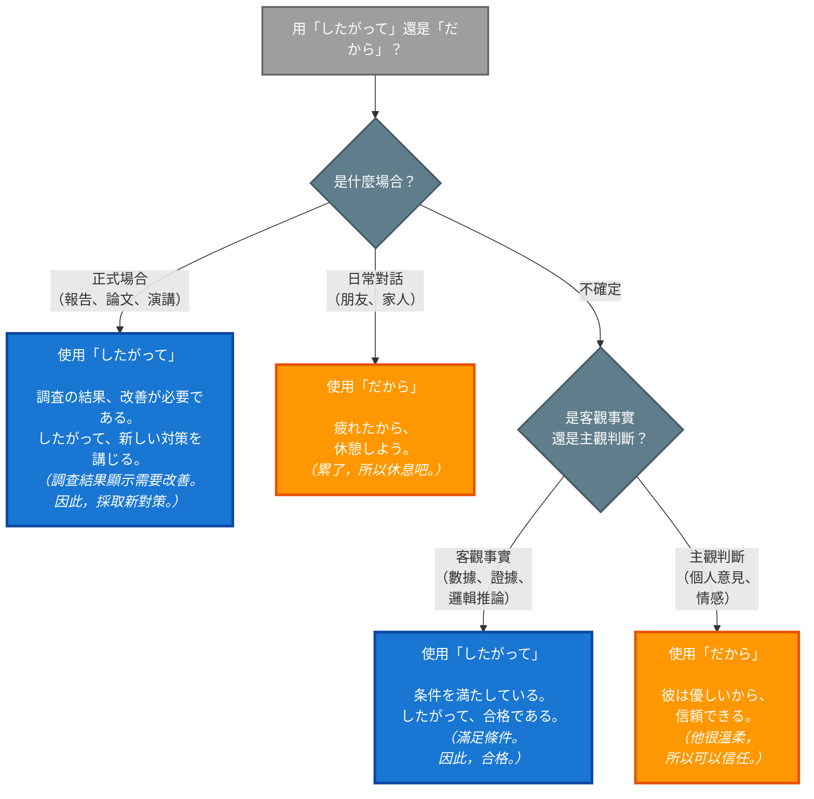

## 概述

「したがって」和「だから」都是表達因果關係的接續詞，意思都是「因此、所以」。但兩者在正式度、語氣強度、使用場合上有明顯差異。「したがって」屬於書面語和正式場合用語，語氣客觀嚴謹；「だから」則是口語常用詞，語氣直接隨意。選擇錯誤會導致語域不當，影響表達效果。

## 核心區別表

| 特徵 | したがって | だから |
|-----|----------|-------|
| **正式度** | 正式（Formal） | 非正式（Informal） |
| **使用場合** | 書面語、演講、報告、學術文章 | 日常對話、口語、非正式書信 |
| **語氣** | 客觀、嚴謹、理性 | 主觀、直接、隨意 |
| **因果強度** | 必然性高（邏輯推論） | 可強可弱（個人判斷） |
| **主觀性** | 客觀陳述 | 可帶主觀判斷 |
| **漢字寫法** | 従って（常用漢字） | 通常只寫平假名 |
| **同義詞** | よって、ゆえに | そのため、そういうわけで |

## したがって（従って）

### 日文解釋

「したがって」は、前に述べた事実や理由から必然的に導かれる結果を示す接続詞です。客観的で論理的なつながりを表し、書き言葉や改まった場面で使われます。話者の主観的な判断ではなく、事実に基づく論理的な帰結を示します。

### 英文解釋

"shitagatte" is a formal conjunction meaning "therefore," "consequently," or "accordingly." It indicates a logical conclusion or necessary result derived from the preceding statement. It is primarily used in written language, formal speeches, academic writing, and official contexts. It emphasizes objective, logical reasoning rather than subjective judgment.

### 中文解釋

「したがって」是正式的接續詞，意為「因此、所以、從而」，表示從前述事實或理由必然推導出的結果。主要用於書面語、正式演講、學術論文和公文等場合。強調客觀的邏輯推理，而非主觀判斷。

### したがって 的核心用法

#### 1. 書面語、學術論述

表達邏輯性強的因果關係：

**例句 1**
```
実験の結果、仮説が正しいことが証明された。したがって、この理論は妥当である。
The experiment proved the hypothesis correct. Therefore, this theory is valid.
實驗證明了假說的正確性。因此，這個理論是妥當的。
```

**例句 2**
```
契約書の条項に違反している。したがって、契約を解除する権利がある。
You violated the contract terms. Accordingly, we have the right to terminate the contract.
您違反了合約條款。因此，我方有權解除合約。
```

#### 2. 正式報告、演講

用於正式場合的理性陳述：

**例句 3**
```
今年度の売上は目標を達成した。したがって、来年度の予算を増額する。
This year's sales met the target. Therefore, we will increase next year's budget.
本年度銷售達成目標。因此，明年度將增加預算。
```

**例句 4**
```
現在の状況を考慮すると、計画の変更が必要である。したがって、次の会議で新しい案を提示する。
Considering the current situation, a plan change is necessary. Accordingly, we will present a new proposal at the next meeting.
考慮到目前狀況，有必要變更計劃。因此，我們將在下次會議上提出新方案。
```

#### 3. 法律、公文

表達必然性的法律推論：

**例句 5**
```
この証拠により被告の犯行が明らかになった。したがって、有罪判決を下す。
This evidence revealed the defendant's guilt. Therefore, we render a guilty verdict.
這項證據證明了被告的犯行。因此，判決有罪。
```

#### 4. 客觀的因果關係

不帶主觀判斷的客觀陳述：

**例句 6**
```
気温が0度以下である。したがって、水は凍る。
The temperature is below 0°C. Therefore, water freezes.
氣溫在零度以下。因此，水會結冰。
```

## だから

### 日文解釋

「だから」は、前に述べた理由や原因から結論を導く接続詞です。日常会話でよく使われ、話し言葉的な表現です。話者の主観的な判断や個人的な意見を含むことができ、カジュアルな場面で自然に使えます。

### 英文解釋

"dakara" is an informal conjunction meaning "so," "therefore," or "that's why." It draws a conclusion from the preceding reason or cause and is commonly used in everyday conversation. It can include the speaker's subjective judgment or personal opinion and is natural in casual settings. It is generally avoided in formal writing or official contexts.

### 中文解釋

「だから」是非正式的接續詞，意為「所以、因此、這就是為什麼」，從前述的理由或原因引出結論。常用於日常對話，屬於口語表達。可以包含說話者的主觀判斷或個人意見，在隨意場合使用自然。正式書寫或公文場合一般避免使用。

### だから 的核心用法

#### 1. 日常對話

表達日常的因果關係：

**例句 7**
```
今日は雨だから、家にいる。
It's raining today, so I'll stay home.
今天下雨，所以我待在家裡。
```

**例句 8**
```
疲れているから、早く寝たい。
I'm tired, so I want to sleep early.
我累了，所以想早點睡。
```

#### 2. 主觀判斷、個人意見

帶有個人判斷或情感：

**例句 9**
```
彼は優しいから、きっと助けてくれる。
He's kind, so he'll surely help.
他很溫柔，所以一定會幫忙的。
```

**例句 10**
```
この店は美味しいから、よく来るんだ。
This restaurant is delicious, so I come here often.
這家店很好吃，所以我常來。
```

#### 3. 說服、解釋理由

向對方說明理由：

**例句 11**
```
明日試験があるから、今日は勉強しなきゃ。
I have an exam tomorrow, so I have to study today.
明天有考試，所以今天得念書。
```

**例句 12**
```
このケーキは高いから、特別な日に食べよう。
This cake is expensive, so let's eat it on a special day.
這個蛋糕很貴，所以在特別的日子吃吧。
```

#### 4. 帶有情緒的回應

表達不滿、強調或情緒：

**例句 13**
```
だから言ったでしょう！
That's why I told you!
所以我不是說了嗎！
```

**例句 14**
```
忙しいから、後にして。
I'm busy, so (talk to me) later.
我很忙，所以晚點再說。
```

## 關鍵對比情境

### 情境 1：正式報告 vs 日常對話

**正式報告（したがって）**
```
調査の結果、顧客満足度が低いことが判明した。したがって、サービスの改善が急務である。
The survey revealed low customer satisfaction. Therefore, improving service is urgent.
調查結果顯示顧客滿意度低。因此，改善服務是當務之急。
```

**日常對話（だから）**
```
お客さんが少ないから、サービスを良くしたほうがいいよ。
There aren't many customers, so we should improve the service.
客人很少，所以最好改善服務。
```

### 情境 2：客觀推論 vs 主觀判斷

**客觀推論（したがって）**
```
全ての条件を満たしている。したがって、合格である。
All conditions are met. Therefore, you pass.
滿足所有條件。因此，合格。
```

**主觀判斷（だから）**
```
頑張ったから、きっと合格すると思う。
You worked hard, so I think you'll probably pass.
你很努力，所以我覺得應該會合格。
```

### 情境 3：學術論文 vs 個人感想

**學術論文（したがって）**
```
実験データから相関関係が確認された。したがって、仮説Aは支持される。
Correlation was confirmed from the experimental data. Therefore, Hypothesis A is supported.
實驗數據確認了相關性。因此，假說A得到支持。
```

**個人感想（だから）**
```
この結果を見ると、やっぱりAが正しいと思う。だから、仮説Aでいこう。
Looking at these results, I think A is correct after all. So, let's go with Hypothesis A.
看這個結果，果然覺得A是對的。所以，就用假說A吧。
```

### 情境 4：法律文書 vs 朋友建議

**法律文書（したがって）**
```
契約期間が満了した。したがって、契約は自動的に終了する。
The contract period has expired. Accordingly, the contract terminates automatically.
合約期限已滿。因此，合約自動終止。
```

**朋友建議（だから）**
```
契約が切れたから、もう辞めてもいいんじゃない？
The contract's over, so you can quit now, right?
合約結束了，所以可以辭職了吧？
```

## 常見陷阱與錯誤

### 陷阱 1：在正式場合誤用「だから」

❌ 誤：（商務報告）売上が減少しました。だから、戦略を見直します。
✅ 正：売上が減少しました。したがって、戦略を見直します。
說明：正式報告應使用「したがって」，「だから」過於隨意。

### 陷阱 2：在日常對話過度使用「したがって」

❌ 誤：（朋友對話）お腹が空いた。したがって、ご飯を食べよう。
✅ 正：お腹が空いた。だから、ご飯を食べよう。
說明：日常對話使用「したがって」會顯得過於拘謹，不自然。

### 陷阱 3：混淆客觀與主觀

❌ 誤：彼はいい人だ。したがって、信頼できる。
✅ 正：彼はいい人だ。だから、信頼できる。
說明：「いい人」是主觀評價，應使用「だから」。「したがって」適用於客觀事實。

### 陷阱 4：在學術寫作中使用「だから」

❌ 誤：実験結果から明らかである。だから、この方法は有効である。
✅ 正：実験結果から明らかである。したがって、この方法は有効である。
說明：學術論文需要客觀正式的表達，應使用「したがって」。

## 判斷流程圖



**圖表說明**：
- 🔵 藍色方框：使用「したがって」（正式、客觀）
- 🟠 橙色方框：使用「だから」（非正式、主觀）
- ⚫ 灰色方框：判斷節點（決策點）

## 學習要點

1. **したがって = 正式 + 客觀**：用於書面語、正式場合、邏輯推論
2. **だから = 非正式 + 主觀**：用於口語、日常對話、個人判斷
3. **場合決定選擇**：商務報告、學術論文必用「したがって」
4. **主觀性判斷**：個人意見、情感色彩用「だから」
5. **不可混用**：正式場合用「だから」會顯得不專業
6. **同義替換**：したがって ≈ よって、ゆえに；だから ≈ そのため、そういうわけで

## 常見問題 (FAQ)

**Q1: 郵件中應該用哪一個？**
A: 看郵件性質。商務郵件、正式通知用「したがって」；朋友、同事間的輕鬆郵件可用「だから」。

**Q2: 「よって」和「したがって」有什麼區別？**
A: 「よって」更加正式，常用於法律文書和公文。「したがって」也正式，但更常見於一般書面語和演講。

**Q3: 可以在句首使用嗎？**
A: 兩者都可以在句首使用。「したがって」通常獨立成句，前後有標點；「だから」在口語中可以直接接續，不一定有標點。

**Q4: 為什麼「だから」有時聽起來很強硬？**
A: 在特定語境下（如「だから言ったでしょう」），「だから」帶有強調、不滿或責備的語氣。這是語氣問題，需注意使用情境。

## 相關連結

### 基礎接續詞
- [conjunction/shitagatte](../conjunction/shitagatte.md) - したがって接續詞（正式因果）（待建立）
- [だから](../conjunction/001_dakara.md) - 所以、因此（口語因果連接詞）

### 相關對比
- [soredewa_vs_jaa](soredewa_vs_jaa.md) - それでは vs じゃあ（正式度對比）（待建立）
- [しかし vs でも](003_shikashi_vs_demo.md) - 轉折接續詞的正式度對比

### 相關文法
- [formal_vs_informal_speech](../grammar/formal_vs_informal_speech.md) - 正式語 vs 非正式語（待建立）
- [conjunctions_logic](../grammar/conjunctions_logic.md) - 邏輯接續詞系統（待建立）
