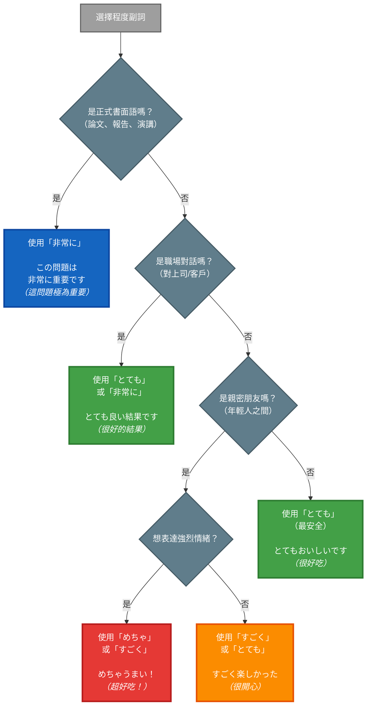

## 概述

日語中表達「非常」「很」的程度副詞種類繁多，從正式書面語到口語俚語都有不同的選擇。本卡片比較四個常用程度副詞：とても（標準）、非常に（正式）、すごく（口語）、めちゃ（俚語），幫助學習者根據場合選擇適當的表達方式。

## 核心區別表

| 特徵 | とても | 非常に | すごく | めちゃ |
|-----|--------|--------|--------|--------|
| **基本意思** | 很、非常 | 非常、極其 | 很、超級 | 超、非常 |
| **語域** | 中性（口語/書面） | 正式（書面語） | 口語 | 俚語/方言 |
| **強度** | 中等（★★☆） | 中等偏高（★★★） | 高（★★★★） | 很高（★★★★★） |
| **使用場合** | 所有場合通用 | 正式場合、演講、論文 | 朋友對話、輕鬆場合 | 親密朋友、年輕人之間 |
| **書面語適用** | ✅ | ✅ | △（不正式） | ❌ |
| **口語適用** | ✅ | ⚠️（過於正式） | ✅ | ✅（限年輕人） |
| **職場適用** | ✅ | ✅（對上司/客戶） | △（看關係） | ❌ |
| **地域限制** | 無 | 無 | 無 | 有（關西方言色彩） |

## とても（標準通用型）

### 日文解釋

「とても」は程度を表す副詞で、標準語として最も汎用性が高い表現です。話し言葉でも書き言葉でも使え、カジュアルな場面からフォーマルな場面まで幅広く対応できます。

### 英文解釋

"totemo" is a standard degree adverb meaning "very" or "quite." It is the most versatile and neutral option, suitable for both spoken and written Japanese across all formality levels. It's safe to use in any context.

### 中文解釋

「とても」是標準的程度副詞，意為「很」「非常」。它是最通用且中性的選擇，適用於口語和書面語，從隨意到正式場合都能使用。在不確定該用哪個時，選擇とても最安全。

### とても 的核心用法

**例句 1**
```
このケーキはとてもおいしいです。
This cake is very delicious.
這個蛋糕很好吃。
```

**例句 2**
```
今日はとても寒いですね。
It's very cold today, isn't it?
今天很冷呢。
```

## 非常に（正式書面型）

### 日文解釋

「非常に」は「とても」より改まった表現で、主に書き言葉やフォーマルな場面で使われます。ビジネス文書、論文、スピーチなどで好まれ、丁寧で教養ある印象を与えます。

### 英文解釋

"hijō ni" is a more formal degree adverb meaning "extremely" or "very." It's primarily used in written language, business contexts, academic papers, and formal speeches. It conveys a polished and educated tone.

### 中文解釋

「非常に」是較正式的程度副詞，意為「極其」「非常」。主要用於書面語、商業場合、學術論文和正式演講。它給人一種有禮貌、有教養的印象。

### 非常に 的核心用法

**例句 3**
```
この問題は非常に重要です。
This issue is extremely important.
這個問題極其重要。
```

**例句 4**
```
貴社の製品は非常に優れていると存じます。
I believe your company's products are extremely excellent.
我認為貴公司的產品極為優秀。
```

## すごく（口語強調型）

### 日文解釋

「すごく」は口語的な表現で、話し言葉で頻繁に使われます。「とても」より感情的で強調のニュアンスがあり、カジュアルな会話では非常に一般的です。ただし、フォーマルな場面では避けるべきです。

### 英文解釋

"sugoku" is a colloquial intensifier meaning "really" or "super." It's very common in casual spoken Japanese and carries more emotional emphasis than "totemo." However, it should be avoided in formal situations.

### 中文解釋

「すごく」是口語化的程度副詞，意為「真的很」「超級」。它比「とても」更有感情色彩和強調意味，在輕鬆對話中非常常用。但正式場合應避免使用。

### すごく 的核心用法

**例句 5**
```
この映画、すごく面白かった！
This movie was really interesting!
這部電影超好看！
```

**例句 6**
```
今日はすごく疲れたよ。
I'm really tired today.
今天真的很累。
```

## めちゃ（俚語超強型）

### 日文解釋

「めちゃ」は「めちゃくちゃ」の省略形で、非常にカジュアルでくだけた表現です。主に若者言葉として使われ、関西弁の色彩もあります。親しい友人同士の会話では使えますが、目上の人や公式な場面では不適切です。

### 英文解釋

"mecha" is an abbreviation of "mechakucha," a very casual and slangy intensifier meaning "super" or "crazy." It's primarily youth slang with Kansai dialect influences. Suitable only for close friends, never for formal or professional contexts.

### 中文解釋

「めちゃ」是「めちゃくちゃ」的縮寫，是非常隨意的俚語表達，意為「超」「巨」。主要是年輕人用語，帶有關西方言色彩。只能在親密朋友之間使用，絕不適用於正式或職場場合。

### めちゃ 的核心用法

**例句 7**
```
あの店のラーメン、めちゃうまいよ！
That shop's ramen is super delicious!
那家店的拉麵超好吃！
```

**例句 8**
```
昨日めちゃ寝たわ。
I slept like crazy yesterday.
昨天睡超久。
```

## 關鍵對比情境

### 情境 1：職場評價

**給上司的報告（使用 非常に）**
```
このプロジェクトは非常に成功しました。
This project was extremely successful.
這個專案極為成功。
```

**同事間的對話（使用 とても 或 すごく）**
```
あのプレゼン、とても良かったね。
That presentation was very good.
那個簡報很不錯呢。
```

```
あのプレゼン、すごく良かったね！
That presentation was really good!
那個簡報超棒！
```

### 情境 2：餐廳評論

**正式美食評論（使用 非常に）**
```
この料理は非常に洗練された味わいです。
This dish has an extremely refined flavor.
這道菜的味道極為精緻。
```

**朋友聊天（使用 すごく 或 めちゃ）**
```
ここの料理、すごくおいしい！
The food here is really delicious!
這裡的料理超好吃！
```

```
ここの料理、めちゃうまい！
The food here is crazy good!
這裡的料理巨好吃！
```

### 情境 3：表達疲勞

**對長輩說（使用 とても）**
```
今日はとても疲れました。
I'm very tired today.
今天很累。
```

**對朋友說（使用 すごく 或 めちゃ）**
```
今日、すごく疲れたー。
I'm really tired today.
今天超累的。
```

```
今日、めちゃ疲れたわ。
I'm crazy tired today.
今天累爆了。
```

### 情境 4：學術論文 vs 部落格

**學術論文（使用 非常に）**
```
この研究結果は非常に興味深い。
These research results are extremely interesting.
這個研究結果極其有趣。
```

**個人部落格（使用 とても 或 すごく）**
```
この本、とても面白かったです。
This book was very interesting.
這本書很有趣。
```

```
この本、すごく面白かった！
This book was really interesting!
這本書超有趣！
```

## 常見陷阱與錯誤

### 陷阱 1：職場使用「めちゃ」

❌ 誤：
```
社長、今回のプロジェクトはめちゃ成功しました。
(對社長說：這次專案超成功。)
```
✅ 正：
```
社長、今回のプロジェクトは非常に成功しました。
(對社長說：這次專案極為成功。)
```
說明：對上司或客戶使用「めちゃ」過於隨便，應使用「非常に」。

### 陷阱 2：論文使用「すごく」

❌ 誤：
```
この仮説はすごく重要である。
(論文：這個假說超重要。)
```
✅ 正：
```
この仮説は非常に重要である。
(論文：這個假說極為重要。)
```
說明：學術論文應使用正式的「非常に」，不用口語的「すごく」。

### 陷阱 3：年長者間使用「めちゃ」

❌ 誤：
```
（對不熟的長輩）お元気そうでめちゃよかったです。
(您看起來很健康，超好。)
```
✅ 正：
```
（對長輩）お元気そうでとてもよかったです。
(您看起來很健康，真好。)
```
說明：對不熟的長輩使用「めちゃ」不禮貌，應使用中性的「とても」。

### 陷阱 4：朋友聊天過度正式

⚠️ 可用但不自然：
```
（對好友）今日は非常に楽しかったね。
(今天極為開心呢。)
```
✅ 自然：
```
（對好友）今日はすごく楽しかったね！
(今天超開心！)
```
說明：朋友間過度使用「非常に」會顯得生硬，「すごく」更自然。

## 判斷流程圖



**圖表說明**：
- 🔵 深藍色：非常に（正式書面）
- 🟢 綠色：とても（中性通用）
- 🟠 橙色：すごく（口語）
- 🔴 紅色：めちゃ（俚語）

## 學習要點

1. **とても = 萬用安全牌**：不確定時選擇とても，所有場合都適用
2. **非常に = 正式場合專用**：論文、演講、對上司/客戶時使用
3. **すごく = 朋友對話首選**：輕鬆場合、朋友聊天時自然
4. **めちゃ = 限親密關係**：只在非常熟的朋友間使用，職場絕對禁止
5. **語域比強度重要**：選擇正確的語域比強度差異更關鍵
6. **方言色彩注意**：めちゃ帶有關西方言色彩，不是所有地區都常用

## 常見問題 (FAQ)

**Q1: 為什麼「すごく」不能用在正式場合？**
A: 「すごく」源自形容詞「すごい」（驚人的），本身帶有口語和情緒化色彩。正式場合需要中性、客觀的表達，因此應使用「非常に」或「とても」。

**Q2: 「とても」和「非常に」可以互換嗎？**
A: 在正式書面語中，兩者意思相近可互換。但在口語中，「非常に」會顯得過於正式，「とても」更自然。建議：書面語優先「非常に」，口語優先「とても」。

**Q3: 關西人以外可以用「めちゃ」嗎？**
A: 可以，但要注意：(1) 只在親密朋友間使用；(2) 對方能接受這種俚語；(3) 絕不在正式場合使用。現在「めちゃ」在年輕人間已較普遍，不限關西。

**Q4: 還有其他程度副詞嗎？**
A: 有很多，例如：
- かなり（相當）- 中性，程度較客觀
- 大変（非常）- 偏正式，常用於負面情況
- 本当に（真的）- 強調真實性
- ものすごく（非常）- 比すごく更強烈
- 超（ちょう）- 年輕人俚語，類似めちゃ

## 相關連結

### 相關詞彙
- [adverb/intensity_adverbs](../adverb/intensity_adverbs.md) - 強度副詞總覽（待建立）
- [adverb/kanari](../adverb/kanari.md) - かなり（相當）（待建立）
- [adverb/hontoni](../adverb/hontoni.md) - 本当に（真的）（待建立）

### 相關文法
- [formality_levels](../grammar/formality_levels.md) - 日語敬語與語域層級（待建立）
- [spoken_vs_written](../grammar/spoken_vs_written.md) - 口語 vs 書面語差異（待建立）

### 相關概念
- [youth_slang](../concept/youth_slang.md) - 年輕人俚語文化（待建立）
- [kansai_dialect](../concept/kansai_dialect.md) - 關西方言特徵（待建立）
