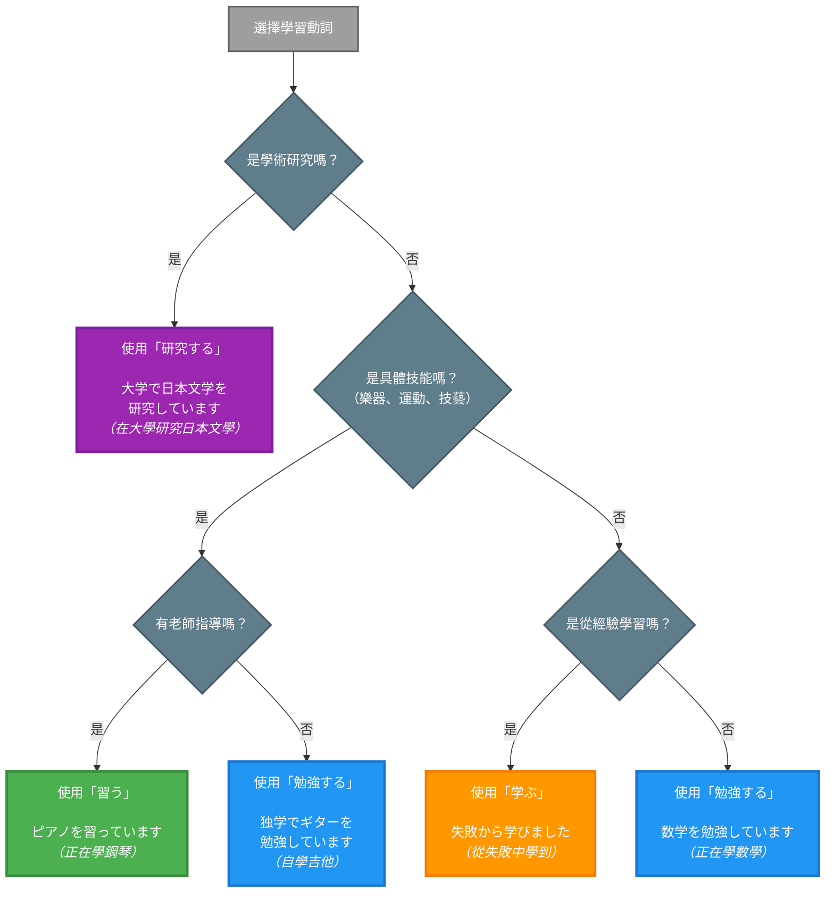

## 概述

日語中表達「學習」概念的動詞有多個，每個都有其獨特的語義焦點和使用場景。本卡片比較四個最常用的學習動詞：勉強する、学ぶ、習う、研究する，幫助學習者理解它們之間的細微差異。

## 核心區別表

| 特徵 | 勉強する | 学ぶ | 習う | 研究する |
|-----|---------|------|------|---------|
| **核心含義** | 用功、苦讀 | 學習、領悟 | 學習技能 | 研究、深入探討 |
| **焦點** | 努力過程 | 知識獲得 | 技能習得 | 深入分析 |
| **對象範圍** | 廣泛（學科、考試） | 廣泛（知識、經驗） | 具體技能 | 學術主題 |
| **學習方式** | 讀書、做題 | 主動理解 | 跟隨指導 | 系統性探究 |
| **時間投入** | 短期至中期 | 持續性 | 中期至長期 | 長期深入 |
| **正式程度** | 中性 | 稍正式 | 中性 | 正式 |
| **典型場景** | 考試準備 | 經驗學習 | 技藝學習 | 學術研究 |

## 勉強する（べんきょうする）

### 日文解釋

「勉強する」は学習活動の中でも、特に努力して知識を身につける行為を指します。主に学校の科目や試験対策など、意図的な学習努力を表します。「勉強」という言葉自体に「努力」の意味が含まれています。

### 英文解釋

"benkyou suru" refers to studying with deliberate effort, typically in academic contexts. It emphasizes the process of applying oneself to learning, often through reading, memorizing, and practicing. Commonly used for school subjects, exam preparation, and formal learning activities.

### 中文解釋

「勉強する」指的是用功學習、苦讀，強調透過努力來獲取知識。通常用於學校科目、考試準備等正式學習場景。這個詞本身就包含「努力」的含義，側重學習的過程和付出的努力。

### 使用場景

#### 1. 學校科目學習

**例句 1**
```
毎日3時間日本語を勉強しています。
I study Japanese for three hours every day.
我每天學習日語三小時。
```

#### 2. 考試準備

**例句 2**
```
来週の試験のために一生懸命勉強しました。
I studied hard for next week's exam.
我為了下週的考試努力用功。
```

#### 3. 廣泛學習活動

**例句 3**
```
図書館で勉強するのが好きです。
I like studying at the library.
我喜歡在圖書館學習。
```

### 常用搭配

- 勉強する時間（學習時間）
- 試験勉強（考試準備）
- 独学で勉強する（自學）
- 勉強が苦手（不擅長學習）

## 学ぶ（まなぶ）

### 日文解釋

「学ぶ」は知識や技能を身につける行為全般を指し、「勉強する」よりも広い概念です。経験から学ぶ、人生から学ぶなど、形式的な学習だけでなく、様々な経験を通じた学びを含みます。

### 英文解釋

"manabu" means to learn in a broader sense, encompassing both formal education and learning from experience. It emphasizes the acquisition of knowledge, skills, or wisdom through various means - not limited to studying but including observation, experience, and life lessons.

### 中文解釋

「学ぶ」是更廣義的學習，不僅包括正式的學習，也包括從經驗、觀察、人生中學習。它強調知識或智慧的獲得，範圍比「勉強する」更廣，可以用於各種學習情境。

### 使用場景

#### 1. 從經驗中學習

**例句 4**
```
失敗から多くのことを学びました。
I learned many things from failure.
我從失敗中學到很多東西。
```

#### 2. 文化與歷史學習

**例句 5**
```
日本の歴史を学んでいます。
I am learning about Japanese history.
我正在學習日本歷史。
```

#### 3. 人生智慧

**例句 6**
```
先生から大切なことを学びました。
I learned important things from my teacher.
我從老師那裡學到重要的事情。
```

### 常用搭配

- 歴史を学ぶ（學習歷史）
- 経験から学ぶ（從經驗中學習）
- 学びの機会（學習的機會）
- 実践で学ぶ（從實踐中學習）

## 習う（ならう）

### 日文解釋

「習う」は具体的な技能や技術を、指導者から教わりながら身につけることを意味します。ピアノ、書道、料理など、実際に練習を重ねて習得する技能に使われます。「先生に習う」という形で、指導者の存在を前提とします。

### 英文解釋

"narau" means to learn a skill or craft from a teacher or instructor. It implies systematic training under guidance, typically for practical skills like music, calligraphy, martial arts, or crafts. The focus is on acquiring proficiency through repeated practice and instruction.

### 中文解釋

「習う」指在老師或師傅的指導下學習具體技能或技藝。通常用於需要反覆練習才能掌握的技能，如樂器、書法、武術等。這個詞強調跟隨指導者學習的過程。

### 使用場景

#### 1. 樂器學習

**例句 7**
```
子供の頃からピアノを習っています。
I have been learning piano since I was a child.
我從小就在學鋼琴。
```

#### 2. 技藝學習

**例句 8**
```
書道の先生に習っています。
I am learning calligraphy from a teacher.
我正在跟老師學習書法。
```

#### 3. 運動技能

**例句 9**
```
週に2回、空手を習っています。
I learn karate twice a week.
我每週學習空手道兩次。
```

### 常用搭配

- ピアノを習う（學鋼琴）
- 先生に習う（跟老師學）
- 習い事（才藝課程）
- 料理を習う（學做菜）

## 研究する（けんきゅうする）

### 日文解釋

「研究する」は特定のテーマや問題について深く掘り下げて調査・分析することを意味します。主に学術的な文脈で使われ、系統的で専門的な探究活動を指します。「勉強する」や「学ぶ」よりも高度で専門的なニュアンスがあります。

### 英文解釋

"kenkyuu suru" means to research or conduct in-depth investigation into a specific topic or problem. It is primarily used in academic or professional contexts, implying systematic and scholarly inquiry. It carries a more advanced and specialized connotation than general studying or learning.

### 中文解釋

「研究する」指對特定主題或問題進行深入的調查和分析。主要用於學術或專業場景，強調系統性的專門探究。比起一般的學習，這個詞帶有更高深、更專業的意涵。

### 使用場景

#### 1. 學術研究

**例句 10**
```
大学で日本文学を研究しています。
I am researching Japanese literature at university.
我在大學研究日本文學。
```

#### 2. 專業調查

**例句 11**
```
この問題について詳しく研究する必要があります。
We need to thoroughly research this problem.
我們需要詳細研究這個問題。
```

#### 3. 深入分析

**例句 12**
```
環境問題を研究するチームに参加しました。
I joined a team researching environmental issues.
我加入了研究環境問題的團隊。
```

### 常用搭配

- 研究する対象（研究對象）
- 研究を進める（推進研究）
- 研究成果（研究成果）
- 専門分野を研究する（研究專業領域）

## 關鍵對比情境

### 情境 1：學習日語

**勉強する**
```
毎日日本語を勉強しています。
I study Japanese every day.
我每天學習日語。
```
**說明**：強調用功、努力的學習過程。

**学ぶ**
```
日本人から日本語を学んでいます。
I am learning Japanese from Japanese people.
我正在向日本人學習日語。
```
**說明**：強調從他人或經驗中獲得知識。

**習う**
```
先生に日本語を習っています。
I am learning Japanese from a teacher.
我正在跟老師學日語。
```
**說明**：強調在老師指導下學習。

### 情境 2：音樂

**勉強する** (較少用)
```
音楽理論を勉強しています。
I am studying music theory.
我正在學習樂理。
```
**說明**：用於理論知識的學習。

**習う** (最常用)
```
ピアノを習っています。
I am learning piano.
我正在學鋼琴。
```
**說明**：技能學習的標準表達。

### 情境 3：學術領域

**勉強する**
```
経済学を勉強しています。
I am studying economics.
我在學習經濟學。
```
**說明**：一般性的學習。

**学ぶ**
```
経済の仕組みを学んでいます。
I am learning about economic systems.
我在學習經濟體系。
```
**說明**：理解和領悟。

**研究する**
```
経済政策を研究しています。
I am researching economic policy.
我在研究經濟政策。
```
**說明**：專業性的深入研究。

## 常見陷阱與錯誤

### 陷阱 1：技能學習誤用「勉強する」

❌ 誤：ピアノを勉強しています。
✅ 正：ピアノを習っています。
說明：樂器等技能應該用「習う」，不用「勉強する」。

### 陷阱 2：經驗學習誤用「勉強する」

❌ 誤：失敗から勉強しました。
✅ 正：失敗から学びました。
說明：從經驗中學習應該用「学ぶ」，不用「勉強する」。

### 陷阱 3：一般學習誤用「研究する」

❌ 誤：英語を研究しています。（除非是語言學研究）
✅ 正：英語を勉強しています。
說明：一般性的語言學習用「勉強する」，不用「研究する」。

### 陷阱 4：缺少指導者時誤用「習う」

❌ 誤：独学で日本語を習っています。
✅ 正：独学で日本語を勉強しています。
說明：「習う」暗示有老師指導，自學應該用「勉強する」或「学ぶ」。

## 選擇流程圖



**圖表說明**：
- 🟣 紫色方框：研究する（學術研究）
- 🟢 綠色方框：習う（技能學習 + 指導者）
- 🟠 橙色方框：学ぶ（經驗學習）
- 🔵 藍色方框：勉強する（一般學習）
- ⚫ 灰色方框：判斷節點（決策點）

## 學習要點

1. **勉強する**：用功、苦讀，適用於一般學科學習和考試準備
2. **学ぶ**：廣義學習，包括從經驗、觀察、人生中學習
3. **習う**：跟隨老師學習具體技能，強調指導者的存在
4. **研究する**：學術性的深入研究，最正式和專業
5. **技能學習**：優先使用「習う」（有老師）或「勉強する」（自學）
6. **經驗學習**：使用「学ぶ」而非「勉強する」

## 常見問題 (FAQ)

**Q1: 「学ぶ」和「勉強する」最大的差別是什麼？**
A: 「勉強する」強調努力的學習過程，通常用於學科和考試。「学ぶ」範圍更廣，包括從經驗、觀察中學習，不限於正式教育。

**Q2: 什麼時候一定要用「習う」？**
A: 當學習具體技能（如樂器、運動、手工藝）且有老師指導時，「習う」是最自然的選擇。

**Q3: 大學生說「我在學經濟」用哪個動詞？**
A: 一般學習用「経済学を勉強しています」，如果是研究生或做專題研究則用「経済学を研究しています」。

**Q4: 「独学で習う」可以嗎？**
A: 不行，「習う」暗示有老師指導。自學應該用「独学で勉強する」或「独学で学ぶ」。

## 相關連結

### 相關動詞
- [勉強する](../verb-irr/001_benkyousuru.md) - 用功學習（包含雙向連結）[^1]
- [学ぶ](../verb-u/030_manabu.md) - 學習、領悟[^2]
- [習う](../verb-u/031_narau.md) - 學習技能[^3]
- [研究する](../verb-irr/kenkyuu_suru.md) - 研究（待建立）

[^1]: 「勉強する」強調努力的學習過程，適用於學科和考試準備。此卡片與本對比卡形成雙向連結，方便交叉參考。
[^2]: 「学ぶ」涵蓋從經驗、觀察中學習，不限於正式教育。
[^3]: 「習う」專指在老師指導下學習具體技能，如樂器、武術。

### 相關概念
- [learning_methods](../concept/learning_methods.md) - 學習方法論（待建立）
- [teacher_student](../concept/teacher_student.md) - 師生關係（待建立）
