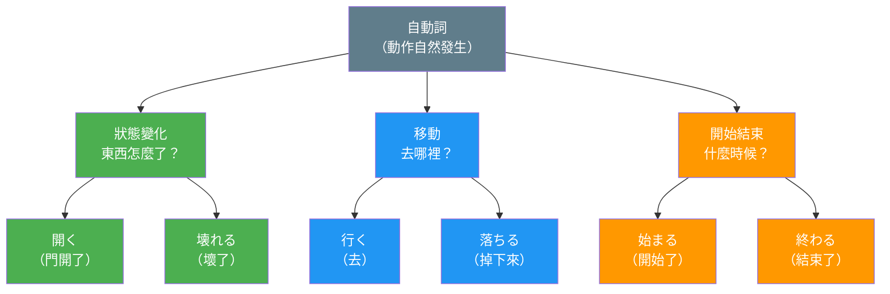
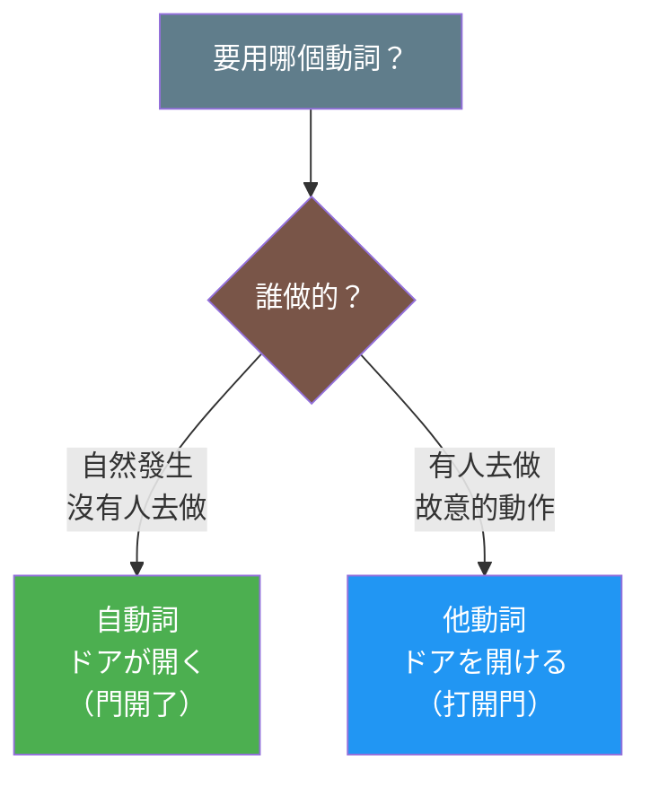

## 日文

自動詞（じどうし）

**羅馬拼音**：jidoushi

**類型**：語言學概念（文法術語）

## 日文解釋

自動詞とは、動作や状態の変化が主語自体に起こる動詞[^verb-type]で、目的語[^object]を必要としません。主語には助詞「が」[^particle-ga]を使い、「を」[^particle-wo]は使いません。

自動詞の特徴：
1. **自発性**：動作や変化が自然に起こる
2. **無賓語**：動作の対象（目的語）を取らない
3. **対応他動詞**[^tadoushi]：多くの自動詞には対応する他動詞がある

例えば、「ドアが開く」（自動詞）と「ドアを開ける」（他動詞[^tadoushi]）は動詞対[^verb-pair]を成します。

## 英文解釋

An intransitive verb (jidoushi) is a verb[^verb-type] that describes an action or state change that occurs to the subject itself, without requiring an object[^object]. The subject is marked with the particle "ga"[^particle-ga], not "wo"[^particle-wo].

Characteristics of intransitive verbs:
1. **Spontaneity**: Actions or changes happen naturally
2. **No object**: Does not take a direct object
3. **Transitive counterparts**[^tadoushi]: Many intransitive verbs have corresponding transitive verbs

For example, "doa ga aku" (the door opens - intransitive) and "doa wo akeru" (open the door - transitive[^tadoushi]) form a verb pair[^verb-pair].

## 中文解釋

自動詞（jidoushi）是指動作或狀態變化發生在主語本身的動詞[^verb-type]，不需要賓語[^object]。主語使用助詞「が」[^particle-ga]標示，而不使用「を」[^particle-wo]。

自動詞的特徵：
1. **自發性**：動作或變化自然發生
2. **無賓語**：不需要動作的對象（直接賓語）
3. **對應他動詞**[^tadoushi]：許多自動詞都有對應的他動詞

例如，「ドアが開く」（門開了 - 自動詞）與「ドアを開ける」（打開門 - 他動詞[^tadoushi]）構成動詞對[^verb-pair]。

## 圖解

### 自動詞的三種類型

## 常見自動詞類型

### 1. 狀態變化動詞

表示主語狀態的自然變化：

| 自動詞 | 意思 | 對應他動詞 |
|--------|------|-----------|
| 開く（ひらく） | 開啟 | 開ける |
| 閉まる（しまる） | 關閉 | 閉める |
| 壊れる（こわれる） | 損壞 | 壊す |
| 割れる（われる） | 破裂 | 割る |

### 2. 移動動詞

表示主語的位置移動：

| 自動詞 | 意思 |
|--------|------|
| 落ちる（おちる） | 掉落 |
| 行く（いく） | 去 |
| 来る（くる） | 來 |
| 出る（でる） | 出去 |

### 3. 開始・結束動詞

表示活動的自發開始或結束：

| 自動詞 | 意思 | 對應他動詞 |
|--------|------|-----------|
| 始まる（はじまる） | 開始 | 始める |
| 終わる（おわる） | 結束 | 終える |
| 続く（つづく） | 持續 | 続ける |

## 例句

1. 窓が開いています。
   The window is open.
   窗戶開著。

   （自動詞「開く」，主語「窓」用「が」標示）

2. 会議が9時に始まります。
   The meeting starts at 9 o'clock.
   會議在九點開始。

   （自動詞「始まる」，表示會議自發開始）

3. 花瓶が落ちて割れました。
   The vase fell and broke.
   花瓶掉下來破了。

   （「落ちる」和「割れる」都是自動詞，描述自然發生的變化）

4. 電車が止まりました。
   The train stopped.
   電車停了。

   （自動詞「止まる」，對應他動詞是「止める」）

5. 雨が降っています。
   It is raining.
   正在下雨。

   （自動詞「降る」，天氣現象的自然發生）

## 自動詞與他動詞的區別

| 項目 | 自動詞 | 他動詞 |
|------|--------|--------|
| **主語助詞** | が | が |
| **賓語助詞** | - | を |
| **動作主體** | 主語本身 | 外力作用 |
| **意志性** | 自發的 | 意圖的 |
| **例句** | ドア**が**開く | （私が）ドア**を**開ける |

## 學習要點

1. **助詞標記**：記住「自動詞用が，他動詞用を」
2. **動詞對**：學習常見的自動詞・他動詞配對
3. **語感差異**：
   - 自動詞：強調變化的結果或狀態
   - 他動詞：強調動作的執行者和意圖
4. **被動語態**：自動詞通常不用被動形（已經是自發的）
5. **て形 + いる**：自動詞常表示結果的持續狀態

---

## 註解

[^verb-type]: **動詞** - 表示動作、狀態或變化的詞類。日文動詞分為自動詞和他動詞兩大類，這是理解日文句型結構的關鍵。

[^object]: **賓語（目的語）** - 動作的直接對象。在日文中通常用助詞「を」標示。自動詞不需要賓語，這是與他動詞的主要區別。

[^particle-ga]: **助詞「が」** - 標示主語的格助詞。自動詞的主語必須用「が」標示，不能用「を」。詳見 [が](../particle/001_ga.md)

[^particle-wo]: **助詞「を」** - 標示他動詞賓語的格助詞。自動詞不使用「を」標示主語，這是識別自動詞的重要特徵。詳見 [を](../particle/011_wo.md)

[^tadoushi]: **他動詞** - 需要賓語的動詞，表示主語對賓語施加的動作。與自動詞相對，構成日文動詞的兩大分類。詳見 [他動詞](004_tadoushi.md)

[^verb-pair]: **動詞對（自他對應）** - 表示同一動作的自動詞和他動詞配對，如「開く・開ける」「始まる・始める」「壊れる・壊す」等。理解動詞對是掌握日文動詞系統的關鍵。

---

## 相關連結

### 對比概念
- [他動詞](004_tadoushi.md) - 需要賓語的動詞（相對概念）
- [不規則活用](002_fukisoku-katsuyou.md) - 不規則動詞的活用規則

### 相關助詞
- [が](../particle/001_ga.md) - 自動詞主語標記
- [を](../particle/011_wo.md) - 他動詞賓語標記（對比）

### 相關動詞範例
- [行く](../verb-u/009_iku.md) - 去（移動動詞，自動詞）
- [いる](../verb-irr/005_iru.md) - 存在動詞（有生命，自動詞）
- [ある](../verb-irr/004_aru.md) - 存在動詞（無生命，自動詞）

### 相關文法與比較
- [いる vs ある](../comparison/003_iru_vs_aru.md) - 存在動詞的對比
- [て形+いる的意義](../comparison/004_te_iru_meanings.md) - 自動詞與他動詞在進行式中的差異

### 延伸學習
- [一段動詞](../grammar/003_ichidan_verb.md) - る動詞分類
- [五段動詞](../grammar/006_godan_verb.md) - う動詞分類
