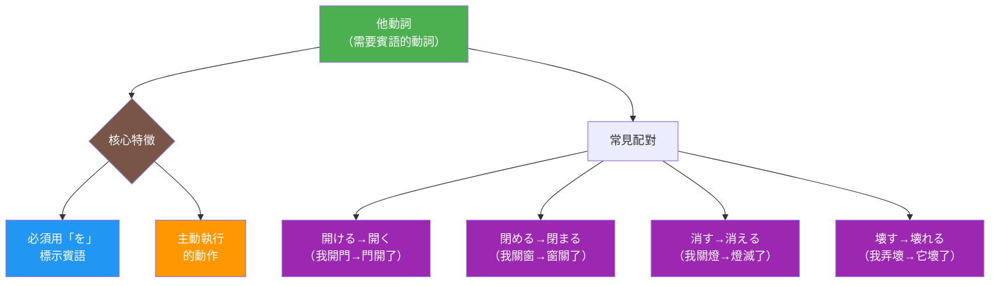

# 他動詞（Transitive Verb）

## 概念說明

### 日文解釋（Japanese）

他動詞（たどうし）とは、動作が主語から他の対象（目的語）に及ぶ動詞のことです[^transitive-concept]。他動詞は必ず目的語[^object]を必要とし、その目的語は通常助詞「を」[^wo-particle]で示されます。例えば、「ドアを開ける」「本を読む」「手紙を書く」など、主語が意識的に[^intentional]対象に働きかける動作を表します。日本語では、多くの動詞が自動詞[^intransitive]と他動詞の対になっており（例：開く/開ける、閉まる/閉める、消える/消す）、この区別を正確に理解することが日本語学習の重要なポイントとなります。

### 英文解釋（English）

A transitive verb (tadoushi) is a verb where the action extends from the subject to an object (direct object)[^transitive-concept]. Transitive verbs require a direct object[^object], which is typically marked by the particle "wo" (を)[^wo-particle]. For example, "open the door" (ドアを開ける), "read a book" (本を読む), and "write a letter" (手紙を書く) all represent actions where the subject intentionally[^intentional] acts upon an object. In Japanese, many verbs come in pairs of intransitive[^intransitive] and transitive forms (e.g., 開く/開ける, 閉まる/閉める, 消える/消す), and understanding this distinction is a crucial aspect of Japanese grammar.

### 中文解釋（Traditional Chinese）

他動詞是指動作從主語延伸到另一個對象（賓語）的動詞[^transitive-concept]。他動詞必須要有賓語[^object]，該賓語通常用助詞「を」[^wo-particle]來標示。例如：「開門」（ドアを開ける）、「讀書」（本を読む）、「寫信」（手紙を書く）等，都表示主語有意識地[^intentional]對對象施加動作。在日文中，許多動詞都有自動詞[^intransitive]與他動詞的配對（例：開く/開ける、閉まる/閉める、消える/消す），準確理解這個區別是學習日文的重要關鍵。

## 圖解



**圖表說明**：
- 綠色：他動詞主概念
- 棕色：判斷節點（核心特徵）
- 藍色：文法特徵（を助詞）
- 橘色：語義特徵（主動性）
- 紫色：常見動詞配對（他動詞→自動詞）

## 他動詞的核心特徵

### 1. 必須有賓語（を格）

他動詞必須搭配賓語使用，賓語用「を」標示：

| 他動詞 | 例句 | 說明 |
|--------|------|------|
| 開ける | ドア**を**開ける | 開門（主動打開） |
| 閉める | 窓**を**閉める | 關窗（主動關閉） |
| 読む | 本**を**読む | 讀書 |
| 書く | 手紙**を**書く | 寫信 |
| 消す | 電気**を**消す | 關燈（主動熄滅） |

### 2. 主動性與意圖性

他動詞表示主語有意識地執行動作：

- ✅ 私がドアを開けた。（我打開了門）→ 主動行為
- ❌ ドアが開けた。（❌ 錯誤用法）
- ✅ ドアが開いた。（門開了）→ 自動詞

### 3. 與自動詞的配對關係

許多日文動詞有他動詞/自動詞配對：

| 他動詞（Transitive） | 自動詞（Intransitive） | 差異 |
|---------------------|----------------------|------|
| 開ける（akeru）| 開く（aku）| 主動打開 vs 自然開啟 |
| 閉める（shimeru）| 閉まる（shimaru）| 主動關閉 vs 自然關上 |
| 消す（kesu）| 消える（kieru）| 主動熄滅 vs 自然消失 |
| 壊す（kowasu）| 壊れる（kowareru）| 主動破壞 vs 自然損壞 |
| 起こす（okosu）| 起きる（okiru）| 叫醒他人 vs 自己醒來 |
| 落とす（otosu）| 落ちる（ochiru）| 使掉落 vs 自然掉落 |

## 例句（Example Sentences）

### 例句 1：開ける/開く（打開/開啟）

**他動詞**：
```
私は毎朝8時に店のドアを開けます。
わたし は まいあさ 8じ に みせ の ドア を あけます。
Watashi wa maiasa 8-ji ni mise no doa wo akemasu.
中文：我每天早上8點開店門。
English: I open the store door every morning at 8 o'clock.
```
（他動詞「開ける」，賓語「ドア」用「を」[^wo-particle]標示，主語「私」主動打開門）

**自動詞**：
```
店のドアは8時に開きます。
みせ の ドア は 8じ に あきます。
Mise no doa wa 8-ji ni akimasu.
中文：店門在8點開啟。
English: The store door opens at 8 o'clock.
```
（自動詞「開く」，主語「ドア」自然開啟，無賓語）

### 例句 2：消す/消える（熄滅/消失）

**他動詞**：
```
寝る前に必ず電気を消してください。
ねる まえ に かならず でんき を けして ください。
Neru mae ni kanarazu denki wo keshite kudasai.
中文：睡覺前請一定要關燈。
English: Please be sure to turn off the lights before going to bed.
```

**自動詞**：
```
突然、電気が消えた。
とつぜん、でんき が きえた。
Totsuzen, denki ga kieta.
中文：燈突然熄滅了。
English: The lights suddenly went out.
```

### 例句 3：壊す/壊れる（破壞/損壞）

**他動詞**：
```
子供が大切な花瓶を壊してしまった。
こども が たいせつ な かびん を こわして しまった。
Kodomo ga taisetsu na kabin wo kowashite shimatta.
中文：孩子把重要的花瓶打破了。
English: The child broke the important vase.
```

**自動詞**：
```
古い時計が壊れた。
ふるい とけい が こわれた。
Furui tokei ga kowareta.
中文：舊時鐘壞了。
English: The old clock broke.
```

### 例句 4：読む/書く（典型他動詞）

```
毎日新聞を読んで、日記を書きます。
まいにち しんぶん を よんで、にっき を かきます。
Mainichi shinbun wo yonde, nikki wo kakimasu.
中文：每天讀報紙，寫日記。
English: I read the newspaper and write in my diary every day.
```
（「読む」和「書く」都是典型的他動詞，必須有賓語「新聞」和「日記」，用「を」標示）

### 例句 5：落とす/落ちる（掉落）

**他動詞**：
```
財布を落としてしまいました。
さいふ を おとして しまいました。
Saifu wo otoshite shimaimashita.
中文：我把錢包掉了。
English: I dropped my wallet.
```

**自動詞**：
```
木から葉が落ちる。
き から は が おちる。
Ki kara ha ga ochiru.
中文：葉子從樹上掉落。
English: Leaves fall from the tree.
```

## 學習要點（Learning Points）

### 初學者重點

1. **を助詞標記**：他動詞的賓語用「を」標示
2. **主動意圖**：他動詞表示主語有意識的動作
3. **動詞配對**：記住常見的他動詞/自動詞配對
4. **が vs を**：自動詞用「が」，他動詞用「を」

### 識別技巧

判斷他動詞的三個問題：

1. **這個動作需要對象嗎？** → 需要 = 他動詞
2. **可以加「を」嗎？** → 可以 = 他動詞
3. **主語有主動意圖嗎？** → 有 = 他動詞

### 常見他動詞配對規律

| 自動詞詞尾 | 他動詞詞尾 | 例子 |
|-----------|-----------|------|
| -u | -eru | 開く（aku）→ 開ける（akeru）|
| -aru | -eru | 上がる（agaru）→ 上げる（ageru）|
| -eru | -asu | 冷える（hieru）→ 冷やす（hiyasu）|
| -reru | -su | 壊れる（kowareru）→ 壊す（kowasu）|

### 常見錯誤

1. ❌ 窓が閉めました → ✅ 窓を閉めました（他動詞用を）
2. ❌ 電気を消えた → ✅ 電気が消えた（自動詞用が）
3. ❌ ドアを開いた → ✅ ドアを開けた（主動用他動詞）
4. ❌ 本が読みます → ✅ 本を読みます（他動詞用を）

## 進階知識

### 使役形與他動詞的關係

有些自動詞通過使役形可以變成類似他動詞：

- 行く（自動詞）→ 行かせる（使役形：讓某人去）
- 食べる（他動詞）→ 食べさせる（使役形：讓某人吃）

### 被動形與他動詞

只有他動詞才能形成直接被動句：

- 他動詞：先生が学生を褒めた → 学生が先生に褒められた
- 自動詞：❌ 不能形成直接被動

---

## 註解

[^transitive-concept]: **他動詞概念** - 語言學上指需要直接賓語的動詞。動作從主語傳遞到賓語，主語對賓語產生直接影響。是理解日文句型結構的關鍵概念。

[^object]: **賓語（目的語）** - 動作的接受者或對象。在日文中，他動詞的賓語必須用助詞「を」標示。例：本**を**読む（賓語：本）、ドア**を**開ける（賓語：ドア）。

[^wo-particle]: **を助詞** - 標示他動詞直接賓語的格助詞。是識別他動詞最重要的標記。詳見 [を](../particle/011_wo.md)

[^intentional]: **意圖性** - 他動詞通常表示主語有意識、主動執行的動作，而非無意或自然發生。這是他動詞與自動詞的重要區別。例如：「窓を開ける」（我打開窗戶）vs「窓が開く」（窗戶開了）。

[^intransitive]: **自動詞** - 與他動詞相對，不需要賓語的動詞，動作不及於其他對象。主語本身發生變化或狀態。用「が」標示主語。詳見 [自動詞](003_jidoushi.md)

---

## 相關連結

### 對比概念
- [自動詞](003_jidoushi.md) - 他動詞的對應概念
- [不規則活用](002_fukisoku-katsuyou.md) - 不規則動詞的活用規則

### 相關助詞
- [を](../particle/011_wo.md) - 他動詞賓語標記（核心助詞）
- [が](../particle/001_ga.md) - 主語標記（對比）

### 常見他動詞範例
- [食べる](../verb-ru/001_taberu.md) - 吃（典型他動詞）
- [する](../verb-irr/001_suru.md) - 做（不規則他動詞）

### 相關文法
- [一段動詞](../grammar/003_ichidan_verb.md) - る動詞分類
- [五段動詞](../grammar/006_godan_verb.md) - う動詞分類
- [被動形](../grammar/012_passive_form.md) - 他動詞的被動用法
- [使役形](../grammar/013_causative_form.md) - 使役表達

### 相關比較
- [いる vs ある](../comparison/003_iru_vs_aru.md) - 存在動詞對比
- [て形+いる的意義](../comparison/004_te_iru_meanings.md) - 自動詞與他動詞在進行式中的差異
