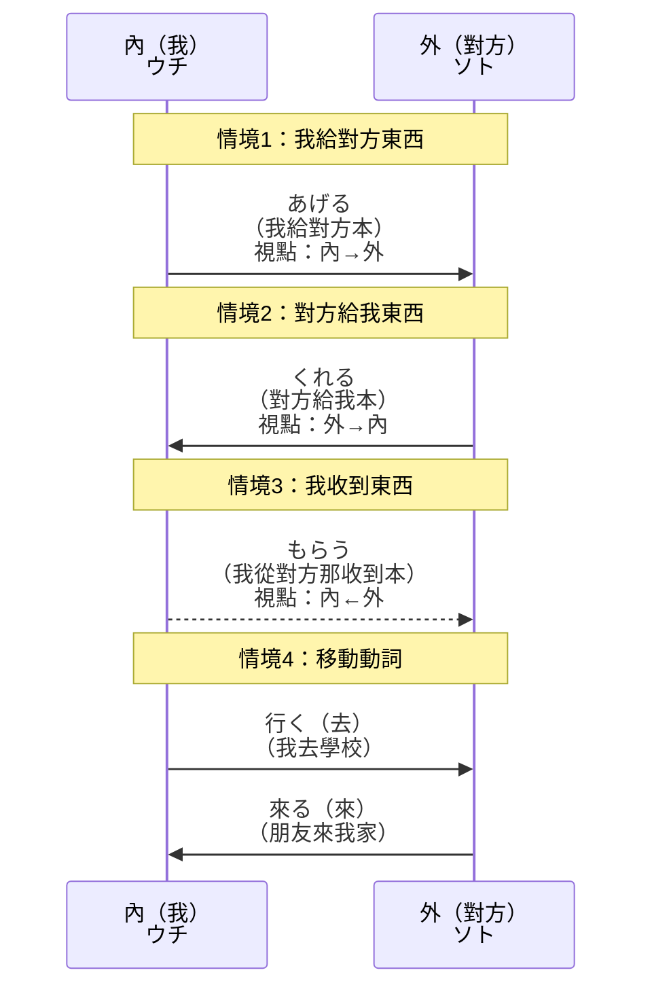
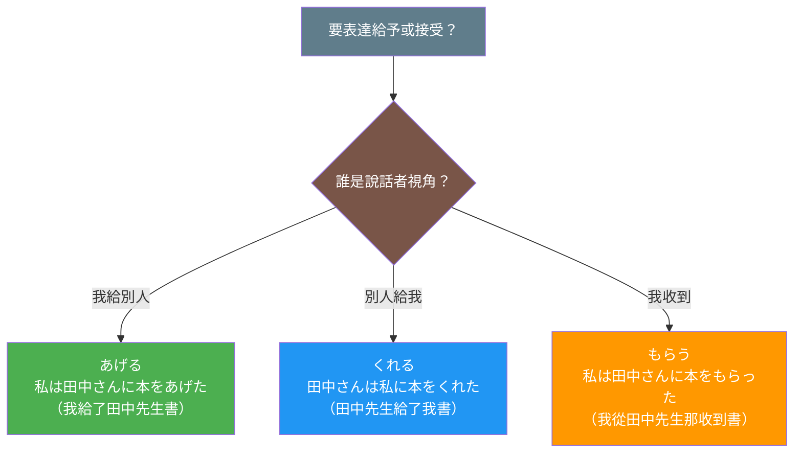

## 日文

視点（してん）/ 視角

**羅馬拼音**: shiten / shikaku

**概念類型**：語言學理論・語用學

## 日文解釋

「視点」（してん）とは、言語学において、話者が文の内容をどの立場から述べるかを示す概念です。日本語では、特に授受表現や移動動詞などで視点の選択が文法的に非常に重要です。

### 視点の基本概念

日本語の視点は、主に**話者中心**（speaker-centered）の原則に基づいています。つまり、多くの文法構造において、話者が自分の立場を中心として、恩恵や移動の方向を表現します。

### 授受表現における視点

授受表現（あげる・くれる・もらう）は、視点理論の最も顕著な例です：

1. **あげる**：話者または話者グループから外部への授与を表す
   - 視点：与える側（内側→外側）
   - 例：私は友達に本をあげた

2. **くれる**：外部から話者または話者グループへの授与を表す
   - 視点：受け取る側（外側→内側）
   - 例：友達が私に本をくれた

3. **もらう**：話者が外部から受け取ることを表す
   - 視点：受け取る側（内側←外側）
   - 例：私は友達に本をもらった

### 移動動詞における視点

「行く」と「来る」も視点の違いを示します：

- **行く（iku）**：話者の位置から離れる移動
- **来る（kuru）**：話者の位置に近づく移動

例：
- 私は学校に行きます（話者の視点から学校へ）
- 友達が私の家に来ます（話者の視点から友達が来る）

### 内と外（ウチとソト）

視点の選択は、「内と外」の概念と密接に関係しています。話者は自分とその内集団（家族、会社など）を「内」として、それ以外を「外」として区別し、視点を決定します。

## 英文解釋

"Viewpoint" (shiten/shikaku) is a linguistic concept that indicates from which standpoint the speaker describes the content of a sentence. In Japanese, viewpoint selection is grammatically crucial, particularly in giving-receiving expressions and motion verbs.

### Basic Concept of Viewpoint

Japanese viewpoint is primarily based on the **speaker-centered principle**. This means that in many grammatical structures, the speaker expresses the direction of benefits or movement centered on their own position.

### Viewpoint in Giving-Receiving Expressions

Giving-receiving expressions (ageru, kureru, morau) are the most prominent examples of viewpoint theory:

1. **Ageru**: Expresses giving from the speaker or speaker's group to outsiders
   - Viewpoint: Giver's side (inside → outside)
   - Example: I gave a book to my friend

2. **Kureru**: Expresses giving from outsiders to the speaker or speaker's group
   - Viewpoint: Receiver's side (outside → inside)
   - Example: My friend gave me a book

3. **Morau**: Expresses the speaker receiving from outsiders
   - Viewpoint: Receiver's side (inside ← outside)
   - Example: I received a book from my friend

### Viewpoint in Motion Verbs

"Iku" (go) and "kuru" (come) also demonstrate viewpoint differences:

- **Iku**: Movement away from the speaker's position
- **Kuru**: Movement toward the speaker's position

Examples:
- I go to school (from speaker's viewpoint to school)
- My friend comes to my house (from speaker's viewpoint, friend comes)

### Uchi-Soto (Inside-Outside)

Viewpoint selection is closely related to the "uchi-soto" (inside-outside) concept. The speaker distinguishes themselves and their in-group (family, company, etc.) as "inside" and everything else as "outside," determining viewpoint accordingly.

## 中文解釋

「視點」（してん）是語言學中的概念，指說話者從哪個立場描述句子內容。在日語中，視點的選擇在文法上非常重要，特別是在授受表現和移動動詞中。

### 視點的基本概念

日語的視點主要基於**說話者中心原則**（speaker-centered principle）。也就是說，在許多文法結構中，說話者以自己的立場為中心，表達恩惠或移動的方向。

### 授受表現中的視點

授受表現（あげる・くれる・もらう）是視點理論最顯著的例子：

1. **あげる**：表示從說話者或說話者群體給予外部
   - 視點：給予者一方（內側→外側）
   - 例：我給了朋友一本書

2. **くれる**：表示從外部給予說話者或說話者群體
   - 視點：接受者一方（外側→內側）
   - 例：朋友給了我一本書

3. **もらう**：表示說話者從外部接受
   - 視點：接受者一方（內側←外側）
   - 例：我從朋友那裡收到了書

### 移動動詞中的視點

「行く」和「來る」也展示了視點差異：

- **行く（iku）**：從說話者位置離開的移動
- **來る（kuru）**：向說話者位置靠近的移動

例句：
- 我去學校（從說話者視點到學校）
- 朋友來我家（從說話者視點，朋友來）

### 內與外（ウチとソト）

視點的選擇與「內與外」概念密切相關。說話者將自己和其內群體（家人、公司等）區分為「內」，其餘為「外」，據此決定視點。

## 例句

### 授受表現的視點對比

1. 私は田中さんに本をあげました。（あげる：內→外）
   I gave Tanaka-san a book.
   我給了田中先生一本書。
   （我是給予者，視點從我出發）

2. 田中さんは私に本をくれました。（くれる：外→內）
   Tanaka-san gave me a book.
   田中先生給了我一本書。
   （田中先生是給予者，但視點在我這邊）

3. 私は田中さんに本をもらいました。（もらう：內←外）
   I received a book from Tanaka-san.
   我從田中先生那裡收到了書。
   （我是接受者，視點從我出發）

### 移動動詞的視點對比

4. 私は東京に行きます。
   I will go to Tokyo.
   我要去東京。
   （從我的位置離開）

5. 友達が私の家に来ます。
   My friend will come to my house.
   朋友會來我家。
   （朋友向我的位置移動）

### 視點錯誤的例子

6. ❌ 田中さんは私に本をあげました。
   （錯誤：「あげる」不能用於外部人給我）

   ✅ 田中さんは私に本をくれました。
   Tanaka-san gave me a book.
   田中先生給了我一本書。

## 圖解

### 視點系統：說話者中心的授受表現

### 視點判斷流程

## 學習要點

1. **說話者中心**：日語視點以說話者為中心
2. **內外區分**：區分內群體（我方）和外部（他方）
3. **方向性**：恩惠或移動的方向決定動詞選擇
4. **文法限制**：某些動詞有視點限制（如くれる必須向內）
5. **文化背景**：視點概念反映日本社會的內外群體意識
6. **實際應用**：正確使用視點是流利日語的關鍵

---

## 相關連結

### 授受表現系統
- [授受表現](../grammar/051_juju_hyougen.md) - 日語的給予與接受動詞系統總覽
- [あげる](../verb-ru/011_ageru.md) - 給予（由內向外）
- [くれる](../verb-ru/013_kureru.md) - 給予（由外向內）
- [もらう](../verb-ru/012_morau.md) - 接受

### 視點相關對比
- [〜てもらう vs 〜てくれる](../comparison/032_te_morau_vs_te_kureru.md) - 視角差異對比
- [あげる vs くれる](../comparison/029_ageru_vs_kureru.md) - 授與動詞方向對比

### 文化概念
- [內與外](007_uchi_soto.md) - 日本社會的內外群體概念

### 相關語言學概念
- [自動詞](003_jidoushi.md) - 自動詞概念，展示視點的文法系統
- [他動詞](004_tadoushi.md) - 他動詞概念，與自動詞對比
