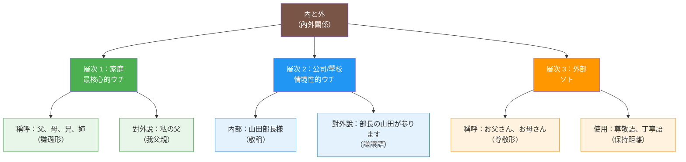
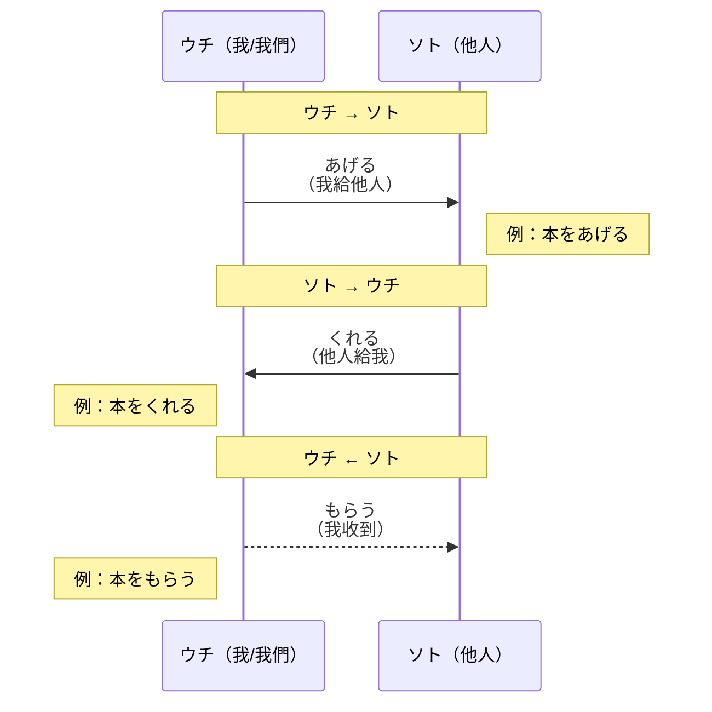

## 日文

内と外（うちとそと）/ ウチとソト

**羅馬拼音**: uchi-soto

**概念類型**：文化概念・社會學

## 日文解釋

「内と外（ウチとソト）」は、日本社会における人間関係を理解するための最も基本的な概念の一つです。この概念は、個人が所属する集団（内）とそれ以外の外部（外）を明確に区別し、それぞれに対する言葉遣い、行動、態度を変える日本文化の特徴を表しています。

### 「ウチ」の概念

「ウチ」（内）とは、自分が所属する内集団を指します：

1. **家族**：最も基本的な「ウチ」
2. **会社・組織**：勤務先や所属団体
3. **学校・クラス**：教育機関や学習集団
4. **地域・国**：地元や日本という国全体

「ウチ」の範囲は文脈によって変化します。例えば、家族内では自分だけが「ウチ」ですが、会社について外部に話す時は、会社全体が「ウチ」になります。

### 「ソト」の概念

「ソト」（外）とは、「ウチ」以外のすべての人や集団を指します：

1. **他人**：知らない人や関係の薄い人
2. **他社**：取引先や競合会社
3. **客**：サービスを提供する対象
4. **外国**：日本以外の国

### 言語表現への影響

「ウチとソト」の概念は、日本語の文法と語用に深く影響しています：

**授受表現**：
- 「あげる」：ウチからソトへ
- 「くれる」：ソトからウチへ
- 「もらう」：ウチがソトから受け取る

**敬語の使用**：
- ウチの人について外部に話す時は謙譲語を使用
- ソトの人に対しては尊敬語を使用
- 例：「社長の田中が参ります」（外部に対して）
  vs.「社長の田中様がいらっしゃいます」（社内で）

**家族の呼び方**：
- ウチの家族：「父、母、兄、姉」（謙遜形）
- ソトの家族：「お父さん、お母さん、お兄さん、お姉さん」（尊敬形）

### 文化的背景

この概念は、日本が歴史的に集団主義社会であったことに由来します。個人のアイデンティティは所属する集団と密接に結びついており、集団の和を保つことが重視されます。そのため、ウチとソトで異なる行動規範を持つことが自然とされています。

## 英文解釋

"Uchi-soto" (inside-outside) is one of the most fundamental concepts for understanding interpersonal relationships in Japanese society. This concept represents the characteristic of Japanese culture where individuals clearly distinguish between their in-group (uchi) and outsiders (soto), changing their language, behavior, and attitudes accordingly.

### The Concept of "Uchi"

"Uchi" (inside) refers to one's in-group:

1. **Family**: The most basic "uchi"
2. **Company/Organization**: One's workplace or affiliated organization
3. **School/Class**: Educational institutions or learning groups
4. **Region/Country**: One's local area or Japan as a whole

The scope of "uchi" changes depending on context. For example, within family, only oneself is "uchi," but when talking about the company to outsiders, the entire company becomes "uchi."

### The Concept of "Soto"

"Soto" (outside) refers to all people and groups outside of "uchi":

1. **Others**: Strangers or people with weak relationships
2. **Other companies**: Business partners or competitors
3. **Customers**: Service recipients
4. **Foreign countries**: Countries other than Japan

### Linguistic Impact

The "uchi-soto" concept deeply influences Japanese grammar and pragmatics:

**Giving-Receiving Expressions**:
- "Ageru": From uchi to soto
- "Kureru": From soto to uchi
- "Morau": Uchi receives from soto

**Honorific Usage**:
- Use humble language when talking about uchi people to outsiders
- Use respectful language toward soto people
- Example: "Our president Tanaka will come" (to outsiders)
  vs. "President Tanaka-sama will come" (within company)

**Family Terms**:
- One's own family: "chichi, haha, ani, ane" (humble forms)
- Others' family: "otousan, okaasan, oniisan, oneesan" (respectful forms)

### Cultural Background

This concept originates from Japan historically being a collectivist society. Individual identity is closely tied to group membership, and maintaining group harmony is emphasized. Therefore, having different behavioral norms for uchi and soto is considered natural.

## 中文解釋

「內與外（ウチとソト）」是理解日本社會人際關係最基本的概念之一。這個概念代表日本文化的特徵：個人明確區分所屬群體（內）和外部（外），並相應改變語言、行為和態度。

### 「ウチ」（內）的概念

「ウチ」（內）指自己所屬的內群體：

1. **家庭**：最基本的「ウチ」
2. **公司・組織**：工作單位或所屬團體
3. **學校・班級**：教育機構或學習群體
4. **地區・國家**：家鄉或日本整體

「ウチ」的範圍隨情境變化。例如，在家庭內只有自己是「ウチ」，但對外談論公司時，整個公司都成為「ウチ」。

### 「ソト」（外）的概念

「ソト」（外）指「ウチ」以外的所有人和群體：

1. **他人**：陌生人或關係淺的人
2. **其他公司**：交易對象或競爭公司
3. **客戶**：服務提供對象
4. **外國**：日本以外的國家

### 對語言表達的影響

「ウチとソト」概念深刻影響日語的文法和語用：

**授受表現**：
- 「あげる」：從ウチ到ソト
- 「くれる」：從ソト到ウチ
- 「もらう」：ウチ從ソト接受

**敬語使用**：
- 對外談論ウチ的人時使用謙讓語
- 對ソト的人使用尊敬語
- 例：「社長の田中が参ります」（對外部）
  vs.「社長の田中様がいらっしゃいます」（公司內）

**家人稱呼**：
- 自己的家人：「父、母、兄、姉」（謙遜形）
- 他人的家人：「お父さん、お母さん、お兄さん、お姉さん」（尊敬形）

### 文化背景

這個概念源自日本歷史上是集體主義社會。個人身份與所屬群體密切相關，維持群體和諧被重視。因此，對ウチ和ソト有不同行為規範被視為自然。

## 例句

### 授受表現中的ウチ・ソト

1. 私は田中さんに本をあげました。（ウチ→ソト）
   I gave Tanaka-san a book.
   我給了田中先生一本書。
   （我給外部的人）

2. 田中さんは私に本をくれました。（ソト→ウチ）
   Tanaka-san gave me a book.
   田中先生給了我一本書。
   （外部的人給我）

### 敬語使用中的ウチ・ソト

3. （對客戶）部長の山田が参ります。
   Our department manager Yamada will come.
   我們部長山田會來。
   （對外部，降低ウチ的人）

4. （在公司內）部長の山田様がいらっしゃいます。
   Department Manager Yamada-sama will come.
   山田部長會來。
   （對內部，提升上級）

### 家族稱呼中的ウチ・ソト

5. （對外部）私の父は会社員です。
   My father is a company employee.
   我父親是公司職員。
   （使用謙遜形「父」）

6. （詢問他人）お父さんのお仕事は何ですか。
   What does your father do?
   您父親從事什麼工作？
   （使用尊敬形「お父さん」）

## 學習要點

1. **動態範圍**：ウチ的範圍隨情境變化
2. **語言影響**：深刻影響敬語和授受表現
3. **文化理解**：理解日本集體主義文化的關鍵
4. **社交規範**：決定適當的言語和行為
5. **語用重要性**：不理解會導致嚴重的語用錯誤
6. **實際應用**：正確使用是流利日語和文化適應的關鍵

## 圖解

### 內外關係的層次結構

### 授受表現的方向

---

## 相關連結

### 授受表現系統
- [授受表現](../grammar/048_juju-hyougen.md) - 日語的給予與接受動詞系統總覽
- [あげる](../verb-ru/011_ageru.md) - 給予（由內向外）
- [くれる](../verb-ru/013_kureru.md) - 給予（由外向內）
- [もらう](../verb-ru/012_morau.md) - 接受

### 相關概念
- [視點理論](006_viewpoint.md) - 日語的視點概念
- [敬語系統](../grammar/005_keigo_system.md) - 日語敬語系統

### 文化理解
- [集團主義](collectivism.md) - 日本社會的集體主義（待建立）
- [和的文化](wa-culture.md) - 日本的和文化（待建立）
