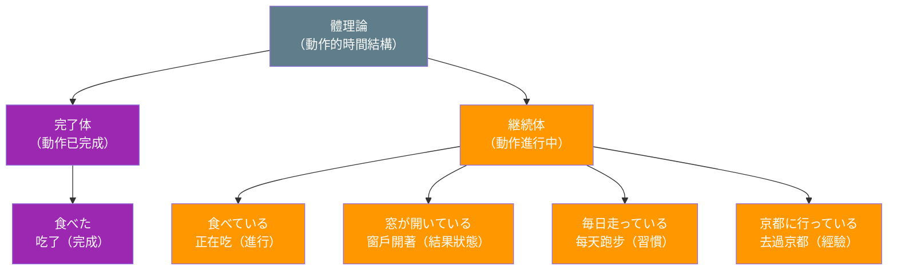
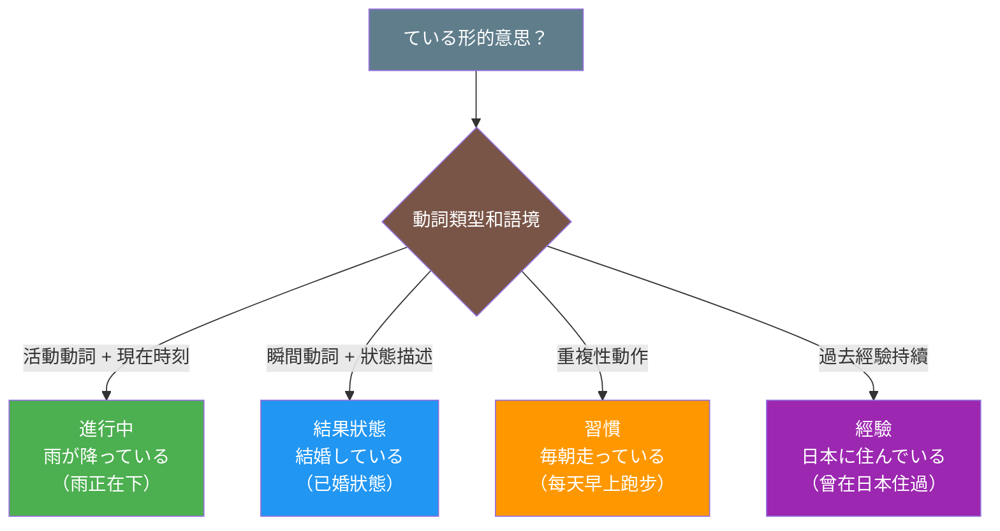

## 日文

体理論（たいりろん）

**羅馬拼音**：tai riron

**概念類型**：言語学理論（げんごがくりろん）

## 概念情報

| 項目 | 內容 |
|------|------|
| 理論分類 | 文法理論・時制研究 |
| 研究領域 | 語言學、認知語言學 |
| 主要概念 | 完了体・継続体・習慣体 |
| 日文應用 | 「ている」「た」「てある」等文法形式 |

## 日文解釋

体理論とは、動作や出来事、状態の内部的な時間構造を分析する言語学の理論です。英語で「aspect」と呼ばれるこの概念は、「時制（tense）」とは異なり、動作の完了性、継続性、反復性など、出来事の展開の仕方に焦点を当てます。

日本語の体系では、主に「テイル形」と「タ形」が体の表現に関わります。「テイル形」は継続体として動作の進行中や結果の状態を表し、「タ形」は完了体として動作の完了を表します。例えば、「食べている」は動作の継続または結果状態を、「食べた」は動作の完了を示します。

体理論は特に日本語教育において重要です。なぜなら、日本語学習者が「ている」の多様な用法（進行・結果状態・習慣・経験）を理解し、適切に使い分けるためには、この理論的枠組みが不可欠だからです。また、動詞の語彙的側面（lexical aspect）、つまり動詞自体が持つ時間構造の特徴（瞬間動詞・継続動詞・状態動詞など）も、文法的な体の形式とどのように相互作用するかを理解する上で重要です。

さらに、体理論は言語間比較においても有用です。英語の進行形（-ing）と日本語の「テイル形」は表面的に似ていますが、意味範囲や使用条件が異なります。このような違いを体理論の枠組みで分析することで、より深い言語理解が可能になります。

## 英文解釋

Aspect theory is a linguistic framework that analyzes the internal temporal structure of actions, events, and states. Unlike tense, which locates an event in time (past, present, future), aspect focuses on how an event unfolds - whether it is completed, ongoing, habitual, or iterative.

In Japanese, aspect is primarily expressed through the "-teiru" form and the "-ta" form. The "-teiru" form functions as a progressive or resultative aspect, indicating either an action in progress or the resulting state of a completed action. The "-ta" form serves as a perfective aspect, indicating that an action has been completed. For example, "tabete iru" (食べている) can mean "is eating" (progressive) or "has eaten" (resultative state), while "tabeta" (食べた) means "ate" or "has eaten" (perfective).

Aspect theory is particularly crucial in Japanese language pedagogy because learners must understand the multiple meanings of "-teiru" (progressive, resultative, habitual, experiential) and use them appropriately. Additionally, the concept of lexical aspect - the inherent temporal characteristics of verbs (punctual, durative, stative, etc.) - is essential for understanding how grammatical aspect forms interact with different verb types.

The theory also proves valuable in cross-linguistic analysis. While English progressive (-ing) and Japanese "-teiru" may appear similar, they differ significantly in semantic range and usage conditions. Analyzing these differences through the lens of aspect theory enables deeper linguistic understanding.

## 中文解釋

體理論是一個分析動作、事件和狀態的內部時間結構的語言學理論。與時制（tense）不同，時制定位事件在時間軸上的位置（過去、現在、未來），而體（aspect）則關注事件如何展開——是已完成、進行中、習慣性還是重複性。

在日文中，體主要透過「ている形」和「た形」來表達。「ている形」作為進行體或結果體，表示動作正在進行或已完成動作的結果狀態。「た形」則作為完成體，表示動作已經完成。例如，「食べている」可以表示「正在吃」（進行）或「已經吃了」（結果狀態），而「食べた」表示「吃了」或「已經吃完」（完成）。

體理論在日語教學中特別重要，因為學習者必須理解「ている」的多重意義（進行、結果狀態、習慣、經驗）並恰當使用。此外，詞彙體（lexical aspect）的概念——即動詞本身固有的時間結構特徵（瞬間動詞、持續動詞、狀態動詞等）——對於理解文法體形式如何與不同動詞類型相互作用至關重要。

該理論在跨語言比較中也很有價值。儘管英語進行式（-ing）和日語「ている形」表面上相似，但它們在語義範圍和使用條件上有顯著差異。通過體理論的框架分析這些差異，能夠實現更深層的語言理解。

---

## 圖解

### 體理論核心對比



### 「ている」的四種意義



---

## 核心用法

### 用法 1：分析動詞的時間結構類型

體理論用於分類動詞的固有時間特性，幫助理解不同動詞與體標記的互動。

**例句 1**
```
瞬間動詞「死ぬ」は「死んでいる」という形で結果状態を表します。
Punctual verbs like "shinu" (to die) express resultative states in the form "shinde iru" (is dead).
瞬間動詞「死ぬ」用「死んでいる」的形式表達結果狀態。
```

**例句 2**
```
状態動詞「ある」は通常、進行形を取らず、状態そのものを表現します。
Stative verbs like "aru" (to exist) typically do not take progressive forms and express states themselves.
狀態動詞「ある」通常不採用進行形式，直接表達狀態本身。
```

### 用法 2：區分文法體的不同意義

體理論幫助辨析同一文法形式在不同語境中的多重意義。

**例句 3**
```
「彼は走っている」は進行（今走っている）と結果状態（痩せている）の両方を表せます。
"Kare wa hashitte iru" can express both progressive (is running now) and resultative state (is lean/fit).
「彼は走っている」既可表達進行（正在跑）也可表達結果狀態（身材精瘦）。
```

**例句 4**
```
「毎朝公園を走っている」は習慣体として反復的な行為を表現します。
"Maiasa kouen wo hashitte iru" expresses habitual aspect, indicating repetitive action.
「毎朝公園を走っている」表達習慣體，指示重複性行為。
```

### 用法 3：跨語言對比分析

體理論提供框架來比較不同語言的體系統。

**例句 5**
```
英語の「I am writing」と日本語の「書いている」は進行を表すが、日本語は結果状態も表現できる。
English "I am writing" and Japanese "kaite iru" both express progressive, but Japanese can also express resultative states.
英語的「I am writing」和日語的「書いている」都表達進行，但日語還能表達結果狀態。
```

## 理論要素

### 要素 1：完了体（Perfective Aspect）

完了体は動作や出来事を完結した全体として捉える視点です。日本語では主に「た形」で表現されます。

**特徴**：
- 動作の始まりと終わりを含む全体を一つのまとまりとして提示
- 時間的な境界が明確
- 「昨日本を読んだ」は読書という行為が完了したことを示す

### 要素 2：継続体（Imperfective Aspect）

継続体は動作や出来事の内部構造に焦点を当て、進行中や未完了の状態を表現します。日本語では主に「ている形」で表現されます。

**特徴**：
- 動作の進行中の様子を描写
- 時間的な内部構造を見せる
- 「本を読んでいる」は読書行為が進行中または結果状態にあることを示す

### 要素 3：語彙的側面（Lexical Aspect）

動詞自体が持つ固有の時間構造特性を指します。これは文法的な体標記とは独立した概念です。

**主要な分類**：
- **状態動詞（Stative）**：「ある」「いる」「好きだ」
- **活動動詞（Activity）**：「走る」「泳ぐ」「読む」
- **達成動詞（Accomplishment）**：「家を建てる」「本を読む（読了まで）」
- **到達動詞（Achievement）**：「気づく」「死ぬ」「着く」

### 要素 4：「ている」の多義性

日本語の「ている形」は文脈と動詞の語彙的側面によって異なる意味を持ちます。

**意味の類型**：
- **進行中（Progressive）**：「今、雨が降っている」
- **結果状態（Resultative）**：「窓が開いている」
- **習慣（Habitual）**：「毎日走っている」
- **経験（Experiential）**：「京都に行っている」（＝行ったことがある）

## 理論的意義

### 意義 1：日語文法教學的理論基礎

體理論為解釋日語複雜的體系統提供了系統性框架，特別是「ている」形式的多重用法。

### 意義 2：認知語言學的洞察

體標記反映了說話者如何認知和概念化事件的時間結構，揭示了語言與認知的關係。

### 意義 3：翻譯和對比語言學的工具

體理論幫助識別不同語言在時間表達上的差異，對翻譯和語言學習有實際應用價值。

## 常見誤解

### 誤解 1：體和時制混淆

❌ 誤：認為「た形」只是過去時制
✅ 正：「た形」主要表達完了體，雖然常與過去時間相關，但也可用於完了的現在或未來
說明：「明日までに終わった」（明天之前就完成了）使用「た形」但指涉未來的完成狀態

### 誤解 2：認為「ている」只表示進行

❌ 誤：「彼は結婚している」理解為「他正在結婚（進行婚禮）」
✅ 正：「彼は結婚している」表示結果狀態「他已婚」
說明：「結婚する」是瞬間動詞，「ている」形式表達的是結果狀態而非進行

### 誤解 3：忽略詞彙體的影響

❌ 誤：認為所有動詞的「ている」形式都有相同意義
✅ 正：不同詞彙體的動詞與「ている」結合會產生不同意義
說明：「知っている」（狀態動詞）vs「走っている」（活動動詞）的「ている」意義完全不同

## 學習要點

1. **體≠時制**：體關注事件的內部時間結構，時制定位事件在時間軸上的位置
2. **「ている」的四種意義**：進行、結果狀態、習慣、經驗，需根據語境判斷
3. **詞彙體影響文法體**：動詞的固有時間特性決定了「ている」形式的主要意義
4. **完了體vs繼續體**：「た形」呈現完整事件，「ている形」聚焦內部過程
5. **跨語言差異**：不能直接用英語進行式理解日語「ている」，需要獨立學習

## 相關連結

### 基礎文法概念
- [te_iru_form](../grammar/te_iru_form.md) - 「ている」形式的詳細用法（待建立）
- [ta_form](../grammar/ta_form.md) - 「た」形式的用法和意義（待建立）
- [te_aru_form](../grammar/te_aru_form.md) - 「てある」形式與體的關係（待建立）

### 動詞分類
- [lexical_aspect](lexical_aspect.md) - 詞彙體的分類與特徵（待建立）
- [verb_types_temporal](verb_types_temporal.md) - 動詞的時間結構分類（待建立）
- [stative_vs_active_verbs](../comparison/stative_vs_active_verbs.md) - 狀態動詞vs活動動詞（待建立）

### 相關語言學理論
- [tense_theory](tense_theory.md) - 時制理論與體理論的區別（待建立）
- [aktionsart](aktionsart.md) - 行為類型理論（待建立）
- [grammaticalization](grammaticalization.md) - 體標記的文法化過程（待建立）

### 教學應用
- [teaching_te_iru](../pedagogy/teaching_te_iru.md) - 「ている」的教學策略（待建立）
- [aspect_errors](../extension/aspect_errors.md) - 學習者常見的體錯誤分析（待建立）
- [aspect_en_vs_jp](../comparison/aspect_en_vs_jp.md) - 英日體系統對比（待建立）

---

**建立日期**: 2025-10-31
**最後更新**: 2025-10-31
**字數**: ~2,800
**例句數**: 5
