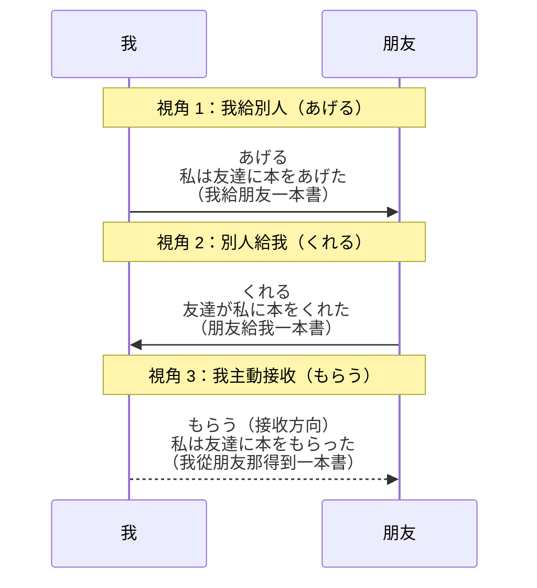

## 日文

授受視角（じゅじゅしかく）

**羅馬拼音**：juju shikaku

## 日文解釋

授受視角とは、日本語の授受動詞[^benefactive-verbs]（あげる、くれる、もらう）を使用する際に、話し手がどの立場から恩恵[^benefit]の授受を描写するかという、視点の選択に関する語用論的概念[^pragmatics]です。

日本語の授受表現は、単なる物や行為の移動を表すだけでなく、話し手の心理的距離感[^psychological-distance]や内外関係[^uchi-soto]を反映します。視角の選択を誤ると、文法的には正しくても語用論的に不自然な表現[^pragmatic-inappropriateness]になり、日本語母語話者には違和感を与えます。

この概念は、「誰から見た恩恵か」「誰が受益者か」という2つの軸で理解されます。話し手は常に自分の視点、または自分に近い人（内集団[^in-group]）の視点から授受を描写する傾向があります。例えば、第三者間の授受を描写する場合でも、話し手がどちらの立場に感情移入するかによって、あげる・くれる・もらうの選択が変わります。

特に重要なのは、くれるの使用です。くれるは「相手が私（または私の内集団）に何かをしてくれる」という、受益者側から見た視点を表します。これに対し、あげるは「私が相手に何かをしてあげる」という、与え手側の視点です。もらうは「私が相手から何かをもらう」という、能動的に受け取る視点を表します。

この視角の選択は、敬語[^keigo]や謙譲語[^kenjougo]との組み合わせでさらに複雑になり、社会的距離[^social-distance]や上下関係[^hierarchy]を微妙に表現する手段となります。

## 英文解釋

Benefactive perspective (juju shikaku) is a pragmatic concept[^pragmatics] in Japanese that refers to the speaker's choice of viewpoint when describing the giving and receiving of benefits[^benefit] through benefactive verbs[^benefactive-verbs] (ageru, kureru, morau).

Japanese benefactive expressions do not merely indicate the physical transfer of objects or actions, but also reflect the speaker's psychological distance[^psychological-distance] and the uchi-soto distinction[^uchi-soto] (in-group vs. out-group). Incorrect perspective choice can result in grammatically correct but pragmatically inappropriate[^pragmatic-inappropriateness] expressions that sound unnatural to native speakers.

This concept is understood through two axes: "from whose perspective is the benefit viewed?" and "who is the beneficiary?" Speakers consistently tend to describe giving and receiving from their own viewpoint, or from the viewpoint of someone close to them (in-group[^in-group]). Even when describing exchanges between third parties, the choice among ageru, kureru, and morau depends on which party the speaker empathizes with.

Particularly important is the use of kureru, which expresses the perspective of the beneficiary: "someone does something for me (or my in-group)." In contrast, ageru represents the giver's perspective: "I do something for someone." Morau indicates active reception: "I receive something from someone."

The choice of perspective becomes even more complex when combined with honorific language[^keigo] and humble language[^kenjougo], serving as a subtle means of expressing social distance[^social-distance] and hierarchical relationships[^hierarchy].

## 中文解釋

授受視角是日文中的語用概念[^pragmatics]，指的是使用授受動詞[^benefactive-verbs]（あげる、くれる、もらう）描述恩惠[^benefit]授受時，說話者選擇的觀察立場。

日文的授受表達不僅表示物品或行為的傳遞，還反映了說話者的心理距離[^psychological-distance]和內外關係[^uchi-soto]。視角選擇錯誤會導致語法正確但語用不當[^pragmatic-inappropriateness]的表達，讓日語母語者感到不自然。

這個概念透過兩個軸心理解：「從誰的角度看待恩惠？」和「誰是受益者？」說話者始終傾向從自己的視角，或與自己親近的人（內集團[^in-group]）的視角來描述授受。即使描述第三方之間的交換，あげる、くれる、もらう的選擇也取決於說話者認同哪一方。

くれる的使用特別重要。くれる表達受益者的視角：「對方為我（或我的內集團）做某事」。相對地，あげる代表給予者的視角：「我為對方做某事」。もらう表示主動接收：「我從對方那裡得到某物」。

這種視角選擇與敬語[^keigo]和謙讓語[^kenjougo]結合時變得更加複雜，成為微妙表達社會距離[^social-distance]和上下關係[^hierarchy]的手段。

## 圖解

### 授受動詞的視角與方向

以下圖表展示三種授受動詞的給予方向和視角差異：



**圖表說明**：

- **實線箭頭（→）**：表示實際的給予方向
- **虛線箭頭（--→）**：表示もらう的接收視角，強調主動性
- **あげる**：從我（給予者）到對方的視角
- **くれる**：從對方到我（受益者）的視角，強調感激
- **もらう**：從我（接收者）的視角，強調主動接收行為

## 核心用法

### 用法 1：第一人稱視角（我給予）

使用「あげる」表達從給予者視角看待的恩惠傳遞。

**例句 1**
```
私は友達に本をあげました。
I gave a book to my friend.
我給朋友一本書。
```

**例句 2**
```
母が妹にお金をあげた。
My mother gave money to my younger sister.
媽媽給妹妹錢。
```

### 用法 2：第一人稱視角（我接收恩惠）

使用「くれる」表達從受益者視角看待別人給予的恩惠。

**例句 3**
```
友達が私に本をくれました。
My friend gave me a book.
朋友給我一本書。
```

**例句 4**
```
先生が教えてくれた。
The teacher taught me (kindly).
老師教了我。
```

### 用法 3：主動接收視角

使用「もらう」表達主動從對方那裡接收恩惠。

**例句 5**
```
私は友達に本をもらいました。
I received a book from my friend.
我從朋友那裡得到一本書。
```

## 視角選擇規則

### 規則 1：內集團優先原則

當涉及內集團[^in-group]成員時，優先採用內集團視角。

**說明**：
- 內集團包括：家人、親密朋友、同事（視情境而定）
- 說話者與內集團成員的心理距離較近
- 選擇能突顯內集團受益的動詞

**對比**：
```
✓ 父が妹に時計をあげた。（內集團內部交換，用あげる）
  Father gave my sister a watch.
  爸爸給妹妹一隻手錶。

✓ 先生が私の妹に時計をくださった。（外部給內集團，用くれる的敬語形）
  The teacher gave my sister a watch.
  老師給我妹妹一隻手錶。
```

### 規則 2：受益者接近原則

當說話者是受益者或與受益者關係親近時，使用「くれる」。

**說明**：
- くれる強調受益者視角
- 表達感謝或受惠的心情
- 不能用於自己給予別人

**對比**：
```
✓ 友達が手伝ってくれた。（朋友幫我）
  My friend helped me.
  朋友幫了我。

✗ 私が友達を手伝ってくれた。（語用錯誤）
```

### 規則 3：主動接收意識

「もらう」表達主動性和意圖性，常與依賴或請求相關。

**說明**：
- 強調受益者的主動角色
- 可搭配「〜てもらう」表請求
- 與くれる相比，較少情感色彩

**對比**：
```
友達が本をくれた。（朋友主動給，強調對方好意）
友達に本をもらった。（我接收，較中性）
```

## 常見錯誤

### 錯誤 1：混淆あげる和くれる的視角

❌ 誤：友達が私に本をあげました。
✅ 正：友達が私に本をくれました。

**說明**：當「我」是受益者時，應使用くれる表達對方給予的恩惠，而非あげる。あげる用於「我給別人」或「第三方給第三方」的情境。

### 錯誤 2：第三者交換的視角選擇

❌ 誤：先生が田中さんにくれた。（說話者與兩者都不親）
✅ 正：先生が田中さんにあげた。

**說明**：當說話者與給予者和受益者都沒有親密關係時，應使用中性的あげる，而非暗示說話者與受益者親近的くれる。

### 錯誤 3：もらう的主語錯誤

❌ 誤：友達が私にもらった。
✅ 正：私が友達にもらった。

**說明**：もらう的主語必須是受益者（接收者），而非給予者。助詞使用「に」標示來源（從誰那裡），「を」標示接收的對象。

### 錯誤 4：內集團視角不一致

❌ 誤：先生が弟にあげた。（弟是內集團）
✅ 正：先生が弟にくださった。（用くれる的敬語形）

**說明**：當內集團成員受益時，即使不是「我」本人，也應採用接收視角（くれる），以反映內集團的團體意識[^group-consciousness]。

## 語用層次分析

### 層次 1：句法層次（誰→誰）

**基本結構**：
- あげる：A が B に（を）あげる
- くれる：A が B に（を）くれる
- もらう：B が A に（から）もらう

### 層次 2：語意層次（恩惠流向）

**恩惠傳遞方向**：
- あげる：從 A 流向 B
- くれる：從 A 流向 B（B 包含說話者或其內集團）
- もらう：從 A 流向 B（B 主動接收）

### 層次 3：語用層次（視角選擇）

**心理視角**：
- あげる：給予者視角，中性或略顯優越
- くれる：受益者視角，感激或親近
- もらう：接收者視角，主動或依賴

### 層次 4：社會層次（人際關係）

**社會距離表現**：
- あげる系（あげる、さしあげる、やる）：給予者主導
- くれる系（くれる、くださる）：受益者感激
- もらう系（もらう、いただく）：接收者謙遜

## 學習要點

1. **視角一致性**：在同一語境中保持視角一致，避免混用あげる和くれる導致視角混亂。

2. **內集團意識**：理解日文的內外集團概念，當內集團成員受益時，使用くれる視角。

3. **主動性差異**：くれる強調對方的好意，もらう強調自己的接收行為，選擇時考慮要表達的語用意圖。

4. **敬語結合**：さしあげる、くださる、いただく是授受動詞的敬語形式，使用時需同時考慮視角和社會關係。

5. **第三方交換**：描述第三方之間的交換時，選擇視角取決於說話者的心理認同對象。

## 相關連結

### 授受動詞
- [001_ageru](../verb-ru/001_ageru.md) - あげる（給予）（待建立）
- [002_kureru](../verb-ru/002_kureru.md) - くれる（給我/我方）（待建立）
- [001_morau](../verb-u/001_morau.md) - もらう（得到）（待建立）

### 敬語形式
- [003_sashiageru](../verb-ru/003_sashiageru.md) - さしあげる（あげる的謙讓語）（待建立）
- [002_kudasaru](../verb-u/002_kudasaru.md) - くださる（くれる的尊敬語）（待建立）
- [003_itadaku](../verb-u/003_itadaku.md) - いただく（もらう的謙讓語）（待建立）

### 相關概念
- [001_uchi_soto](001_uchi_soto.md) - 內外關係（待建立）
- [002_empathy](002_empathy.md) - 共感視點（待建立）
- [003_psychological_distance](003_psychological_distance.md) - 心理距離（待建立）

### 文法相關
- [001_te_ageru](../grammar/001_te_ageru.md) - 〜てあげる（為某人做）（待建立）
- [002_te_kureru](../grammar/002_te_kureru.md) - 〜てくれる（為我做）（待建立）
- [003_te_morau](../grammar/003_te_morau.md) - 〜てもらう（請某人做）（待建立）

### 語用學概念
- [004_pragmatics](004_pragmatics.md) - 語用學基礎（待建立）
- [005_politeness_theory](005_politeness_theory.md) - 禮貌理論（待建立）

---

## 註解

[^benefactive-verbs]: **授受動詞** - 表達恩惠、物品或行為授受的動詞類別，主要包括あげる（給予）、くれる（給我/我方）、もらう（得到）及其敬語形式。這些動詞不僅表達物理傳遞，更反映心理距離和社會關係。

[^benefit]: **恩惠** - 廣義的利益或好處，可以是物品、行為或服務。在日文授受表達中，「恩惠」的概念不限於物質，也包括幫助、教導、照顧等抽象行為。

[^pragmatics]: **語用論** - 研究語言在特定語境中如何使用的語言學分支。授受視角是典型的語用現象，語法正確不代表語用適當。詳見 [004_pragmatics](004_pragmatics.md)

[^psychological-distance]: **心理距離** - 說話者感知到的與他人之間的親疏遠近。心理距離影響授受動詞的選擇，距離近時傾向使用くれる，距離遠時使用あげる。詳見 [003_psychological_distance](003_psychological_distance.md)

[^uchi-soto]: **內外關係** - 日本社會文化中區分「內集團」（ウチ）和「外集團」（ソト）的概念。內集團包括家人、親友等親近者，外集團是其他人。授受視角強烈受此概念影響。詳見 [001_uchi_soto](001_uchi_soto.md)

[^pragmatic-inappropriateness]: **語用不當** - 語法正確但不符合語境或社會規範的表達。例如「友達が私に本をあげた」語法無誤，但從語用角度應說「友達が私に本をくれた」。

[^in-group]: **內集團** - 說話者認同並感到親近的社會群體，通常包括家人、親友、同事等。內集團成員之間的授受表達遵循特殊規則，強調團體意識。

[^keigo]: **敬語** - 日語的敬語系統，包括尊敬語、謙讓語、丁寧語。授受動詞有對應的敬語形式：さしあげる（謙讓）、くださる（尊敬）、いただく（謙讓）。

[^kenjougo]: **謙讓語** - 敬語的一種，通過降低自己或己方的行為來表示對對方的尊敬。授受動詞的謙讓語形式包括さしあげる、いただく。

[^social-distance]: **社會距離** - 基於社會地位、職業、年齡等因素產生的人際距離。影響敬語使用和授受動詞的選擇。

[^hierarchy]: **上下關係** - 日本社會中的階層意識，體現在年齡、職位、社會地位等方面。授受動詞結合敬語時能精確表達上下關係。

[^group-consciousness]: **集團意識** - 日本文化中強調集團歸屬和團體利益的意識。在授受表達中，內集團成員被視為「我方」的延伸，影響視角選擇。

---

**建立日期**: 2025-10-31
**最後更新**: 2025-10-31
**字數**: ~3,200
**例句數**: 5
