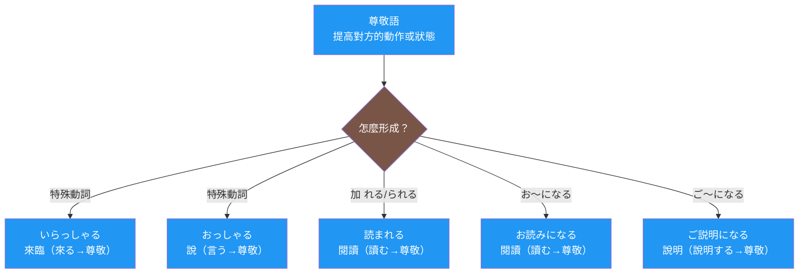

## 日文

尊敬語（そんけいご）

**羅馬拼音**: sonkeigo

**概念類型**：語言學理論・敬語系統

## 圖解



## 日文解釋

「尊敬語」（そんけいご）とは、日本語の敬語体系における三つの柱の一つであり、話題の人物（多くは聞き手や第三者）の動作や状態を高めることで、その人物への敬意を表す言語形式です。尊敬語は単なる丁寧な表現ではなく、日本社会の上下関係や人間関係を言語的に体現する重要な文法カテゴリーです。

### 尊敬語の言語学的特徴

尊敬語は以下の言語学的特徴を持っています：

**1. 動作主の地位上昇**

尊敬語は、動作や状態の主体を高めることで敬意を表します。これは、話者が自分より地位や立場が上の人物、あるいは心理的距離がある人物に対して使用します。

例：
- 基本形：「先生が来る」
- 尊敬語：「先生がいらっしゃる」「先生がおいでになる」

**2. 文法化された尊敬表現**

尊敬語は、語彙の交替だけでなく、複数の文法的手段によって実現されます：

- **特殊尊敬動詞**：「行く」→「いらっしゃる」、「言う」→「おっしゃる」、「食べる」→「召し上がる」
- **尊敬助動詞**：「れる・られる」（例：「読まれる」「食べられる」）
- **尊敬の接辞構成**：「お〜になる」（例：「お読みになる」）、「お〜です」（例：「お忙しいです」）
- **尊敬の名詞修飾**：「御〜」（例：「ご意見」「ご住所」）

**3. 視点の固定性**

尊敬語は、話者の視点から見て「上」にいる人物の動作にのみ使用されます。自分自身の動作に尊敬語を使うことは原則として誤りです。この視点の固定性は、日本語の敬語体系全体の重要な特徴です。

**4. 場面依存性と柔軟性**

尊敬語の使用は、固定的な規則だけでなく、場面や関係性に応じて調整されます。同じ人物に対しても、場面によって尊敬語の程度を変えることがあります。

### 尊敬語の社会的機能

尊敬語は以下の社会的機能を果たしています：

**1. 階層関係の表現**

年齢、社会的地位、組織内の序列など、明確な上下関係を言語で表現します。

**2. 心理的距離の調整**

親疎関係や心理的距離を言語で示し、人間関係を調整します。

**3. 改まりの演出**

公的場面や改まった状況で、適切な言語的距離を保ちます。

**4. 配慮と気遣いの表現**

相手への配慮や気遣いを、尊敬語という言語形式で具体化します。

### 尊敬語の形成パターン

尊敬語は主に以下のパターンで形成されます：

**パターン1：特殊尊敬動詞（語彙的交替）**

基本動詞が完全に別の動詞に置き換わります：
- 「来る」→「いらっしゃる」「おいでになる」「お越しになる」
- 「行く」→「いらっしゃる」「おいでになる」
- 「食べる」→「召し上がる」
- 「言う」→「おっしゃる」
- 「する」→「なさる」
- 「見る」→「ご覧になる」

**パターン2：助動詞「れる・られる」**

動詞の未然形に「れる」（五段動詞）または「られる」（一段動詞・カ変・サ変）を接続：
- 「書く」→「書かれる」
- 「読む」→「読まれる」
- 「食べる」→「食べられる」

注意：「られる」は可能形とも同形のため、文脈で判断が必要です。

**パターン3：「お〜になる」構成**

和語動詞のます形語幹に「お」を付け、「になる」を接続：
- 「読む」→「お読みになる」
- 「書く」→「お書きになる」
- 「待つ」→「お待ちになる」

**パターン4：「ご〜になる」構成**

漢語動詞（サ変動詞）の語幹に「ご」を付け、「になる」を接続：
- 「説明する」→「ご説明になる」
- 「心配する」→「ご心配になる」
- 「利用する」→「ご利用になる」

**パターン5：「お〜です」「ご〜です」**

形容詞や名詞に「お」または「ご」を付けて、状態や所有物を高めます：
- 「忙しい」→「お忙しい」→「お忙しいです」
- 「意見」→「ご意見」→「ご意見です」

### 尊敬語の使用における注意点

**1. 過剰尊敬の回避**

複数の尊敬表現を重ねることは、一般的に避けるべきです：
- ❌「お読みになられる」（「お〜になる」+「られる」の二重尊敬）
- ✅「お読みになる」または「読まれる」

ただし、特殊尊敬動詞に「れる・られる」を付ける形は、最高敬語として許容される場合があります：
- 「いらっしゃる」→「いらっしゃられる」（最高敬語、ただし現代ではやや古風）

**2. 自己尊敬の禁止**

自分自身の動作に尊敬語を使うことは誤りです：
- ❌「私が申し上げられます」
- ✅「私が申し上げます」（謙譲語を使用）

**3. 内外の区別**

ビジネス場面では、内部の人間について外部に話すときは、上司であっても尊敬語を使いません：
- 外部の人に対して：「部長の佐藤は今、席を外しております」（尊敬語不使用）
- 社内で部長について：「佐藤部長はお出かけになりました」（尊敬語使用）

**4. 場面と関係性の判断**

同じ人物に対しても、場面によって尊敬語の程度を調整する必要があります。

## 英文解釋

"Sonkeigo" (respectful language) is one of the three pillars of the Japanese honorific system (keigo), a linguistic form that expresses respect by elevating the actions or states of the person being discussed (often the listener or a third party). Sonkeigo is not merely polite expression but an important grammatical category that linguistically embodies hierarchical relationships and interpersonal dynamics in Japanese society.

### Linguistic Characteristics of Sonkeigo

Sonkeigo has the following linguistic characteristics:

**1. Elevation of the Agent's Status**

Sonkeigo expresses respect by elevating the subject of actions or states. Speakers use it for people of higher status or position, or those with greater psychological distance.

Examples:
- Basic form: "Sensei ga kuru" (The teacher comes)
- Respectful: "Sensei ga irassharu" (The teacher comes - respectful)

**2. Grammaticalized Respectful Expressions**

Sonkeigo is realized not only through lexical substitution but also through multiple grammatical means:

- **Special respectful verbs**: "iku" → "irassharu," "iu" → "ossharu," "taberu" → "meshiagaru"
- **Respectful auxiliary verbs**: "reru/rareru" (e.g., "yomareru," "taberareru")
- **Respectful affix constructions**: "o-~ni naru" (e.g., "o-yomi ni naru"), "o-~desu" (e.g., "o-isogashii desu")
- **Respectful noun modification**: "go-~" (e.g., "go-iken," "go-juusho")

**3. Fixed Viewpoint**

Sonkeigo is used only for actions of people who are "above" the speaker from their viewpoint. Using sonkeigo for one's own actions is generally incorrect. This fixedness of viewpoint is an important feature of the entire Japanese keigo system.

**4. Situational Dependency and Flexibility**

The use of sonkeigo is adjusted not only according to fixed rules but also according to situations and relationships. The degree of sonkeigo may vary for the same person depending on the situation.

### Social Functions of Sonkeigo

Sonkeigo fulfills the following social functions:

**1. Expression of Hierarchical Relationships**

It linguistically expresses clear hierarchical relationships such as age, social status, and organizational rank.

**2. Adjustment of Psychological Distance**

It linguistically indicates intimacy and psychological distance, adjusting interpersonal relationships.

**3. Creation of Formality**

In public situations or formal contexts, it maintains appropriate linguistic distance.

**4. Expression of Consideration and Attentiveness**

It concretizes consideration and attentiveness toward others through the linguistic form of sonkeigo.

### Formation Patterns of Sonkeigo

Sonkeigo is mainly formed through the following patterns:

**Pattern 1: Special Respectful Verbs (Lexical Alternation)**

Basic verbs are completely replaced by different verbs:
- "kuru" → "irassharu," "oide ni naru," "o-koshi ni naru"
- "iku" → "irassharu," "oide ni naru"
- "taberu" → "meshiagaru"
- "iu" → "ossharu"
- "suru" → "nasaru"
- "miru" → "go-ran ni naru"

**Pattern 2: Auxiliary Verb "reru/rareru"**

"Reru" (for godan verbs) or "rareru" (for ichidan verbs and irregular verbs) is attached to the mizenkei form:
- "kaku" → "kakareru"
- "yomu" → "yomareru"
- "taberu" → "taberareru"

Note: "Rareru" has the same form as the potential form, so context is needed for interpretation.

**Pattern 3: "O-~ni naru" Construction**

"O" is added to the masu-stem of native Japanese verbs, followed by "ni naru":
- "yomu" → "o-yomi ni naru"
- "kaku" → "o-kaki ni naru"
- "matsu" → "o-machi ni naru"

**Pattern 4: "Go-~ni naru" Construction**

"Go" is added to the stem of Sino-Japanese verbs (suru-verbs), followed by "ni naru":
- "setsumei suru" → "go-setsumei ni naru"
- "shinpai suru" → "go-shinpai ni naru"
- "riyou suru" → "go-riyou ni naru"

**Pattern 5: "O-~desu" / "Go-~desu"**

"O" or "go" is added to adjectives or nouns to elevate states or possessions:
- "isogashii" → "o-isogashii" → "o-isogashii desu"
- "iken" → "go-iken" → "go-iken desu"

### Precautions in Using Sonkeigo

**1. Avoiding Excessive Respect**

Stacking multiple respectful expressions should generally be avoided:
- ❌ "O-yomi ni narareru" (double respect: "o-~ni naru" + "rareru")
- ✅ "O-yomi ni naru" or "yomareru"

However, adding "reru/rareru" to special respectful verbs may be acceptable as supreme honorifics:
- "Irassharu" → "irasshareru" (supreme honorific, though somewhat archaic in modern Japanese)

**2. Prohibition of Self-Respect**

Using sonkeigo for one's own actions is incorrect:
- ❌ "Watashi ga moushiageraremasu"
- ✅ "Watashi ga moushiagemasu" (use humble language)

**3. Inside-Outside Distinction**

In business situations, when talking to outsiders about insiders, sonkeigo is not used even for superiors:
- To outsiders: "Buchou no Satou wa ima, seki wo hazushite orimasu" (no sonkeigo)
- Within the company about the manager: "Satou-buchou wa o-dekake ni narimashita" (sonkeigo used)

**4. Judgment of Situation and Relationship**

The degree of sonkeigo needs to be adjusted according to the situation, even for the same person.

## 中文解釋

「尊敬語」（そんけいご）是日語敬語體系三大支柱之一，是一種通過提高話題人物（通常是聽話者或第三者）的動作或狀態來表達對該人物敬意的語言形式。尊敬語不僅僅是禮貌的表達，而是語言上體現日本社會上下關係和人際關係的重要文法類別。

### 尊敬語的語言學特徵

尊敬語具有以下語言學特徵：

**1. 動作主體地位的提升**

尊敬語通過提高動作或狀態的主體來表達敬意。說話者對地位或立場比自己高的人物，或心理距離較遠的人物使用。

例如：
- 基本形：「先生が来る」（老師來）
- 尊敬語：「先生がいらっしゃる」「先生がおいでになる」（老師來臨）

**2. 文法化的尊敬表達**

尊敬語不僅通過詞彙替換，還通過多種文法手段實現：

- **特殊尊敬動詞**：「行く」→「いらっしゃる」、「言う」→「おっしゃる」、「食べる」→「召し上がる」
- **尊敬助動詞**：「れる・られる」（例：「読まれる」「食べられる」）
- **尊敬詞綴構成**：「お〜になる」（例：「お読みになる」）、「お〜です」（例：「お忙しいです」）
- **尊敬名詞修飾**：「御〜」（例：「ご意見」「ご住所」）

**3. 視點的固定性**

尊敬語只用於從說話者視點看來在「上」的人物的動作。對自己的動作使用尊敬語原則上是錯誤的。這種視點的固定性是日語敬語體系整體的重要特徵。

**4. 場面依賴性與靈活性**

尊敬語的使用不僅依據固定規則，還根據場面和關係性進行調整。即使對同一人物，也可能根據場面改變尊敬語的程度。

### 尊敬語的社會功能

尊敬語發揮以下社會功能：

**1. 階層關係的表達**

在語言上表達年齡、社會地位、組織內序列等明確的上下關係。

**2. 心理距離的調整**

在語言上顯示親疏關係和心理距離，調整人際關係。

**3. 正式感的營造**

在公開場合或正式情境中，保持適當的語言距離。

**4. 關懷和體貼的表達**

通過尊敬語這一語言形式，具體化對他人的關懷和體貼。

### 尊敬語的形成模式

尊敬語主要通過以下模式形成：

**模式1：特殊尊敬動詞（詞彙替換）**

基本動詞完全替換為其他動詞：
- 「来る」→「いらっしゃる」「おいでになる」「お越しになる」
- 「行く」→「いらっしゃる」「おいでになる」
- 「食べる」→「召し上がる」
- 「言う」→「おっしゃる」
- 「する」→「なさる」
- 「見る」→「ご覧になる」

**模式2：助動詞「れる・られる」**

在動詞未然形後接「れる」（五段動詞）或「られる」（一段動詞・カ變・サ變）：
- 「書く」→「書かれる」
- 「読む」→「読まれる」
- 「食べる」→「食べられる」

注意：「られる」與可能形同形，需要根據語境判斷。

**模式3：「お〜になる」構成**

在和語動詞的ます形詞幹前加「お」，後接「になる」：
- 「読む」→「お読みになる」
- 「書く」→「お書きになる」
- 「待つ」→「お待ちになる」

**模式4：「ご〜になる」構成**

在漢語動詞（サ變動詞）的詞幹前加「ご」，後接「になる」：
- 「説明する」→「ご説明になる」
- 「心配する」→「ご心配になる」
- 「利用する」→「ご利用になる」

**模式5：「お〜です」「ご〜です」**

在形容詞或名詞前加「お」或「ご」，提高狀態或所有物：
- 「忙しい」→「お忙しい」→「お忙しいです」
- 「意見」→「ご意見」→「ご意見です」

### 使用尊敬語的注意事項

**1. 避免過度尊敬**

疊加多個尊敬表達通常應該避免：
- ❌「お読みになられる」（「お〜になる」+「られる」的雙重尊敬）
- ✅「お読みになる」或「読まれる」

但是，在特殊尊敬動詞上加「れる・られる」作為最高敬語，在某些情況下可以接受：
- 「いらっしゃる」→「いらっしゃられる」（最高敬語，但在現代稍顯古風）

**2. 禁止自我尊敬**

對自己的動作使用尊敬語是錯誤的：
- ❌「私が申し上げられます」
- ✅「私が申し上げます」（使用謙讓語）

**3. 內外之分**

在商務場合，對外部人士談論內部人士時，即使是上司也不使用尊敬語：
- 對外部人士：「部長の佐藤は今、席を外しております」（不使用尊敬語）
- 公司內部談論部長：「佐藤部長はお出かけになりました」（使用尊敬語）

**4. 場面與關係性的判斷**

即使對同一人物，也需要根據場面調整尊敬語的程度。

## 核心用法

### 用法 1：提升對方的動作

使用尊敬語提高聽話者或話題人物的動作地位。

**例句 1**
```
社長がこちらにいらっしゃいました。
The president has come here. (respectful)
社長來這裡了。（尊敬）
```

**例句 2**
```
先生はもうお帰りになりましたか。
Has the teacher already gone home? (respectful)
老師已經回去了嗎？（尊敬）
```

### 用法 2：提升對方的狀態或所有物

使用「お〜」「ご〜」提高對方的狀態、性質或所有物。

**例句 3**
```
お忙しいところ、お時間をいただき、ありがとうございます。
Thank you for taking the time despite being busy. (respectful)
感謝您在百忙之中撥冗。（尊敬）
```

**例句 4**
```
ご意見をお聞かせいただけますでしょうか。
Could I ask for your opinion? (respectful)
能否請教您的意見？（尊敬）
```

### 用法 3：商務場合的內外區分

根據內外關係調整尊敬語的使用。

**例句 5**
```
（外部の人に対して）部長の田中は今、会議中でございます。
(To an outsider) Department Manager Tanaka is currently in a meeting.
（對外部人士）部長田中現在正在開會。
```

## 文法規則

### 規則 1：特殊尊敬動詞的優先使用

當存在特殊尊敬動詞時，通常優先使用特殊動詞而非文法形式：

- ✅「先生がいらっしゃる」（特殊動詞）
- △「先生が来られる」（助動詞形式，較不自然）
- △「先生がお越しになる」（お〜になる形式，也可接受）

### 規則 2：助動詞「れる・られる」的附加規則

五段動詞的未然形 + 「れる」：
- 書く → 書か（未然形）+ れる → 書かれる
- 読む → 読ま（未然形）+ れる → 読まれる

一段動詞・不規則動詞的未然形 + 「られる」：
- 食べる → 食べ（未然形）+ られる → 食べられる
- 来る → 来（未然形）+ られる → 来られる
- する → せ（未然形）+ られる → せられる

### 規則 3：「お・ご」的選擇規則

**使用「お」**：
- 和語動詞：お読みになる、お書きになる
- 和語名詞：お名前、お時間

**使用「ご」**：
- 漢語動詞：ご説明になる、ご利用になる
- 漢語名詞：ご意見、ご住所

**例外**：
- 「お電話」（雖然「電話」是漢語，但習慣用「お」）
- 「お勉強」（雖然「勉強」是漢語，但習慣用「お」）

### 規則 4：視點與敬語的關係

尊敬語只用於「上方」的人物，不用於：
- 自己的動作（用謙讓語）
- 對外部談論內部人士（即使是上司）
- 同等或下位者（除非需要禮貌距離）

## 常見錯誤

### 錯誤 1：二重尊敬

❌ 誤：「社長がお読みになられました」
✅ 正：「社長がお読みになりました」或「社長が読まれました」
說明：「お〜になる」和「られる」都是尊敬表現，疊加使用構成二重尊敬，過度且不自然。

### 錯誤 2：自我尊敬

❌ 誤：「私がご説明になります」
✅ 正：「私がご説明いたします」或「私が説明いたします」
說明：不能對自己的動作使用尊敬語，應該使用謙讓語（いたす）。

### 錯誤 3：內外區分錯誤

❌ 誤：（對客戶說）「部長の佐藤がおっしゃいました」
✅ 正：「部長の佐藤が申しました」
說明：對外部人士談論公司內部人士時，即使是上司也不用尊敬語，要用謙讓語。

### 錯誤 4：「お・ご」的誤用

❌ 誤：「ご読みになる」
✅ 正：「お読みになる」
說明：「読む」是和語動詞，應該用「お」而不是「ご」。

### 錯誤 5：可能形與尊敬形的混淆

❌ 混淆：「先生が食べられる」（意思模糊）
✅ 明確（尊敬）：「先生が召し上がる」或「先生がお食べになる」
✅ 明確（可能）：「先生は食べることができる」
說明：「られる」既可表尊敬也可表可能，應使用其他形式避免歧義。

## 學習要點

1. **提升主體**：尊敬語通過提高動作主體的地位來表達敬意
2. **多種形成方式**：特殊動詞、助動詞、接辭構成等多種文法手段
3. **視點固定**：只用於「上方」人物，不用於自己
4. **內外區分**：商務場合特別注意內外關係對尊敬語使用的影響
5. **避免過度**：不疊加多個尊敬表現，保持自然
6. **與謙讓語對比**：尊敬語提高對方，謙讓語降低自己，兩者配合使用
7. **語境判斷**：根據場面、關係性靈活調整尊敬語的程度

## 相關連結

### 敬語體系
- [敬語體系](013_keigo_taikei.md) - 敬語的整體理論框架
- [謙讓語概念](kenjougo_concept.md)（待建立） - 降低自己地位的敬語
- [丁寧語概念](teineigo_concept.md)（待建立） - 基本禮貌表達

### 尊敬語文法形式
- [尊敬助動詞れる・られる](../grammar/sonkeigo_reru_rareru.md)（待建立） - 助動詞形式
- [お〜になる](../grammar/o_ni_naru.md)（待建立） - 和語尊敬構成
- [ご〜になる](../grammar/go_ni_naru.md)（待建立） - 漢語尊敬構成

### 特殊尊敬動詞
- [いらっしゃる](../verb-u/irassharu.md)（待建立） - 來・去・在的尊敬語
- [おっしゃる](../verb-u/ossharu.md)（待建立） - 說的尊敬語
- [召し上がる](../verb-u/meshiagaru.md)（待建立） - 吃・喝的尊敬語
- [なさる](../verb-u/nasaru.md)（待建立） - 做的尊敬語
- [ご覧になる](../verb-u/goran_ni_naru.md)（待建立） - 看的尊敬語

### 社會語言學概念
- [內與外](007_uchi-soto.md) - 內外群體概念對敬語的影響
- [視點理論](006_viewpoint.md) - 視點與敬語選擇的關係
- [社會階層](social_hierarchy.md)（待建立） - 上下關係的語言表現

### 實用應用
- [商務敬語](../extension/business_keigo.md)（待建立） - 商務場合的敬語使用
- [敬語常見錯誤](../extension/keigo_mistakes.md)（待建立） - 學習者常犯錯誤分析

---

**建立日期**: 2025-10-31
**最後更新**: 2025-10-31
**字數**: ~5200
**例句數**: 5
