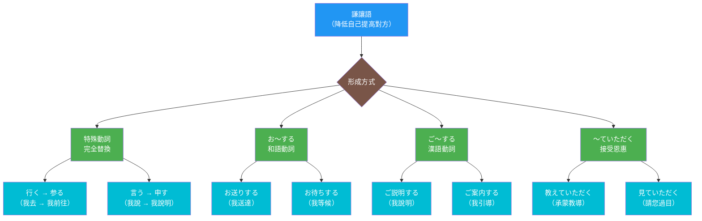
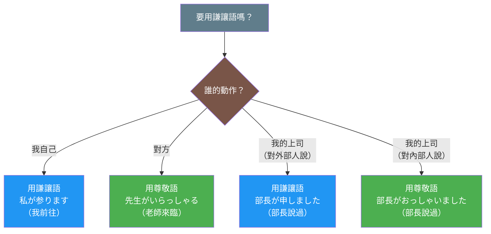

## 日文

謙譲語(けんじょうご)

**羅馬拼音**: kenjougo

**概念類型**:語言學理論・敬語系統

## 日文解釋

「謙譲語」(けんじょうご)とは、日本語の敬語体系における三つの柱の一つであり、話者自身または内集団の動作や状態を低めることで、相対的に相手や第三者を高め、敬意を表す言語形式です。謙譲語は尊敬語と対をなす重要な文法カテゴリーであり、日本社会における「へりくだり」の精神を言語化したものと言えます。

### 謙譲語の言語学的特徴

謙譲語は以下の言語学的特徴を持っています:

**1. 動作主の地位低下による相対的敬意表現**

謙譲語は、話者自身や内集団の動作を低めることで、間接的に相手を高めます。これは「自分を低くすることで相手を高く見せる」という日本的な敬意表現の核心です。

例:
- 基本形:「私が行く」
- 謙譲語:「私が参る」「私が伺う」

**2. 文法化された謙遜表現**

謙譲語は、語彙の交替だけでなく、複数の文法的手段によって実現されます:

- **特殊謙譲動詞**:「行く」→「参る」「伺う」、「言う」→「申す」、「食べる」→「いただく」、「もらう」→「いただく」
- **謙譲の補助動詞**:「〜ていただく」「〜てくださる」(受益表現)
- **謙譲の接辞構成**:「お〜する」(例:「お送りする」)、「ご〜する」(例:「ご説明する」)
- **謙譲の補助動詞**:「〜いたす」「〜申し上げる」

**3. 二種類の謙譲語**

現代日本語学では、謙譲語を二つに分類する考え方が一般的です:

**謙譲語I(謙譲語A)**:向かう先のある動作を謙譲表現にする
- 「先生に伺う」(行く・来るの謙譲語)
- 「お客様に申し上げる」(言うの謙譲語)
- 動作の向かう先(多くは相手)を高めることを主目的とする

**謙譲語II(丁重語)**:動作主を低めて丁寧さを表す
- 「私が参ります」(聞き手への丁寧さ)
- 「こちらでございます」
- 相手への直接の向かい先がなくても使用可能

この区別は、文化庁の「敬語の指針」(2007)で示され、日本語教育で重要な概念となっています。

**4. 視点の固定性と内外の区別**

謙譲語は、話者の視点から見て「自分側」の動作にのみ使用されます。そして、「内」と「外」の区別が重要です:

- 内部の人間の動作を外部に対して述べる時は、上司であっても謙譲語を使います
- 内部での会話では、上司の動作には尊敬語を使います

**5. 恩恵性の表現**

謙譲語は、相手からの恩恵を受ける場合や、相手のために何かをする場合に用いられることが多く、「受益」の意味を持つことがあります:

- 「教えていただく」(相手から恩恵を受ける)
- 「お手伝いいたします」(相手のために行動する)

### 謙譲語の社会的機能

謙譲語は以下の社会的機能を果たしています:

**1. へりくだりによる敬意の表現**

自分を低くすることで相手を相対的に高め、敬意を表します。これは日本文化の「謙虚さ」「遠慮」の価値観を反映しています。

**2. 内外関係の表現**

特にビジネス場面で、自分の所属する組織(内)と外部(外)を明確に区別し、内部の人間を一括して低めることで、組織全体として外部に敬意を示します。

**3. 恩恵関係の言語化**

「〜ていただく」などの形式で、相手からの恩恵や配慮を明示的に言語化し、感謝の気持ちを表現します。

**4. 円滑なコミュニケーションの促進**

自分を低めることで、相手に心理的な負担をかけず、円滑な人間関係を構築します。

### 謙譲語の形成パターン

謙譲語は主に以下のパターンで形成されます:

**パターン1:特殊謙譲動詞(語彙的交替)**

基本動詞が完全に別の動詞に置き換わります:

- 「行く」→「参る」「伺う」
- 「来る」→「参る」
- 「言う」→「申す」「申し上げる」
- 「する」→「いたす」
- 「食べる・飲む」→「いただく」
- 「もらう」→「いただく」「頂戴する」
- 「見る」→「拝見する」
- 「聞く」→「伺う」「拝聴する」
- 「知る」→「存じる」「存じ上げる」
- 「会う」→「お目にかかる」
- 「いる」→「おる」

**パターン2:「お〜する」構成**

和語動詞のます形語幹に「お」を付け、「する」を接続:

- 「送る」→「お送りする」
- 「待つ」→「お待ちする」
- 「伝える」→「お伝えする」
- 「渡す」→「お渡しする」

**パターン3:「ご〜する」構成**

漢語動詞(サ変動詞)の語幹に「ご」を付け、「する」を接続:

- 「説明する」→「ご説明する」
- 「案内する」→「ご案内する」
- 「連絡する」→「ご連絡する」
- 「報告する」→「ご報告する」

**パターン4:「〜いたす」(謙譲の補助動詞)**

「する」の謙譲語「いたす」を補助動詞として使用:

- 「説明する」→「説明いたします」
- 「確認する」→「確認いたします」

**パターン5:「〜ていただく」「〜てもらう」の謙譲形**

相手から恩恵を受けることを謙譲的に表現:

- 「見てもらう」→「見ていただく」
- 「教えてもらう」→「教えていただく」

**パターン6:「お(ご)〜いたす」「お(ご)〜申し上げる」**

より丁重な謙譲表現:

- 「お知らせいたします」
- 「ご報告申し上げます」

### 謙譲語使用における注意点

**1. 自分側の動作にのみ使用**

謙譲語は自分または内集団の動作にのみ使用し、相手の動作には使いません:
- ❌「先生が参りました」
- ✅「先生がいらっしゃいました」(尊敬語を使用)

**2. 内外の区別を正しく理解**

ビジネス場面では、内部の上司について外部に述べる時も謙譲語を使います:
- 外部の人に:「部長の佐藤が申しました」(謙譲語)
- 社内で:「佐藤部長がおっしゃいました」(尊敬語)

**3. 謙譲語Iと謙譲語IIの使い分け**

向かう先がある動作か、単に丁寧さを表すかを区別:
- 謙譲語I:「先生に伺います」(向かう先がある)
- 謙譲語II:「私が参ります」(向かう先は特定されない)

**4. 過度な謙遜の回避**

過度に謙譲語を使うと、かえって不自然になります:
- ❌「拝見させていただきます」(二重謙譲)
- ✅「拝見いたします」または「見させていただきます」

**5. 「お・ご」の選択**

和語には「お」、漢語には「ご」を使用するのが原則:
- 和語:「お送りする」「お待ちする」
- 漢語:「ご説明する」「ご案内する」

ただし例外もあります:「お電話する」(電話は漢語だが「お」を使う)

### 謙譲語と尊敬語の対比

謙譲語と尊敬語は対をなす敬語形式です:

| 基本形 | 尊敬語 | 謙譲語 |
|-------|--------|--------|
| 行く | いらっしゃる | 参る・伺う |
| 来る | いらっしゃる | 参る |
| 言う | おっしゃる | 申す・申し上げる |
| する | なさる | いたす |
| 食べる | 召し上がる | いただく |
| 見る | ご覧になる | 拝見する |
| 聞く | お聞きになる | 伺う・拝聴する |

この対比から、謙譲語と尊敬語が同じ概念の「上げる」と「下げる」という対照的な表現方法であることが分かります。

### 謙譲語の通時的変化

謙譲語は歴史的に発展してきました:

**古代日本語**:既に謙譲語と尊敬語の区別が存在(「参る」「申す」など)
**中世日本語**:武家社会の発展に伴い、より複雑化
**近代日本語**:明治期以降、標準語化に伴い整理
**現代日本語**:「〜させていただく」の過剰使用など、新しい問題も出現

## 英文解釋

"Kenjougo" (humble language) is one of the three pillars of the Japanese honorific system (keigo), a linguistic form that expresses respect by lowering the speaker's own actions or those of their in-group, thereby relatively elevating the listener or a third party. Kenjougo is an important grammatical category that pairs with sonkeigo (respectful language) and can be said to linguistically embody the Japanese spirit of humility.

### Linguistic Characteristics of Kenjougo

Kenjougo has the following linguistic characteristics:

**1. Relative Expression of Respect Through Lowering the Agent**

Kenjougo indirectly elevates others by lowering the speaker's own or their in-group's actions. This is the core of Japanese respect expression: "making others appear higher by lowering oneself."

Examples:
- Basic form: "Watashi ga iku" (I go)
- Humble: "Watashi ga mairu" (I go - humble), "Watashi ga ukagau" (I visit - humble)

**2. Grammaticalized Humble Expressions**

Kenjougo is realized not only through lexical substitution but also through multiple grammatical means:

- **Special humble verbs**: "iku" → "mairu" (go), "iu" → "mousu" (say), "taberu" → "itadaku" (eat/drink)
- **Humble auxiliary verbs**: "~te itadaku," "~te kudasaru" (benefactive expressions)
- **Humble affix constructions**: "o-~suru" (e.g., "o-okuri suru"), "go-~suru" (e.g., "go-setsumei suru")
- **Humble auxiliary verbs**: "~itasu," "~moushiageru"

**3. Two Types of Kenjougo**

In modern Japanese linguistics, it is common to classify kenjougo into two types:

**Kenjougo I (Kenjougo A)**: Humble expressions for actions directed toward someone
- "Sensei ni ukagau" (visit the teacher - humble)
- "Okyaku-sama ni moushiageru" (say to the customer - humble)
- Main purpose is to elevate the recipient of the action

**Kenjougo II (Teichougo - Courteous Language)**: Expresses politeness by lowering the agent
- "Watashi ga mairimasu" (I will go - polite to listener)
- "Kochira de gozaimasu" (It is here)
- Can be used even without a direct recipient

This distinction was established in the Agency for Cultural Affairs' "Guidelines for Honorifics" (2007) and has become an important concept in Japanese language education.

**4. Fixed Viewpoint and Inside-Outside Distinction**

Kenjougo is used only for actions of "one's own side" from the speaker's viewpoint. The distinction between "inside" (uchi) and "outside" (soto) is crucial:

- When speaking to outsiders about insiders, humble language is used even for superiors
- In internal conversations, respectful language is used for superiors' actions

**5. Expression of Benefactive Relationships**

Kenjougo is often used when receiving favors from others or doing something for others, carrying a "benefactive" meaning:

- "Oshiete itadaku" (receive teaching from someone)
- "O-tetsudai itashimasu" (I will help you)

### Social Functions of Kenjougo

Kenjougo fulfills the following social functions:

**1. Expression of Respect Through Humility**

By lowering oneself, others are relatively elevated, expressing respect. This reflects Japanese cultural values of "modesty" and "restraint."

**2. Expression of Inside-Outside Relationships**

Especially in business contexts, it clearly distinguishes between one's own organization (inside) and outsiders, collectively lowering insiders to show respect as an organization to outsiders.

**3. Linguistic Expression of Benefactive Relationships**

Forms like "~te itadaku" explicitly linguistically express favors and consideration received from others, conveying gratitude.

**4. Facilitation of Smooth Communication**

By lowering oneself, one avoids placing psychological burden on others, facilitating smooth interpersonal relationships.

### Formation Patterns of Kenjougo

Kenjougo is mainly formed through the following patterns:

**Pattern 1: Special Humble Verbs (Lexical Alternation)**

Basic verbs are completely replaced by different verbs:
- "iku" → "mairu," "ukagau"
- "kuru" → "mairu"
- "iu" → "mousu," "moushiageru"
- "suru" → "itasu"
- "taberu/nomu" → "itadaku"
- "morau" → "itadaku," "choudai suru"
- "miru" → "haiken suru"
- "kiku" → "ukagau," "haichou suru"
- "shiru" → "zonjiru," "zonjiageru"
- "au" → "o-me ni kakaru"
- "iru" → "oru"

**Pattern 2: "O-~suru" Construction**

"O" is added to the masu-stem of native Japanese verbs, followed by "suru":
- "okuru" → "o-okuri suru"
- "matsu" → "o-machi suru"
- "tsutaeru" → "o-tsutae suru"

**Pattern 3: "Go-~suru" Construction**

"Go" is added to the stem of Sino-Japanese verbs (suru-verbs), followed by "suru":
- "setsumei suru" → "go-setsumei suru"
- "annai suru" → "go-annai suru"
- "renraku suru" → "go-renraku suru"

**Pattern 4: "~itasu" (Humble Auxiliary Verb)**

"Itasu" (humble form of "suru") used as auxiliary verb:
- "setsumei suru" → "setsumei itashimasu"
- "kakunin suru" → "kakunin itashimasu"

**Pattern 5: "~te itadaku" (Humble Form of Receiving Favor)**

Humble expression for receiving favors from others:
- "mite morau" → "mite itadaku"
- "oshiete morau" → "oshiete itadaku"

**Pattern 6: "O(go)-~itasu" / "O(go)-~moushiageru"**

More courteous humble expressions:
- "O-shirase itashimasu"
- "Go-houkoku moushiagemasu"

### Precautions in Using Kenjougo

**1. Use Only for One's Own Side's Actions**

Kenjougo is used only for one's own or in-group's actions, not for the other party's:
- ❌ "Sensei ga mairimashita"
- ✅ "Sensei ga irasshaimashita" (use respectful language)

**2. Correctly Understand Inside-Outside Distinction**

In business situations, humble language is used even for internal superiors when speaking to outsiders:
- To outsiders: "Buchou no Satou ga moushimashita" (humble)
- Internally: "Satou-buchou ga osshaimashita" (respectful)

**3. Distinguish Between Kenjougo I and Kenjougo II**

Distinguish whether the action is directed toward someone or simply expresses politeness:
- Kenjougo I: "Sensei ni ukagaimasu" (has a direction)
- Kenjougo II: "Watashi ga mairimasu" (no specific direction)

**4. Avoid Excessive Humility**

Excessive use of kenjougo becomes unnatural:
- ❌ "Haiken sasete itadakimasu" (double humble)
- ✅ "Haiken itashimasu" or "Misasete itadakimasu"

**5. Choice of "O" vs "Go"**

Generally, use "o" for native Japanese words and "go" for Sino-Japanese words:
- Native: "o-okuri suru," "o-machi suru"
- Sino-Japanese: "go-setsumei suru," "go-annai suru"
- Exception: "o-denwa suru" ("denwa" is Sino-Japanese but uses "o")

## 圖解

### 謙讓語形成方式



### 謙讓語使用場景



## 中文解釋

「謙讓語」(けんじょうご)是日語敬語體系三大支柱之一,是一種通過降低說話者自身或內群體的動作或狀態,從而相對提高對方或第三者,以表達敬意的語言形式。謙讓語是與尊敬語相對應的重要文法類別,可以說是將日本社會的「謙遜」精神語言化的表現。

### 謙讓語的語言學特徵

謙讓語具有以下語言學特徵:

**1. 通過降低動作主體地位來表達相對敬意**

謙讓語通過降低說話者自身或內群體的動作,間接地提高對方。這是日本式敬意表達的核心:「通過降低自己來使對方顯得更高」。

例如:
- 基本形:「私が行く」(我去)
- 謙讓語:「私が参る」「私が伺う」(我前往/拜訪)

**2. 文法化的謙遜表達**

謙讓語不僅通過詞彙替換,還通過多種文法手段實現:

- **特殊謙讓動詞**:「行く」→「参る」「伺う」、「言う」→「申す」、「食べる」→「いただく」
- **謙讓助動詞**:「〜ていただく」「〜てくださる」(受益表達)
- **謙讓詞綴構成**:「お〜する」(例:「お送りする」)、「ご〜する」(例:「ご説明する」)
- **謙讓補助動詞**:「〜いたす」「〜申し上げる」

**3. 兩種類型的謙讓語**

現代日語學將謙讓語分為兩類:

**謙讓語I(謙讓語A)**:有明確對象的動作的謙讓表達
- 「先生に伺う」(拜訪老師)
- 「お客様に申し上げる」(對客戶說)
- 主要目的是提高動作指向的對象

**謙讓語II(丁重語)**:通過降低動作主體來表達禮貌
- 「私が参ります」(對聽話者的禮貌)
- 「こちらでございます」
- 即使沒有直接的對象也可使用

這個區別由日本文化廳的「敬語指針」(2007)確立,是日語教育中的重要概念。

**4. 視點固定性與內外區分**

謙讓語只用於從說話者視點看「自己這邊」的動作。而且「內」與「外」的區分很重要:

- 對外部人士談論內部人士時,即使是上司也使用謙讓語
- 內部對話中,對上司的動作使用尊敬語

**5. 恩惠性的表達**

謙讓語常用於接受對方恩惠或為對方做事的場合,帶有「受益」的意義:

- 「教えていただく」(接受對方教導)
- 「お手伝いいたします」(為對方幫忙)

### 謙讓語的社會功能

謙讓語發揮以下社會功能:

**1. 通過謙遜表達敬意**

通過降低自己來相對提高對方,表達敬意。這反映了日本文化的「謙虛」「客氣」價值觀。

**2. 內外關係的表達**

特別在商務場合,明確區分自己所屬的組織(內)和外部(外),將內部人員統一降低,以組織整體向外部表達敬意。

**3. 恩惠關係的語言化**

通過「〜ていただく」等形式,明確地將從對方獲得的恩惠或關懷語言化,表達感謝之情。

**4. 促進順暢溝通**

通過降低自己,不給對方造成心理負擔,構築順暢的人際關係。

### 謙讓語的形成模式

謙讓語主要通過以下模式形成:

**模式1:特殊謙讓動詞(詞彙替換)**

基本動詞完全替換為其他動詞:
- 「行く」→「参る」「伺う」
- 「来る」→「参る」
- 「言う」→「申す」「申し上げる」
- 「する」→「いたす」
- 「食べる・飲む」→「いただく」
- 「もらう」→「いただく」「頂戴する」
- 「見る」→「拝見する」
- 「聞く」→「伺う」「拝聴する」
- 「知る」→「存じる」「存じ上げる」
- 「会う」→「お目にかかる」
- 「いる」→「おる」

**模式2:「お〜する」構成**

在和語動詞的ます形詞幹前加「お」,後接「する」:
- 「送る」→「お送りする」
- 「待つ」→「お待ちする」
- 「伝える」→「お伝えする」

**模式3:「ご〜する」構成**

在漢語動詞(サ變動詞)的詞幹前加「ご」,後接「する」:
- 「説明する」→「ご説明する」
- 「案内する」→「ご案内する」
- 「連絡する」→「ご連絡する」

**模式4:「〜いたす」(謙讓補助動詞)**

將「する」的謙讓語「いたす」作為補助動詞使用:
- 「説明する」→「説明いたします」
- 「確認する」→「確認いたします」

**模式5:「〜ていただく」(接受恩惠的謙讓形)**

謙讓地表達從對方接受恩惠:
- 「見てもらう」→「見ていただく」
- 「教えてもらう」→「教えていただく」

**模式6:「お(ご)〜いたす」「お(ご)〜申し上げる」**

更加鄭重的謙讓表達:
- 「お知らせいたします」
- 「ご報告申し上げます」

### 使用謙讓語的注意事項

**1. 只用於自己這邊的動作**

謙讓語只用於自己或內群體的動作,不用於對方的動作:
- ❌「先生が参りました」
- ✅「先生がいらっしゃいました」(使用尊敬語)

**2. 正確理解內外區分**

在商務場合,對外部人士談論內部上司時也要使用謙讓語:
- 對外部:「部長の佐藤が申しました」(謙讓語)
- 公司內部:「佐藤部長がおっしゃいました」(尊敬語)

**3. 區分謙讓語I和謙讓語II**

區分動作是否有指向對象,還是單純表達禮貌:
- 謙讓語I:「先生に伺います」(有指向對象)
- 謙讓語II:「私が参ります」(沒有特定對象)

**4. 避免過度謙遜**

過度使用謙讓語反而不自然:
- ❌「拝見させていただきます」(雙重謙讓)
- ✅「拝見いたします」或「見させていただきます」

**5. 「お・ご」的選擇**

原則上和語用「お」,漢語用「ご」:
- 和語:「お送りする」「お待ちする」
- 漢語:「ご説明する」「ご案内する」
- 例外:「お電話する」(電話是漢語但用「お」)

## 核心用法

### 用法1:降低自己的動作

使用謙讓語降低自己的動作地位,相對提高對方。

**例句1**
```
明日、御社に伺います。
I will visit your company tomorrow. (humble)
明天我將前往貴公司拜訪。(謙讓)
```

**例句2**
```
私が説明いたします。
I will explain. (humble)
我來說明。(謙讓)
```

### 用法2:對外談論內部人士

在商務場合,對外部人士談論內部上司時使用謙讓語。

**例句3**
```
部長の田中が申しておりました。
Department Manager Tanaka said (to me). (humble when speaking to outsiders)
部長田中說過。(對外部人士時用謙讓語)
```

**例句4**
```
社長の山田は今、外出しております。
President Yamada is currently out. (humble when speaking to outsiders)
社長山田現在外出了。(對外部人士時用謙讓語)
```

### 用法3:表達接受恩惠

使用「〜ていただく」表達從對方接受恩惠或請求。

**例句5**
```
お忙しいところ、お時間をいただき、ありがとうございます。
Thank you for giving me your time despite being busy. (humble + benefactive)
感謝您在百忙之中撥冗。(謙讓+受益表達)
```

## 文法規則

### 規則1:特殊謙讓動詞的優先使用

當存在特殊謙讓動詞時,通常優先使用特殊動詞:

- ✅「私が参ります」(特殊動詞)
- △「私が行きます」(普通形,不夠禮貌)

### 規則2:「お・ご」的選擇規則

**使用「お」**:
- 和語動詞:お送りする、お待ちする
- 和語名詞:お名前、お時間

**使用「ご」**:
- 漢語動詞:ご説明する、ご案内する
- 漢語名詞:ご意見、ご住所

**例外**:
- 「お電話する」(雖然「電話」是漢語,但習慣用「お」)
- 「お勉強する」(雖然「勉強」是漢語,但習慣用「お」)

### 規則3:視點與敬語的關係

謙讓語只用於「自己側」的人物,不用於:
- 對方的動作(用尊敬語)
- 對外部談論內部人士時(即使是上司也用謙讓語)

### 規則4:內外區分的語境判斷

- 內部成員之間:根據上下關係使用尊敬語或普通形
- 對外部人士:將內部成員整體降低(謙讓語)
- 視點轉換:根據溝通對象調整內外界線

### 規則5:謙讓語I與謙讓語II的區別

- **謙讓語I**:動作有明確的指向對象(多為相手或第三者)
  - 「先生に伺う」
  - 「お客様に申し上げる」

- **謙讓語II(丁重語)**:對聽話者表達禮貌,不需要特定對象
  - 「私が参ります」
  - 「こちらでございます」

## 常見錯誤

### 錯誤1:對他人的動作使用謙讓語

❌ 誤:「先生が参りました」
✅ 正:「先生がいらっしゃいました」
說明:謙讓語只用於自己的動作,對他人的動作應使用尊敬語。

### 錯誤2:內外區分錯誤

❌ 誤:(對客戶說)「部長の佐藤がおっしゃいました」
✅ 正:「部長の佐藤が申しました」
說明:對外部人士談論公司內部人士時,即使是上司也要用謙讓語,不用尊敬語。

### 錯誤3:過度謙讓

❌ 誤:「拝見させていただきます」
✅ 正:「拝見いたします」或「見させていただきます」
說明:「拝見する」本身已是謙讓語,再加「させていただく」構成雙重謙讓,過度且不自然。

### 錯誤4:「お・ご」的誤用

❌ 誤:「ご送りする」
✅ 正:「お送りする」
說明:「送る」是和語動詞,應該用「お」而不是「ご」。

### 錯誤5:「させていただく」的過度使用

❌ 過度:「出席させていただきます」(普通場合)
✅ 適度:「出席いたします」
說明:「させていただく」應該用於真正需要對方許可的場合,過度使用顯得諂媚。只在確實獲得對方恩惠或許可時使用。

## 學習要點

1. **降低自己**:謙讓語通過降低自己的地位來相對提高對方
2. **多種形成方式**:特殊動詞、接辭構成、補助動詞等多種文法手段
3. **視點固定**:只用於「自己側」的人物,不用於對方
4. **內外區分**:商務場合特別注意內外關係對謙讓語使用的影響
5. **兩種謙讓語**:區分謙讓語I(有對象)和謙讓語II(丁重語)
6. **與尊敬語對比**:謙讓語降低自己,尊敬語提高對方,兩者配合使用
7. **受益表達**:「〜ていただく」等形式表達從對方接受恩惠
8. **避免過度**:不疊加多個謙讓表現,保持自然和適度

## 相關連結

### 敬語體系
- [敬語體系](013_keigo_taikei.md) - 敬語的整體理論框架
- [尊敬語概念](034_sonkeigo_concept.md) - 提高對方地位的敬語
- [丁寧語概念](teineigo_concept.md)(待建立) - 基本禮貌表達

### 謙讓語文法形式
- [お〜する](../grammar/kenjougo_o_suru.md)(待建立) - 和語謙讓構成
- [ご〜する](../grammar/kenjougo_go_suru.md)(待建立) - 漢語謙讓構成
- [〜ていただく](../grammar/te_itadaku.md)(待建立) - 受益表達的謙讓形式
- [〜させていただく](../grammar/sasete_itadaku.md)(待建立) - 使役的謙讓表達

### 特殊謙讓動詞
- [参る](../verb-u/mairu.md)(待建立) - 去・來的謙讓語
- [申す](../verb-u/mousu.md)(待建立) - 說的謙讓語
- [致す](../verb-u/itasu.md)(待建立) - 做的謙讓語
- [いただく](../verb-ru/itadaku.md)(待建立) - 吃・喝・得到的謙讓語
- [拝見する](../verb-irregular/haiken_suru.md)(待建立) - 看的謙讓語
- [存じる](../verb-irregular/zonjiru.md)(待建立) - 知道的謙讓語
- [伺う](../verb-u/ukagau.md)(待建立) - 訪問・聽・問的謙讓語

### 社會語言學概念
- [內與外](007_uchi-soto.md) - 內外群體概念對敬語的影響
- [視點理論](006_viewpoint.md) - 視點與敬語選擇的關係
- [受益表達](benefactive.md)(待建立) - 恩惠關係的語言表現

### 實用應用
- [商務敬語](../extension/business_keigo.md)(待建立) - 商務場合的敬語使用
- [敬語常見錯誤](../extension/keigo_mistakes.md)(待建立) - 學習者常犯錯誤分析
- [內外區分與敬語](../extension/uchi_soto_keigo.md)(待建立) - 內外關係的敬語實踐

---

**建立日期**: 2025-10-31
**最後更新**: 2025-10-31
**字數**: ~6800
**例句數**: 5
