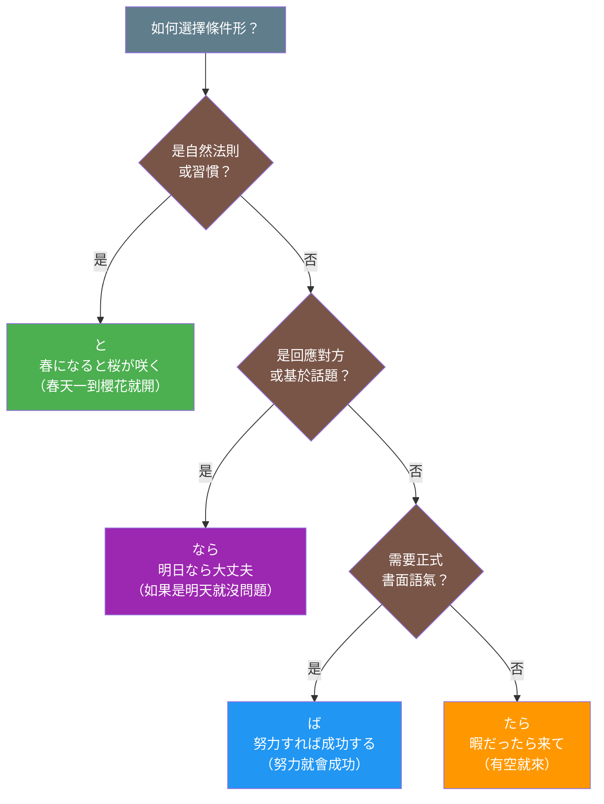

## 日文

条件形総覧

## 概述

日文的條件表達體系包含四種主要形式：「と」「ば」「たら」「なら」。每種形式都有其獨特的語義特徵和使用場景，理解它們之間的差異是掌握日文條件表達的關鍵。

## 日文解釋

日本語の条件表現は、「と」「ば」「たら」「なら」という四つの主要な形式で構成されています。これらは単なる「もし〜なら」という条件を表すだけでなく、それぞれ異なる意味的・語用的特徴を持っています。

「と」は自然的・必然的な結果を表し、主に一般的真理や習慣を述べる際に使われます。前件が成立すれば後件が必ず起こるという因果関係を示します。

「ば」は仮定条件を表し、やや文語的で改まった表現です。可能性や潜在的な条件を示し、「もし〜ならば」という論理的な条件関係を表現します。

「たら」は最も柔軟な条件形で、仮定・発見・時間的前後関係など、多様な意味を表現できます。日常会話で最も頻繁に使用され、口語的な印象を与えます。

「なら」は話題や前提に基づく条件を表し、相手の発言や状況を受けて「それならば」という意味で使われることが多いです。文脈依存性が高く、対話的な性質を持ちます。

これらの形式を適切に使い分けることで、微妙なニュアンスの違いを表現し、より正確で自然な日本語コミュニケーションが可能になります。

## 英文解釋

The Japanese conditional system consists of four primary forms: "to", "ba", "tara", and "nara". Each form carries distinct semantic and pragmatic features that go beyond simply expressing "if...then" conditions.

"To" (と) expresses natural or inevitable consequences, primarily used for general truths and habitual actions. It indicates that the consequent necessarily follows from the antecedent.

"Ba" (ば) represents hypothetical conditions with a slightly formal or literary tone. It expresses potential or hypothetical situations, conveying a logical conditional relationship akin to "if...would".

"Tara" (たら) is the most versatile conditional form, expressing hypothetical situations, discoveries, and temporal sequences. It is the most frequently used form in daily conversation and carries a colloquial impression.

"Nara" (なら) expresses conditions based on topics or premises, often responding to someone's statement or a given situation with the meaning "if that's the case". It is highly context-dependent and inherently dialogical.

Understanding these distinctions enables speakers to express subtle nuances and achieve more precise and natural Japanese communication.

## 中文解釋

日文的條件表達系統由四種主要形式組成：「と」「ば」「たら」「なら」。每種形式都具有獨特的語義和語用特徵，不僅僅是表達「如果...那麼」的條件關係。

「と」表達自然或必然的結果，主要用於一般真理和習慣性行為。它表示前件成立時，後件必然發生的因果關係。

「ば」表達假設條件，帶有略微正式或書面的語氣。它表達潛在或假設的情境，傳達邏輯性的條件關係，相當於「如果...就會」。

「たら」是最靈活的條件形式，可表達假設、發現和時間先後等多種意義。它是日常會話中最常用的形式，帶有口語化的印象。

「なら」表達基於話題或前提的條件，常用於回應他人的話語或既定情境，意思是「既然如此」或「如果是那樣的話」。它高度依賴語境，具有對話性質。

理解這些區別能幫助說話者表達微妙的語義差異，實現更精確、更自然的日文溝通。

## 圖解



## 四種條件形比較表

| 特徵 | と | ば | たら | なら |
|-----|----|----|------|------|
| **語氣** | 中性 | 正式 | 口語 | 對話性 |
| **條件性質** | 必然・習慣 | 假設・潛在 | 假設・發現 | 話題・前提 |
| **時態限制** | 前後件現在時 | 限制較少 | 最靈活 | 限制較少 |
| **主觀意志** | 不可用 | 可用 | 可用 | 可用 |
| **典型場景** | 自然現象、真理 | 書面、正式 | 日常會話 | 對話回應 |
| **JLPT** | N4 | N3 | N4 | N3 |

## 核心用法

### 用法 1：と - 必然的結果（自然法則）

「と」用於表達客觀的、必然的因果關係，常用於自然現象和一般真理。

**例句 1**
```
春になると、桜が咲く。
When spring comes, cherry blossoms bloom.
春天一到，櫻花就會綻放。
```

**例句 2**
```
このボタンを押すと、電源が入る。
When you press this button, the power turns on.
按下這個按鈕，電源就會開啟。
```

### 用法 2：ば - 假設條件（潛在可能）

「ば」用於表達假設性的條件，帶有「如果...就會」的邏輯關係，語氣較為正式。

**例句 3**
```
時間があれば、手伝います。
If I have time, I will help.
如果有時間的話，我會幫忙。
```

**例句 4**
```
努力すれば、必ず成功する。
If you make efforts, you will surely succeed.
如果努力的話，一定會成功。
```

### 用法 3：たら - 靈活條件（假設・發現・時間）

「たら」是最靈活的條件形式，可用於假設、發現和時間先後關係，是日常會話的首選。

**例句 5**
```
暇だったら、遊びに来てください。
If you're free, please come visit.
如果有空的話，請來玩。
```

**例句 6**
```
家に帰ったら、母が料理を作っていた。
When I got home, my mother was cooking.
回到家時，媽媽正在做飯。
```

### 用法 4：なら - 話題前提（對話回應）

「なら」基於對方的話語或既定情境提出條件，具有強烈的對話性質。

**例句 7**
```
A: 明日暇？
B: 明日なら大丈夫です。
A: Are you free tomorrow?
B: If it's tomorrow, I'm available.
A: 明天有空嗎？
B: 如果是明天的話沒問題。
```

**例句 8**
```
日本へ行くなら、京都がおすすめです。
If you're going to Japan, I recommend Kyoto.
如果要去日本的話，推薦京都。
```

## 核心區別

### 區別 1：條件的必然性

- **と**：前件成立→後件必然發生（客觀因果）
- **ば**：前件成立→後件可能發生（假設推論）
- **たら**：前件成立→後件可能發生（假設或發現）
- **なら**：基於話題→提出條件（對話前提）

### 區別 2：主觀意志的限制

- **と**：後件不能是主觀意志行為（×「雨が降ると、傘を持って行く」）
- **ば**：後件可以是主觀意志行為（○「時間があれば、行きます」）
- **たら**：後件可以是主觀意志行為（○「暇だったら、来てください」）
- **なら**：後件可以是主觀意志行為（○「それなら、行きましょう」）

### 區別 3：時態和語氣

- **と**：前後件通常是現在時，表示一般性條件
- **ば**：較為正式，書面語氣
- **たら**：最口語化，可用於過去時態
- **なら**：對話性最強，回應性質

### 區別 4：使用頻率

- **日常會話**：たら > なら > と > ば
- **書面文章**：ば > と > たら > なら
- **自然法則**：と（幾乎唯一選擇）
- **對話回應**：なら（最自然）

## 判斷流程

選擇條件形的決策流程：

1. **是否為自然法則或習慣？**
   - 是 → 使用「と」
   - 否 → 繼續

2. **是否回應對方或基於話題？**
   - 是 → 使用「なら」
   - 否 → 繼續

3. **是否需要正式或書面語氣？**
   - 是 → 使用「ば」
   - 否 → 使用「たら」（日常會話的萬用選擇）

4. **後件是否為主觀意志？**
   - 是 → 不能用「と」，可用「ば」「たら」「なら」
   - 否 → 所有形式都可用（根據其他條件判斷）

## 常見錯誤

### 錯誤 1：と + 主觀意志

❌ 誤：雨が降ると、傘を持って行く。
✅ 正：雨が降ったら、傘を持って行く。
說明：「と」後不能接主觀意志行為，應改用「たら」。「と」只能表達客觀、必然的結果。

### 錯誤 2：混淆 なら 和 たら

❌ 誤：暇だったら、京都がおすすめです。（語境不自然）
✅ 正：京都へ行くなら、春がいいです。
說明：「なら」用於基於話題提出條件，「たら」用於假設或發現。推薦事項通常用「なら」更自然。

### 錯誤 3：ば 用於過去發現

❌ 誤：家に帰れば、誰もいなかった。
✅ 正：家に帰ったら、誰もいなかった。
說明：表達過去的發現時應使用「たら」，「ば」不適合表達已發生的事實。

### 錯誤 4：過度使用正式形式

❌ 誤：コンビニへ行けば、一緒に来る？（過於生硬）
✅ 正：コンビニへ行くけど、一緒に来る？
說明：日常邀請不需要用條件形，直接用「けど」更自然。過度使用條件形會顯得不自然。

## 學習要點

1. **と的本質**：表達必然性和客觀性，不能用於主觀意志，適合自然現象和習慣
2. **ば的特徵**：帶有假設性和正式感，常用於書面語和邏輯推論
3. **たら的靈活性**：最萬用的條件形式，可用於假設、發現、時間，是日常會話首選
4. **なら的對話性**：基於話題或對方話語提出條件，具有回應性質
5. **主觀意志限制**：「と」不能接主觀意志，其他三種可以
6. **語氣層次**：正式度排序為 ば > と > たら ≈ なら
7. **語境依賴性**：「なら」高度依賴語境，需要明確的話題或前提
8. **時態靈活性**：「たら」可用於過去時態，其他形式主要用於現在或未來

## 相關連結

### 基礎文法
- [conditional_to](../grammar/conditional_to.md) - と條件形詳解（待建立）
- [conditional_ba](../grammar/conditional_ba.md) - ば條件形詳解（待建立）
- [conditional_tara](../grammar/conditional_tara.md) - たら條件形詳解（待建立）
- [conditional_nara](../grammar/conditional_nara.md) - なら條件形詳解（待建立）

### 相關比較
- [tara_vs_to](../comparison/tara_vs_to.md) - たら與と的區別（待建立）
- [ba_vs_tara](../comparison/ba_vs_tara.md) - ば與たら的區別（待建立）
- [nara_vs_tara](../comparison/nara_vs_tara.md) - なら與たら的區別（待建立）

### 進階概念
- [causality](causality.md) - 因果關係的表達（待建立）
- [hypothetical](hypothetical.md) - 假設性表達（待建立）
- [pragmatics](pragmatics.md) - 語用學概念（待建立）

---

**建立日期**: 2025-10-31
**最後更新**: 2025-10-31
**字數**: ~3200
**例句數**: 8
