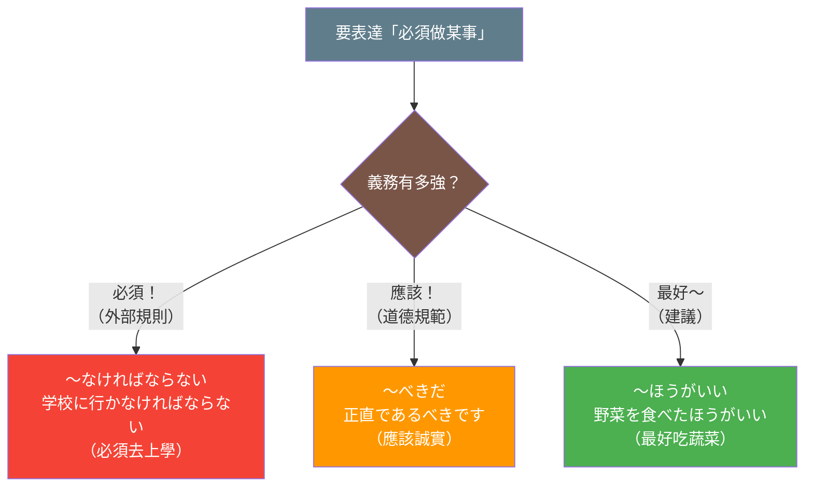
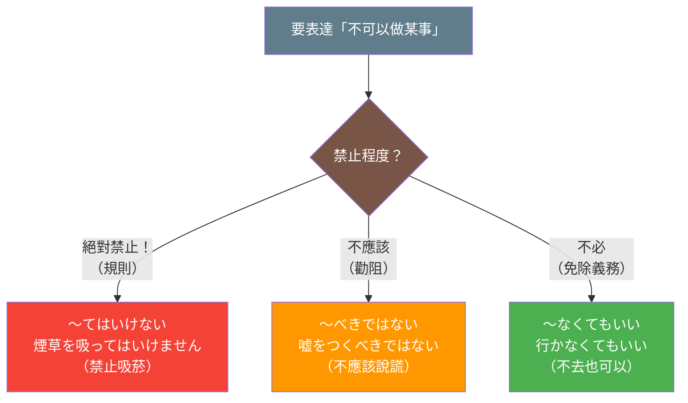

## 日文

義務表現（ぎむひょうげん）

### 概念情報

| 項目 | 內容 |
|------|------|
| 概念類型 | 語法系統 |
| JLPT | N5-N3（涵蓋初級到中級） |
| 使用頻率 | 極高 |
| 複雜度 | 中等 |

## 日文解釋

義務表現とは、話し手が「何かをしなければならない」「何かをする必要がある」という必要性や義務を表現するための文法体系である。

日本語には義務や必要性を表現する方法が複数存在し、それぞれ微妙なニュアンスの違いがある。最も基本的な形式は「〜なければならない」と「〜なくてはいけない」であり、これらは客観的な義務や社会的な規則を表現する際に使用される。一方、「〜べきだ」は規範的な義務や道徳的な判断を表現し、より強い主張や意見を含む。

義務表現の使い分けは、義務の発生源（外部的規則、内的動機、社会的規範）、義務の強さ（絶対的、推奨的）、そして話し手の立場（客観的、主観的）によって決定される。例えば、「薬を飲まなければならない」は医学的な必要性を表すが、「健康のために運動をするべきだ」は一般的な推奨を表現する。

また、義務表現には否定形も存在し、「〜てはいけない」「〜べきではない」などは禁止や避けるべき行為を表現する。これらの否定形は、許可の表現とも密接に関連している。

義務表現は日常会話から公式文書まで幅広く使用され、日本語学習において重要な文法項目の一つである。特に、ビジネス場面や公的なコミュニケーションでは、適切な義務表現を選択することが円滑な意思疎通につながる。

## 英文解釋

Obligation expressions (gimu hyōgen) are a grammatical system used to express necessity, duty, or obligation—conveying that "something must be done" or "something needs to be done."

Japanese offers multiple ways to express obligation and necessity, each with subtle nuances. The most fundamental forms are "〜なければならない" (nakereba naranai) and "〜なくてはいけない" (nakute wa ikenai), which express objective obligations or social rules. In contrast, "〜べきだ" (beki da) expresses normative obligations or moral judgments, conveying stronger assertions or opinions.

The choice of obligation expression depends on the source of the obligation (external rules, internal motivation, social norms), the strength of the obligation (absolute, recommended), and the speaker's stance (objective, subjective). For example, "薬を飲まなければならない" (kusuri wo nomanakerebanaranai) expresses medical necessity, while "健康のために運動をするべきだ" (kenkō no tame ni undō wo suru beki da) expresses a general recommendation.

Obligation expressions also include negative forms. Expressions like "〜てはいけない" (te wa ikenai) and "〜べきではない" (beki dewa nai) express prohibition or actions that should be avoided, and are closely related to permission expressions.

These expressions are widely used from everyday conversation to official documents, making them a crucial grammatical element in Japanese language learning. Particularly in business and formal communication, selecting the appropriate obligation expression contributes to smooth communication.

## 中文解釋

義務表現（義務表達）是用來表達必要性、責任或義務的文法體系，傳達「必須做某事」或「需要做某事」的意思。

日文中有多種表達義務和必要性的方式，各自帶有細微的語感差異。最基本的形式是「〜なければならない」和「〜なくてはいけない」，用於表達客觀的義務或社會規則。相對地，「〜べきだ」表達規範性義務或道德判斷，帶有更強的主張或意見。

義務表現的選擇取決於義務的來源（外部規則、內在動機、社會規範）、義務的強度（絕對的、推薦的），以及說話者的立場（客觀的、主觀的）。例如，「薬を飲まなければならない」表達醫學上的必要性，而「健康のために運動をするべきだ」表達一般性的建議。

義務表現也包含否定形式。「〜てはいけない」和「〜べきではない」等表達禁止或應該避免的行為，與許可表達密切相關。

這些表達從日常會話到正式文件都廣泛使用，是日語學習中的重要文法項目。特別是在商務場合和正式溝通中，選擇適當的義務表達有助於順暢的意思交流。

## 核心用法

### 用法 1：強烈義務（〜なければならない）

表達客觀的、必須履行的義務，通常來自外部規則或社會規範。

**例句 1**
```
学生は毎日学校に行かなければなりません。
Students must go to school every day.
學生必須每天去上學。
```

**例句 2**
```
この書類を明日までに提出しなければならない。
I must submit this document by tomorrow.
我必須在明天之前提交這份文件。
```

### 用法 2：道德義務（〜べきだ）

表達規範性或道德性的義務，帶有說話者的判斷或主張。

**例句 3**
```
嘘をついてはいけない。正直であるべきです。
You shouldn't lie. You should be honest.
不應該說謊。應該誠實。
```

**例句 4**
```
環境を守るために、みんなが努力するべきだと思う。
I think everyone should make an effort to protect the environment.
我認為每個人都應該為保護環境而努力。
```

### 用法 3：禁止（否定義務）

表達禁止或不應該做的事情。

**例句 5**
```
ここで煙草を吸ってはいけません。
You must not smoke here.
這裡禁止吸菸。
```

## 文法規則

### 規則 1：義務強度的分級

義務表現可依強度分為三個層級：

**強制性義務**：
- 〜なければならない（最強）
- 〜なくてはいけない
- 〜ないといけない

**規範性義務**：
- 〜べきだ（道德、規範）
- 〜ほうがいい（建議）

**弱義務（必要性）**：
- 〜必要がある（需要）
- 〜たほうがいい（最好）

### 規則 2：義務的來源

義務可根據來源分類：

**外部義務**：法律、規則、命令
- 「法律で決められているから、〜なければならない」

**社會義務**：社會規範、禮儀
- 「社会人として、〜べきだ」

**個人義務**：個人責任、自我要求
- 「自分の責任として、〜なくてはいけない」

### 規則 3：形式變化

義務表現可與各種動詞形態結合：

**基本形**：
```
動詞ない形 + なければならない
動詞ない形 + なくてはいけない
動詞辞書形 + べきだ
```

**過去形**：
```
〜なければならなかった（應該要做但沒做）
〜べきだった（當時應該要做）
```

**否定形**：
```
〜なくてもいい（不必）
〜べきではない（不應該）
〜てはいけない（禁止）
```

## 常見錯誤

### 錯誤 1：混淆「なければならない」與「べきだ」

❌ 誤：明日までに宿題を出すべきだ。（從規則角度錯誤）
✅ 正：明日までに宿題を出さなければならない。
說明：老師給定的明確期限是外部規則，應使用「なければならない」而非「べきだ」。「べきだ」更適合表達道德或規範性判斷。

### 錯誤 2：否定形的混淆

❌ 誤：ここで写真を撮るべきではない。（語氣太弱）
✅ 正：ここで写真を撮ってはいけません。
說明：在表達明確禁止時，應使用「てはいけない」而非「べきではない」。「べきではない」更適合表達建議性的勸阻。

### 錯誤 3：過度使用強烈義務表現

❌ 誤：もっと野菜を食べなければなりません。（在日常建議中過於強硬）
✅ 正：もっと野菜を食べたほうがいいですよ。
說明：給予健康建議時，使用「たほうがいい」比「なければならない」更自然、更友善。

## 圖解

義務表達的強度層級：



禁止表達的選擇：



## 學習要點

1. **義務強度梯度**：掌握從強制到建議的義務表現梯度，依情境選擇適當形式
2. **來源區分**：理解義務來自外部規則（なければならない）還是內在規範（べきだ）
3. **否定形變化**：熟悉各種義務表現的否定形式及其語感差異
4. **語域適配**：在正式和非正式場合選擇相應的義務表現形式
5. **文化理解**：認識日本社會中義務與責任的文化內涵

## 相關連結

### 基礎文法
- [nakereba_naranai.md](../grammar/nakereba_naranai.md) - 〜なければならない的詳細用法（待建立）
- [beki.md](../grammar/beki.md) - 〜べきだ的規範義務表達（待建立）
- [te_wa_ikenai.md](../grammar/te_wa_ikenai.md) - 〜てはいけない的禁止表達（待建立）
- [nakute_mo_ii.md](../grammar/nakute_mo_ii.md) - 〜なくてもいい的許可表達（待建立）

### 相關概念
- [permission_expressions.md](permission_expressions.md) - 許可表現系統（待建立）
- [necessity_expressions.md](necessity_expressions.md) - 必要性表現（待建立）
- [prohibition_expressions.md](prohibition_expressions.md) - 禁止表現（待建立）

### 進階文法
- [hou_ga_ii.md](../grammar/hou_ga_ii.md) - 〜ほうがいい的建議表達（待建立）
- [hitsuyou_ga_aru.md](../grammar/hitsuyou_ga_aru.md) - 〜必要がある的必要性表達（待建立）

### 語用辨析
- [nakereba_vs_beki.md](../comparison/nakereba_vs_beki.md) - 「なければならない」vs「べきだ」（待建立）
- [te_wa_ikenai_vs_beki_dewa_nai.md](../comparison/te_wa_ikenai_vs_beki_dewa_nai.md) - 禁止表達的選擇（待建立）

---

**建立日期**: 2025-10-31
**最後更新**: 2025-10-31
**字數**: ~2,850
**例句數**: 5
