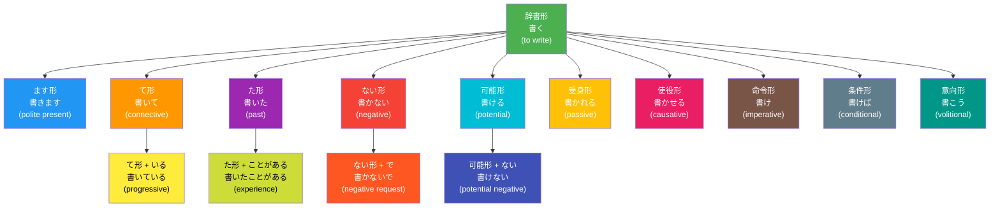

## 日文

動詞の形（どうしのかたち）

### 概念情報

| 項目 | 內容 |
|------|------|
| 読み方 | どうしのかたち |
| 漢字 | 動詞の形 |
| 英語 | verb forms |
| 中国語 | 動詞形式 |
| 領域 | 言語学、文法理論 |
| 関連概念 | 活用、活用形、語形変化 |

### 定義

動詞の形とは、日本語の動詞が文法的機能や意味を表現するために取る様々な形態的変化の総称である。基本形（辞書形）を起点として、て形、た形、ない形、可能形、受身形、使役形、命令形など、多様な派生形式が存在する。これらの形は活用（[katsuyou](010_katsuyou.md)）という体系的な変化規則に従って生成される。

### 動詞の形の分類

**基本的な形**
- **辞書形（dictionary form）**：動詞の基本形（書く、食べる、する）
- **ます形（polite form）**：丁寧な表現（書きます、食べます、します）
- **て形（te-form）**：接続、進行、依頼などに使用（書いて、食べて、して）
- **た形（ta-form）**：過去、完了を表す（書いた、食べた、した）
- **ない形（negative form）**：否定を表す（書かない、食べない、しない）

**派生的な形**
- **可能形（potential form）**：能力や可能性を表す（書ける、食べられる、できる）
- **受身形（passive form）**：受動的な行為を表す（書かれる、食べられる、される）
- **使役形（causative form）**：他者に行為をさせることを表す（書かせる、食べさせる、させる）
- **命令形（imperative form）**：命令や指示を表す（書け、食べろ、しろ）
- **条件形（conditional form）**：仮定条件を表す（書けば、食べれば、すれば）
- **意向形（volitional form）**：意志や勧誘を表す（書こう、食べよう、しよう）

## 日文解釋

動詞の形は、日本語文法における最も重要な概念の一つである。一つの動詞から多様な形が派生し、それぞれが異なる文法的機能や意味的ニュアンスを担う。

この概念の核心は、日本語が形態的に豊かな言語であるという点にある。英語などの言語と比較すると、日本語の動詞は形態変化のバリエーションが豊富で、一つの動詞から十数種類以上の形を生み出すことができる。例えば、「書く」という動詞は、「書きます」「書いて」「書いた」「書かない」「書ける」「書かれる」「書かせる」など、用途に応じて様々な形に変化する。

これらの形は、活用という規則的なシステムに基づいて生成される。動詞のグループ（五段動詞、一段動詞、変格動詞）によって変化のパターンは異なるが、同じグループ内では一貫した規則が適用される。学習者にとって、これらの形を習得することは、日本語の表現力を大きく広げる鍵となる。

また、動詞の形は単独で使われるだけでなく、複数の形が組み合わさることで、より複雑な文法表現を作り出すこともできる。例えば、「書かせられる」（使役受身）、「食べられなかった」（可能否定過去）など、複数の形態的要素が重層的に付加される。

## 英文解釋

**Verb forms** (doushi no katachi) refer to the various morphological transformations that Japanese verbs undergo to express different grammatical functions and meanings. Starting from the basic dictionary form, verbs can take numerous derived forms including te-form, ta-form, negative form, potential form, passive form, causative form, and imperative form, among others.

The richness of Japanese verb morphology is one of the language's distinctive features. A single verb can generate over a dozen different forms through systematic conjugation patterns. These forms are not arbitrary variations but follow predictable rules based on the verb's classification (godan, ichidan, or irregular).

**Basic forms** include:
- **Dictionary form**: The base form found in dictionaries
- **Masu-form**: Polite form used in formal speech
- **Te-form**: Connective form used for linking clauses, expressing ongoing actions, or making requests
- **Ta-form**: Past tense and perfective aspect
- **Nai-form**: Negative form

**Derived forms** include:
- **Potential form**: Expresses ability or possibility
- **Passive form**: Indicates passive voice
- **Causative form**: Expresses causing someone to do something
- **Imperative form**: Commands and instructions
- **Conditional form**: Hypothetical conditions
- **Volitional form**: Intention and invitation

Understanding verb forms is fundamental to mastering Japanese grammar, as they form the building blocks for expressing tense, aspect, mood, voice, and politeness levels.

## 中文解釋

**動詞形式**（動詞の形）指日語動詞為了表達不同的語法功能和意義而進行的各種形態變化的總稱。從基本的辭書形出發，動詞可以衍生出て形、た形、ない形、可能形、被動形、使役形、命令形等多種形式。

日語動詞形態的豐富性是這門語言的顯著特徵之一。單一動詞可以通過系統性的活用規則生成十多種不同的形式。這些形式並非任意變化，而是遵循基於動詞分類（五段動詞、一段動詞、變格動詞）的可預測規則。

**基本形式**包括：
- **辭書形**：字典中的基本形式
- **ます形**：用於正式場合的禮貌形式
- **て形**：連接形式，用於連接句子、表達進行中的動作或提出請求
- **た形**：過去時態和完成體
- **ない形**：否定形式

**派生形式**包括：
- **可能形**：表達能力或可能性
- **被動形**：表示被動語態
- **使役形**：表達讓某人做某事
- **命令形**：命令和指示
- **條件形**：假設條件
- **意向形**：意志和邀請

這些形式可以單獨使用，也可以組合使用以創造更複雜的語法表達。理解動詞形式是掌握日語語法的基礎，因為它們是表達時態、體貌、語氣、語態和禮貌程度的基本構件。

## 圖解

### 動詞の形の体系（「書く」を例に）



**說明**：
- **綠色**：辭書形（基本形）
- **藍色**：禮貌形式
- **橘色**：連接形式
- **紫色**：過去形式
- **紅色**：否定形式
- **青色**：可能形式
- **黃色**：被動形式
- **粉色**：使役形式
- **棕色**：命令形式
- **灰色**：條件形式
- **綠藍色**：意向形式
- **淺色**：組合形式

## 核心用法

### 用法 1：基本形の使い分け

日本語学習の初期段階では、まず基本的な形を習得することが重要である。

**例句 1**
```
毎朝新聞を読みます。辞書形は「読む」で、丁寧な場面では「読みます」を使う。
I read the newspaper every morning. The dictionary form is "yomu," and we use "yomimasu" in polite situations.
我每天早上讀報紙。辭書形是「読む」，在正式場合使用「読みます」。
```

**例句 2**
```
昨日映画を見て、友達と話した。「見る」のて形「見て」で二つの動作を接続している。
Yesterday I watched a movie and talked with friends. The te-form "mite" of "miru" connects two actions.
昨天看了電影，和朋友聊天。「見る」的て形「見て」連接兩個動作。
```

### 用法 2：派生形による意味の拡張

派生形を使うことで、動詞の意味を拡張できる。

**例句 3**
```
日本語が話せるようになった。「話す」の可能形「話せる」は能力を表す。
I became able to speak Japanese. The potential form "hanaseru" of "hanasu" expresses ability.
變得能說日語了。「話す」的可能形「話せる」表達能力。
```

**例句 4**
```
先生に褒められて嬉しかった。「褒める」の受身形「褒められる」は受動的な経験を表す。
I was happy to be praised by my teacher. The passive form "homerareru" of "homeru" expresses passive experience.
被老師稱讚很高興。「褒める」的被動形「褒められる」表達被動經歷。
```

### 用法 3：複合形の使用

複数の形を組み合わせることで、より複雑な意味を表現できる。

**例句 5**
```
この本は子供に読ませられる内容だ。「読む」の使役形「読ませる」に受身形「られる」が付いた使役受身形。
This book has content that can be made to be read by children. "Yomaseru" (causative of "yomu") combined with passive "rareru."
這本書的內容可以讓孩子閱讀。「読む」的使役形「読ませる」加上被動形「られる」形成使役被動形。
```

**例句 6**
```
明日までに書けなかったら困る。「書く」の可能形「書ける」の否定形「書けない」の条件形。
It would be troublesome if I can't write it by tomorrow. Conditional form of "kakenai" (potential negative of "kaku").
如果明天之前寫不完就麻煩了。「書く」的可能形「書ける」的否定形「書けない」的條件形。
```

## 文法規則

### 規則 1：動詞グループによる形成パターンの違い

動詞の形は、動詞のグループ（五段、一段、変格）によって形成方法が異なる。

**五段動詞（godan verbs）**
- 語幹の最後の音が五十音図の五段（a, i, u, e, o）で変化
- 例：書く → 書か（ない）、書き（ます）、書いて、書ける

**一段動詞（ichidan verbs）**
- 語幹は固定、「る」が脱落して語尾が付加
- 例：食べる → 食べ（ない）、食べ（ます）、食べて、食べられる

**変格動詞（irregular verbs）**
- 「する」と「来る」のみ。独自のパターン
- 例：する → し（ない）、し（ます）、して、できる

### 規則 2：形の連鎖と組み合わせ

動詞の形は連鎖的に組み合わせることができる。

- **可能否定**：書ける → 書けない（can't write）
- **使役受身**：書かせる → 書かせられる（be made to write）
- **可能否定過去**：食べられる → 食べられなかった（couldn't eat）
- **丁寧可能否定**：来られる → 来られません（can't come - polite）

組み合わせの順序には規則があり、一般的に「使役・受身 → 可能 → 否定 → 過去 → 丁寧」の順で付加される。

### 規則 3：音便現象

て形とた形を作る際、五段動詞では音便（onbin）が起こる。

- **イ音便**：書く → 書いて/書いた、聞く → 聞いて/聞いた
- **促音便**：待つ → 待って/待った、買う → 買って/買った
- **撥音便**：読む → 読んで/読んだ、死ぬ → 死んで/死んだ

この音便は発音の容易さのために起こる自然な変化である。

## 常見錯誤

### 錯誤 1：動詞グループの判別ミス

❌ 誤：「見る」は五段動詞だから、見ります。
✅ 正：「見る」は一段動詞だから、見ます。
說明：「見る」は一段動詞であり、語幹「見」は変わらない。五段動詞のように「見り」とはならない。動詞グループの判別を誤ると、すべての形が間違ってしまう。

### 錯誤 2：可能形と受身形の混同

❌ 誤：この料理は食べる。（可能の意味で）
✅ 正：この料理は食べられる。（可能の意味で）
說明：一段動詞の可能形と受身形は同じ形「～られる」になる。文脈から判断する必要があるが、可能の意味では「食べられる」を使う。辞書形「食べる」では可能の意味にならない。

### 錯誤 3：複合形の順序の誤り

❌ 誤：書かないせる（否定 + 使役）
✅ 正：書かせない（使役 + 否定）
說明：複合形を作る際、使役や受身が先で、その後に否定が来る。「書かせる」の否定形は「書かせない」が正しい。

### 錯誤 4：音便の欠落

❌ 誤：書きた、行きた、読みた
✅ 正：書いた、行った、読んだ
說明：五段動詞のた形を作る際、音便が必ず起こる。音便を無視すると不自然で誤った形になる。「書く」は「書きた」ではなく「書いた」が正しい。

## 學習要點

1. **動詞グループの判別が基本**：五段、一段、変格の三つのグループを正確に判別できれば、すべての形を正しく作れる。「る」で終わるからといって必ずしも一段動詞とは限らない（「帰る」は五段）。

2. **基本形を優先的に習得**：まずは辞書形、ます形、て形、た形、ない形の五つを確実に習得する。これらが使えれば、日常会話の大部分をカバーできる。

3. **派生形は体系的に学ぶ**：可能、受身、使役などの派生形は、個別に覚えるのではなく、元の動詞からの変化規則として体系的に理解する。

4. **音便は発音重視**：音便はスペリングの問題ではなく、発音しやすさのための変化。実際に声に出して練習することで、自然に身につく。

5. **複合形の順序を理解**：複数の形態的要素を組み合わせる際、付加される順序には規則がある。使役・受身が最も内側で、丁寧形が最も外側に来る。

6. **文脈での使い分け**：同じ形でも文脈によって意味が変わることがある（特に「られる」は可能・受身・尊敬の三つの意味を持つ）。文脈から適切に判断する力を養う。

## 相關連結

### 基礎概念
- [katsuyou](010_katsuyou.md) - 活用の体系的説明
- [verb-classification](045_verb_classification.md) - 動詞分類システム
- [doushi](008_doushi.md) - 動詞の基本概念

### 基本的な形
- [dictionary-form](../grammar/dictionary-form.md) - 辞書形の用法（待建立）
- [masu-form](../grammar/masu-form.md) - ます形の用法（待建立）
- [te-form](../grammar/te-form.md) - て形の形成と用法（待建立）
- [ta-form](../grammar/ta-form.md) - た形の形成と用法（待建立）
- [nai-form](../grammar/nai-form.md) - ない形の形成と用法（待建立）

### 派生形
- [potential-form](../grammar/potential-form.md) - 可能形の用法（待建立）
- [passive-form](../grammar/passive-form.md) - 受身形の用法（待建立）
- [causative-form](../grammar/causative-form.md) - 使役形の用法（待建立）
- [imperative-form](../grammar/imperative-form.md) - 命令形の用法（待建立）
- [conditional-form](../grammar/conditional-form.md) - 条件形の用法（待建立）
- [volitional-form](../grammar/volitional-form.md) - 意向形の用法（待建立）

### 複合形
- [causative-passive](../grammar/causative-passive.md) - 使役受身（待建立）
- [potential-negative](../grammar/potential-negative.md) - 可能否定（待建立）

### 音便
- [onbin](../grammar/onbin.md) - 音便の種類と規則（待建立）
- [i-onbin](../grammar/i-onbin.md) - イ音便（待建立）
- [sokuon-bin](../grammar/sokuon-bin.md) - 促音便（待建立）
- [hatsuon-bin](../grammar/hatsuon-bin.md) - 撥音便（待建立）

### 関連文法
- [tense-aspect](../grammar/tense-aspect.md) - 時制とアスペクト（待建立）
- [voice](../grammar/voice.md) - ヴォイス（態）（待建立）
- [mood](../grammar/mood.md) - ムード（法）（待建立）

---

**建立日期**: 2025-12-26
**最後更新**: 2025-12-26
**字數**: ~3,500
**例句數**: 6
