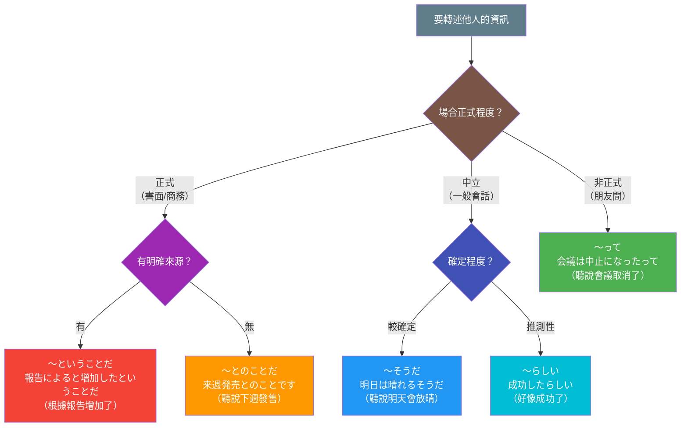
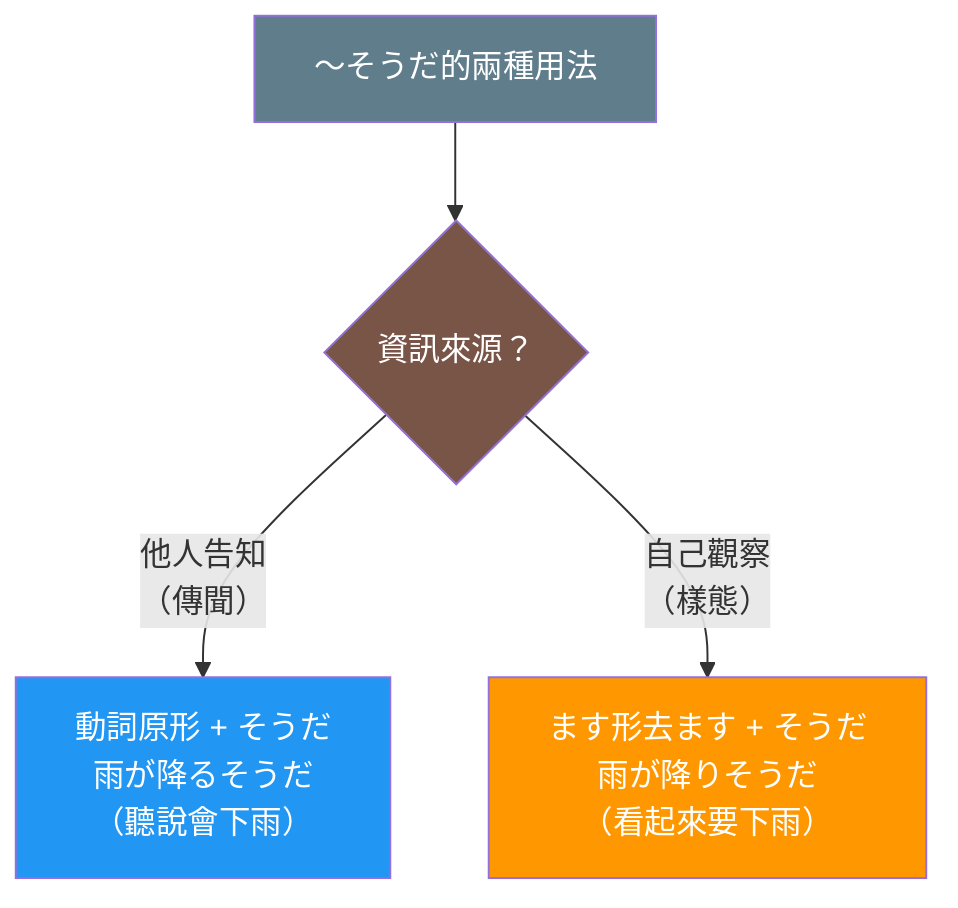

## 日文

伝聞表現（でんぶんひょうげん）

### 概念情報

| 項目 | 內容 |
|------|------|
| 概念類型 | 語法系統 |
| JLPT | N4-N2（涵蓋中級到中高級） |
| 使用頻率 | 高 |
| 複雜度 | 中等 |

## 日文解釋

伝聞表現とは、話し手が他者から聞いた情報や、間接的に得た情報を伝える際に使用する文法体系である。話し手は自分がその情報を直接経験したわけではなく、第三者から伝え聞いたものであることを明示する。

日本語には伝聞を表現する方法が複数存在し、それぞれ情報源の確実性や話し手の態度によって使い分けられる。最も基本的な形式は「〜そうだ」であり、これは他者から聞いた情報をそのまま伝える際に使用される。一方、「〜らしい」は情報源が比較的確実で、一般的に認められている情報を伝える場合に使われる。「〜ということだ」は公式な情報源からの伝聞を示し、より客観的なニュアンスを持つ。

また、「〜と聞いた」「〜と言っていた」などの引用表現も伝聞を表すが、これらは情報源を明示する場合に使用される。「〜って」は日常会話で頻繁に使われる口語的な伝聞表現で、カジュアルな場面で活用される。

伝聞表現を適切に使い分けることは、情報の信頼性を示すだけでなく、話し手の責任範囲を明確にする効果がある。特にビジネスや報道などの場面では、伝聞表現の選択が重要となる。

## 英文解釋

Hearsay expressions (denbun hyōgen) are a grammatical system used when conveying information that the speaker has heard from others or obtained indirectly. The speaker explicitly indicates that they did not directly experience the information but received it secondhand.

Japanese offers multiple ways to express hearsay, distinguished by the reliability of the information source and the speaker's attitude. The most fundamental form is "〜そうだ" (sō da), used to relay information heard from others directly. In contrast, "〜らしい" (rashii) is used when the information source is relatively reliable and the information is generally accepted. "〜ということだ" (to iu koto da) indicates hearsay from official sources and carries a more objective nuance.

Additionally, quotative expressions like "〜と聞いた" (to kiita, "I heard that") and "〜と言っていた" (to itte ita, "someone said that") also express hearsay, specifically when the information source is explicitly mentioned. "〜って" (tte) is a colloquial hearsay expression frequently used in everyday conversation for casual situations.

Using hearsay expressions appropriately not only demonstrates the reliability of information but also clarifies the scope of the speaker's responsibility. This is particularly important in business and media contexts where the choice of hearsay expression matters significantly.

## 中文解釋

傳聞表現（傳聞表達）是說話者在傳達從他人那裡聽來的資訊，或間接獲得的資訊時使用的文法體系。說話者明確表示該資訊並非自己直接經歷，而是從第三方轉述而來。

日文中有多種表達傳聞的方式，根據資訊來源的可靠性和說話者的態度來區分使用。最基本的形式是「〜そうだ」，用於直接轉述從他人那裡聽到的資訊。相對地，「〜らしい」用於資訊來源相對可靠、且該資訊是普遍認可的情況。「〜ということだ」表示來自官方資訊來源的傳聞，帶有更客觀的語感。

此外，「〜と聞いた」（聽說）、「〜と言っていた」（某人說）等引用表達也可表示傳聞，特別是在明確提及資訊來源時使用。「〜って」是日常會話中經常使用的口語傳聞表達，用於非正式場合。

適當使用傳聞表達不僅能顯示資訊的可信度，還能明確說話者的責任範圍。特別是在商務和報導等場合，傳聞表達的選擇至關重要。

## 核心用法

### 用法 1：一般傳聞（〜そうだ）

表達從他人那裡直接聽到的資訊，不帶個人判斷。

**例句 1**
```
天気予報によると、明日は雨が降るそうです。
According to the weather forecast, it will rain tomorrow.
根據天氣預報，明天會下雨。
```

**例句 2**
```
田中さんは来月アメリカに転勤するそうだ。
I heard that Tanaka-san will transfer to America next month.
聽說田中先生下個月要調到美國。
```

### 用法 2：推測性傳聞（〜らしい）

表達根據可靠資訊來源或普遍認知所得的傳聞。

**例句 3**
```
新しいプロジェクトは成功したらしいです。
It seems that the new project was successful.
新專案似乎成功了。
```

**例句 4**
```
あの店のラーメンはとても美味しいらしい。
I hear that the ramen at that shop is very delicious.
聽說那家店的拉麵非常好吃。
```

### 用法 3：口語傳聞（〜って）

日常會話中常用的非正式傳聞表達。

**例句 5**
```
今度の会議は中止になったって。
I heard the next meeting was cancelled.
聽說下次的會議取消了。
```

**例句 6**
```
山田さん、結婚するんだって！
I heard Yamada-san is getting married!
聽說山田要結婚了！
```

## 文法規則

### 規則 1：傳聞表達的語感分級

傳聞表現可依確定性和正式程度分類：

**正式傳聞**：
- 〜ということだ（最正式，書面語）
- 〜とのことだ（正式，敬體）
- 〜そうだ（中立，通用）

**推測性傳聞**：
- 〜らしい（有一定把握）
- 〜みたいだ（口語，較不確定）

**口語傳聞**：
- 〜って（非正式）
- 〜んだって（強調）

### 規則 2：情報源的明示

可根據是否明示資訊來源來選擇表達：

**明示來源**：
- 「〜によると、〜そうだ」（根據...）
- 「〜と聞いた」（我聽說...）
- 「〜と言っていた」（某人說...）

**不明示來源**：
- 「〜そうだ」（聽說...）
- 「〜らしい」（好像...）
- 「〜って」（聽說...）

### 規則 3：接續方式

各傳聞表達的接續規則：

**〜そうだ（傳聞）**：
```
動詞普通形 + そうだ
い形容詞普通形 + そうだ
な形容詞だ形 + そうだ
名詞だ形 + そうだ
```

**〜らしい**：
```
動詞普通形 + らしい
い形容詞普通形 + らしい
な形容詞語幹 + らしい
名詞 + らしい
```

**〜って**：
```
普通形 + って
```

## 常見錯誤

### 錯誤 1：混淆「〜そうだ」（傳聞）與「〜そうだ」（樣態）

❌ 誤：雨が降りそうだと聞きました。
✅ 正：雨が降るそうだと聞きました。
說明：「降りそうだ」是樣態表達（看起來要下雨），「降るそうだ」才是傳聞表達（聽說會下雨）。傳聞接動詞原形，樣態接ます形去ます。

### 錯誤 2：在正式場合使用「〜って」

❌ 誤：（商務報告中）売上が増加したって。
✅ 正：売上が増加したとのことです。
說明：「〜って」是非正式的口語表達，正式場合應使用「〜とのことです」或「〜そうです」。

### 錯誤 3：過度使用傳聞表達

❌ 誤：私は昨日買い物に行ったそうだ。
✅ 正：私は昨日買い物に行った。
說明：傳聞表達用於轉述他人的資訊，不適用於自己的直接經驗。

## 圖解

傳聞表達的選擇流程：



傳聞與樣態的區分：



## 學習要點

1. **區分傳聞與樣態**：「〜そうだ」有傳聞和樣態兩種用法，接續方式不同，需明確區分
2. **場合適配**：根據正式程度選擇適當的傳聞表達，避免在正式場合使用口語形式
3. **資訊責任**：理解傳聞表達的責任劃分功能，適時表明資訊來源
4. **確定度表達**：掌握「〜そうだ」與「〜らしい」在確定程度上的差異
5. **引用技巧**：學會使用「〜と聞いた」「〜と言っていた」等明示來源的表達

## 相關連結

### 基礎文法
- [sou_da_hearsay.md](../grammar/sou_da_hearsay.md) - 〜そうだ（傳聞）的詳細用法（待建立）
- [rashii.md](../grammar/rashii.md) - 〜らしい的推測傳聞表達（待建立）
- [to_iu_koto_da.md](../grammar/to_iu_koto_da.md) - 〜ということだ的正式傳聞（待建立）

### 相關概念
- [evidentiality.md](evidentiality.md) - 情報源標記系統（待建立）
- [quotation_expressions.md](quotation_expressions.md) - 引用表現（待建立）
- [conjecture_expressions.md](conjecture_expressions.md) - 推測表現（待建立）

### 語用辨析
- [sou_da_hearsay_vs_appearance.md](../comparison/sou_da_hearsay_vs_appearance.md) - 傳聞「そうだ」vs 樣態「そうだ」（待建立）
- [rashii_vs_sou_da.md](../comparison/rashii_vs_sou_da.md) - 「らしい」vs「そうだ」（待建立）

---

**建立日期**: 2025-12-27
**最後更新**: 2025-12-27
**字數**: ~2,600
**例句數**: 6
