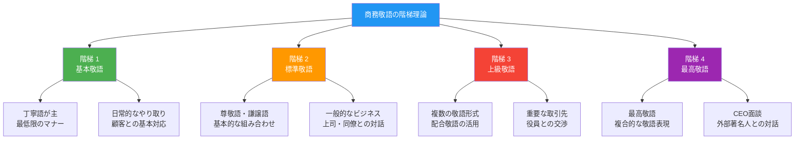
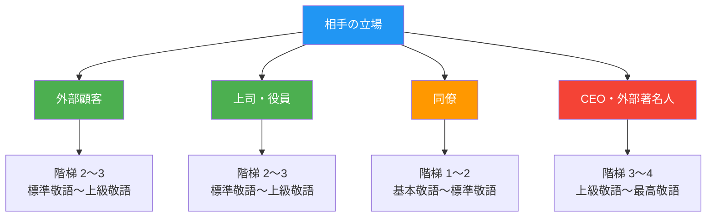

## 日文

商務敬語の階梯理論（しょうむ けいご の かいだい りろん）

### 概念情報

| 項目 | 內容 |
|------|------|
| 概念類型 | 敬語體系 |
| 使用層級 | ビジネス中級～上級 |
| 主要形式 | 丁寧語・尊敬語・謙譲語・美化語の組み合わせ |
| 使用場面 | 商務環境、社會人間交流 |

### 基本結構

**敬語使用の四段階**
```
階梯 1：基本敬語（丁寧語） - 最低限のマナー
階梯 2：標準敬語（尊敬語・謙譲語） - 一般的なビジネス
階梯 3：上級敬語（配合敬語） - 重要な取引先・上司
階梯 4：最高敬語（敬語の最大値） - CEO面談・外部スピーチ
```

## 日文解釋

商務敬語の階梯理論とは、ビジネス環境における敬語使用の複雑さを体系的に説明する理論である。単なる敬語の形式的な知識ではなく、相手の立場、場面の重要度、取引内容の規模に応じて、適切な敬語レベルを選択する能力を指す。

この理論は、日本のビジネス文化において相手を尊重する度合いを言語的に表現するための階段的な枠組みを提供する。階梯が高いほど、より複雑で高度な敬語表現が使用される。同時に、場面や相手に不適切な高い階梯の敬語を使用することは、かえって相手に違和感や距離感を与える可能性がある。

商務敬語の階梯理論の理解は、日本のビジネス社会における人間関係構築の基礎となる。相手への敬意の表現方法、社内階級の認識、顧客対応の原則、危機管理など、多角的な視点を含む。この理論を習得することで、ビジネス日本語の実践的な運用能力が大幅に向上する。

さらに、このテーマは単なる言語規則ではなく、日本社会の文化的価値観、階級意識、人間関係の複雑さを反映している。敬語の使用パターンから、日本企業の組織文化や意思決定プロセスを読み解くことも可能である。

## 英文解釋

The Business Keigo Hierarchy Theory refers to a systematic explanation of the complexity of honorific language usage in business environments. It goes beyond formal knowledge of honorific expressions to encompass the ability to select appropriate levels of honorific language based on the interlocutor's position, situation importance, and transaction scale.

This theory provides a hierarchical framework for linguistically expressing degrees of respect for the other party within Japanese business culture. The higher the hierarchy, the more complex and sophisticated honorific expressions are used. However, using excessively high-level honorifics inappropriate to the situation or relationship may create discomfort or distance.

Understanding the Business Keigo Hierarchy Theory forms the foundation for building human relationships in Japanese business society. It encompasses multiple perspectives including methods of expressing respect to the other party, recognition of in-company hierarchies, principles of customer service, and crisis management. Mastering this theory significantly improves practical business Japanese proficiency.

Furthermore, this theme reflects not merely linguistic rules but cultural values of Japanese society, class consciousness, and the complexity of human relationships. It is possible to decipher organizational culture and decision-making processes of Japanese companies through patterns of honorific usage.

## 中文解釋

商務敬語的階梯理論是一種系統性解釋商務環境中敬語使用複雜性的理論。它超越敬語形式知識，涵蓋根據對方地位、場合重要性、交易規模等因素選擇適當敬語等級的能力。

該理論為在日本商務文化中對他人表達尊重程度提供了階段性框架。階梯越高，使用的敬語表達就越複雜、越高級。然而，在不適當的場合或關係中使用過高等級的敬語，反而可能會給對方帶來違和感或距離感。

理解商務敬語的階梯理論是在日本商務社會中建立人際關係的基礎。它涵蓋多個視角，包括向對方表達敬意的方法、公司內部等級認識、客戶服務原則和危機管理。掌握該理論將大幅提高商務日文的實踐運用能力。

此外，這個主題不僅反映語言規則，也反映日本社會的文化價值觀、階級意識和人際關係的複雜性。通過敬語使用模式，還可以解讀日本企業的組織文化和決策流程。

## 核心用法

### 用法 1：階梯 1 - 基本敬語（丁寧語）

最低限のビジネスマナーとして、顧客や外部の人との基本的なやり取りに使用される。

**例句 1**
```
来月の会議に参加します。
I will attend the meeting next month.
我將參加下個月的會議。
```

**例句 2**
```
資料をお送りします。
I will send you the materials.
我將把資料寄給您。
```

### 用法 2：階梯 2 - 標準敬語（尊敬語・謙譲語の基本形）

一般的なビジネス場面で、相手の行動に尊敬語、自分の行動に謙譲語を使用する。

**例句 3**
```
田中部長がお見えになりました。
Manager Tanaka has arrived.
田中部長來了。
```

**例句 4**
```
弊社でお手伝いさせていただきたいのですが。
We would like to assist your company if possible.
我們希望能為貴公司提供幫助。
```

### 用法 3：階梯 3 - 上級敬語（配合敬語）

重要な顧客や役員との交渉で、複数の敬語形式を組み合わせて使用される。

**例句 5**
```
ご多忙のところお時間をいただき、ありがとうございます。
Thank you for taking time from your busy schedule.
感謝您在百忙之中抽出時間。
```

**例句 6**
```
弊社の新製品についてご説明させていただきたく存じます。
I would like to explain our company's new product to you.
我想為您說明我們公司的新產品。
```

### 用法 4：階梯 4 - 最高敬語

CEO面談や重要なスピーチ、外部の著名人との対話で使用される最上級の敬語。

**例句 7**
```
本日は、弊社の経営方針についてご説明申し上げたいと存じます。
Today, I would like to explain our company's management policy.
今天，我想說明我們公司的經營方針。
```

**例句 8**
```
貴社のご活躍を心からお祈り申し上げております。
I sincerely wish for your company's continued success.
衷心祝願貴公司蓬勃發展。
```

## 概念規則

### 規則 1：相手の立場による階梯選択

相手の社会的地位や企業内での位置によって、使用する敬語レベルが決定される。

**適用ガイドライン**
- 外部顧客：階梯 2～3
- 上司・役員：階梯 2～3
- 同僚：階梯 1～2
- CEO・外部著名人：階梯 3～4

### 規則 2：場面の重要度による階梯調整

会議の規模、契約内容の重要度、初対面か既存顧客かなど、場面の属性が敬語レベルに影響する。

**重要度による分類**
- 日常的なメール・電話：階梯 1～2
- 公式な提案・交渉：階梯 2～3
- 契約締結・重要決定：階梯 3
- 経営層との重要会談：階梯 3～4

### 規則 3：混雑回避の原則

不適切に高い階梯の敬語を使用することは、相手に負担や違和感を与える。場面に合った階梯の選択が重要である。

**適用原則**
- 親しい取引先との継続的な関係：階梯を下げてもよい
- 初対面や重要な場面：階梯を上げるべき
- 突然の敬語レベルの上昇：相手に違和感を与える可能性

### 規則 4：敬語表現の組み合わせ

高い階梯では、尊敬語・謙譲語・丁寧語・美化語が複雑に組み合わされる。

**組み合わせパターン**
- 階梯 2：尊敬語（相手の行動）+ 丁寧語（基本形式）
- 階梯 3：尊敬語 + 謙譲語 + 丁寧語 + 敬語の複数形
- 階梯 4：最高敬語（いたします、申し上げます等）+ 丁寧語 + 美化語

## ビジネス環境での実践

### 電話対応での階梯使い分け

**顧客からの電話（階梯 2）**
```
いつもお世話になっております。本日はどのようなご用件でしょうか。
Thank you for your business. How can I help you today?
感謝一直以來的照顧。請問今天有什麼需要幫助的嗎？
```

**CEO への報告電話（階梯 3～4）**
```
本来であれば直接ご説明申し上げたいところでございますが、本メールでご報告させていただきたく存じます。
Ideally, I would like to explain this to you in person, but I would like to report this via email.
本應該親自向您說明，但我想通過電郵報告此事。
```

### メール作成での階梯適用

**一般的な営業メール（階梯 2）**
```
いつもお世話になっております。先日は、貴重なご助言をいただき、ありがとうございました。
Thank you for your continued support. Thank you for the valuable advice you provided the other day.
感謝一直以來的支持。感謝您前不久提供的寶貴建議。
```

**重要な提案メール（階梯 3）**
```
ご多忙のところお時間をいただき、誠にありがとうございます。本件について、弊社一同でご相談させていただきたく存じます。
Thank you very much for taking time from your busy schedule. We would like to discuss this matter with you.
感謝您在百忙之中抽出時間。我們想與您討論此事。
```

## 常見錯誤

### 錯誤 1：不適切な敬語レベルの使用

階梯 4 の敬語を日常的な顧客とのやり取りで使用する。

❌ 誤：毎度、弊社をご利用いただきまして、心より感謝申し上げている次第でございます。
✅ 正：いつもお世話になっております。ありがとうございます。
說明：日常的なやり取りには階梯 2 が適切。

### 錯誤 2：敬語の組み合わせ誤り

尊敬語と謙譲語を同じ主語で混在させる。

❌ 誤：田中さんが申し上げられました。
✅ 正：田中さんがおっしゃいました。
說明：尊敬語「おっしゃいました」が適切。「申し上げられました」は謙譲語と尊敬語の不適切な混在。

### 錯誤 3：敬語レベルの急激な変化

メールの途中で敬語レベルが変わる。

❌ 誤：お疲れ様です。弊社の新製品についてご説明申し上げたく存じます。ぜひ見てみてください。
✅ 正：お疲れ様です。弊社の新製品についてご説明申し上げたく存じます。ぜひご覧ください。
說明：全体を階梯 2～3 で統一する。

### 錯誤 4：過剰な美化語の使用

必要のない敬語を付けすぎる。

❌ 誤：お手紙をお読みになられていただきますでしょうか。
✅ 正：手紙をお読みになりましたか。
說明：「お」は必要に応じてのみ使用。過剰な敬語は不自然。

## 学習要点

1. **階梯認識の重要性**：相手の立場と場面の属性を正確に判断し、適切な敬語レベルを選択することが最優先。

2. **文化的背景の理解**：敬語の使い分けは日本企業の階級制度と人間関係の複雑さを反映している。表面的な形式だけでなく、その背景にある文化を理解することが重要。

3. **実践的運用**：理論的知識を実際のビジネス場面に応用し、継続的に修正と改善を行う能力が求められる。

4. **違和感の回避**：高すぎる敬語は相手に負担を与える可能性があることを常に念頭に置く。

5. **継続的な学習**：日本企業文化は多様であり、異なる企業や業界での敬語使用の実態を学ぶことが重要である。

## 圖解

### 商務敬語の四階梯



### 敬語レベルと対象者の関係



## 相關連結

### 敬語システム
- [040_teineigo_concept.md](040_teineigo_concept.md) - 丁寧語の概念（待建立）
- [038_kenjougo_concept.md](038_kenjougo_concept.md) - 謙譲語の概念（待建立）
- [051_polite_expression.md](051_polite_expression.md) - 敬語表現の基礎（待建立）

### ビジネス日本語
- [065_bijinesu_mail.md](065_bijinesu_mail.md) - ビジネスメールの敬語（待建立）
- [072_business_communication.md](072_business_communication.md) - ビジネスコミュニケーション（待建立）
- [060_hourensou.md](060_hourensou.md) - 報告・連絡・相談の文化（待建立）

### 組織文化
- [071_hierarchy.md](071_hierarchy.md) - 組織の階級構造（待建立）
- [064_uchi_soto.md](064_uchi_soto.md) - 内と外の概念（待建立）
- [069_kuuki_wo_yomu.md](069_kuuki_wo_yomu.md) - 空気を読む文化（待建立）

---

**建立日期**: 2025-12-27
**最後更新**: 2025-12-27
**字數**: ~3,200
**例句數**: 8
