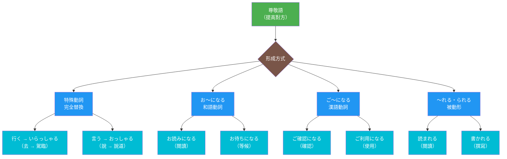
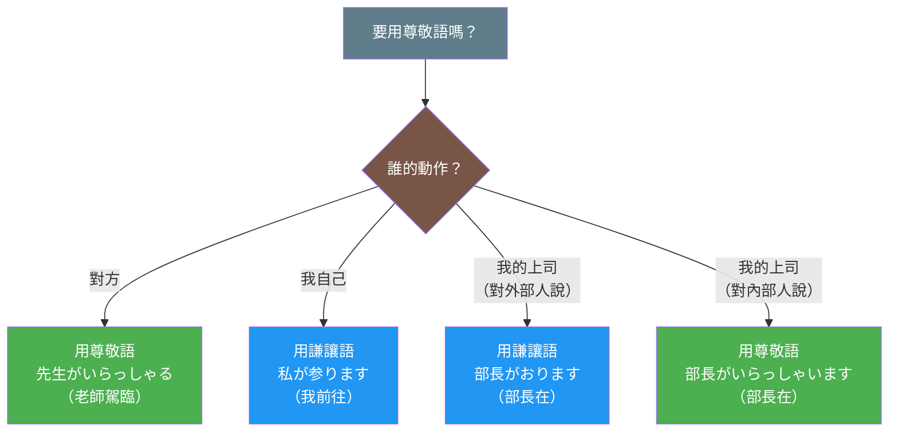

## 日文

尊敬語（そんけいご）

**羅馬拼音**: sonkeigo

**概念類型**: 語言學理論・敬語系統

## 日文解釋

「尊敬語」（そんけいご）とは、日本語の敬語体系における三つの柱の一つであり、話者が動作の主体（主語）を高めることで敬意を表す言語形式です。尊敬語は話者の視点から見て「相手側」の人物、つまり話し相手や第三者の動作・状態・所有物などを高める機能を持っています。

### 尊敬語の言語学的特徴

尊敬語には以下の言語学的特徴があります：

**1. 動作主の地位上昇による直接的敬意表現**

尊敬語は、動作主（多くの場合、相手や目上の人）の行動を言語的に高めることで、直接的に敬意を表現します。これは「相手を高く見せる」という日本的敬意表現の核心です。

例：
- 基本形：「先生が行く」
- 尊敬語：「先生がいらっしゃる」「先生がお越しになる」

**2. 文法化された敬意表現**

尊敬語は、語彙の交替だけでなく、複数の文法的手段によって実現されます：

- **特殊尊敬動詞**：「行く」→「いらっしゃる」、「言う」→「おっしゃる」、「食べる」→「召し上がる」
- **尊敬の接辞構成**：「お〜になる」（例：「お読みになる」）、「ご〜になる」（例：「ご確認になる」）
- **尊敬の助動詞**：「〜れる」「〜られる」（受身形と同形）

**3. 動作主への焦点**

尊敬語は動作を行う人（動作主）を高めることに焦点を当てます。これは謙譲語が動作の受け手を高めることと対照的です。動作主が目上の人や敬意を払うべき対象であるとき、尊敬語が使用されます。

**4. 視点の外向性**

尊敬語は話者の視点から見て「外」に属する人物、つまり：
- 話し相手（あなた）
- 話し相手の関係者（あなたの家族、あなたの会社の人など）
- 社会的に地位の高い第三者（先生、上司、お客様など）

これらの人物の動作・状態に対して使用されます。

**5. 所有物への敬意拡張**

尊敬語は動作だけでなく、相手の所有物や関係物にも敬意を拡張します：

- 「お名前」（あなたの名前）
- 「ご住所」（あなたの住所）
- 「お荷物」（あなたの荷物）

### 尊敬語の社会的機能

尊敬語は以下の社会的機能を果たしています：

**1. 階層関係の表現**

日本社会における年齢、地位、経験などに基づく上下関係を言語的に表現します。

**2. 社会的距離の維持**

尊敬語を使うことで、話者と相手の間に適切な社会的距離を設定・維持します。

**3. 場面の格式化**

尊敬語の使用によって、会話や状況を格式のあるものとして位置づけます。

**4. 相手への配慮の表明**

尊敬語を通じて、相手を大切に思い、敬意を払っていることを言語的に明示します。

### 尊敬語の形成パターン

尊敬語は主に以下のパターンで形成されます：

**パターン1：特殊尊敬動詞（語彙的交替）**

基本動詞が完全に別の動詞に置き換わります：

- 「行く・来る」→「いらっしゃる」「おいでになる」
- 「いる」→「いらっしゃる」「おられる」
- 「言う」→「おっしゃる」
- 「する」→「なさる」
- 「食べる・飲む」→「召し上がる」
- 「見る」→「ご覧になる」
- 「知る」→「ご存じ」
- 「寝る」→「お休みになる」
- 「くれる」→「くださる」

**パターン2：「お〜になる」構成**

和語動詞のます形語幹に「お」を付け、「になる」を接続：

- 「読む」→「お読みになる」
- 「待つ」→「お待ちになる」
- 「帰る」→「お帰りになる」
- 「使う」→「お使いになる」

**パターン3：「ご〜になる」構成**

漢語動詞（サ変動詞）の語幹に「ご」を付け、「になる」を接続：

- 「確認する」→「ご確認になる」
- 「出発する」→「ご出発になる」
- 「利用する」→「ご利用になる」
- 「理解する」→「ご理解になる」

**パターン4：「〜れる」「〜られる」（受身形）**

動詞の受身形を尊敬語として使用：

- 「読む」→「読まれる」
- 「書く」→「書かれる」
- 「食べる」→「食べられる」
- 「来る」→「来られる」

この形式は特殊尊敬動詞や「お〜になる」より敬意の度合いがやや低いとされますが、日常的に広く使われています。

**パターン5：「お（ご）〜くださる」**

相手からの恩恵的行為を尊敬語で表現：

- 「お教えくださる」
- 「ご説明くださる」
- 「お待ちくださる」

### 尊敬語使用における注意点

**1. 自分の動作には使用しない**

尊敬語は相手の動作にのみ使用し、自分の動作には使いません：
- ❌「私がいらっしゃいます」
- ✅「私が参ります」（謙譲語を使用）

**2. 内外の区別を正しく理解**

ビジネス場面では、自社の人間について外部の人に話すとき、尊敬語を使いません：
- 外部の人に：「佐藤は今外出しております」（謙譲語）
- 社内で：「佐藤部長はいらっしゃいますか」（尊敬語）

**3. 敬意の度合いの使い分け**

場面と相手に応じて、敬意の度合いを調整します：
- 最高敬意：「召し上がる」「いらっしゃる」（特殊動詞）
- 高敬意：「お〜になる」「ご〜になる」
- 普通敬意：「〜れる」「〜られる」

**4. 二重敬語の回避**

一つの動作に対して尊敬語を重ねる「二重敬語」は避けるべきです：
- ❌「お召し上がりになられる」
- ✅「召し上がる」または「お食べになる」

**5. 「お・ご」の選択**

和語には「お」、漢語には「ご」を使用するのが原則：
- 和語：「お名前」「お時間」「お読みになる」
- 漢語：「ご住所」「ご意見」「ご確認になる」

## 英文解釋

"Sonkeigo" (honorific/respectful language) is one of the three pillars of the Japanese honorific system (keigo), a linguistic form that expresses respect by elevating the agent of an action (the subject). Sonkeigo functions to elevate the actions, states, and possessions of people on "the other side" from the speaker's viewpoint - that is, the listener or third parties.

### Linguistic Characteristics of Sonkeigo

Sonkeigo has the following linguistic characteristics:

**1. Direct Expression of Respect Through Elevating the Agent**

Sonkeigo expresses respect directly by linguistically elevating the actions of the agent (often the listener or a social superior). This is the core of Japanese respectful expression: "making others appear elevated."

Examples:
- Basic form: "Sensei ga iku" (The teacher goes)
- Honorific: "Sensei ga irassharu" (The teacher goes - honorific)

**2. Grammaticalized Respectful Expressions**

Sonkeigo is realized not only through lexical substitution but also through multiple grammatical means:

- **Special honorific verbs**: "iku" → "irassharu" (go), "iu" → "ossharu" (say), "taberu" → "meshiagaru" (eat)
- **Honorific affix constructions**: "o-~ni naru" (e.g., "o-yomi ni naru"), "go-~ni naru" (e.g., "go-kakunin ni naru")
- **Honorific auxiliaries**: "~reru" / "~rareru" (same form as passive)

**3. Focus on the Agent**

Sonkeigo focuses on elevating the person performing the action (the agent). This contrasts with kenjougo (humble language), which elevates the recipient of the action. Sonkeigo is used when the agent is a social superior or someone deserving respect.

**4. Outward-Directed Viewpoint**

From the speaker's viewpoint, sonkeigo is used for people belonging to the "outside":
- The listener (you)
- People associated with the listener (your family, your company, etc.)
- Third parties of high social status (teachers, superiors, customers, etc.)

**5. Extension of Respect to Possessions**

Sonkeigo extends respect not only to actions but also to the possessions and belongings of the other person:
- "o-namae" (your name)
- "go-juusho" (your address)
- "o-nimotsu" (your luggage)

### Social Functions of Sonkeigo

Sonkeigo fulfills the following social functions:

**1. Expression of Hierarchical Relationships**

It linguistically expresses hierarchical relationships based on age, position, and experience in Japanese society.

**2. Maintenance of Social Distance**

By using sonkeigo, appropriate social distance between the speaker and the other party is established and maintained.

**3. Formalization of Situations**

The use of sonkeigo positions conversations and situations as formal.

**4. Demonstration of Consideration for Others**

Through sonkeigo, one linguistically demonstrates that they value and respect the other person.

### Formation Patterns of Sonkeigo

Sonkeigo is mainly formed through the following patterns:

**Pattern 1: Special Honorific Verbs (Lexical Alternation)**

Basic verbs are completely replaced by different verbs:
- "iku/kuru" → "irassharu" (go/come)
- "iru" → "irassharu" (exist/be)
- "iu" → "ossharu" (say)
- "suru" → "nasaru" (do)
- "taberu/nomu" → "meshiagaru" (eat/drink)
- "miru" → "goran ni naru" (see)
- "shiru" → "go-zonji" (know)
- "kureru" → "kudasaru" (give to me)

**Pattern 2: "O-~ni naru" Construction**

"O" is added to the masu-stem of native Japanese verbs, followed by "ni naru":
- "yomu" → "o-yomi ni naru" (read)
- "matsu" → "o-machi ni naru" (wait)
- "kaeru" → "o-kaeri ni naru" (return)

**Pattern 3: "Go-~ni naru" Construction**

"Go" is added to the stem of Sino-Japanese verbs (suru-verbs), followed by "ni naru":
- "kakunin suru" → "go-kakunin ni naru" (confirm)
- "shuppatsu suru" → "go-shuppatsu ni naru" (depart)
- "riyou suru" → "go-riyou ni naru" (use)

**Pattern 4: "~reru" / "~rareru" (Passive Form)**

The passive form of verbs used as honorifics:
- "yomu" → "yomareru" (read)
- "kaku" → "kakareru" (write)
- "taberu" → "taberareru" (eat)

This form is considered slightly less respectful than special verbs or "o-~ni naru" but is widely used in daily life.

### Precautions in Using Sonkeigo

**1. Do Not Use for One's Own Actions**

Sonkeigo is used only for others' actions, not for one's own:
- Incorrect: "Watashi ga irasshaimasu"
- Correct: "Watashi ga mairimasu" (use humble language)

**2. Correctly Understand Inside-Outside Distinction**

In business situations, sonkeigo is not used when speaking about one's own company members to outsiders:
- To outsiders: "Satou wa ima gaishutsu shite orimasu" (humble)
- Internally: "Satou buchou wa irasshaimasu ka" (honorific)

**3. Adjust the Level of Respect**

Adjust the degree of respect according to the situation and the person:
- Highest respect: "meshiagaru," "irassharu" (special verbs)
- High respect: "o-~ni naru," "go-~ni naru"
- Standard respect: "~reru," "~rareru"

**4. Avoid Double Honorifics**

"Double honorifics" - layering honorific expressions for a single action - should be avoided:
- Incorrect: "o-meshiagari ni narareru"
- Correct: "meshiagaru" or "o-tabe ni naru"

## 中文解釋

「尊敬語」（そんけいご）是日語敬語體系三大支柱之一，是一種通過提高動作主體（主語）來表達敬意的語言形式。尊敬語的功能是提高從說話者視點來看屬於「對方側」的人物，即聽者或第三者的動作、狀態、所有物等。

### 尊敬語的語言學特徵

尊敬語具有以下語言學特徵：

**1. 通過提高動作主體來直接表達敬意**

尊敬語通過在語言上提高動作主體（多數情況下是對方或長輩）的行動，直接表達敬意。這是日本式敬意表達的核心：「使對方顯得更高」。

例如：
- 基本形：「先生が行く」（老師去）
- 尊敬語：「先生がいらっしゃる」（老師駕臨）

**2. 文法化的敬意表達**

尊敬語不僅通過詞彙替換，還通過多種文法手段實現：

- **特殊尊敬動詞**：「行く」→「いらっしゃる」、「言う」→「おっしゃる」、「食べる」→「召し上がる」
- **尊敬詞綴構成**：「お〜になる」（例：「お読みになる」）、「ご〜になる」（例：「ご確認になる」）
- **尊敬助動詞**：「〜れる」「〜られる」（與被動形同形）

**3. 對動作主體的聚焦**

尊敬語聚焦於提高執行動作的人（動作主體）。這與謙讓語提高動作接受者形成對比。當動作主體是長輩或應該尊敬的對象時，使用尊敬語。

**4. 視點的外向性**

從說話者的視點來看，尊敬語用於屬於「外」的人物，即：
- 說話對象（您）
- 說話對象的相關人士（您的家人、您公司的人等）
- 社會地位較高的第三者（老師、上司、客戶等）

**5. 對所有物的敬意擴展**

尊敬語不僅擴展到動作，還擴展到對方的所有物和相關物品：
- 「お名前」（您的名字）
- 「ご住所」（您的地址）
- 「お荷物」（您的行李）

### 尊敬語的社會功能

尊敬語發揮以下社會功能：

**1. 階層關係的表達**

在語言上表達日本社會中基於年齡、地位、經驗等的上下關係。

**2. 社會距離的維持**

通過使用尊敬語，在說話者與對方之間設定並維持適當的社會距離。

**3. 場合的正式化**

通過使用尊敬語，將對話或情況定位為正式的。

**4. 對對方關懷的表明**

通過尊敬語，在語言上明示重視對方並對其表示敬意。

### 尊敬語的形成模式

尊敬語主要通過以下模式形成：

**模式1：特殊尊敬動詞（詞彙替換）**

基本動詞完全替換為其他動詞：
- 「行く・来る」→「いらっしゃる」「おいでになる」
- 「いる」→「いらっしゃる」「おられる」
- 「言う」→「おっしゃる」
- 「する」→「なさる」
- 「食べる・飲む」→「召し上がる」
- 「見る」→「ご覧になる」
- 「知る」→「ご存じ」
- 「くれる」→「くださる」

**模式2：「お〜になる」構成**

在和語動詞的ます形詞幹前加「お」，後接「になる」：
- 「読む」→「お読みになる」
- 「待つ」→「お待ちになる」
- 「帰る」→「お帰りになる」

**模式3：「ご〜になる」構成**

在漢語動詞（サ變動詞）的詞幹前加「ご」，後接「になる」：
- 「確認する」→「ご確認になる」
- 「出発する」→「ご出発になる」
- 「利用する」→「ご利用になる」

**模式4：「〜れる」「〜られる」（被動形）**

將動詞的被動形作為尊敬語使用：
- 「読む」→「読まれる」
- 「書く」→「書かれる」
- 「食べる」→「食べられる」

這種形式被認為敬意程度比特殊動詞或「お〜になる」稍低，但在日常生活中廣泛使用。

### 使用尊敬語的注意事項

**1. 不用於自己的動作**

尊敬語只用於對方的動作，不用於自己的動作：
- ❌「私がいらっしゃいます」
- ✅「私が参ります」（使用謙讓語）

**2. 正確理解內外區分**

在商務場合，對外部人士談論本公司人員時不使用尊敬語：
- 對外部：「佐藤は今外出しております」（謙讓語）
- 公司內部：「佐藤部長はいらっしゃいますか」（尊敬語）

**3. 敬意程度的區分**

根據場合和對象調整敬意程度：
- 最高敬意：「召し上がる」「いらっしゃる」（特殊動詞）
- 高敬意：「お〜になる」「ご〜になる」
- 普通敬意：「〜れる」「〜られる」

**4. 避免二重敬語**

對一個動作疊加尊敬語的「二重敬語」應該避免：
- ❌「お召し上がりになられる」
- ✅「召し上がる」或「お食べになる」

## 核心用法

### 用法1：使用特殊尊敬動詞

使用特殊尊敬動詞直接表達對動作主體的敬意。

**例句1**
```
先生がいらっしゃいました。
The teacher has arrived. (honorific)
老師來了。（尊敬語）
```

**例句2**
```
社長がおっしゃったとおりです。
It is exactly as the president said. (honorific)
正如社長所說的那樣。（尊敬語）
```

### 用法2：「お〜になる」構成

使用「お〜になる」構成表達對和語動詞動作的敬意。

**例句3**
```
この本をお読みになりましたか。
Have you read this book? (honorific)
您讀過這本書嗎？（尊敬語）
```

**例句4**
```
社長はもうお帰りになりました。
The president has already left. (honorific)
社長已經回去了。（尊敬語）
```

### 用法3：「〜れる」「〜られる」構成

使用被動形式的尊敬語表達日常場合的敬意。

**例句5**
```
部長は会議に出られますか。
Will the department manager attend the meeting? (honorific)
部長會出席會議嗎？（尊敬語）
```

**例句6**
```
先生は何時に来られますか。
What time will the teacher arrive? (honorific)
老師幾點來？（尊敬語）
```

## 文法規則

### 規則1：特殊尊敬動詞的優先使用

當存在特殊尊敬動詞時，通常優先使用特殊動詞：

- ✅「先生がいらっしゃいます」（特殊動詞）
- △「先生がおられます」（也可以，但「いらっしゃる」更常用）
- △「先生がいられます」（敬意較低）

### 規則2：「お・ご」的選擇規則

**使用「お」**：
- 和語動詞：お読みになる、お待ちになる
- 和語名詞：お名前、お時間

**使用「ご」**：
- 漢語動詞：ご確認になる、ご利用になる
- 漢語名詞：ご意見、ご住所

**例外**：
- 「お電話」（雖然「電話」是漢語，但習慣用「お」）
- 「お返事」（雖然「返事」是漢語，但習慣用「お」）

### 規則3：視點與敬語的關係

尊敬語只用於「對方側」的人物，不用於：
- 自己的動作（用謙讓語或普通形）
- 對外部談論內部人士時（即使是上司也不用尊敬語）

### 規則4：敬意程度的階層

敬意程度由高到低：
1. 特殊尊敬動詞（いらっしゃる、おっしゃる、召し上がる等）
2. 「お〜になる」「ご〜になる」構成
3. 「〜れる」「〜られる」構成

根據場合、對象、關係選擇適當的敬意程度。

### 規則5：二重敬語的回避

不要對同一動作疊加多個尊敬形式：
- ❌「お読みになられる」（二重敬語）
- ✅「お読みになる」或「読まれる」

## 常見錯誤

### 錯誤1：對自己的動作使用尊敬語

❌ 誤：「私がいらっしゃいます」
✅ 正：「私が参ります」
說明：尊敬語只用於對方的動作，自己的動作應使用謙讓語。

### 錯誤2：內外區分錯誤

❌ 誤：（對客戶說）「佐藤部長がいらっしゃいます」
✅ 正：「佐藤はおります」
說明：對外部人士談論公司內部人士時，即使是上司也不用尊敬語，要用謙讓語。

### 錯誤3：二重敬語

❌ 誤：「お召し上がりになられますか」
✅ 正：「召し上がりますか」或「お食べになりますか」
說明：「召し上がる」本身已是尊敬語，再加「お〜になられる」構成二重敬語，過度且不自然。

### 錯誤4：「お・ご」的誤用

❌ 誤：「ご読みになる」
✅ 正：「お読みになる」
說明：「読む」是和語動詞，應該用「お」而不是「ご」。

### 錯誤5：敬意程度不當

❌ 不當：（對客戶）「先生は何を食べられますか」
✅ 更佳：「先生は何を召し上がりますか」
說明：在正式場合對重要客戶，應使用敬意較高的特殊尊敬動詞。

## 學習要點

1. **提高對方**：尊敬語通過提高對方的地位來表達敬意，與謙讓語降低自己形成對比
2. **多種形成方式**：特殊動詞、「お〜になる」構成、「〜れる」構成等多種文法手段
3. **視點固定**：只用於「對方側」的人物，不用於自己
4. **內外區分**：商務場合特別注意內外關係對尊敬語使用的影響
5. **敬意程度**：根據場合和對象選擇適當的敬意程度（特殊動詞>お〜になる>〜れる）

## 圖解

### 尊敬語形成方式



### 尊敬語使用場景



## 相關連結

### 敬語體系
- [謙讓語概念](038_kenjougo_concept.md) - 降低自己地位的敬語
- [丁寧語概念](040_teineigo_concept.md) - 基本禮貌表達
- [敬語體系](keigo_taikei.md) - 敬語的整體理論框架

### 尊敬語文法形式
- [お〜になる](../grammar/sonkeigo_o_ninaru.md) - 和語尊敬構成
- [ご〜になる](../grammar/sonkeigo_go_ninaru.md) - 漢語尊敬構成
- [〜れる・られる](../grammar/passive_honorific.md) - 被動形尊敬用法

### 特殊尊敬動詞
- [いらっしゃる](../verb-irregular/irassharu.md) - 去・來・在的尊敬語
- [おっしゃる](../verb-irregular/ossharu.md) - 說的尊敬語
- [なさる](../verb-irregular/nasaru.md) - 做的尊敬語
- [召し上がる](../verb-irregular/meshiagaru.md) - 吃・喝的尊敬語
- [ご覧になる](../verb-irregular/goran_ninaru.md) - 看的尊敬語

### 社會語言學概念
- [內與外](007_uchi-soto.md) - 內外群體概念對敬語的影響
- [視點理論](shiten_riron.md) - 視點與敬語選擇的關係

### 實用應用
- [商務敬語](../extension/business_keigo.md) - 商務場合的敬語使用
- [敬語常見錯誤](../extension/keigo_mistakes.md) - 學習者常犯錯誤分析

---

**建立日期**: 2025-12-27
**最後更新**: 2025-12-27
**字數**: ~5500
**例句數**: 6
