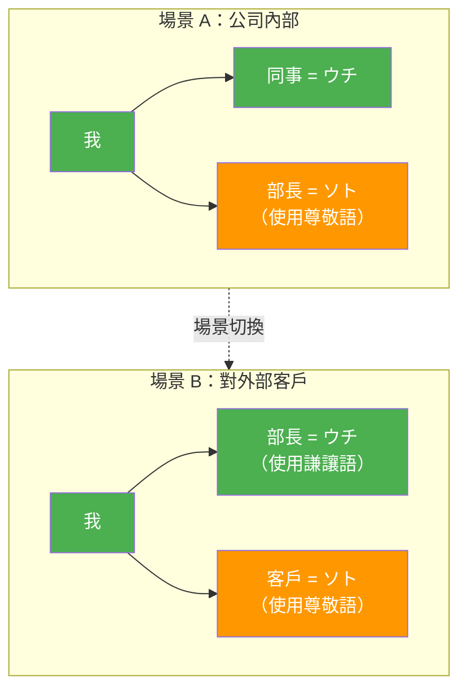
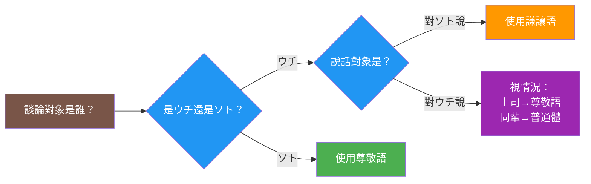

## 日文

ウチとソト（うちとそと）

**羅馬拼音**: uchi to soto

**概念類型**: 社會語言學・文化概念

## 日文解釋

「ウチとソト」は、日本語の敬語使用と人称表現を理解するための最も重要な社会言語学的概念の一つです。この概念は、話者が自分の所属する集団（ウチ＝内）と外部の集団（ソト＝外）を区別し、それぞれに対して異なる言語表現を用いることを指します。

### ウチ（内）の定義

「ウチ」とは、話者が心理的に同一視する集団を指します：

1. **家族**: 最も基本的なウチ
2. **会社・部署**: ビジネス場面での所属集団
3. **学校・クラス**: 教育場面での帰属集団
4. **友人グループ**: 親しい人間関係

### ソト（外）の定義

「ソト」とは、ウチ以外のすべての人や集団を指します：

1. **取引先・顧客**: ビジネス上の外部関係者
2. **初対面の人**: 関係が確立されていない人
3. **目上の人**: 社会的地位が上の人（文脈による）
4. **他社・他組織**: 所属しない団体

### 敬語使用への影響

ウチとソトの区別は、敬語選択に直接影響します：

**ウチの人について話す場合（対ソト）**：
- 謙譲語を使用して自分側を低める
- 例：「社長の田中が申しております」

**ソトの人について話す場合**：
- 尊敬語を使用して相手を高める
- 例：「山田様がおっしゃいました」

**重要なポイント**：
会社内では上司に尊敬語を使いますが、外部の人に対して上司のことを話す時は謙譲語を使います。つまり、ウチ・ソトの判断は話す相手によって変わります。

### 人称表現への影響

家族の呼び方もウチ・ソトで変わります：

| 関係 | ウチ（自分の家族） | ソト（他人の家族） |
|------|-------------------|-------------------|
| 父 | 父、親父 | お父さん、お父様 |
| 母 | 母、おふくろ | お母さん、お母様 |
| 兄 | 兄 | お兄さん |
| 姉 | 姉 | お姉さん |
| 息子 | 息子、せがれ | 息子さん |
| 娘 | 娘 | 娘さん、お嬢さん |

## 英文解釋

"Uchi to Soto" (inside and outside) is one of the most important sociolinguistic concepts for understanding Japanese honorific usage and personal reference expressions. This concept refers to how speakers distinguish between their in-group (uchi = inside) and out-group (soto = outside), using different linguistic expressions for each.

### Definition of Uchi (Inside)

"Uchi" refers to the group with which the speaker psychologically identifies:

1. **Family**: The most fundamental uchi
2. **Company/Department**: Affiliated group in business contexts
3. **School/Class**: Belonging group in educational settings
4. **Friend Groups**: Close interpersonal relationships

### Definition of Soto (Outside)

"Soto" refers to all people and groups outside of uchi:

1. **Business Partners/Customers**: External parties in business
2. **Strangers**: People with no established relationship
3. **Social Superiors**: People of higher status (context-dependent)
4. **Other Companies/Organizations**: Groups one doesn't belong to

### Impact on Honorific Usage

The uchi-soto distinction directly affects honorific selection:

**When speaking about uchi members (to soto)**:
- Use humble language to lower one's own side
- Example: "Our president Tanaka says..." (using humble verb)

**When speaking about soto members**:
- Use respectful language to elevate the other party
- Example: "Mr. Yamada said..." (using respectful verb)

**Key Point**:
Within a company, you use respectful language for superiors, but when speaking to outsiders about your superior, you use humble language. In other words, uchi-soto judgment changes depending on who you're speaking to.

### Impact on Personal Reference

Family terms also change based on uchi-soto:

| Relation | Uchi (own family) | Soto (others' family) |
|----------|-------------------|----------------------|
| Father | chichi, oyaji | otousan, otousama |
| Mother | haha, ofukuro | okaasan, okaasama |
| Brother | ani | oniisan |
| Sister | ane | oneesan |
| Son | musuko, segare | musukosan |
| Daughter | musume | musumesan, ojousan |

## 中文解釋

「ウチとソト」（內與外）是理解日語敬語使用和人稱表達最重要的社會語言學概念之一。這個概念指的是說話者區分自己所屬的群體（ウチ＝內）和外部群體（ソト＝外），並對各自使用不同的語言表達方式。

### ウチ（內）的定義

「ウチ」指說話者心理上認同的群體：

1. **家庭**：最基本的ウチ
2. **公司・部門**：商業場合的所屬群體
3. **學校・班級**：教育場合的歸屬群體
4. **朋友圈**：親密的人際關係

### ソト（外）的定義

「ソト」指ウチ以外的所有人和群體：

1. **交易對象・客戶**：商業上的外部關係人
2. **陌生人**：尚未建立關係的人
3. **地位較高者**：社會地位較高的人（依情境）
4. **其他公司・組織**：不隸屬的團體

### 對敬語使用的影響

ウチとソト的區別直接影響敬語選擇：

**談論ウチ的人時（對ソト說）**：
- 使用謙讓語降低自己這方
- 例：「社長の田中が申しております」（我們社長田中說...）

**談論ソト的人時**：
- 使用尊敬語提升對方
- 例：「山田様がおっしゃいました」（山田先生說了...）

**重要觀點**：
在公司內對上司使用尊敬語，但對外部的人談論上司時使用謙讓語。也就是說，ウチ・ソト的判斷會根據說話對象而改變。

### 對人稱表達的影響

家人的稱呼也會因ウチ・ソト而改變：

| 關係 | ウチ（自己的家人） | ソト（他人的家人） |
|------|-------------------|-------------------|
| 父親 | 父、親父 | お父さん、お父様 |
| 母親 | 母、おふくろ | お母さん、お母様 |
| 哥哥 | 兄 | お兄さん |
| 姐姐 | 姉 | お姉さん |
| 兒子 | 息子、せがれ | 息子さん |
| 女兒 | 娘 | 娘さん、お嬢さん |

## 例句

### 敬語使用場景

1. （對客戶介紹上司）部長の山田が参ります。
   Our department manager Yamada will come.
   我們部長山田會來。
   *對外部使用謙讓語「参ります」*

2. （在公司內對同事說）部長がいらっしゃいますよ。
   The department manager is coming.
   部長來了喔。
   *對內部使用尊敬語「いらっしゃいます」*

3. （對客戶說）弊社の田中が申しておりました。
   Our Tanaka was saying.
   敝公司的田中說過。
   *「弊社」表示ウチ的公司*

### 人稱表達場景

4. （自我介紹時）私の父は医者です。
   My father is a doctor.
   我父親是醫生。
   *使用謙遜形「父」*

5. （詢問對方）お父様はお元気ですか。
   Is your father well?
   令尊身體好嗎？
   *使用尊敬形「お父様」*

6. （對外部說家人的事）母がよろしくと申しておりました。
   My mother sends her regards.
   家母請我代為問候。
   *使用謙遜形「母」和謙讓語「申す」*

## 學習要點

1. **情境依存性**：ウチ・ソト的判斷會根據說話對象和場合改變
2. **敬語連動**：ウチ・ソト區分直接決定使用尊敬語還是謙讓語
3. **動態邊界**：同一個人可能在不同情境下被視為ウチ或ソト
4. **商業場合的特殊性**：公司全體對外都是ウチ，即使是社長也要用謙讓語
5. **家庭稱呼的雙重系統**：同樣的親屬關係有不同稱呼方式
6. **文化理解的關鍵**：不理解ウチ・ソト會導致敬語使用錯誤

## 圖解

### ウチとソトの動態關係

### 敬語選擇流程

---

## 相關連結

### 敬語系統
- [敬語系統](../grammar/005_keigo_system.md) - 日語敬語的整體架構
- [謙讓語概念](038_kenjougo_concept.md) - 謙讓語的使用原則
- [丁寧語概念](040_teineigo_concept.md) - 丁寧語的使用場合

### 授受表現
- [授受表現](../grammar/048_juju-hyougen.md) - 給予與接受的表達系統
- [あげる](../verb-ru/011_ageru.md) - 給予動詞（內→外）
- [くれる](../verb-ru/013_kureru.md) - 給予動詞（外→內）

### 相關文化概念
- [視點理論](006_viewpoint.md) - 日語的視點概念
