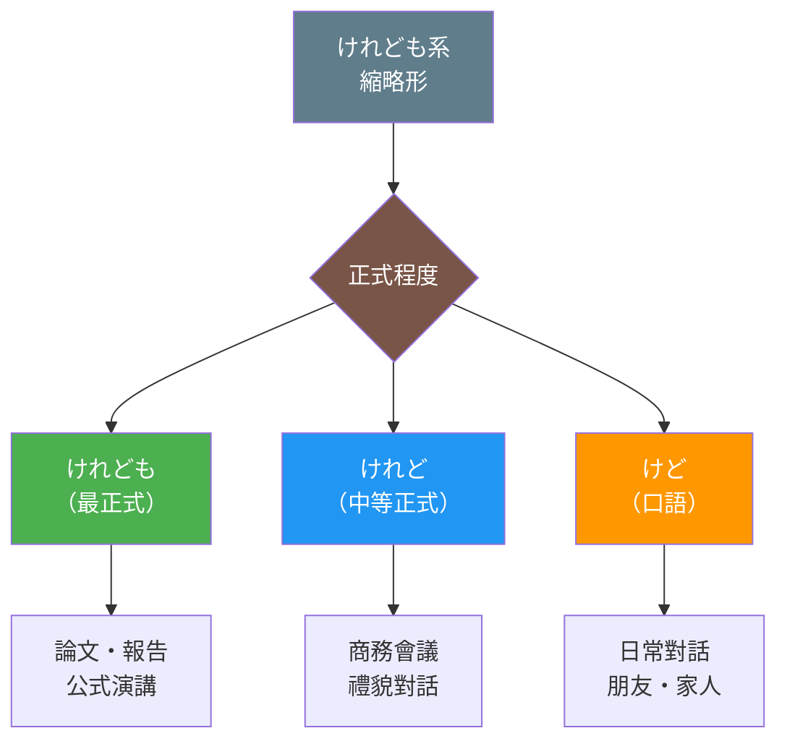
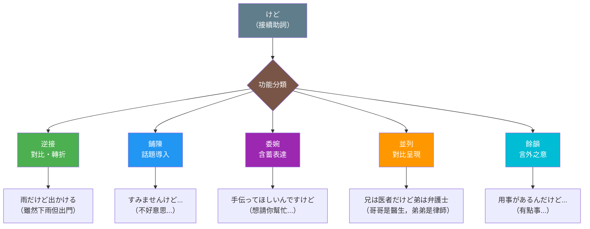

## 日文

けど（kedo）

**羅馬拼音**: kedo

**詞性**: 接続助詞（逆接・並列）

**異形**: けれど、けれども

## 日文解釋

「けど」は、日本語で最も頻繁に使用される接続助詞の一つであり、「けれど」「けれども」の縮約形です。基本的には逆接（前件と後件が対立する関係）を表しますが、実際の使用では逆接以外にも多様な機能を持ちます。

### けどの基本概念

「けど」は以下の特徴を持っています：

**1. 縮約形の階層**

「けれども」から派生した縮約形には格式度の違いがあります：

- **けれども**（最も格式が高い、書き言葉・改まった話し言葉）
- **けれど**（やや格式、丁寧な会話）
- **けど**（最も口語的、日常会話で圧倒的に多い）

**2. 文法的機能**

「けど」は接続助詞として、前件と後件を結びつけます。動詞・形容詞の終止形、名詞＋だ、な形容詞語幹＋だ などに接続します。

- 動詞：「行くけど」「食べたけど」
- い形容詞：「高いけど」「おいしかったけど」
- な形容詞：「静かだけど」「便利だったけど」
- 名詞：「学生だけど」「雨だったけど」

**3. 意味的多様性**

「けど」は単なる逆接だけでなく、以下の意味・機能を表すことができます：

- 逆接（対比・転換）
- 前置き（話題導入）
- 婉曲表現（控えめな依頼・提案）
- 情報の並列（対比的並列）
- 余韻・含み（言い差し）

### けどと「が」の関係

「けど」と「が」は非常に似た機能を持ちますが、重要な違いがあります：

**共通点**：
- 両方とも逆接を表せる
- 両方とも前置きに使える
- 両方とも節と節を接続する

**相違点**：

| 項目 | けど | が |
|------|------|-----|
| 格式度 | 口語的・カジュアル | 中立〜やや硬め |
| 使用場面 | 日常会話中心 | 書き言葉・話し言葉両方 |
| 逆接の強さ | やや弱い | 中程度 |
| 前置きとして | 非常に自然 | 自然 |
| 文末使用 | 可能（余韻を残す） | あまり自然でない |

### 「けど」の語用論的特徴

「けど」は日本語のコミュニケーションにおいて重要な語用論的機能を果たしています：

**1. ポライトネス機能**

「けど」を使うことで、直接的な表現を避け、相手への配慮を示すことができます。特に依頼や提案、反論などの場面で、発言の角を取る効果があります。

**2. ターン・テイキング機能**

会話において「けど」で発話を終えることで、相手の反応を求めたり、会話のターンを渡したりする機能があります。

**3. 情報構造への貢献**

「けど」は前件を背景情報として位置づけ、後件を焦点として提示する情報構造を作り出します。

## 英文解釋

"Kedo" is one of the most frequently used conjunctive particles in Japanese, being a contraction of "keredo" and "keredomo." While its basic function is to express contrast (adversative relationship between clauses), in actual usage it serves multiple diverse functions.

### Basic Concept of Kedo

Kedo has the following characteristics:

**1. Hierarchy of Contractions**

The contractions derived from "keredomo" differ in formality:

- **Keredomo** (most formal, written language and formal speech)
- **Keredo** (somewhat formal, polite conversation)
- **Kedo** (most colloquial, overwhelmingly common in daily conversation)

**2. Grammatical Function**

As a conjunctive particle, "kedo" connects the preceding and following clauses. It attaches to the terminal form of verbs and adjectives, noun + da, na-adjective stem + da, etc.

- Verbs: "iku kedo" (go but), "tabeta kedo" (ate but)
- I-adjectives: "takai kedo" (expensive but), "oishikatta kedo" (was delicious but)
- Na-adjectives: "shizuka da kedo" (quiet but), "benri datta kedo" (was convenient but)
- Nouns: "gakusei da kedo" (student but), "ame datta kedo" (was rain but)

**3. Semantic Diversity**

"Kedo" can express not only simple contrast but also the following meanings and functions:

- Contrast (opposition, transition)
- Preface (topic introduction)
- Softening (hedged requests, suggestions)
- Parallel information (contrastive listing)
- Lingering tone (trailing off)

### Relationship Between Kedo and Ga

"Kedo" and "ga" have very similar functions, but there are important differences:

**Commonalities**:
- Both can express contrast
- Both can be used as prefaces
- Both connect clauses

**Differences**:

| Aspect | Kedo | Ga |
|--------|------|-----|
| Formality | Colloquial, casual | Neutral to slightly formal |
| Usage context | Centered on daily conversation | Both written and spoken |
| Strength of contrast | Somewhat weak | Moderate |
| As a preface | Very natural | Natural |
| Sentence-final use | Possible (creates lingering tone) | Less natural |

### Pragmatic Features of Kedo

"Kedo" fulfills important pragmatic functions in Japanese communication:

**1. Politeness Function**

Using "kedo" allows speakers to avoid direct expressions and show consideration for the listener. It has the effect of softening statements, especially in situations involving requests, suggestions, or counterarguments.

**2. Turn-Taking Function**

Ending an utterance with "kedo" in conversation serves to invite the other party's response or pass the conversational turn.

**3. Contribution to Information Structure**

"Kedo" positions the preceding clause as background information while presenting the following clause as the focus, creating a specific information structure.

## 中文解釋

「けど」是日語中使用最頻繁的接續助詞之一，是「けれど」和「けれども」的縮略形。雖然其基本功能是表示逆接（前後句對立的關係），但在實際使用中具有多種功能。

### けど的基本概念

「けど」具有以下特徵：

**1. 縮略形的層級**

從「けれども」派生的縮略形在正式程度上有所不同：

- **けれども**（最正式，用於書面語和正式口語）
- **けれど**（較正式，用於禮貌對話）
- **けど**（最口語化，日常對話中使用最為普遍）

**2. 文法功能**

作為接續助詞，「けど」連接前後兩個句子。可接續動詞、形容詞的終止形，名詞＋だ、な形容詞詞幹＋だ等。

- 動詞：「行くけど」「食べたけど」
- い形容詞：「高いけど」「おいしかったけど」
- な形容詞：「静かだけど」「便利だったけど」
- 名詞：「学生だけど」「雨だったけど」

**3. 語義多樣性**

「けど」不僅表示單純的逆接，還可以表達以下意義和功能：

- 逆接（對比、轉折）
- 鋪陳（話題導入）
- 委婉表達（含蓄的請求、建議）
- 訊息並列（對比性並列）
- 餘韻、含意（話音未盡）

### けど與「が」的關係

「けど」和「が」具有非常相似的功能，但有重要區別：

**共同點**：
- 兩者都可以表示逆接
- 兩者都可以用於鋪陳
- 兩者都連接分句

**差異點**：

| 項目 | けど | が |
|------|------|-----|
| 正式程度 | 口語化、隨意 | 中性至略正式 |
| 使用場合 | 以日常對話為主 | 書面語和口語皆可 |
| 逆接強度 | 較弱 | 中等 |
| 作為鋪陳 | 非常自然 | 自然 |
| 句末使用 | 可以（留下餘韻） | 不太自然 |

### 「けど」的語用學特徵

「けど」在日語交際中發揮重要的語用學功能：

**1. 禮貌功能**

使用「けど」可以避免直接表達，表現對對方的體貼。特別在請求、建議、反駁等場合，有緩和語氣的效果。

**2. 話輪轉換功能**

在對話中以「けど」結束發言，可以邀請對方回應或轉交對話權。

**3. 對訊息結構的貢獻**

「けど」將前句定位為背景訊息，將後句呈現為焦點，建構特定的訊息結構。

## 核心用法

### 用法1：逆接（對比・轉折）

表示前後句內容相反或出乎意料，是「けど」最基本的功能。

**例句1**
```
雨が降っているけど、出かけます。
It's raining, but I'm going out.
雖然在下雨，但我要出門。
```

**例句2**
```
この店は高いけど、おいしい。
This restaurant is expensive, but delicious.
這家店很貴，但很好吃。
```

**例句3**
```
勉強したけど、試験に落ちた。
I studied, but I failed the exam.
我讀了書，但考試沒過。
```

### 用法2：鋪陳（話題導入）

在提出主要話題之前，用「けど」做前置引導，使對話更自然流暢。

**例句4**
```
すみませんけど、ちょっといいですか。
Excuse me, do you have a moment?
不好意思，方便打擾一下嗎？
```

**例句5**
```
あのう、田中さんのことなんですけど...
Um, it's about Mr. Tanaka...
那個，關於田中先生的事...
```

**例句6**
```
ちょっと聞きたいんですけど、この近くに郵便局はありますか。
I'd like to ask, is there a post office nearby?
想問一下，這附近有郵局嗎？
```

### 用法3：委婉表達（含蓄的請求・建議）

使用「けど」使請求或建議更加含蓄委婉，避免過於直接。

**例句7**
```
手伝ってほしいんですけど...
I was hoping you could help me...
想請你幫忙...
```

**例句8**
```
もう少し安くならないですけど。
I was wondering if it could be a bit cheaper...
能不能再便宜一點...
```

**例句9**
```
明日のパーティー、来られるかと思ったんですけど。
I was wondering if you could come to tomorrow's party.
想問你明天的派對能不能來。
```

### 用法4：對比並列（訊息的平行呈現）

列舉兩個對比的事項，不一定有強烈的轉折關係。

**例句10**
```
兄は医者だけど、弟は弁護士だ。
My older brother is a doctor, and my younger brother is a lawyer.
哥哥是醫生，弟弟是律師。
```

**例句11**
```
東京は人が多いけど、北海道は自然が豊かだ。
Tokyo has many people, while Hokkaido has rich nature.
東京人很多，而北海道自然豐富。
```

### 用法5：餘韻・言外之意

以「けど」結束句子，留下未盡之意，讓對方推測或補充。

**例句12**
```
A: 明日、暇？
B: うーん、ちょっと用事があるんだけど...
A: Are you free tomorrow?
B: Hmm, I kind of have plans...
A: 明天有空嗎？
B: 嗯，有點事...
```

## 文法規則

### 規則1：接續方式

「けど」接續於各種詞性的終止形（或だ形）之後：

**動詞**：
- 終止形＋けど：「行くけど」「見るけど」
- た形＋けど：「行ったけど」「見たけど」

**い形容詞**：
- 終止形＋けど：「高いけど」「新しいけど」
- た形＋けど：「高かったけど」

**な形容詞**：
- 語幹＋だ＋けど：「静かだけど」「便利だけど」
- 語幹＋だった＋けど：「静かだったけど」

**名詞**：
- 名詞＋だ＋けど：「学生だけど」「雨だけど」
- 名詞＋だった＋けど：「学生だったけど」

### 規則2：正式程度的選擇

根據場合選擇適當的形式：

| 場合 | 推薦形式 |
|------|----------|
| 論文、報告 | けれども |
| 商務會議 | けれど、けれども |
| 禮貌對話 | けれど |
| 日常對話 | けど |
| 親密對話 | けど |

### 規則3：句末使用的限制

「けど」可以用於句末表示餘韻，但「けれども」在句末較不自然：

- ✅「ちょっと聞きたいんですけど」（自然）
- △「ちょっと聞きたいんですけれども」（較生硬）

### 規則4：與「んです」的搭配

「けど」常與「んです」搭配使用，形成「んですけど」的模式，用於委婉說明理由或提出請求：

- 「ちょっとお願いがあるんですけど」（我有個請求...）
- 「これ、借りたいんですけど」（我想借這個...）

## 常見錯誤

### 錯誤1：正式場合使用「けど」

❌ 誤：論文で「この研究は重要だけど、課題も多い」
✅ 正：「この研究は重要であるが、課題も多い」または「けれども」
說明：論文等正式文書應使用「が」或「けれども」。

### 錯誤2：將「けど」用於強烈對立

❌ 不當：「彼は約束を破った。けど、許せない」
✅ 更佳：「彼は約束を破った。だから、許せない」
說明：強烈的因果關係或強調時，「けど」過於柔和。

### 錯誤3：過度使用句末「けど」

❌ 問題：「あの、それはちょっと...けど...けど...」
說明：過多使用句末「けど」會讓表達變得模糊不清。

### 錯誤4：書面語中省略後句

❌ 不當：報告書で「予算は確保したんですけど。」
✅ 正確：「予算は確保したが、人員が不足している」
說明：書面語中以「けど」結尾不完整，應補充後句。

## 學習要點

1. **縮略形層級**：けれども（最正式）→ けれど（中等）→ けど（口語），根據場合選擇
2. **多功能性**：不只表示逆接，還可用於鋪陳、委婉、對比並列、餘韻等
3. **與「が」的區別**：「けど」更口語化，「が」更中性；「けど」可用於句末，「が」較不自然
4. **語用功能**：「けど」有緩和語氣、表示禮貌、邀請回應的功能
5. **「んですけど」模式**：委婉請求、說明的常用搭配

## 圖解

### けど系縮略形正式程度



### けど的多重功能



## 相關連結

### 同類接續詞
- [けれども](../conjunction/005_keredomo.md) - 正式的逆接接續詞
- [でも](../grammar/174_demo.md) - 口語的轉折接續詞
- [しかし](../grammar/176_shikashi.md) - 正式的轉折接續詞
- [が](../particle/001_ga.md) - 句中轉折助詞

### 縮略形與語域
- [けれども縮約形](../grammar/006_keredomo_contractions.md) - 縮略形的詳細說明

### 比較說明
- [しかし vs でも](../comparison/006_shikashi_vs_demo.md) - 逆接詞的比較

### 相關文法
- [接続詞の種類](../grammar/295_setsuzokushi_shurui.md) - 接續詞分類

---

**建立日期**: 2025-12-27
**最後更新**: 2025-12-27
**字數**: ~4200
**例句數**: 12
