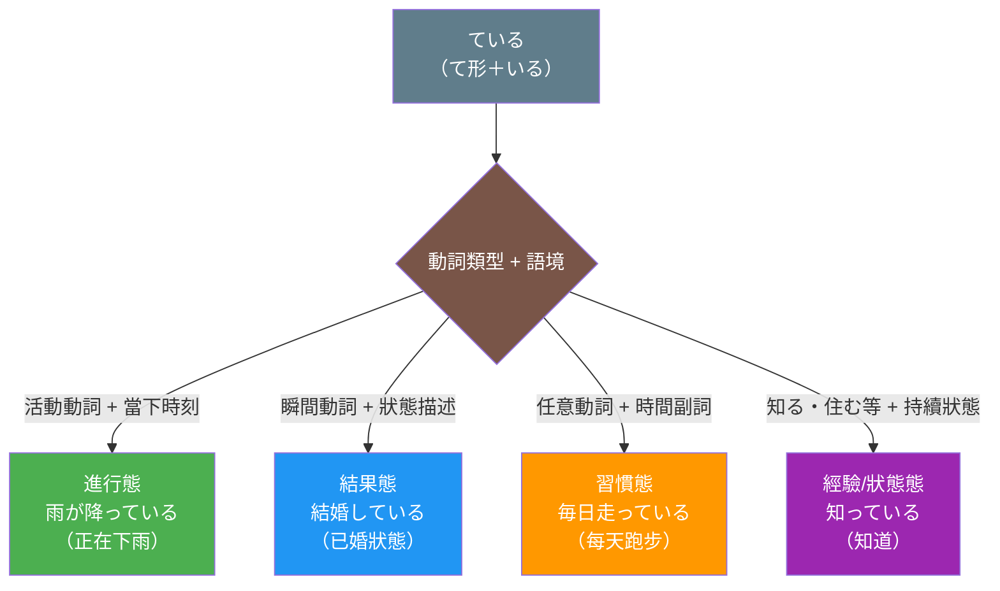
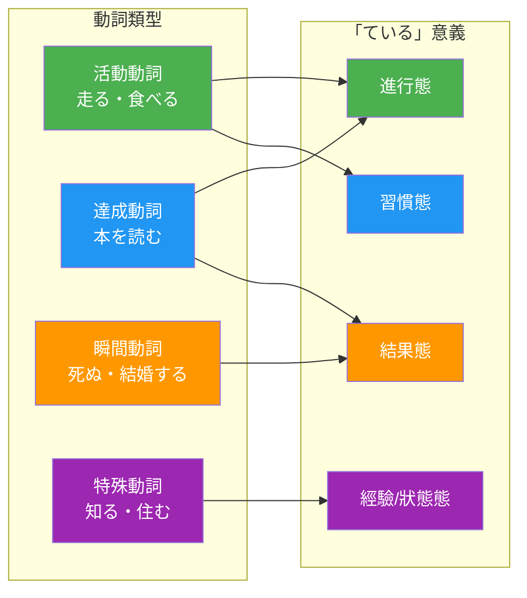

## 日文

ている（〜ている）

**羅馬拼音**: te iru

**概念類型**: 文法形式・體標記

## 概念情報

| 項目 | 內容 |
|------|------|
| 文法分類 | 體標記（アスペクト標識） |
| 構成 | て形 + いる |
| 學習層級 | JLPT N4 |
| 多義性 | 進行態・結果態・習慣態・經驗態 |

## 日文解釋

「ている」は日本語において最も多機能な文法形式の一つであり、動詞のて形に存在動詞「いる」を接続して形成される。この形式は一般に「進行形」と呼ばれることが多いが、実際には動詞の種類（語彙的側面）と文脈によって、少なくとも四つの異なる意味を表すことができる。

### 1. 進行態（Progressive Aspect）

動作が現在進行中であることを表す。主に活動動詞（走る、歩く、食べる、読むなど）と共に使用される。

```
今、本を読んでいる。
I am reading a book now.
我現在正在看書。
```

活動動詞は時間的な持続を持つ動作を表すため、「ている」と結合すると自然に「進行中」の意味になる。

### 2. 結果態（Resultative Aspect）

動作が完了した後の結果状態が継続していることを表す。主に瞬間動詞・変化動詞（死ぬ、結婚する、開く、着くなど）と共に使用される。

```
窓が開いている。
The window is open. (resultative state)
窗戶開著。
```

瞬間動詞は動作の完了点に焦点を当てるため、「ている」と結合すると「完了後の状態」を表す。「窓が開いている」は「開く」という動作が既に完了し、その結果として窓が開いた状態にあることを示す。

### 3. 習慣態（Habitual Aspect）

反復的・習慣的な行為を表す。時間副詞（毎日、いつも、週に三回など）と共によく使用される。

```
毎朝公園を走っている。
I run in the park every morning. (habitual)
每天早上在公園跑步。
```

この用法では、動作は話している時点で必ずしも進行中ではないが、習慣として定着していることを表す。

### 4. 経験態（Experiential Aspect）

過去の経験が現在まで持続していること、あるいは経験の蓄積を表す。特に「知っている」「住んでいる」などの動詞でよく見られる。

```
彼は日本に住んでいる。
He lives in Japan. / He has been living in Japan.
他住在日本。
```

```
この事実を知っている。
I know this fact. (I have come to know and still know)
我知道這個事實。
```

### 動詞類型と「ている」の意味関係

「ている」の意味は動詞の語彙的側面（lexical aspect）によって大きく影響される。以下に主要な動詞類型と「ている」の意味の対応関係を示す。

**活動動詞（Activity Verbs）**：走る、歩く、食べる、読む
- → 進行態が基本（「今走っている」＝今走っている最中）
- 習慣態も可能（「毎日走っている」＝習慣的に走る）

**達成動詞（Accomplishment Verbs）**：本を読む、手紙を書く、家を建てる
- → 進行態（「本を読んでいる」＝読書中）
- → 結果態も可能（「もう読んでいる」＝既に読了した状態）

**到達動詞・瞬間動詞（Achievement Verbs）**：死ぬ、結婚する、着く、開く
- → 結果態が基本（「死んでいる」＝死んだ状態、「結婚している」＝既婚状態）

**状態動詞（Stative Verbs）**：ある、いる、できる
- → 通常「ている」形を取らない（「いる」自体が状態を表すため）
- 例外：「分かっている」「知っている」などは可能

### 「ている」と「てある」の対比

「ている」と「てある」は類似しているが、視点と主語が異なる。

**ている**：動作主（または状態の主体）に焦点
```
窓が開いている。（窓に焦点、自然に開いた可能性あり）
The window is open.
窗戶開著。
```

**てある**：動作の結果に焦点、他動詞のみ使用、誰かが意図的に行ったことを含意
```
窓が開けてある。（誰かが意図的に開けた結果として開いている）
The window has been opened (by someone, intentionally).
窗戶被（人為地）開著。
```

### 「ている」の文体的変異

口語では「ている」はしばしば縮約される：

- **標準形**：食べている
- **口語形**：食べてる（「い」が省略）
- **方言形**：食べとる（西日本）、食べでる（東北）

また、丁寧体では「〜ています」となる。

## 英文解釋

"Te iru" is one of the most multifunctional grammatical forms in Japanese, formed by attaching the existential verb "iru" to the te-form of a verb. While commonly referred to as the "progressive form," it actually expresses at least four distinct meanings depending on the verb type (lexical aspect) and context.

### 1. Progressive Aspect

Indicates that an action is currently in progress. Primarily used with activity verbs (run, walk, eat, read, etc.).

```
今、本を読んでいる。
I am reading a book now.
我現在正在看書。
```

Activity verbs denote actions with temporal duration, so when combined with "te iru," they naturally express "in progress."

### 2. Resultative Aspect

Indicates that the resulting state of a completed action continues. Primarily used with achievement verbs (die, marry, open, arrive, etc.).

```
窓が開いている。
The window is open. (resultative state)
窗戶開著。
```

Achievement verbs focus on the completion point of an action, so when combined with "te iru," they express "the state after completion." "Mado ga aite iru" indicates that the action of opening has already been completed and the window is in an open state as a result.

### 3. Habitual Aspect

Indicates repetitive or habitual actions. Often used with temporal adverbs (every day, always, three times a week, etc.).

```
毎朝公園を走っている。
I run in the park every morning. (habitual)
每天早上在公園跑步。
```

In this usage, the action is not necessarily in progress at the moment of speaking, but indicates an established habit.

### 4. Experiential Aspect

Indicates that past experience continues to the present, or the accumulation of experience. Particularly common with verbs like "shitte iru" (know) and "sunde iru" (live).

```
彼は日本に住んでいる。
He lives in Japan. / He has been living in Japan.
他住在日本。
```

### Relationship Between Verb Types and "Te iru" Meanings

The meaning of "te iru" is significantly influenced by the lexical aspect of the verb:

**Activity Verbs**: run, walk, eat, read
- → Progressive is the default ("ima hashitte iru" = currently running)
- Habitual also possible ("mainichi hashitte iru" = run habitually)

**Accomplishment Verbs**: read a book, write a letter, build a house
- → Progressive ("hon wo yonde iru" = reading)
- → Resultative also possible ("mou yonde iru" = already in a state of having read)

**Achievement Verbs**: die, marry, arrive, open
- → Resultative is the default ("shinde iru" = dead state, "kekkon shite iru" = married state)

**Stative Verbs**: exist, be able to
- → Usually do not take "te iru" form (since "iru" itself expresses state)
- Exceptions: "wakatte iru" (understand), "shitte iru" (know) are possible

### Contrast Between "Te iru" and "Te aru"

"Te iru" and "te aru" are similar but differ in viewpoint and subject:

**Te iru**: Focus on the agent (or subject of the state)
```
窓が開いている。(Focus on the window, may have opened naturally)
```

**Te aru**: Focus on the result of the action, uses only transitive verbs, implies someone did it intentionally
```
窓が開けてある。(Open as a result of someone's intentional action)
```

## 中文解釋

「ている」是日語中最具多功能性的文法形式之一，由動詞的て形接續存在動詞「いる」構成。雖然常被稱為「進行式」，但實際上根據動詞類型（詞彙體）和語境的不同，至少可以表達四種不同的意義。

### 1. 進行態（Progressive Aspect）

表示動作正在進行中。主要與活動動詞（跑、走、吃、讀等）搭配使用。

```
今、本を読んでいる。
I am reading a book now.
我現在正在看書。
```

活動動詞表示具有時間延續的動作，因此與「ている」結合時，自然表達「進行中」的意義。

### 2. 結果態（Resultative Aspect）

表示動作完成後的結果狀態持續中。主要與瞬間動詞、變化動詞（死、結婚、開、到達等）搭配使用。

```
窓が開いている。
The window is open. (resultative state)
窗戶開著。
```

瞬間動詞聚焦於動作的完成點，因此與「ている」結合時，表達「完成後的狀態」。「窓が開いている」表示「開」這個動作已經完成，窗戶作為結果處於開啟狀態。

### 3. 習慣態（Habitual Aspect）

表示反覆性、習慣性的行為。常與時間副詞（每天、總是、一週三次等）搭配使用。

```
毎朝公園を走っている。
I run in the park every morning. (habitual)
每天早上在公園跑步。
```

這種用法中，動作在說話時點不一定正在進行，而是表示已成為習慣。

### 4. 經驗態（Experiential Aspect）

表示過去的經驗持續到現在，或經驗的累積。特別常見於「知っている」「住んでいる」等動詞。

```
彼は日本に住んでいる。
He lives in Japan. / He has been living in Japan.
他住在日本。
```

### 動詞類型與「ている」意義的關係

「ている」的意義受動詞的詞彙體（lexical aspect）顯著影響：

**活動動詞**：跑、走、吃、讀
- → 進行態為基本（「今走っている」＝正在跑）
- 習慣態也可能（「毎日走っている」＝習慣性地跑）

**達成動詞**：讀書、寫信、蓋房子
- → 進行態（「本を読んでいる」＝讀書中）
- → 結果態也可能（「もう読んでいる」＝已經讀完的狀態）

**到達動詞/瞬間動詞**：死、結婚、到達、開
- → 結果態為基本（「死んでいる」＝死亡狀態、「結婚している」＝已婚狀態）

**狀態動詞**：有、在、能夠
- → 通常不採用「ている」形（因為「いる」本身表達狀態）
- 例外：「分かっている」「知っている」等可能

### 「ている」與「てある」的對比

「ている」與「てある」類似但視點和主語不同：

**ている**：聚焦於動作主體（或狀態的主體）
```
窓が開いている。（聚焦於窗戶，可能自然開啟）
窗戶開著。
```

**てある**：聚焦於動作的結果，僅使用他動詞，暗示有人故意為之
```
窓が開けてある。（作為某人故意開啟的結果而開著）
窗戶被（人為地）開著。
```

## 核心用法

### 用法1：進行態——動作正在進行

與活動動詞搭配，表示說話時點動作正在進行。

**例句1**
```
彼女は今テレビを見ている。
She is watching TV now.
她現在正在看電視。
```

**例句2**
```
雨が降っている。
It is raining.
正在下雨。
```

### 用法2：結果態——動作完成後的狀態

與瞬間動詞搭配，表示動作完成後的結果狀態持續中。

**例句3**
```
彼は結婚している。
He is married. (resultative state, not "getting married")
他已婚。
```

**例句4**
```
電車がもう着いている。
The train has already arrived. (and is still there)
電車已經到了。
```

### 用法3：習慣態——反覆進行的動作

表示習慣性、反覆性的行為，常搭配時間副詞。

**例句5**
```
私は毎日ジムで運動している。
I exercise at the gym every day. (habitual)
我每天在健身房運動。
```

**例句6**
```
週に三回日本語を勉強している。
I study Japanese three times a week. (habitual)
我一週學習三次日語。
```

### 用法4：經驗/狀態態——知識或狀態的持續

表示已獲得的知識或狀態持續到現在。

**例句7**
```
彼のことは知っている。
I know about him.
我知道他的事。
```

**例句8**
```
東京に住んでいる。
I live in Tokyo.
我住在東京。
```

## 動詞類型判斷表

| 動詞類型 | 代表例 | 「ている」意義 | 說明 |
|---------|-------|--------------|------|
| 活動動詞 | 走る、食べる | 進行態/習慣態 | 動作具時間延續性 |
| 達成動詞 | 本を読む、家を建てる | 進行態/結果態 | 有明確終點的動作 |
| 瞬間動詞 | 死ぬ、結婚する、開く | 結果態 | 動作瞬間完成 |
| 狀態動詞 | ある、いる | 不使用 | 本身即為狀態 |
| 特殊動詞 | 知る、分かる | 經驗/狀態態 | 一旦獲得即持續 |

## 常見錯誤

### 錯誤1：將結果態誤解為進行態

❌ 誤：「彼は結婚している」理解為「他正在結婚（進行婚禮中）」
✅ 正：「彼は結婚している」意為「他已婚」（結婚這個動作的結果狀態）
說明：「結婚する」是瞬間動詞，「ている」表結果態而非進行態。

### 錯誤2：誤用「ている」於狀態動詞

❌ 誤：「ここに本がいる」
✅ 正：「ここに本がある」
說明：「ある」「いる」本身是狀態動詞，不需要再加「ている」。

### 錯誤3：混淆「知っている」與「知る」

❌ 誤：（回答問題時）「はい、知ります」
✅ 正：「はい、知っています」
說明：「知る」是瞬間動詞，表示獲得知識的瞬間。持續的「知道」狀態用「知っている」。

### 錯誤4：忽略動詞類型的影響

❌ 誤：認為所有「ている」都是「正在...」
✅ 正：需要根據動詞類型判斷是進行態還是結果態
說明：「走っている」（正在跑）vs「死んでいる」（已死的狀態），意義完全不同。

### 錯誤5：口語縮約的不當使用

❌ 誤：在正式場合使用「食べてる」
✅ 正：正式場合應使用「食べている」或「食べています」
說明：「〜てる」是口語縮約形，正式場合應避免使用。

## 學習要點

1. **四種語義功能**：進行態、結果態、習慣態、經驗態，需根據動詞類型和語境判斷
2. **動詞類型決定意義**：活動動詞傾向進行態，瞬間動詞傾向結果態
3. **「知っている」特殊性**：「知る」是瞬間動詞，表示「知道」的狀態必須用「知っている」
4. **「ている」vs「てある」**：前者聚焦狀態，後者暗示有人故意為之
5. **文體變異**：口語常縮約為「〜てる」，正式場合使用完整形

## 圖解

### 「ている」的四種語義功能



### 動詞類型與「ている」意義對應



## 相關連結

### 體理論基礎
- [體理論](021_aspect_theory.md) - 體理論的整體框架
- [動詞分類](045_verb_classification.md) - 動詞類型系統

### 相關文法形式
- [てある](../grammar/te_aru_form.md) - 結果態的另一形式（待建立）
- [た形](../grammar/ta_form.md) - 完成態標記（待建立）
- [ていた](../grammar/te_ita_form.md) - 過去進行/結果態（待建立）

### 動詞類型
- [活動動詞](activity_verbs.md) - 具時間延續的動作動詞（待建立）
- [瞬間動詞](achievement_verbs.md) - 瞬間完成的動詞（待建立）
- [狀態動詞](stative_verbs.md) - 表達狀態的動詞（待建立）

### 進階應用
- [ている的曖昧性](../extension/teiru_ambiguity.md) - 多義性的語用分析（待建立）
- [ている與ていた](../comparison/teiru_vs_teita.md) - 時制與體的交互（待建立）
- [日英進行式對比](../comparison/progressive_jp_en.md) - 跨語言對比（待建立）

---

**建立日期**: 2025-12-27
**最後更新**: 2025-12-27
**字數**: ~4500
**例句數**: 8
