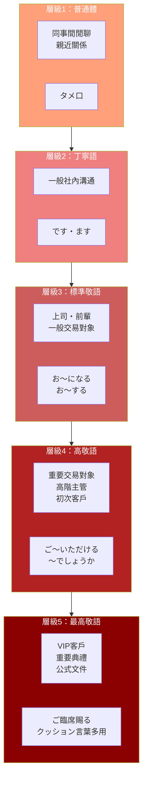
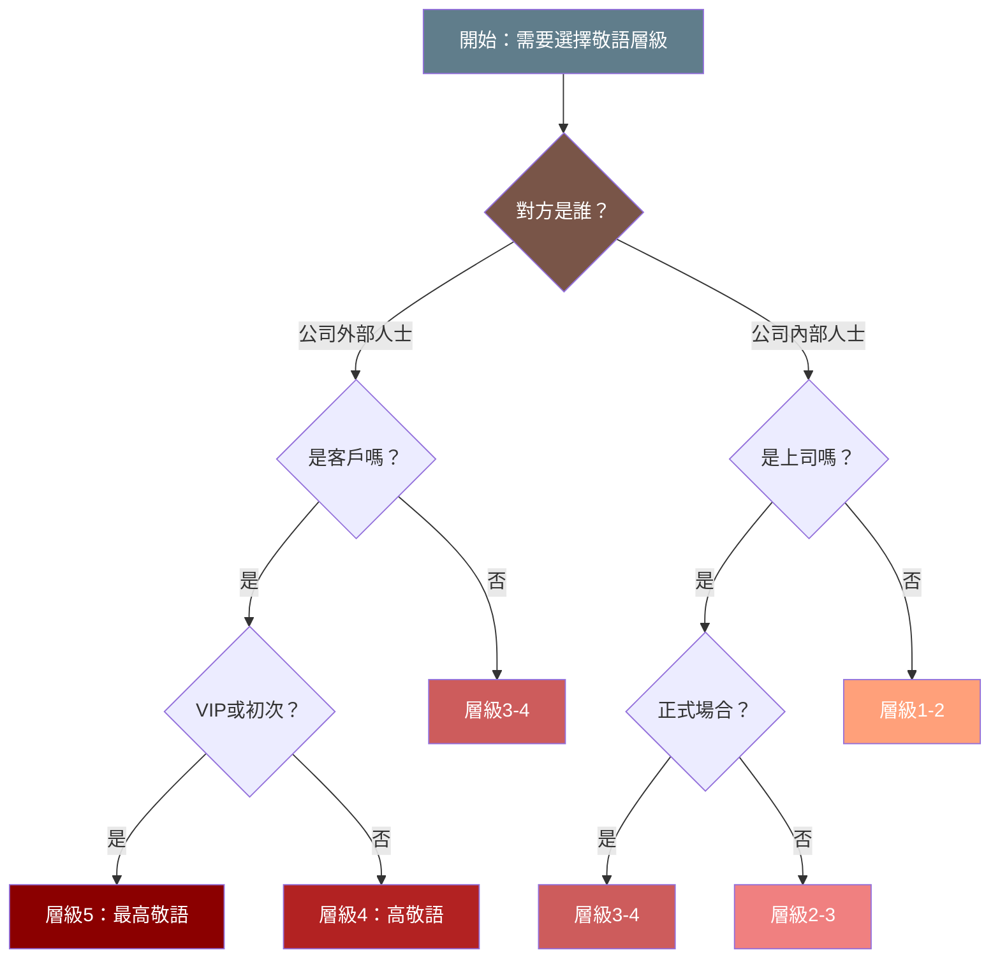

## 日文

ビジネス敬語の階梯理論（ビジネスけいごのかいていりろん）

**羅馬拼音**: bijinesu keigo no kaitei riron

**概念類型**: 社會語言學・商務溝通

## 日文解釋

「ビジネス敬語の階梯理論」とは、商務場面における敬語使用の段階的な選択体系を説明する概念です。日本のビジネスシーンでは、相手との関係性、場面の格式、話題の内容によって、普通体から最高敬語まで複数の敬意レベルを適切に使い分けることが求められます。

### 階梯の基本構造

この理論では、敬語を以下の5つのレベルに分類します：

**レベル1：普通体（タメ口）**
- 使用場面：同僚間の雑談、親しい関係
- 特徴：敬語をほとんど使用しない
- 例：「明日の会議、出る？」

**レベル2：丁寧語レベル（です・ます体）**
- 使用場面：一般的な社内コミュニケーション
- 特徴：基本的な「です・ます」を使用
- 例：「明日の会議に出席しますか。」

**レベル3：標準敬語レベル**
- 使用場面：上司、先輩、取引先との日常的なやり取り
- 特徴：尊敬語・謙譲語の基本形を使用
- 例：「明日の会議にご出席になりますか。」

**レベル4：高敬語レベル**
- 使用場面：重要な取引先、役員、初対面の顧客
- 特徴：特殊敬語動詞、二重敬語に近い表現
- 例：「明日の会議にご出席いただけますでしょうか。」

**レベル5：最高敬語レベル**
- 使用場面：VIP顧客、重要な式典、公式文書
- 特徴：最大限の敬意表現、クッション言葉の多用
- 例：「恐れ入りますが、明日の会議にご臨席賜れますでしょうか。」

### 階梯選択の判断基準

敬語レベルの選択には、以下の要素が影響します：

**1. 社会的地位差**
- 相手と自分の役職・年齢・経験の差
- 差が大きいほど高いレベルを選択

**2. 内外関係（ウチ・ソト）**
- 社内（ウチ）：比較的低いレベル
- 社外（ソト）：高いレベルを選択
- 顧客は常に「ソト」として最高レベルで対応

**3. 場面の格式**
- 非公式場面：低いレベル可能
- 公式場面（会議、式典）：高いレベル必須

**4. コミュニケーション媒体**
- 口頭：状況に応じて調整
- 文書・メール：通常より1レベル高く

**5. 取引関係**
- 新規顧客：最高レベル
- 既存顧客：徐々にレベル調整可能
- 重要度の高い案件：常に高レベル維持

### 階梯理論の実践的意義

この理論を理解することで：

**1. 場面判断力の向上**
- 状況に応じた適切なレベル選択が可能に
- 敬語の「過不足」を回避

**2. 信頼関係の構築**
- 適切な敬語使用は信頼の証
- レベルの調整で関係性の変化を示す

**3. トラブル回避**
- 敬語不足による不快感の防止
- 過剰敬語による距離感の解消

**4. キャリア形成**
- ビジネスパーソンとしての評価向上
- 国際ビジネスでの日本文化理解の深化

### 注意点

**1. 固定的に考えない**
- 階梯は目安であり、状況に応じて柔軟に調整
- 相手の反応を見ながらレベルを微調整

**2. 二重敬語の回避**
- 高レベルを目指すあまり、文法的に誤った二重敬語を避ける
- 正しい形式の範囲内で敬意を表現

**3. 自然さの維持**
- 機械的な敬語使用は逆効果
- 心からの敬意を言葉に反映させる

## 英文解釋

"Business Keigo Hierarchy Theory" is a concept that explains the systematic selection of honorific levels in business settings. In Japanese business contexts, it is essential to appropriately choose from multiple levels of politeness, ranging from casual speech to the highest honorific expressions, based on the relationship with the other party, the formality of the situation, and the nature of the topic.

### Basic Structure of the Hierarchy

This theory classifies honorific language into five levels:

**Level 1: Casual Form (Tameguchi)**
- Usage: Casual conversation among colleagues, close relationships
- Features: Minimal or no honorific usage
- Example: "Ashita no kaigi, deru?" (Coming to tomorrow's meeting?)

**Level 2: Polite Level (Desu/Masu Form)**
- Usage: General internal communication
- Features: Basic "desu/masu" usage
- Example: "Ashita no kaigi ni shusseki shimasu ka." (Will you attend tomorrow's meeting?)

**Level 3: Standard Honorific Level**
- Usage: Daily interactions with superiors, seniors, and business partners
- Features: Basic forms of sonkeigo (respectful) and kenjougo (humble) language
- Example: "Ashita no kaigi ni go-shusseki ni narimasu ka." (Will you attend tomorrow's meeting? - honorific)

**Level 4: High Honorific Level**
- Usage: Important business partners, executives, first-time customers
- Features: Special honorific verbs, expressions approaching double honorifics
- Example: "Ashita no kaigi ni go-shusseki itadakemasu deshou ka." (Would you be able to attend tomorrow's meeting? - highly respectful)

**Level 5: Highest Honorific Level**
- Usage: VIP customers, important ceremonies, official documents
- Features: Maximum respectful expressions, frequent use of cushioning phrases
- Example: "Osore irimasu ga, ashita no kaigi ni go-rinseki tamawaremasu deshou ka." (I apologize for the imposition, but would you grace us with your presence at tomorrow's meeting?)

### Criteria for Selecting Hierarchy Levels

The following factors influence the selection of honorific levels:

**1. Social Status Difference**
- The gap in position, age, and experience between oneself and the other party
- Greater differences require higher levels

**2. Inside-Outside Relations (Uchi-Soto)**
- Internal (Uchi): Relatively lower levels acceptable
- External (Soto): Higher levels selected
- Customers are always treated as "Soto" with highest levels

**3. Formality of the Situation**
- Informal settings: Lower levels possible
- Formal settings (meetings, ceremonies): High levels required

**4. Communication Medium**
- Verbal: Adjustable based on situation
- Written/Email: Typically one level higher than verbal

**5. Business Relationship**
- New customers: Highest level
- Existing customers: Gradual level adjustment possible
- High-importance matters: Maintain high levels consistently

### Practical Significance

Understanding this theory enables:

**1. Improved Situational Judgment**
- Appropriate level selection based on circumstances
- Avoiding excess or insufficiency in honorific usage

**2. Building Trust**
- Appropriate honorific use demonstrates trust
- Level adjustment shows relationship evolution

**3. Trouble Avoidance**
- Preventing discomfort from insufficient honorifics
- Resolving distance created by excessive honorifics

**4. Career Development**
- Enhanced evaluation as a business professional
- Deeper understanding of Japanese culture in international business

## 中文解釋

「商務敬語階梯理論」是說明商務場合中敬語使用的層級選擇體系的概念。在日本商務情境中，根據與對方的關係、場合的正式程度、話題的內容，需要從普通體到最高敬語之間適當選擇並運用多個敬意層級。

### 階梯的基本結構

本理論將敬語分為以下五個層級：

**層級1：普通體（タメ口）**
- 使用場合：同事間的閒聊、親近關係
- 特徵：幾乎不使用敬語
- 例：「明日の会議、出る？」（明天的會議，來嗎？）

**層級2：禮貌語層級（です・ます體）**
- 使用場合：一般的公司內部溝通
- 特徵：使用基本的「です・ます」
- 例：「明日の会議に出席しますか。」（明天會出席會議嗎？）

**層級3：標準敬語層級**
- 使用場合：與上司、前輩、交易對象的日常交流
- 特徵：使用尊敬語・謙讓語的基本形式
- 例：「明日の会議にご出席になりますか。」（您明天會出席會議嗎？）

**層級4：高級敬語層級**
- 使用場合：重要的交易對象、高階主管、初次見面的客戶
- 特徵：特殊敬語動詞、接近二重敬語的表達
- 例：「明日の会議にご出席いただけますでしょうか。」（不知您明天能否出席會議？）

**層級5：最高敬語層級**
- 使用場合：VIP客戶、重要典禮、正式文件
- 特徵：最大限度的敬意表達、大量使用緩衝語
- 例：「恐れ入りますが、明日の会議にご臨席賜れますでしょうか。」（冒昧請問，不知您明天能否蒞臨會議？）

### 階梯選擇的判斷基準

以下要素影響敬語層級的選擇：

**1. 社會地位差距**
- 對方與自己在職位、年齡、經驗上的差距
- 差距越大，選擇越高的層級

**2. 內外關係（ウチ・ソト）**
- 公司內（ウチ）：可使用相對較低的層級
- 公司外（ソト）：選擇較高的層級
- 客戶始終視為「ソト」，以最高層級對應

**3. 場合的正式程度**
- 非正式場合：可使用較低層級
- 正式場合（會議、典禮）：必須使用高層級

**4. 溝通媒介**
- 口頭：根據情況調整
- 書面・郵件：通常比口頭高一個層級

**5. 交易關係**
- 新客戶：最高層級
- 既有客戶：可逐漸調整層級
- 重要案件：始終維持高層級

### 階梯理論的實踐意義

理解本理論可以：

**1. 提升場合判斷力**
- 能夠根據情況選擇適當的層級
- 避免敬語的「過多或不足」

**2. 建立信賴關係**
- 適當的敬語使用是信賴的證明
- 通過層級調整顯示關係的變化

**3. 避免問題**
- 防止因敬語不足造成的不快感
- 消除因過度敬語造成的距離感

**4. 職涯發展**
- 提升作為商務人士的評價
- 在國際商務中深化對日本文化的理解

## 核心用法

### 用法1：根據對象選擇層級

根據對方的身分地位選擇適當的敬語層級。

**例句1**
```
（對同事）明日の資料、できた？
The materials for tomorrow, are they done?
明天的資料做好了嗎？（普通體）
```

**例句2**
```
（對客戶）ご依頼いただきました資料が完成いたしました。ご確認いただけますでしょうか。
The materials you requested have been completed. Would you kindly review them?
您委託的資料已經完成了。能否請您確認？（高敬語層級）
```

### 用法2：根據場合調整層級

同一對象在不同場合使用不同層級。

**例句3**
```
（會議中對上司）部長、この件について、ご意見を伺えますでしょうか。
Department head, may I ask for your opinion on this matter?
部長，關於這件事，能否請教您的意見？（高敬語層級）
```

**例句4**
```
（午餐時對上司）部長、今日のランチはどうしますか。
Department head, what shall we do for lunch today?
部長，今天的午餐怎麼辦？（丁寧語層級）
```

### 用法3：書面與口頭的層級差異

書面溝通通常比口頭高一個層級。

**例句5**
```
（口頭）お時間をいただきありがとうございます。
Thank you for your time.
感謝您撥冗。（標準敬語層級）
```

**例句6**
```
（書面）お忙しいところ、貴重なお時間を賜り、誠にありがとうございます。
Thank you very much for your precious time despite your busy schedule.
百忙之中承蒙撥冗，誠摯感謝。（高敬語層級）
```

## 文法規則

### 規則1：層級選擇的基本原則

- 首次接觸：從較高層級開始
- 關係深化：可逐漸降低層級
- 不確定時：選擇較高層級較安全

### 規則2：各層級的典型表達

**層級2（丁寧語）**：
- 動詞ます形 + ます
- 名詞/形容詞 + です

**層級3（標準敬語）**：
- お/ご〜になる（尊敬）
- お/ご〜する/いたす（謙讓）

**層級4（高敬語）**：
- お/ご〜いただく（謙讓 + 請求）
- お/ご〜くださる（尊敬 + 恩惠）
- 〜でしょうか（推量疑問）

**層級5（最高敬語）**：
- 特殊敬語動詞（召し上がる、ご覧になる等）
- 賜る、存じ上げる等最高敬表達
- クッション言葉（恐れ入りますが、失礼ながら等）

### 規則3：層級調整的時機

**升級時機**：
- 初次見面 → 對等關係確立後
- 出現問題 → 表達歉意時
- 重要請求 → 強調誠意時

**降級時機**：
- 關係熟悉後
- 非正式場合
- 對方主動降級後

### 規則4：內外區分與層級的關係

- 公司內部：通常使用層級2-3
- 公司外部：通常使用層級3-5
- 對外談及公司內部人士：降低層級（謙讓語）

## 常見錯誤

### 錯誤1：對客戶使用過低層級

❌ 誤：（對客戶）「今度の会議、出席しますか。」
✅ 正：「今度の会議にご出席いただけますでしょうか。」
說明：對客戶應使用高敬語層級，不能用普通的丁寧語。

### 錯誤2：同一場合層級不一致

❌ 誤：「ご確認をお願いします。あと、これ見といて。」
✅ 正：「ご確認をお願いいたします。また、こちらもご確認いただけますと幸いです。」
說明：在同一對話中應維持一致的敬語層級。

### 錯誤3：書面使用口頭層級

❌ 誤：（郵件中）「資料を送りますね。」
✅ 正：「資料をお送りいたします。ご査収くださいますようお願い申し上げます。」
說明：書面溝通應比口頭高一個層級。

### 錯誤4：對上司在外人面前使用尊敬語

❌ 誤：（對客戶）「山田部長がいらっしゃいます。」
✅ 正：「山田は、ただいまおります。」
說明：對外談及公司內部人士時，即使是上司也要使用謙讓語。

### 錯誤5：追求高層級而使用錯誤的二重敬語

❌ 誤：「お読みになられましたか。」
✅ 正：「お読みになりましたか。」或「ご覧になりましたか。」
說明：追求高敬意不應使用文法錯誤的二重敬語。

## 學習要點

1. **五層級體系**：普通體→丁寧語→標準敬語→高敬語→最高敬語
2. **選擇基準**：地位差距、內外關係、場合正式程度、溝通媒介、交易關係
3. **靈活調整**：根據情況和對方反應微調層級
4. **一致性維持**：同一對話中保持敬語層級的一致
5. **書面提升**：書面溝通比口頭高一個層級

## 圖解

### 敬語階梯結構



### 層級選擇判斷流程



## 相關連結

### 敬語體系
- [尊敬語概念](192_sonkeigo.md) - 提高對方地位的敬語
- [謙讓語概念](038_kenjougo_concept.md) - 降低自己地位的敬語
- [丁寧語概念](040_teineigo_concept.md) - 基本禮貌表達
- [敬語系統](56_keigo_system.md) - 敬語的整體理論框架

### 商務溝通
- [商務溝通](072_business_communication.md) - 商務場合的溝通技巧
- [報連相](060_hourensou.md) - 日本職場的溝通文化
- [商務郵件](065_bijinesu_mail.md) - 商務郵件撰寫

### 社會語言學概念
- [內與外](007_uchi_soto.md) - 內外群體概念
- [正式度層級](066_formality_level.md) - 正式程度分級系統
- [社會語言學](61_shakai_gengogaku.md) - 語言與社會的關係

### 實用延伸
- [緩衝語](../grammar/cushion_words.md) - 柔化表達的詞語
- [敬語常見錯誤](../extension/keigo_mistakes.md) - 學習者常犯錯誤分析

---

**建立日期**: 2025-12-27
**最後更新**: 2025-12-27
**字數**: ~4500
**例句數**: 6
