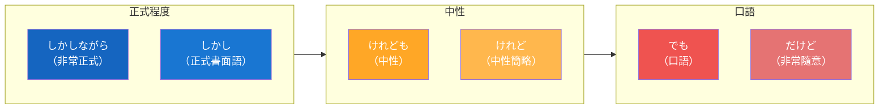

## 日文
しかし（shikashi）

**羅馬拼音**：shikashi

**詞性**：接續詞[^conjunction]（逆接[^adversative]）

## 日文解釋

「しかし」は、前の文と対立する内容や、予想に反する結果を述べるときに使う逆接の接続詞です。書き言葉でも話し言葉でも使えますが、やや改まった表現です。

**使い方のポイント**：
- 文頭に置いて、前の文の内容と対立する事柄を導く
- 「だが」「けれども」「でも」より丁寧でフォーマルな印象
- 論文やレポート、ビジネス文書でよく使われる
- 話し言葉では「でも」や「けど」のほうが自然な場合もある

## 英文解釋

"Shikashi" is an adversative conjunction used to introduce content that contrasts with or contradicts the previous statement, or to present an unexpected result. It can be used in both written and spoken Japanese, but has a somewhat formal tone.

**Key Usage Points**:
- Placed at the beginning of a sentence to introduce content that opposes the previous statement
- More polite and formal than "daga," "keredomo," or "demo"
- Commonly used in academic papers, reports, and business documents
- In casual conversation, "demo" or "kedo" may sound more natural

## 中文解釋

「しかし」是逆接接續詞，用於引出與前句內容對立或相反的內容，或陳述出乎意料的結果。可用於書面語和口語，但語氣略顯正式。

**使用要點**：
- 放在句首，引出與前句對立的內容
- 比「だが」「けれども」「でも」更禮貌、更正式
- 常用於論文、報告、商務文書等正式場合
- 在日常對話中，使用「でも」或「けど」可能更自然

**語氣層級**（由正式到隨意）：
1. しかし（正式書面語）
2. しかしながら（非常正式）
3. けれども、けれど（中性）
4. でも（口語、隨意）
5. だけど（口語、非常隨意）

## 語氣層級圖

## 例句

### 例句 1
**日文**：今日はいい天気です。しかし、明日は雨が降るそうです。

**羅馬拼音**：Kyō wa ii tenki desu. Shikashi, ashita wa ame ga furu sō desu.

**英文翻譯**：The weather is nice today. However, it's supposed to rain tomorrow.

**中文翻譯**：今天天氣很好。但是，據說明天會下雨。

---

### 例句 2
**日文**：彼は一生懸命勉強した。しかし、試験に合格できなかった。

**羅馬拼音**：Kare wa isshōkenmei benkyō shita. Shikashi, shiken ni gōkaku dekinakatta.

**英文翻譯**：He studied very hard. However, he couldn't pass the exam.

**中文翻譯**：他非常努力學習。然而，他沒能通過考試。

---

### 例句 3
**日文**：この計画は素晴らしいと思います。しかし、予算が足りません。

**羅馬拼音**：Kono keikaku wa subarashii to omoimasu. Shikashi, yosan ga tarimasen.

**英文翻譯**：I think this plan is excellent. However, we don't have enough budget.

**中文翻譯**：我認為這個計畫很棒。但是，預算不足。

---

### 例句 4
**日文**：日本語は難しい言語です。しかし、毎日練習すれば上達します。

**羅馬拼音**：Nihongo wa muzukashii gengo desu. Shikashi, mainichi renshū sureba jōtatsu shimasu.

**英文翻譯**：Japanese is a difficult language. However, if you practice every day, you will improve.

**中文翻譯**：日語是一門困難的語言。然而，如果每天練習就會進步。

---

### 例句 5
**日文**：この商品は高品質です。しかし、価格も高いです。

**羅馬拼音**：Kono shōhin wa kō hinshitsu desu. Shikashi, kakaku mo takai desu.

**英文翻譯**：This product is high quality. However, the price is also high.

**中文翻譯**：這個商品品質很高。但是，價格也很高。

---

## 註解

[^conjunction]: **接續詞（接続詞）** - 連接句子或段落的詞彙，用來表示句子之間的邏輯關係。詳見 [接続詞](../grammar/conjunction-types.md)

[^adversative]: **逆接（逆接）** - 表示轉折或對比的語法概念，連接兩個相反或對照的內容。詳見 [逆接表現](../grammar/adversative-expressions.md)

---

## 相關連結

【待 build-card-links 代理人補充】
