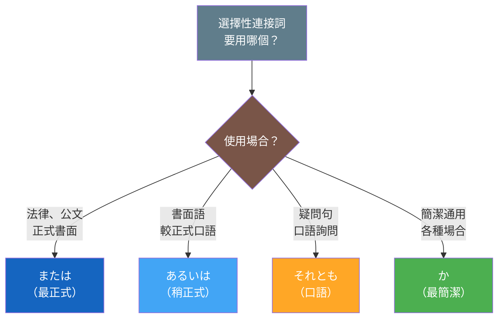

## 日文
または（matawa）

**羅馬拼音**：matawa

**詞性**：接續詞[^conjunction]（選擇[^disjunctive]）

## 日文解釋

「または」は、複数の選択肢の中から一つを選ぶ場合に使う選択の接続詞です。主に書き言葉や公式な場面で使われ、法律文書、契約書、案内文などでよく見られます。

**使い方のポイント**：
- 二つ以上の選択肢を並べるときに使う
- 「AまたはB」という形で、どちらか一方を選ぶことを示す
- 話し言葉では「それとも」や「あるいは」のほうが自然
- フォーマルで客観的な印象を与える
- 複数の項目を列挙する場合、最後の項目の前に置くことが多い

## 英文解釋

"Matawa" is a disjunctive conjunction used to present options or alternatives from which one should be chosen. It is primarily used in written language and formal situations, commonly found in legal documents, contracts, and official notices.

**Key Usage Points**:
- Used to list two or more alternatives
- In the form "A matawa B," indicates choosing one or the other
- In spoken language, "soretomo" or "aruiwa" sound more natural
- Gives a formal and objective impression
- When listing multiple items, often placed before the final item

## 中文解釋

「または」是選擇性接續詞，用於從多個選項中選擇其一的情況。主要用於書面語和正式場合，常見於法律文件、合約、通知等正式文書中。

**使用要點**：
- 用於列舉兩個或多個選項
- 以「A または B」的形式表示選擇其中之一
- 在口語中使用「それとも」或「あるいは」更自然
- 給人正式、客觀的印象
- 列舉多個項目時，通常放在最後一個項目前

**相似表達比較**：
- **または**：最正式，常用於法律、公文
- **あるいは**：稍正式，用於書面語和較正式的口語
- **それとも**：口語，用於疑問句
- **か**：最簡潔，可用於各種場合

## 選擇性連接詞比較圖

## 例句

### 例句 1
**日文**：お茶またはコーヒーをお選びください。

**羅馬拼音**：Ocha matawa kōhī o o-erabi kudasai.

**英文翻譯**：Please choose tea or coffee.

**中文翻譯**：請選擇茶或咖啡。

---

### 例句 2
**日文**：申込書は郵送またはメールでお送りください。

**羅馬拼音**：Mōshikomisho wa yūsō matawa mēru de o-okuri kudasai.

**英文翻譯**：Please send the application form by mail or email.

**中文翻譯**：請以郵寄或電子郵件方式寄送申請表。

---

### 例句 3
**日文**：学生証または運転免許証をご提示ください。

**羅馬拼音**：Gakuseishō matawa unten menkyoshō o go-teiji kudasai.

**英文翻譯**：Please present your student ID or driver's license.

**中文翻譯**：請出示學生證或駕照。

---

### 例句 4
**日文**：会議は月曜日または火曜日に開催されます。

**羅馬拼音**：Kaigi wa getsuyōbi matawa kayōbi ni kaisai saremasu.

**英文翻譯**：The meeting will be held on Monday or Tuesday.

**中文翻譯**：會議將於星期一或星期二舉行。

---

### 例句 5
**日文**：この製品は日本、中国、またはタイで製造されています。

**羅馬拼音**：Kono seihin wa Nihon, Chūgoku, matawa Tai de seizō sarete imasu.

**英文翻譯**：This product is manufactured in Japan, China, or Thailand.

**中文翻譯**：本產品在日本、中國或泰國製造。

---

## 註解

[^conjunction]: **接續詞（接続詞）** - 連接句子或段落的詞彙，用來表示句子之間的邏輯關係。詳見 [接続詞](../grammar/conjunction-types.md)

[^disjunctive]: **選擇（選択）** - 表示兩個或多個選項之間的選擇關係。詳見 [選択表現](../grammar/disjunctive-expressions.md)

---

## 相關連結

【待 build-card-links 代理人補充】
