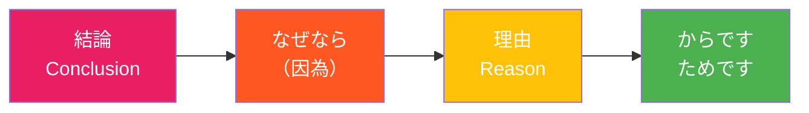

## 日文
なぜなら（nazenara）

**羅馬拼音**：nazenara

**詞性**：接續詞[^conjunction]（理由[^causal]）

## 日文解釋

「なぜなら」は、前に述べた事柄の理由や根拠を説明するときに使う理由の接続詞です。「なぜ（why）」と「なら（if）」が組み合わさった言葉で、「その理由を言うならば」という意味を持ちます。

**使い方のポイント**：
- 文頭に置いて、前の文の理由を導く
- 「なぜなら」の後には、必ず理由や根拠を述べる
- 文末には「〜からです」「〜ためです」などを使うことが多い
- やや改まった表現で、論文や説明文でよく使われる
- 話し言葉では「だって」や「〜から」のほうが自然な場合もある

## 英文解釋

"Nazenara" is a causal conjunction used to explain the reason or basis for what was previously stated. It is a combination of "naze" (why) and "nara" (if), carrying the meaning "if I were to say the reason."

**Key Usage Points**:
- Placed at the beginning of a sentence to introduce the reason for the previous statement
- Must be followed by an explanation of the reason or basis
- Often ends with expressions like "〜kara desu" or "〜tame desu"
- Somewhat formal expression, commonly used in academic papers and explanatory texts
- In casual conversation, "datte" or "〜kara" may sound more natural

## 中文解釋

「なぜなら」是理由性接續詞，用於說明前述事項的理由或根據。由「なぜ（為什麼）」和「なら（如果）」組合而成，意思是「要說理由的話」。

**使用要點**：
- 放在句首，引出前句的理由
- 「なぜなら」之後必須陳述理由或根據
- 句尾常用「〜からです」「〜ためです」等表達
- 語氣略顯正式，常用於論文或說明文
- 在日常對話中使用「だって」或「〜から」可能更自然

**典型句型結構**：
```
【結論】。なぜなら、【理由】からです。
【Conclusion】. Nazenara, 【reason】 kara desu.
【結論】。因為【理由】。
```

**相似表達比較**：
- **なぜなら**：正式，用於書面語和說明
- **というのは**：稍正式，補充說明
- **だって**：口語，隨意
- **〜から**：中性，可用於各種場合

## 因果關係句型結構圖



**句型範例**：
```
私は毎日運動しています。
    ↓ 結論
なぜなら、健康を維持したいからです。
    ↓ 理由
```

## 例句

### 例句 1
**日文**：私は毎日運動しています。なぜなら、健康を維持したいからです。

**羅馬拼音**：Watashi wa mainichi undō shite imasu. Nazenara, kenkō o iji shitai kara desu.

**英文翻譯**：I exercise every day. Because I want to maintain my health.

**中文翻譯**：我每天運動。因為我想保持健康。

---

### 例句 2
**日文**：彼は日本語が上手です。なぜなら、日本に5年間住んでいたためです。

**羅馬拼音**：Kare wa Nihongo ga jōzu desu. Nazenara, Nihon ni go-nenkan sunde ita tame desu.

**英文翻譯**：He is good at Japanese. Because he lived in Japan for five years.

**中文翻譯**：他日語很好。因為他在日本住了五年。

---

### 例句 3
**日文**：この本をお勧めします。なぜなら、初心者にもわかりやすく書かれているからです。

**羅馬拼音**：Kono hon o o-susume shimasu. Nazenara, shoshinsha ni mo wakariyasuku kakarete iru kara desu.

**英文翻譯**：I recommend this book. Because it is written in a way that is easy for beginners to understand.

**中文翻譯**：我推薦這本書。因為它的內容淺顯易懂，初學者也能理解。

---

### 例句 4
**日文**：今日は会議を延期します。なぜなら、資料の準備が間に合わなかったからです。

**羅馬拼音**：Kyō wa kaigi o enki shimasu. Nazenara, shiryō no junbi ga maniawanakatta kara desu.

**英文翻譯**：We will postpone today's meeting. Because the materials weren't ready in time.

**中文翻譯**：今天的會議延期。因為資料準備不及。

---

### 例句 5
**日文**：この計画は実現可能だと思います。なぜなら、十分な予算と時間があるためです。

**羅馬拼音**：Kono keikaku wa jitsugen kanō da to omoimasu. Nazenara, jūbun na yosan to jikan ga aru tame desu.

**英文翻譯**：I think this plan is feasible. Because we have sufficient budget and time.

**中文翻譯**：我認為這個計畫可行。因為我們有充足的預算和時間。

---

## 註解

[^conjunction]: **接續詞（接続詞）** - 連接句子或段落的詞彙，用來表示句子之間的邏輯關係。詳見 [接続詞](../grammar/conjunction-types.md)

[^causal]: **理由（理由）** - 表示原因或理由的語法概念。詳見 [理由表現](../grammar/causal-expressions.md)

---

## 相關連結

【待 build-card-links 代理人補充】
