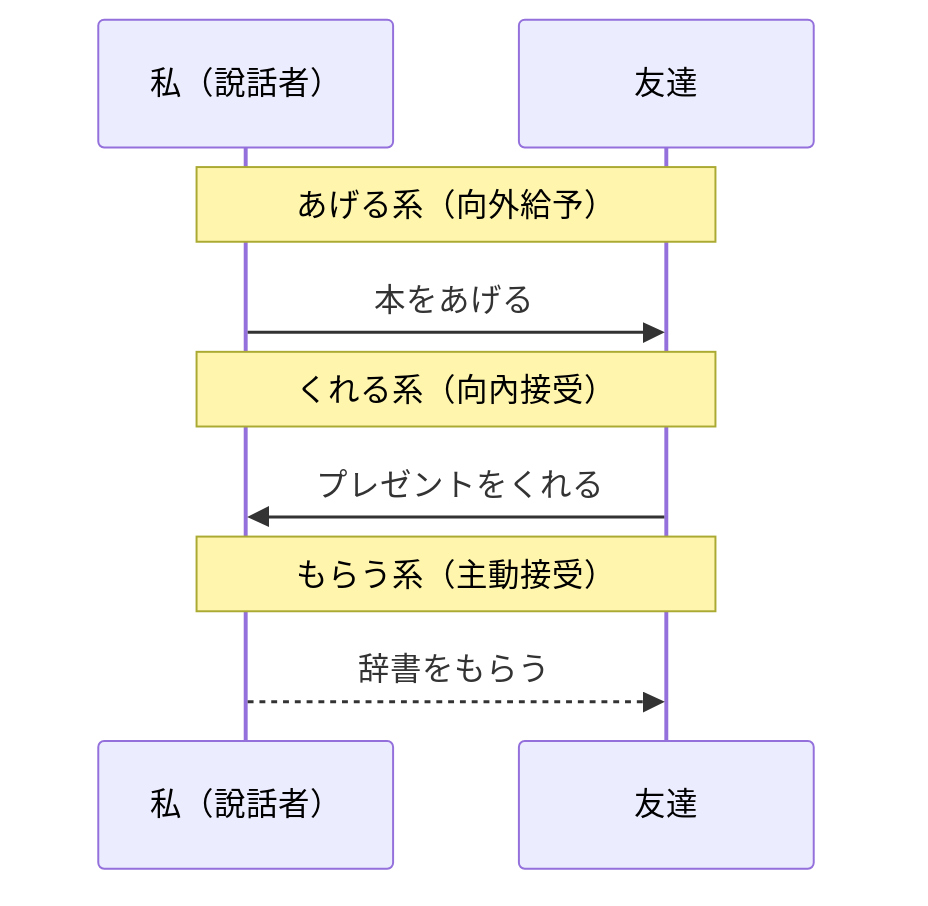

## 日文
授受表現（じゅじゅひょうげん）

**羅馬拼音**: juju-hyougen

**詞性**：文法系統・語用表現

## 日文解釋

授受表現は、物の授受や恩恵の授受を表す日本語の特徴的な文法システムです。「あげる」「くれる」「もらう」の三つの基本動詞[^basic-verbs]を中心に、視点[^viewpoint]と方向性[^directionality]を明確に示す必要があります。

### 三大基本動詞

**1. あげる（上げる）・やる**

話し手から他者へ、または話し手グループから外部への授受を表します。

**使い方**：
- AはBに～をあげる：Aが主体となって、Bに何かを与える
- 「やる」は目下の人や動植物に対して使う[^yaru-usage]
- 敬語形[^keigo]は「差し上げる」

**2. くれる（呉れる）**

他者から話し手へ、または外部から話し手グループへの授受を表します。

**使い方**：
- AはBに～をくれる：Aが主体となって、Bに何かを与える（Bは話し手側）
- 受け手の視点[^receiver-viewpoint]から恩恵を受ける表現
- 敬語形[^keigo]は「くださる」

**3. もらう（貰う）**

話し手が他者から、または話し手グループが外部から受け取ることを表します。

**使い方**：
- AはBに～をもらう：Aが主体となって、Bから何かを受け取る
- 受け取り手が主語になる[^receiver-subject]
- 敬語形[^keigo]は「いただく」

### 視点理論

授受表現の使い分けは、日本語の「内と外」[^uchi-soto]の概念と密接に関係しています。話し手の立場を中心に、恩恵の方向が内向き（くれる・もらう）か外向き（あげる・やる）かを判断します。

### て形複合表現

動詞のて形[^te-form]と組み合わせることで、行為の授受を表現できます：

- 〜てあげる：（私が）してあげる
- 〜てくれる：（相手が私に）してくれる
- 〜てもらう：（私が相手に）してもらう

## 英文解釋

Juju-hyougen (giving and receiving expressions) is a distinctive grammatical system in Japanese that expresses the giving and receiving of objects or favors. Centered around three basic verbs[^basic-verbs]: "ageru," "kureru," and "morau," this system requires clear indication of viewpoint[^viewpoint] and directionality[^directionality].

### Three Basic Verbs

**1. Ageru (to give) / Yaru (to give - casual/to inferiors)**

Expresses giving from the speaker to others, or from the speaker's group to outsiders.

**Usage**:
- A wa B ni ~ o ageru: A gives something to B
- "Yaru" is used for people of lower status, animals, or plants[^yaru-usage]
- Honorific form[^keigo]: "sashiageru"

**2. Kureru (to give - to speaker)**

Expresses giving from others to the speaker, or from outsiders to the speaker's group.

**Usage**:
- A wa B ni ~ o kureru: A gives something to B (where B is the speaker or speaker's side)
- Expresses favor from the receiver's viewpoint[^receiver-viewpoint]
- Honorific form[^keigo]: "kudasaru"

**3. Morau (to receive)**

Expresses the speaker receiving from others, or the speaker's group receiving from outsiders.

**Usage**:
- A wa B ni ~ o morau: A receives something from B
- The receiver becomes the subject[^receiver-subject]
- Honorific form[^keigo]: "itadaku"

### Viewpoint Theory

The proper use of juju-hyougen is closely related to the Japanese concept of "uchi-soto" (insider-outsider)[^uchi-soto]. Centered on the speaker's position, one must determine whether the direction of favor is inward (kureru/morau) or outward (ageru/yaru).

### Te-form Compound Expressions

When combined with the te-form[^te-form] of verbs, these expressions can indicate the giving and receiving of actions:

- ~te ageru: (I) do (something) for (someone)
- ~te kureru: (Someone) does (something) for (me)
- ~te morau: (I) have (someone) do (something) / (Someone) does (something) for (me)

## 中文解釋

授受表現是日語中表達物品或恩惠給予與接受的特殊文法系統。以「あげる」、「くれる」、「もらう」三個基本動詞[^basic-verbs]為核心，需要明確表示視點[^viewpoint]和方向性[^directionality]。

### 三大基本動詞

**1. あげる（給予）・やる（給予 - 對下位者）**

表示從說話者給予他人，或從說話者群體給予外部的行為。

**用法**：
- AはBに～をあげる：A給B某物
- 「やる」用於地位較低的人、動物或植物[^yaru-usage]
- 敬語形式[^keigo]是「差し上げる」

**2. くれる（給予 - 給說話者）**

表示從他人給予說話者，或從外部給予說話者群體的行為。

**用法**：
- AはBに～をくれる：A給B某物（B是說話者或說話者這一方）
- 從接受者的視點[^receiver-viewpoint]表達接受恩惠
- 敬語形式[^keigo]是「くださる」

**3. もらう（接受）**

表示說話者從他人接受，或說話者群體從外部接受的行為。

**用法**：
- AはBに～をもらう：A從B那裡接受某物
- 接受者成為主語[^receiver-subject]
- 敬語形式[^keigo]是「いただく」

### 視點理論

授受表現的使用與日語「內與外」[^uchi-soto]的概念密切相關。以說話者的立場為中心，判斷恩惠的方向是向內（くれる・もらう）還是向外（あげる・やる）。

### 授受表現方向圖

### て形複合表現

與動詞的て形[^te-form]結合，可以表達行為的授受：

- 〜てあげる：（我）為（某人）做某事
- 〜てくれる：（某人）為（我）做某事
- 〜てもらう：（我）請（某人）做某事 / （某人）為（我）做某事

## 例句

### 基本用法範例

1. 私は友達に本をあげました。
   I gave a book to my friend.
   我送了一本書給朋友。

2. 友達は私にプレゼントをくれました。
   My friend gave me a present.
   朋友送了我一個禮物。

3. 私は先生に推薦状をいただきました[^itadaku-keigo]。
   I received a letter of recommendation from my teacher.
   我從老師那裡收到了推薦信。

### 視點對比

4. 私は田中さんに辞書をあげた。
   I gave Tanaka-san a dictionary.
   我給了田中先生一本字典。
   （說話者→他人）

5. 田中さんは私に辞書をくれた。
   Tanaka-san gave me a dictionary.
   田中先生給了我一本字典。
   （他人→說話者）

### て形複合表現

6. 母が妹に本を読んでやりました[^te-yaru]。
   Mother read a book for my younger sister.
   媽媽為妹妹讀了一本書。

7. 先生が推薦状を書いてくださいました[^te-kudasaru]。
   The teacher wrote a letter of recommendation (for me).
   老師幫我寫了推薦信。

8. 友達に空港まで送ってもらいました[^te-morau]。
   I had my friend take me to the airport.
   我請朋友送我到機場。

### 敬語形式對比

9. 社長に報告書を差し上げました[^sashiageru]。
   I gave the report to the company president.
   我把報告書呈交給了社長。

10. 部長がアドバイスをくださいました[^kudasaru-usage]。
    The department manager gave me advice.
    部長給了我建議。

---

## 註解

[^basic-verbs]: **基本授受動詞** - あげる（給予・由內向外）、くれる（給予・由外向內）、もらう（接受・由外向內）是授受表現的三大核心動詞。詳見 [あげる](../verb-ru/011_ageru.md)、[くれる](../verb-ru/013_kureru.md)、[もらう](../verb-ru/012_morau.md)

[^viewpoint]: **視點** - 授受表現必須明確說話者的立場和視角。「くれる」和「もらう」都表示恩惠流向說話者或說話者群體，但主語不同。

[^directionality]: **方向性** - 恩惠的流動方向是授受表現的核心概念。「あげる」表示由內向外，「くれる」和「もらう」表示由外向內。

[^yaru-usage]: **やる的用法** - 「やる」是「あげる」的口語形式，用於對地位較低的人、兒童、動物或植物。在正式場合應避免使用。例：犬に餌をやる（給狗餵食）。詳見 [やる](../verb-u/018_yaru.md)

[^keigo]: **敬語形式** - 授受動詞有相應的敬語形式：あげる→差し上げる（謙讓語）、くれる→くださる（尊敬語）、もらう→いただく（謙讓語）。詳見 [敬語系統](005_keigo_system.md)

[^receiver-viewpoint]: **接受者視點** - 「くれる」的特殊之處在於，它從接受者（說話者或說話者群體）的角度表達恩惠的接受，表達感謝或感激之情。

[^receiver-subject]: **接受者為主語** - 「もらう」句型中，接受者（通常是說話者）成為主語，強調主動接受的行為。

[^uchi-soto]: **內與外（ウチとソト）** - 日本社會重要的人際關係概念，區分內部群體（家人、公司同事等）和外部群體。授受表現的使用必須考慮這個界線。

[^te-form]: **て形** - 動詞的連用形式，用於連接動詞或形成複合表達。在授受表現中，て形+授受動詞表示行為的授受。詳見 [て形](046_te-kei.md)

[^itadaku-keigo]: **いただく（敬語）** - 「もらう」的謙讓語形式，用於從地位較高的人那裡接受物品或恩惠時。

[^te-yaru]: **〜てやる** - 為地位較低的人、兒童或動物做某事。在正式場合應使用「〜てあげる」。

[^te-kudasaru]: **〜てくださる** - 「〜てくれる」的尊敬語形式，用於地位較高的人為說話者做某事。詳見 [〜てくれる](050_te-kureru.md)

[^te-morau]: **〜てもらう** - 表示請求或接受他人為自己做某事。強調接受恩惠的一方。詳見 [〜てもらう](051_te-morau.md)

[^sashiageru]: **差し上げる** - 「あげる」的謙讓語形式，用於向地位較高的人給予物品或恩惠。

[^kudasaru-usage]: **くださる的用法** - 「くれる」的尊敬語形式，用於地位較高的人給予說話者物品或恩惠時。動詞活用：ください（命令形）、くださいます（丁寧形）。

---

## 相關連結

### 基本授受動詞
- [あげる](../verb-ru/011_ageru.md) - 給予（由內向外）
- [くれる](../verb-ru/013_kureru.md) - 給予（由外向內）
- [もらう](../verb-ru/012_morau.md) - 接受
- [やる](../verb-u/018_yaru.md) - 給予（口語、對下位者）

### 複合表達
- [〜てあげる](050_te-ageru.md) - 為他人做某事（待建立）
- [〜てくれる](050_te-kureru.md) - 他人為我方做某事
- [〜てもらう](051_te-morau.md) - 請求或接受他人做某事

### 相關文法
- [て形](046_te-kei.md) - 動詞て形
- [敬語系統](005_keigo_system.md) - 日語敬語系統

### 語用概念
- [內與外](../concept/uchi-soto.md) - 日本社會的內外群體概念（待建立）
- [視點理論](../concept/viewpoint.md) - 日語的視點概念（待建立）
