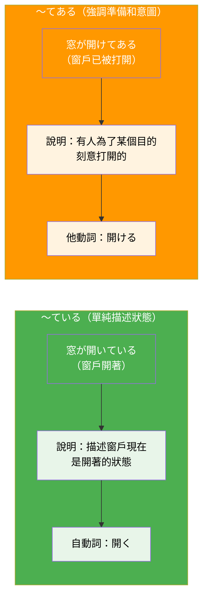

## 日文

〜てある

### 文法情報

| 項目 | 內容 |
|------|------|
| 文法類型 | 動詞變化句型 |
| JLPT | N4 |
| 使用場面 | 書面、正式、說明 |
| 形成 | 他動詞て形 + ある |

### 形成規則

**基本形式**
```
他動詞て形 + ある
```

**範例**
```
開ける → 開けてある（已經打開著）
置く → 置いてある（已經放置著）
書く → 書いてある（已經寫著）
貼る → 貼ってある（已經貼著）
閉める → 閉めてある（已經關著）
```

**重要限制**
- 只能使用**他動詞**（不能用自動詞）
- 表示有意識的動作完成後的結果狀態

## 日文解釋

「〜てある」は、他動詞のて形に助動詞「ある」を付けた表現で、**誰かが意図的に行った動作の結果が現在も残っている状態**を表します。

この文法には重要な特徴があります。第一に、必ず**他動詞**を使用します。自動詞は使えません。第二に、動作を行った人物（動作主）は言及されず、**結果状態そのもの**に焦点が当たります。第三に、その状態が**準備や配慮として意図的に作られた**というニュアンスがあります。

例えば、「窓が開けてある」と言うと、誰かが意図的に窓を開けて、その開いた状態が今も続いていることを表します。動作主が誰かは重要ではなく、「開いている状態が準備されている」という事実が重要です。

「〜ている」との違いは、「〜てある」は**準備・配慮・意図性**を強調する点にあります。「窓が開いている」は単に開いた状態を述べるだけですが、「窓が開けてある」は誰かが意図的に開けた結果であることを示唆します。

書面や説明文でよく使われ、現場の状態を客観的に描写する際に適しています。日常会話では「〜ている」の方が一般的です。

## 英文解釋

"〜てある" (te aru) is a grammatical pattern that expresses **the resulting state of a deliberate action that remains in effect**. It is formed by combining the te-form of a transitive verb with the auxiliary verb "aru" (to exist).

This construction has several key characteristics. First, it **only works with transitive verbs** - intransitive verbs cannot be used. Second, the focus is not on who performed the action (the agent), but rather on the **resulting state itself**. Third, it carries a nuance that the state was **intentionally created as a preparation or arrangement**.

For example, "窓が開けてある" (mado ga aketearる) means "the window has been opened (and remains open)." The emphasis is not on who opened it, but on the fact that someone deliberately opened it and it remains in that state as a result.

The key difference from "〜ている" is that "〜てある" emphasizes **intentionality and preparation**. While "窓が開いている" simply describes the state of being open, "窓が開けてある" implies someone intentionally opened it for a purpose.

This pattern is commonly used in written language and formal descriptions to objectively describe prepared states or arrangements.

## 中文解釋

「〜てある」是一個文法句型，表示**某個有意的動作完成後，其結果狀態持續存在**。由他動詞的て形加上助動詞「ある」構成。

這個文法有幾個重要特點：第一，**只能使用他動詞**，不能使用自動詞。第二，焦點不在於誰執行了動作（動作主），而在於**結果狀態本身**。第三，帶有**為了某種目的而刻意準備**的語感。

例如，「窓が開けてある」表示「窗戶已經被打開（並保持開著的狀態）」。重點不是誰打開的，而是有人刻意打開它，並且這個開著的狀態持續存在。

與「〜ている」的區別在於，「〜てある」強調**意圖性和準備性**。「窓が開いている」只是描述窗戶開著的狀態，而「窓が開けてある」則暗示有人為了某種目的刻意打開它。

這個句型常用於書面語和正式說明中，客觀描述已準備好的狀態。在日常對話中，「〜ている」更為常見。

## 圖解



**圖解說明**：
- **左側（綠色）**：「〜ている」用自動詞「開く」，只描述窗戶開著的狀態，不強調誰打開的或為什麼打開
- **右側（橘色）**：「〜てある」用他動詞「開ける」，強調有人刻意打開窗戶，並且這個狀態是為了某個目的而準備的

## 核心用法

### 用法 1：描述已完成的準備狀態

表示為了某個目的而事先準備好的狀態。

**例句 1**
```
テーブルの上に料理が並べてある。
Dishes are arranged on the table.
桌上已經擺好了菜餚。
```

**例句 2**
```
会議室の椅子が並べてあります。
The chairs in the meeting room have been arranged.
會議室的椅子已經排好了。
```

### 用法 2：說明物品的放置狀態

描述物品被放置在某處並持續存在的狀態。

**例句 3**
```
冷蔵庫にビールが冷やしてある。
Beer has been chilled in the refrigerator.
冰箱裡已經冰好了啤酒。
```

**例句 4**
```
玄関に靴が揃えてある。
Shoes have been lined up neatly at the entrance.
玄關的鞋子已經排整齊了。
```

### 用法 3：表達書寫或記錄的結果

描述資訊已經被寫下或記錄的狀態。

**例句 5**
```
黒板に明日の予定が書いてある。
Tomorrow's schedule is written on the blackboard.
黑板上已經寫好明天的預定。
```

## 文法規則

### 規則 1：只能使用他動詞

「〜てある」只能接在**他動詞**後面，不能使用自動詞。

**正確示範**
```
✅ 窓が開けてある（開ける是他動詞）
✅ ドアが閉めてある（閉める是他動詞）
✅ 電気が消してある（消す是他動詞）
```

**錯誤示範**
```
❌ 窓が開いてある（開く是自動詞）
❌ ドアが閉まってある（閉まる是自動詞）
❌ 電気が消えてある（消える是自動詞）
```

### 規則 2：助詞使用「が」或「は」

因為焦點在結果狀態而非動作主，受詞通常使用「が」或「は」標記，而非「を」。

```
テーブルの上に本が置いてある。
壁に絵が飾ってある。
```

### 規則 3：強調意圖性和準備性

「〜てある」暗示動作是有目的、有計劃的，不用於描述隨機或自然發生的狀態。

```
✅ 会議のために資料が準備してある（有意圖的準備）
❌ 道に石が落ちてある（自然發生，應用「落ちている」）
```

## 常見錯誤

### 錯誤 1：誤用自動詞

❌ 誤：窓が開いてある。
✅ 正：窓が開けてある。
說明：「開く」是自動詞，應該使用他動詞「開ける」。「〜てある」只能接他動詞。

### 錯誤 2：混淆「〜てある」和「〜ている」

❌ 誤：石が道に落ちてある。（不自然）
✅ 正：石が道に落ちている。
說明：石頭掉在路上是自然發生的，不是有意的動作結果，應使用「〜ている」。

### 錯誤 3：誤用助詞「を」

❌ 誤：本をテーブルに置いてある。
✅ 正：本がテーブルに置いてある。
說明：「〜てある」句型中，受詞通常用「が」或「は」標記，因為焦點在狀態而非動作。

## 學習要點

1. **只用他動詞**：「〜てある」只能接在他動詞後面，自動詞要使用「〜ている」
2. **焦點在結果**：不強調誰做的，而是強調結果狀態的存在
3. **意圖性準備**：帶有「為了某個目的而刻意準備」的語感
4. **助詞變化**：受詞通常用「が」或「は」，不用「を」
5. **使用場景**：常見於書面語、說明文，日常對話較少使用

## 相關連結

### 相關文法
- [〜ている](te_iru.md) - 動作進行或結果狀態（待建立）
- [〜ておく](te_oku.md) - 事先準備、保持狀態（待建立）
- [〜てある vs 〜ている](../comparison/te_aru_vs_te_iru.md) - 兩者的對比分析（待建立）

### 相關概念
- [他動詞與自動詞](../concept/transitive_intransitive.md) - 理解動詞的及物性（待建立）
- [助詞「が」的用法](particle_ga.md) - 理解為何用「が」（待建立）

### 延伸學習
- [〜てしまう](te_shimau.md) - 動作完了與遺憾（待建立）
- [〜てみる](te_miru.md) - 嘗試做某事（待建立）

---

**建立日期**: 2025-10-31
**最後更新**: 2025-10-31
**字數**: ~2800
**例句數**: 5
