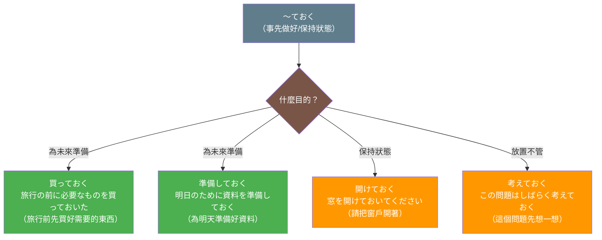

## 日文

〜ておく

### 文法情報

| 項目 | 內容 |
|------|------|
| 文法類型 | 動詞變化句型 |
| JLPT | N4 |
| 使用場面 | 日常會話、計劃說明 |
| 形成 | 動詞て形 + おく |

### 形成規則

**基本形式**
```
動詞て形 + おく
```

**範例**
```
買う → 買っておく（事先買好）
調べる → 調べておく（事先查好）
読む → 読んでおく（事先讀好）
準備する → 準備しておく（事先準備好）
連絡する → 連絡しておく（事先聯絡好）
```

**口語縮略形式**
```
〜ておく → 〜とく
買っておく → 買っとく
調べておく → 調べとく
読んでおく → 読んどく
```

## 日文解釋

「〜ておく」は、動詞のて形に補助動詞「おく」を付けた表現で、主に二つの意味を持ちます。

**第一の意味：事前準備**
最も一般的な用法で、**将来の目的や必要性のために、あらかじめ何かをしておく**という意味です。例えば、「明日のために資料を準備しておく」は、明日必要になるから今準備するという計画的な行動を表します。この用法では、話者の意図性と計画性が強調されます。

**第二の意味：状態の維持・放置**
**ある状態をそのまま保つ**、または**あえてそのままにしておく**という意味です。例えば、「窓を開けておく」は窓を開けた状態を維持する、「そのままにしておく」は何もせず放置するという意味になります。

この文法の重要な特徴は、**動作主（話者または主語）の意図的な行為**を表す点です。「〜てある」が結果状態に焦点を当てるのに対し、「〜ておく」は動作そのものと動作主の意図に焦点を当てます。

助詞の使い方も異なります。「〜ておく」では動作主が主語となり、目的語には「を」を使います（「私は本を買っておく」）。一方、「〜てある」では結果物が主語となり、「が」を使います（「本が買ってある」）。

日常会話では「〜とく」という縮約形がよく使われます。「買っとく」「やっとく」などは自然な口語表現です。

ビジネス場面では「〜ておきます」の丁寧形がよく使われ、計画や準備を伝える際に重要な表現となっています。

## 英文解釋

"〜ておく" (te oku) is a grammatical pattern formed by combining the te-form of a verb with the auxiliary verb "oku" (to put/place). It has two primary meanings.

**First meaning: Advance preparation**
This is the most common usage, expressing **doing something in advance for a future purpose or need**. For example, "資料を準備しておく" (shiryō wo junbi shite oku) means "prepare the materials in advance." This usage emphasizes the speaker's intentionality and planning.

**Second meaning: Maintaining or leaving a state**
This expresses **keeping something in a certain state** or **deliberately leaving something as is**. For example, "窓を開けておく" (mado wo akete oku) means "keep the window open," while "そのままにしておく" (sono mama ni shite oku) means "leave it as it is."

A key characteristic of this pattern is that it represents **the intentional action of the agent (speaker or subject)**. Unlike "〜てある" which focuses on the resulting state, "〜ておく" focuses on the action itself and the agent's intention.

The particle usage also differs. With "〜ておく," the agent is the subject and the object takes "を" (e.g., "私は本を買っておく" - I will buy the book in advance). With "〜てある," the result is the subject and takes "が" (e.g., "本が買ってある" - the book has been bought).

In casual conversation, the contracted form "〜とく" is commonly used. Forms like "買っとく" (kattoku) and "やっとく" (yattoku) are natural colloquial expressions.

In business contexts, the polite form "〜ておきます" is frequently used to communicate plans and preparations.

## 中文解釋

「〜ておく」是由動詞的て形加上補助動詞「おく」構成的文法句型，主要有兩個意思。

**第一個意思：事先準備**
這是最常見的用法，表示**為了將來的目的或需要，事先做好某事**。例如，「資料を準備しておく」表示「事先準備好資料」。這個用法強調說話者的意圖性和計劃性。

**第二個意思：保持或放置狀態**
表示**讓某個狀態保持不變**，或**刻意讓某事物維持原狀**。例如，「窓を開けておく」表示「讓窗戶開著」，「そのままにしておく」表示「就這樣放著不管」。

這個文法的重要特徵是表示**動作主（說話者或主語）的有意行為**。與「〜てある」聚焦於結果狀態不同，「〜ておく」聚焦於動作本身和動作主的意圖。

助詞的用法也有差異。「〜ておく」中，動作主是主語，受詞使用「を」（例：「私は本を買っておく」）。「〜てある」中，結果物是主語，使用「が」（例：「本が買ってある」）。

在日常對話中，常使用縮略形式「〜とく」。「買っとく」「やっとく」等都是自然的口語表達。

在商務場合，禮貌形式「〜ておきます」常用於傳達計劃和準備事項，是重要的表達方式。

## 圖解



## 核心用法

### 用法 1：為未來事件做準備

表示為了即將到來的事件或需求，事先採取行動。

**例句 1**
```
明日のプレゼンのために資料を準備しておきます。
I will prepare the materials in advance for tomorrow's presentation.
我會為明天的簡報事先準備好資料。
```

**例句 2**
```
旅行の前に必要なものを買っておいた。
I bought the necessary things in advance before the trip.
旅行前我事先買好了需要的東西。
```

### 用法 2：保持某個狀態

表示讓某個狀態繼續維持。

**例句 3**
```
暑いから、窓を開けておいてください。
Please keep the window open because it's hot.
因為很熱，請把窗戶開著。
```

**例句 4**
```
電気を付けておいたほうがいいですよ。
You should leave the light on.
你最好把燈開著。
```

### 用法 3：刻意放置或不處理

表示有意地讓某事物保持原樣，不去改變或處理。

**例句 5**
```
この問題はしばらく考えておきます。
I'll think about this problem for a while.
這個問題我會先想一想。
```

## 文法規則

### 規則 1：動作主的意圖性

「〜ておく」表示動作主有意圖地執行動作，強調主動性和計劃性。

**正確示範**
```
✅ 会議の前にメールを送っておく（主動準備）
✅ 部屋を片付けておく（有意圖的整理）
✅ 予約しておく（計劃性的預約）
```

**不適用情況**
```
❌ 雨が降っておく（自然現象，無法用〜ておく）
❌ 花が咲いておく（自然發生，無法用〜ておく）
```

### 規則 2：助詞使用「を」

因為動作主是主語，目的物使用助詞「を」標記。

```
私は本を買っておく。（我事先買好書）
彼は部屋を掃除しておいた。（他事先打掃好房間）
```

**對比〜てある**
```
〜ておく：私は本を買っておく（動作主 + を）
〜てある：本が買ってある（結果物 + が）
```

### 規則 3：口語縮略形式

日常對話中常使用「〜とく」的縮略形式。

**標準形 → 縮略形**
```
買っておく → 買っとく
やっておく → やっとく
言っておく → 言っとく
見ておく → 見とく
しておく → しとく
```

**使用例**
```
明日までにやっとくね。（我會在明天前做好喔）
先に食べとこう。（我們先吃吧）
```

## 常見錯誤

### 錯誤 1：混淆「〜ておく」和「〜てある」

❌ 誤：窓が開けておく。
✅ 正：窓を開けておく。（我把窗戶開著）
✅ 或：窓が開けてある。（窗戶已經開著）
說明：「〜ておく」的主語是動作主，目的物用「を」。如果要表達結果狀態，應該用「〜てある」。

### 錯誤 2：用於自然現象或無意圖的動作

❌ 誤：雨が降っておく。
✅ 正：雨が降っている。
說明：「〜ておく」表示有意圖的動作，自然現象應使用「〜ている」。

### 錯誤 3：誤用縮略形式的發音

❌ 誤：読んでおく → 読んでとく（不正確）
✅ 正：読んでおく → 読んどく
說明：「で」和「おく」結合時，「で」不消失，變成「どく」而非「でとく」。

### 錯誤 4：混淆「〜ておく」和「〜ている」的時間焦點

❌ 誤：昨日、窓を開けておきます。（時態不一致）
✅ 正：明日のために窓を開けておきます。（未來準備）
✅ 或：昨日、窓を開けておきました。（過去準備）
說明：「〜ておく」通常表示為未來做準備，時態要一致。

## 學習要點

1. **兩個核心意思**：事先準備（最常用）和保持狀態（次常用）
2. **強調意圖性**：表示動作主有意識、有計劃的行為
3. **助詞用「を」**：動作主是主語，目的物用「を」標記
4. **縮略形「〜とく」**：日常對話中自然使用縮略形式
5. **對比〜てある**：〜ておく聚焦動作和意圖，〜てある聚焦結果狀態

## 相關連結

### 相關文法
- [〜てある](te_aru.md) - 結果狀態的持續（待建立）
- [〜ている](te_iru.md) - 動作進行或結果狀態（待建立）
- [〜ておく vs 〜てある](../comparison/te_oku_vs_te_aru.md) - 兩者的對比分析（待建立）

### 相關概念
- [意圖性表達](../concept/intentionality.md) - 理解日文中的意圖表達（待建立）
- [て形](te_form.md) - 動詞て形的基礎（待建立）

### 延伸學習
- [〜てしまう](te_shimau.md) - 動作完了與遺憾（待建立）
- [〜てみる](te_miru.md) - 嘗試做某事（待建立）
- [〜てください](te_kudasai.md) - 禮貌的請求（待建立）

---

**建立日期**: 2025-10-31
**最後更新**: 2025-10-31
**字數**: ~3200
**例句數**: 5
