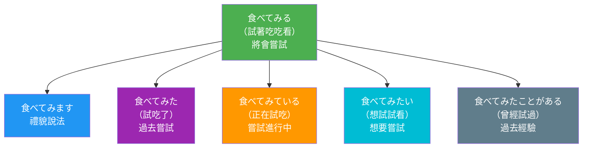

## 日文

〜てみる

### 文法情報

| 項目 | 內容 |
|------|------|
| 文法類型 | 補助動詞 |
| JLPT | N4 |
| 使用場面 | 日常會話、書面語 |
| 形成 | 動詞て形 + みる |

### 形成規則

**基本形式**
```
動詞て形 + みる
```

**活用變化**
```
食べてみる      (辞書形)
食べてみます    (ます形)
食べてみた      (た形)
食べてみて      (て形)
食べてみたい    (たい形 - 想要嘗試)
```

**範例**
```
読む → 読んでみる
書く → 書いてみる
する → してみる
来る → 来てみる
```

## 日文解釋

「〜てみる」は、動詞の後に付いて、「試しに何かをする」「実際に経験してみる」という意味を表す補助動詞である。本動詞「見る」の「確認する」という意味が転じて、動作を試験的に行うことを表現する。

この文法形式の核心は「経験・体験」の意味である。まだ経験したことがない動作や、結果が不確かな動作を試しに行ってみることを表す。「この料理を食べてみます」と言う場合、その料理をまだ食べたことがなく、味を確かめるために試しに食べることを意味する。

「〜てみる」は、話し手の積極的な意志や好奇心を含む表現である。単に動作を行うのではなく、「どうなるか試してみよう」という前向きな姿勢を示す。そのため、新しいことに挑戦する場面や、実験的に何かを試す場面で頻繁に使われる。

また、「〜てみたい」の形で「試してみたい」という希望を表すことができ、これは日常会話で非常によく使われる表現である。「日本に行ってみたい」「この本を読んでみたい」のように、未経験のことへの興味や願望を表す。

丁寧な依頼や提案をする際にも「〜てみてください」「〜てみませんか」という形で使われ、相手に試してみることを勧める柔らかい表現となる。命令形よりも丁寧で、相手の自主性を尊重するニュアンスがある。

## 英文解釋

"〜てみる" (te-miru) is an auxiliary verb that attaches to the te-form of verbs, expressing the meaning of "to try doing something" or "to do something and see what happens." It originates from the verb "見る" (miru, to see/to check), which has evolved to mean testing or experiencing an action.

The core concept of this grammatical pattern is experiential or trial action. It indicates that the speaker will perform an action to see what the result or outcome will be, often implying that this is a first-time experience or an action with uncertain results. For example, "食べてみる" means "to try eating (something)" with the nuance of experiencing its taste or quality.

This form carries a sense of the speaker's active willingness and curiosity. Rather than simply performing an action, it conveys an attitude of "let's try and see what happens." This makes it particularly suitable for situations involving new challenges, experiments, or exploratory actions.

The form "〜てみたい" (te-mitai), meaning "want to try," is extremely common in everyday conversation and effectively expresses interest or desire to experience something new. Phrases like "日本に行ってみたい" (I want to try going to Japan) naturally convey curiosity and aspiration.

When making polite requests or suggestions, forms like "〜てみてください" (please try doing...) and "〜てみませんか" (why don't you try...?) are used. These expressions are softer than direct commands and show respect for the listener's autonomy.

## 中文解釋

「〜てみる」是一個補助動詞，接在動詞て形後面，表達「試著做某事」或「做做看」的意思。它源自本動詞「見る」(看、確認)，引申為試驗性地進行某個動作或體驗某事。

這個文法形式的核心概念是「嘗試・體驗」。它表示說話者將執行某個動作來看看會有什麼結果，通常暗示這是首次經驗或結果不確定的動作。例如「食べてみる」意思是「試著吃吃看」，帶有體驗味道或品質的語感。

「〜てみる」包含說話者的積極意願和好奇心。它不僅僅是執行動作，而是傳達「試試看會怎樣」的前瞻態度。因此特別適合用於接受新挑戰、進行實驗或探索性行動的場合。

「〜てみたい」的形式表示「想要嘗試」，這在日常會話中非常常用，有效表達對新事物的興趣或願望。像「日本に行ってみたい」(想去日本看看)這樣的句子自然地傳達好奇心和期待。

在提出禮貌請求或建議時，會使用「〜てみてください」(請試試看)、「〜てみませんか」(要不要試試看)等形式。這些表達比直接命令更柔和，展現對對方自主性的尊重。

## 圖解

### 時制階梯圖



**圖表說明**：
- **綠色**：基本形式（將會嘗試）
- **藍色**：禮貌形式（正式場合）
- **紫色**：過去形式（已完成的嘗試）
- **橘色**：進行形式（持續進行的嘗試）
- **青色**：希望形式（想要嘗試）
- **灰色**：經驗形式（過去的經驗）

## 核心用法

### 用法 1：嘗試新事物（初次體驗）

表示試著做以前沒做過的事情，帶有體驗和探索的意味。

**例句 1**
```
初めて納豆を食べてみました。
I tried eating natto for the first time.
我第一次嘗試吃納豆。
```

**例句 2**
```
日本語で手紙を書いてみたいです。
I want to try writing a letter in Japanese.
我想試著用日文寫信。
```

### 用法 2：試驗性行動（不確定結果）

表示試著做某事來確認結果或效果如何。

**例句 3**
```
このアプリを使ってみたら、とても便利でした。
When I tried using this app, it was very convenient.
我試用了這個應用程式，非常方便。
```

**例句 4**
```
明日もう一度電話してみます。
I'll try calling again tomorrow.
我明天會再試著打電話看看。
```

### 用法 3：禮貌建議・邀請

用於建議對方嘗試某事，語氣柔和且尊重對方意願。

**例句 5**
```
この料理、美味しいですよ。食べてみてください。
This dish is delicious. Please try it.
這道菜很好吃喔，請試試看。
```

## 文法規則

### 規則 1：て形的接續

「みる」必須接在動詞的て形後面，不能直接接辞書形。

**正確接續**
```
食べる → 食べて + みる → 食べてみる
行く → 行って + みる → 行ってみる
する → して + みる → してみる
来る → 来て + みる → 来てみる
```

### 規則 2：意志動詞的限制

「〜てみる」通常與意志動詞搭配使用，表示主動的嘗試行為。

**適合的動詞**
```
✅ 食べてみる、読んでみる、書いてみる
✅ 行ってみる、聞いてみる、調べてみる
```

**較不自然的組合**
```
❌ 雨が降ってみる (雨不是意志動作)
❌ 病気になってみる (成為生病不是主動選擇)
```

### 規則 3：時制的變化

「みる」本身可以活用，與不同時制結合表達不同意義。

**時制變化**
```
〜てみる        (非過去) - 將會試試看
〜てみた        (過去) - 試過了、嘗試了
〜てみている    (進行) - 正在試著做
〜てみたい      (希望) - 想要嘗試
〜てみたことがある (經驗) - 曾經試過
```

### 規則 4：禮貌表達的形式

根據對象和場合選擇適當的禮貌程度。

**禮貌程度階梯**
```
〜てみろ          (命令・粗魯)
〜てみて          (普通)
〜てみてください   (禮貌請求)
〜てみませんか     (邀請・建議)
〜てみてはいかがですか (正式建議)
```

## 常見錯誤

### 錯誤 1：直接接辞書形

❌ 誤：食べるみる。
✅ 正：食べてみる。
說明：「みる」必須接在て形後面，不能接辞書形。正確的形成順序是：食べる → 食べて → 食べてみる。

### 錯誤 2：與非意志動詞搭配

❌ 不自然：雨が降ってみる。
✅ 自然：傘を持っていってみる。
說明：「〜てみる」表示主動的嘗試，應該與意志動詞搭配。非意志性的自然現象或狀態變化不適合使用這個形式。

### 錯誤 3：混淆「みる」和「いる」

❌ 誤：食べている (想說「試著吃」時)
✅ 正：食べてみる
說明：「〜ている」表示進行或狀態，「〜てみる」表示嘗試。兩者意義完全不同，不可混淆。「食べている」是「正在吃」，「食べてみる」是「試著吃吃看」。

## 學習要點

1. **嘗試的核心意義**：「〜てみる」的本質是「試驗性地做某事來確認結果」，強調體驗和探索的過程。

2. **積極的態度**：這個表達包含說話者的主動意願和好奇心，是帶有正面態度的嘗試，而非被迫或消極的行動。

3. **意志動詞限制**：通常只與意志動詞搭配，因為嘗試本身就是一種主動選擇的行為。

4. **常用組合「〜てみたい」**：「想要嘗試」是日常會話中極其常見的表達，掌握這個形式對自然交流至關重要。

5. **柔和的建議形式**：「〜てみてください」、「〜てみませんか」是比直接命令更禮貌、更尊重對方的表達方式，在日本社會的溝通中非常重要。

## 相關連結

### 相關文法
- [te_form](te_form.md) - て形的基本用法和形成規則（待建立）
- [te_shimau](te_shimau.md) - 〜てしまう（完了・遺憾）（待建立）
- [te_oku](te_oku.md) - 〜ておく（事前準備）（待建立）
- [te_iru](te_iru.md) - 〜ている（進行・状態）（待建立）

### 補助動詞比較
- [te_auxiliary_verbs](../comparison/te_auxiliary_verbs.md) - て形補助動詞的比較（みる vs しまう vs おく vs いる）（待建立）
- [auxiliary_verbs](auxiliary_verbs.md) - 補助動詞系統概論（待建立）

### 相關概念
- [volition](../concept/volition.md) - 意志性與動詞分類（待建立）
- [experiential_aspect](../concept/experiential_aspect.md) - 經驗體（嘗試・體驗）（待建立）
- [polite_expression](../concept/polite_expression.md) - 禮貌表達系統（待建立）

### 相關動詞
- [miru](../verb-ru/miru.md) - 見る（本動詞）（待建立）
- [tamasu](../verb-u/tamasu.md) - 試す（嘗試）（待建立）

---

**建立日期**: 2025-10-31
**最後更新**: 2025-10-31
**字數**: ~2,600
**例句數**: 5
