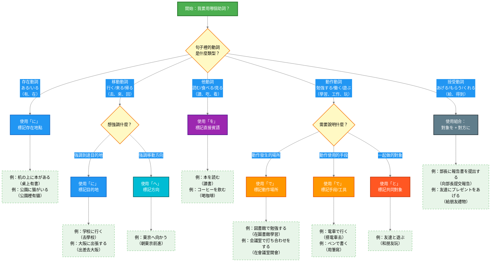

## 日文

格助詞（かくじょし）

**羅馬拼音**: kaku joshi

## 日文解釋

格助詞とは、名詞や代名詞の後ろに付いて、その語が文中でどのような文法的役割を果たすかを示す機能語である[^particle-concept]。日本語は膠着語[^agglutinative]であり、名詞自体が格変化しないため、助詞という独立した形態素を用いて格関係を明示する。これは印欧語族[^indo-european]の格変化とは異なる文法的戦略である。

主要な格助詞には「が」「を」「に」「で」「へ」「と」「から」「まで」「の」「より」などがあり、それぞれが主格[^nominative]、対格[^accusative]、与格[^dative]、具格[^instrumental]、方向格[^allative]などの文法機能を担う。これらの助詞は語順の自由度[^word-order]を高める役割も果たし、話題化[^topicalization]や焦点化[^focus]などの情報構造[^information-structure]にも関わる。

格助詞の体系を理解することは、日本語の統語構造[^syntax]を把握する上で不可欠であり、特に学習者にとっては、動詞との共起関係[^collocation]や、状況に応じた適切な助詞選択が重要な学習課題となる。

## 英文解釋

Case particles (kaku joshi) are functional words that attach to nouns or pronouns to indicate their grammatical role within a sentence. Japanese, as an agglutinative language[^agglutinative], does not inflect nouns for case; instead, it uses independent morphemes called particles to mark case relationships. This grammatical strategy differs from the case inflection found in Indo-European languages[^indo-european].

The major case particles include "ga," "wo," "ni," "de," "e," "to," "kara," "made," "no," and "yori," which respectively mark grammatical functions such as nominative[^nominative], accusative[^accusative], dative[^dative], instrumental[^instrumental], and allative[^allative] cases. These particles also contribute to word order flexibility[^word-order] and are involved in information structure[^information-structure] operations such as topicalization[^topicalization] and focusing[^focus].

Understanding the case particle system is essential for grasping Japanese syntactic structure[^syntax]. For learners, mastering verb-particle collocations[^collocation] and selecting appropriate particles according to context represents a crucial learning objective.

## 中文解釋

格助詞是附加在名詞或代名詞後方，用以標示該詞在句中文法角色的功能詞。日文屬於黏著語[^agglutinative]，名詞本身不會發生格變化，因此使用獨立的形態素（助詞）來明確標記格關係。這種文法策略與印歐語系[^indo-european]的格變化不同。

主要的格助詞包括「が」「を」「に」「で」「へ」「と」「から」「まで」「の」「より」等，分別標記主格[^nominative]、賓格[^accusative]、與格[^dative]、工具格[^instrumental]、方向格[^allative]等文法功能。這些助詞也提升了語序的靈活度[^word-order]，並參與話題化[^topicalization]、焦點化[^focus]等訊息結構[^information-structure]的運作。

理解格助詞體系對於掌握日文句法結構[^syntax]至關重要。對學習者而言，精熟動詞與助詞的搭配關係[^collocation]，以及根據情境選擇適當的助詞，是重要的學習目標。

---

## 格助詞系統架構

### 核心格助詞（8個）

| 格助詞 | 格的名稱 | 主要功能 | 基本例句 |
|-------|---------|---------|---------|
| **が** | 主格 (Nominative) | 標記主語、動作主體 | 鳥**が**飛ぶ |
| **を** | 對格 (Accusative) | 標記直接賓語、路徑 | 本**を**読む |
| **に** | 與格/方位格 (Dative/Locative) | 標記目的地、時間點、接受者 | 学校**に**行く |
| **で** | 具格/處格 (Instrumental/Locative) | 標記手段、動作場所 | ペン**で**書く |
| **へ** | 方向格 (Allative) | 標記移動方向 | 東京**へ**向かう |
| **と** | 共格/引用格 (Comitative/Quotative) | 標記共同對象、引用 | 友達**と**遊ぶ |
| **から** | 起點格 (Ablative) | 標記時空起點、來源 | 駅**から**来る |
| **まで** | 終點格 (Terminative) | 標記時空終點 | 5時**まで**働く |

### 其他重要格助詞

| 格助詞 | 格的名稱 | 主要功能 | 基本例句 |
|-------|---------|---------|---------|
| **の** | 屬格 (Genitive) | 標記所有、修飾關係 | 私**の**本 |
| **より** | 比較格 (Comparative) | 標記比較基準 | これ**より**大きい |
| **や** | 例示格 | 標記不完全列舉 | 本**や**雑誌 |

---

## 格助詞選擇流程圖

以下流程圖幫助你根據動詞類型和使用情境選擇正確的格助詞：



### 圖表顏色說明

| 顏色 | 代表含義 |
|------|---------|
| 🟢 綠色 | 起始點 |
| 🟡 黃色 | 判斷節點（需要思考的問題） |
| 🔵 藍色 | 「に」助詞（目的地/存在地點） |
| 🟦 淺藍 | 「へ」助詞（移動方向） |
| 🟣 紫色 | 「を」助詞（直接賓語） |
| 🟠 橘色 | 「で」助詞（場所/手段） |
| 🔴 紅色 | 「と」助詞（共同對象） |
| ⚫ 灰色 | 組合用法（多個助詞） |
| 🟩 淺綠虛線框 | 具體例句 |

### 使用方法

1. **從起始點開始**：確認你要描述的動作或狀態
2. **判斷動詞類型**：這是什麼類型的動詞？
3. **回答具體問題**：根據情境回答圖表中的問題
4. **找到對應助詞**：順著路徑找到應該使用的助詞
5. **參考例句**：每個助詞都有具體例句可以參考

### 快速判斷口訣

- **有、在** → 用「に」（存在地點）
- **去、來、回** → 用「に」或「へ」（目的地/方向）
- **讀、吃、看** → 用「を」（直接賓語）
- **在哪做事** → 用「で」（動作場所）
- **用什麼做** → 用「で」（手段工具）
- **跟誰一起** → 用「と」（共同對象）

---

## 核心用法

### 用法 1：主格助詞「が」- 標記主語與述語主體

「が」標記動作或狀態的主體，是句子的文法主語。

**例句 1**
```
猫が窓の外を見ている。
The cat is looking outside the window.
貓正在看窗外。
```

**例句 2**
```
誰が来ましたか。
Who came?
誰來了？
```

### 用法 2：對格助詞「を」- 標記直接賓語

「を」標記他動詞的直接賓語，表示動作的對象。

**例句 3**
```
毎朝コーヒーを飲みます。
I drink coffee every morning.
我每天早上喝咖啡。
```

**例句 4**
```
この道を真っすぐ行ってください。
Please go straight down this road.
請沿著這條路直走。
```

### 用法 3：與格助詞「に」- 標記目的地與接受者

「に」標記移動的目的地、時間點，以及授受動詞的接受者。

**例句 5**
```
明日、大阪に出張します。
I will go on a business trip to Osaka tomorrow.
明天我要出差去大阪。
```

**例句 6**
```
部長に報告書を提出しました。
I submitted the report to the department head.
我向部長提交了報告。
```

### 用法 4：具格助詞「で」- 標記手段與場所

「で」標記動作的手段、工具，以及動作發生的場所。

**例句 7**
```
電車で会社に通っています。
I commute to work by train.
我搭電車通勤上班。
```

**例句 8**
```
会議室で打ち合わせをします。
We will have a meeting in the conference room.
我們將在會議室開會。
```

---

## 文法規則

### 規則 1：格助詞的選擇由動詞決定

不同類型的動詞要求不同的格助詞搭配，這稱為動詞的格框架[^case-frame]。

**自動詞的格框架**：
- 存在動詞（ある/いる）：場所**に** + ある/いる
- 移動動詞（行く/来る/帰る）：場所**に/へ** + 動詞

**他動詞的格框架**：
- 一般他動詞：対象**を** + 動詞
- 授受動詞（あげる/もらう）：対象**を** + 相手**に** + 動詞

### 規則 2：格助詞與主題助詞「は」的互動

主題助詞「は」可以取代某些格助詞，但有限制：

**可以取代**：
- が → は（私**が** → 私**は**）
- を → は（本**を** → 本**は**）

**通常保留並組合**：
- に → には（学校**に** → 学校**には**）
- で → では（図書館**で** → 図書館**では**）
- から → からは（朝**から** → 朝**からは**）

### 規則 3：格助詞的省略規則

口語中某些格助詞可以省略，但書面語通常保留：

**常見省略**：
- を：ご飯（を）食べる
- に：学校（に）行く

**不可省略**：
- が：主語不明確時
- で：手段或場所不可省略
- と：共同對象必須明示

---

## 格助詞對比辨析

### 對比 1：「に」vs「で」- 場所標記

| 助詞 | 使用情境 | 動詞類型 | 例句 |
|-----|---------|---------|------|
| **に** | 存在地點 | 存在動詞（ある/いる） | 机の上**に**本がある |
| **に** | 移動目的地 | 移動動詞（行く/来る/帰る） | 学校**に**行く |
| **で** | 動作場所 | 一般動作動詞 | 図書館**で**勉強する |

**判斷原則**：
- 如果是「存在」或「到達」→ 使用「に」
- 如果是「在某處進行動作」→ 使用「で」

### 對比 2：「に」vs「へ」- 移動方向

| 助詞 | 語意焦點 | 例句 | 語感差異 |
|-----|---------|------|---------|
| **に** | 目的地、到達點 | 東京**に**行く | 強調抵達東京 |
| **へ** | 方向、朝向 | 東京**へ**行く | 強調朝東京方向移動 |

**使用建議**：
- 日常會話：「に」和「へ」可以互換
- 精確表達：用「に」表達到達，用「へ」表達方向

### 對比 3：「を」vs「が」- 他動詞與自動詞

| 助詞 | 動詞類型 | 例句 |
|-----|---------|------|
| **を** | 他動詞 | ドア**を**開ける（打開門） |
| **が** | 自動詞 | ドア**が**開く（門開了） |

**對應關係**：
- 他動詞配「を」標記賓語
- 自動詞配「が」標記主語

---

## 常見錯誤

### 錯誤 1：「に」和「で」混淆

❌ 誤：図書館**に**勉強します
✅ 正：図書館**で**勉強します

**說明**：「勉強する」是動作動詞，需要用「で」標記動作場所，不能用「に」。

---

❌ 誤：机の上**で**本があります
✅ 正：机の上**に**本があります

**說明**：「ある」是存在動詞，需要用「に」標記存在地點，不能用「で」。

### 錯誤 2：「を」和「が」混淆

❌ 誤：私**を**日本語**が**勉強します
✅ 正：私**は**日本語**を**勉強します

**說明**：「勉強する」是他動詞，「日本語」是賓語，應該用「を」標記。主語「私」通常用「は」標記為主題。

---

❌ 誤：映画**が**見ます
✅ 正：映画**を**見ます

**說明**：「見る」是他動詞，「映画」是直接賓語，必須用「を」標記。

### 錯誤 3：省略不當或過度使用

❌ 誤：友達遊びます（口語可接受，但不正式）
✅ 正：友達**と**遊びます

**說明**：「と」標記共同對象，在正式場合不應省略。

---

❌ 誤：ここ**を**います（錯誤的助詞選擇）
✅ 正：ここ**に**います

**說明**：「いる」是存在動詞，必須使用「に」標記地點，不能使用「を」。

---

## 學習要點

1. **格助詞由動詞決定**：記憶動詞的格框架[^case-frame]，理解哪些動詞需要哪些格助詞搭配。

2. **區分「に」和「で」的場所用法**：「に」用於存在和到達，「で」用於動作場所。

3. **掌握「を」和「が」的對應關係**：他動詞用「を」標記賓語，自動詞用「が」標記主語。

4. **理解「は」與格助詞的互動**：「は」可以取代「が」和「を」，但通常與「に」「で」「から」組合使用。

5. **注意語境與語體**：口語可以省略某些助詞，但書面語和正式場合應完整使用。

---

## 相關連結

### 個別格助詞詳解
- [002_ga.md](../particle/002_ga.md) - 主格助詞「が」（待建立）
- [011_wo.md](../particle/011_wo.md) - 對格助詞「を」（待建立）
- [004_ni.md](../particle/004_ni.md) - 與格助詞「に」（待建立）
- [005_de.md](../particle/005_de.md) - 具格助詞「で」（待建立）
- [006_e.md](../particle/006_e.md) - 方向格助詞「へ」（待建立）
- [010_to.md](../particle/010_to.md) - 共格助詞「と」（待建立）

### 相關文法概念
- [067_transitive-intransitive.md](067_transitive-intransitive.md) - 自動詞與他動詞（待建立）
- [064_jita_taiou.md](064_jita_taiou.md) - 自他對應（待建立）
- [033_topic_comment_structure.md](033_topic_comment_structure.md) - 主題評述結構
- [011_shugo.md](../concept/011_shugo.md) - 主語概念

### 延伸說明
- [case-frame.md](../concept/case-frame.md) - 格框架理論（待建立）
- [agglutinative-language.md](../concept/agglutinative-language.md) - 黏著語概念（待建立）
- [particle-omission.md](../extension/particle-omission.md) - 助詞省略規則（待建立）

---

## 註解

[^particle-concept]: **助詞（じょし）** - 日文中附加在實詞後方的功能詞，包括格助詞、副助詞、接續助詞、終助詞等類別。詳見 [particle-system.md](../concept/particle-system.md)（待建立）

[^agglutinative]: **膠著語（こうちゃくご）** - 語言類型學中的一種，通過添加詞綴（黏著成分）來表達文法功能，如日語、韓語、土耳其語。詳見 [agglutinative-language.md](../concept/agglutinative-language.md)（待建立）

[^indo-european]: **印歐語族（いんおうごぞく）** - 包括英語、德語、法語、拉丁語等的語言家族，多數具有名詞格變化系統。詳見 [indo-european-languages.md](../concept/indo-european-languages.md)（待建立）

[^nominative]: **主格（しゅかく）** - 標記句子主語的格，在日文中主要由助詞「が」標記。詳見 [nominative-case.md](../concept/nominative-case.md)（待建立）

[^accusative]: **對格/賓格（たいかく/ひんかく）** - 標記直接賓語的格，在日文中由助詞「を」標記。詳見 [accusative-case.md](../concept/accusative-case.md)（待建立）

[^dative]: **與格（よかく）** - 標記間接賓語或接受者的格，在日文中由助詞「に」標記。詳見 [dative-case.md](../concept/dative-case.md)（待建立）

[^instrumental]: **具格/工具格（ぐかく）** - 標記動作手段或工具的格，在日文中由助詞「で」標記。詳見 [instrumental-case.md](../concept/instrumental-case.md)（待建立）

[^allative]: **方向格/向格（ほうこうかく）** - 標記移動方向的格，在日文中由助詞「へ」標記。詳見 [allative-case.md](../concept/allative-case.md)（待建立）

[^word-order]: **語順（ごじゅん）** - 詞語在句子中的排列順序。日文是 SOV 語序（主語-賓語-動詞），但因格助詞明確標記，語順相對靈活。詳見 [word-order.md](../concept/word-order.md)（待建立）

[^topicalization]: **話題化（わだいか）** - 將某個成分提升為句子主題的語法操作，在日文中通常使用「は」標記。詳見 [topicalization.md](../concept/topicalization.md)（待建立）

[^focus]: **焦點化（しょうてんか）** - 強調句子中某個特定成分的語法操作，在日文中常用格助詞或語序變化實現。詳見 [focus.md](../concept/focus.md)（待建立）

[^information-structure]: **情報構造/訊息結構（じょうほうこうぞう）** - 句子中已知訊息與新訊息的組織方式，影響助詞選擇和語序。詳見 [information-structure.md](../concept/information-structure.md)（待建立）

[^syntax]: **統語論/句法（とうごろん）** - 研究詞語組合成句子的規則和結構的語言學分支。詳見 [syntax.md](../concept/syntax.md)（待建立）

[^collocation]: **共起關係/搭配（きょうきかんけい）** - 特定詞語習慣性地一起使用的現象，如特定動詞要求特定格助詞。詳見 [collocation.md](../concept/collocation.md)（待建立）

[^case-frame]: **格框架（かくわくぐみ）** - 動詞要求的論元結構和格助詞配置模式，是動詞語義和句法的重要特徵。詳見 [case-frame.md](../concept/case-frame.md)（待建立）

---

**建立日期**: 2025-10-31
**最後更新**: 2025-10-31
**字數**: ~3,200
**例句數**: 8
