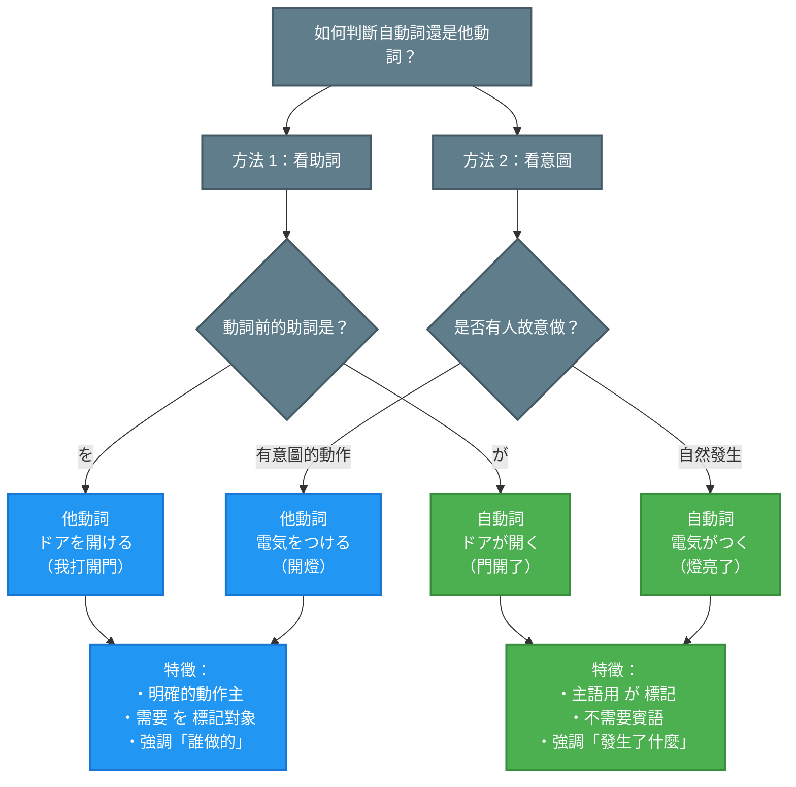

## 日文

他動詞と自動詞（たどうしとじどうし）

**羅馬拼音**：tadoushi to jidoushi

**類型**：文法概念・動詞分類

### 文法情報

| 項目 | 內容 |
|------|------|
| 文法類型 | 動詞分類系統 |
| JLPT | N4 |
| 使用場面 | 所有情境 |
| 重要性 | 基礎核心概念 |

## 日文解釋

他動詞と自動詞は、日本語の動詞を分類する最も基本的な概念の一つです。この区別は単なる文法的な分類ではなく、**話者の視点、責任の所在、事象の捉え方**を反映する重要な言語機能です。

**他動詞**（tadoushi）は、動作主が意図的に対象に働きかける動詞で、「〜を」という目的語を伴います。例えば「窓を開ける」では、「開ける」という動作を意図的に行う主体が存在します。

**自動詞**（jidoushi）は、主語自体に変化や動作が起こる動詞で、目的語を取りません。主語は「〜が」で示されます。例えば「窓が開く」では、窓という主語に開くという変化が起こることを述べています。

この区別は、**事象を能動的に捉えるか、状態変化として捉えるか**という認識の違いを言語化するシステムです。日本語では多くの動詞が自他のペアで存在し、同じ事象でも視点を変えて表現できます。これにより、責任の所在を明確にしたり、ぼかしたりすることができ、日本語特有の繊細なコミュニケーションを可能にしています。

## 英文解釋

Transitive and intransitive verbs (tadoushi and jidoushi) represent one of the most fundamental concepts in Japanese verb classification. This distinction is not merely grammatical but reflects **the speaker's perspective, attribution of responsibility, and how events are conceptualized**.

**Transitive verbs** (tadoushi) describe actions where an agent intentionally acts upon an object, marked by the particle "wo" (を). For example, in "mado wo akeru" (open the window), there is an agent who intentionally performs the action of opening.

**Intransitive verbs** (jidoushi) describe changes or actions that occur to the subject itself, without taking an object. The subject is marked with "ga" (が). For example, in "mado ga aku" (the window opens), the focus is on the change occurring to the window.

This distinction linguistically encodes whether an event is viewed **actively or as a state change**. Japanese features many transitive-intransitive verb pairs, allowing the same event to be expressed from different perspectives. This enables speakers to clarify or obscure responsibility attribution, facilitating the nuanced communication characteristic of Japanese.

## 中文解釋

他動詞與自動詞是日語動詞分類中最基本的概念之一。這個區別不僅是文法上的分類，更反映了**說話者的視角、責任歸屬和對事件的理解方式**。

**他動詞**（tadoushi）描述動作主體有意識地對某個對象施加動作的動詞，使用助詞「を」標記對象。例如「窓を開ける」（打開窗戶）中，存在一個有意執行「打開」這個動作的主體。

**自動詞**（jidoushi）描述變化或動作發生在主語本身的動詞，不需要賓語。主語用「が」標記。例如「窓が開く」（窗戶開了）中，焦點在於窗戶這個主語發生了「打開」的變化。

這個區別將事件視為**主動行為或狀態變化**的認知差異語言化。日語中許多動詞都有自動詞和他動詞的配對，使同一事件可以從不同視角表達。這讓說話者能夠明確或模糊責任歸屬，實現日語特有的細膩溝通。

## 核心用法

### 用法 1：基本句型對比

**他動詞句型**：主語 + が/は + 賓語 + を + 他動詞

**例句 1**
```
母が窓を開けました。
My mother opened the window.
媽媽打開了窗戶。
```

**自動詞句型**：主語 + が/は + 自動詞

**例句 2**
```
風で窓が開きました。
The window opened due to the wind.
窗戶因為風而打開了。
```

### 用法 2：責任歸屬的表達

責任明確（他動詞）vs 避免指責（自動詞）

**例句 3**
```
すみません、花瓶を壊してしまいました。
I'm sorry, I broke the vase.
對不起，我打破了花瓶。（承認責任）
```

**例句 4**
```
あっ、花瓶が壊れてしまいました。
Oh, the vase broke.
啊，花瓶破了。（避免直接承認責任）
```

### 用法 3：視角轉換

從主動視角（他動詞）vs 狀態變化視角（自動詞）

**例句 5**
```
9時に店長が店を開けます。店が開くと、お客さんが入ってきます。
The manager opens the store at 9. When the store opens, customers come in.
9點店長開店。店開了之後，客人就進來了。
```

## 文法規則

### 規則 1：助詞判斷法

**最簡單的判斷方法**是看動詞前的助詞：

- **を + 動詞** → 他動詞
  - 例：ドア**を**開ける、電気**を**消す

- **が + 動詞** → 自動詞
  - 例：ドア**が**開く、電気**が**消える

**注意**：他動詞句中，動作主用「が」或「は」標記，被動作的對象用「を」標記。

### 判斷樹圖示



**圖表說明**：
- 藍色節點：他動詞（有人主動做）
- 綠色節點：自動詞（自然發生）
- 灰色節點：判斷條件

**使用方式**：
1. 先看動詞前的助詞：「を」→他動詞，「が」→自動詞（最快速的方法）
2. 如果助詞不明確，看意圖：有人故意做的動作→他動詞，自然發生的變化→自動詞

### 規則 2：意圖性判斷

**他動詞**通常表示：
- 有意圖的動作
- 主動控制的行為
- 明確的動作主

**自動詞**通常表示：
- 自然發生的變化
- 無需外力的狀態轉換
- 焦點在結果而非行為者

### 規則 3：常見配對模式

日語中許多動詞成對出現，遵循一定的轉換規律：

| 模式 | 自動詞 | 他動詞 | 例子 |
|------|--------|--------|------|
| -u ↔ -eru | -u | -eru | 開く → 開ける |
| -aru ↔ -eru | -aru | -eru | 始まる → 始める |
| -eru ↔ -asu | -eru | -asu | 冷える → 冷やす |
| -reru ↔ -su | -reru | -su | 壊れる → 壊す |

### 規則 4：〜ている 的語意差異

同樣使用「〜ている」，但意義不同：

**他動詞 + ている**：表示動作的結果狀態
```
窓を開けている。（I have the window open. / I'm opening the window.）
我開著窗戶。
```

**自動詞 + ている**：表示狀態的持續
```
窓が開いている。（The window is open.）
窗戶開著。
```

## 常見錯誤

### 錯誤 1：助詞與動詞不匹配

❌ 誤：ドアが開けた。
✅ 正：ドアが開いた。/ ドアを開けた。
說明：「開ける」是他動詞，需要用「を」；「開く」是自動詞，用「が」。

### 錯誤 2：混淆自他動詞

❌ 誤：電気を消えた。
✅ 正：電気が消えた。/ 電気を消した。
說明：「消える」是自動詞（熄滅），「消す」是他動詞（關掉）。

### 錯誤 3：責任歸屬不當

❌ 誤：コップを壊れました。（語法錯誤）
✅ 正：コップが壊れました。（杯子破了 - 自然發生）
✅ 正：コップを壊しました。（我打破了杯子 - 承認責任）
說明：「壊れる」是自動詞，「壊す」是他動詞，不可混用。

### 錯誤 4：只有自動詞或他動詞的動詞

❌ 誤：ご飯が食べる。（「食べる」只有他動詞形式）
✅ 正：ご飯を食べる。
說明：並非所有動詞都有自他配對。「食べる」、「飲む」、「見る」等只有他動詞形式。

## 學習要點

1. **掌握助詞判斷法**：「を」→他動詞，「が」→自動詞，這是最快速的識別方法。

2. **理解視角差異**：他動詞強調「誰做的」，自動詞強調「發生了什麼」。

3. **熟記常見配對**：從日常高頻動詞開始，如開く/開ける、始まる/始める、消える/消す等。

4. **注意語用選擇**：在日本文化中，使用自動詞可以避免直接指責，是禮貌表達的重要技巧。

5. **區分單獨動詞**：記住哪些動詞只有自動詞或他動詞形式，如「食べる」（只有他動詞）、「ある」（只有自動詞）。

## 相關連結

### 基礎概念
- [003_jidoushi.md](../concept/003_jidoushi.md.md) - 自動詞概念詳解（待建立）
- [004_tadoushi.md](../concept/004_tadoushi.md.md) - 他動詞概念詳解（待建立）

### 相關文法
- [064_jita_taiou.md](064_jita_taiou.md.md) - 自他動詞對應配對系統
- [067_transitive-intransitive.md](067_transitive-intransitive.md.md) - 他動詞與自動詞的對比和使用規則
- [066_case-particles.md](066_case-particles.md.md) - 格助詞系統

### 相關助詞
- [001_ga.md](../particle/001_ga.md.md) - 主格助詞が（待建立）
- [011_wo.md](../particle/011_wo.md.md) - 賓格助詞を（待建立）

### 延伸文法
- [022_te_iru.md](022_te_iru.md.md) - ている形與自他動詞的結合
- [031_tearu.md](031_tearu.md.md) - てある形（他動詞的結果狀態）

---

**建立日期**: 2025-10-31
**最後更新**: 2025-10-31
**字數**: ~2800
**例句數**: 5
