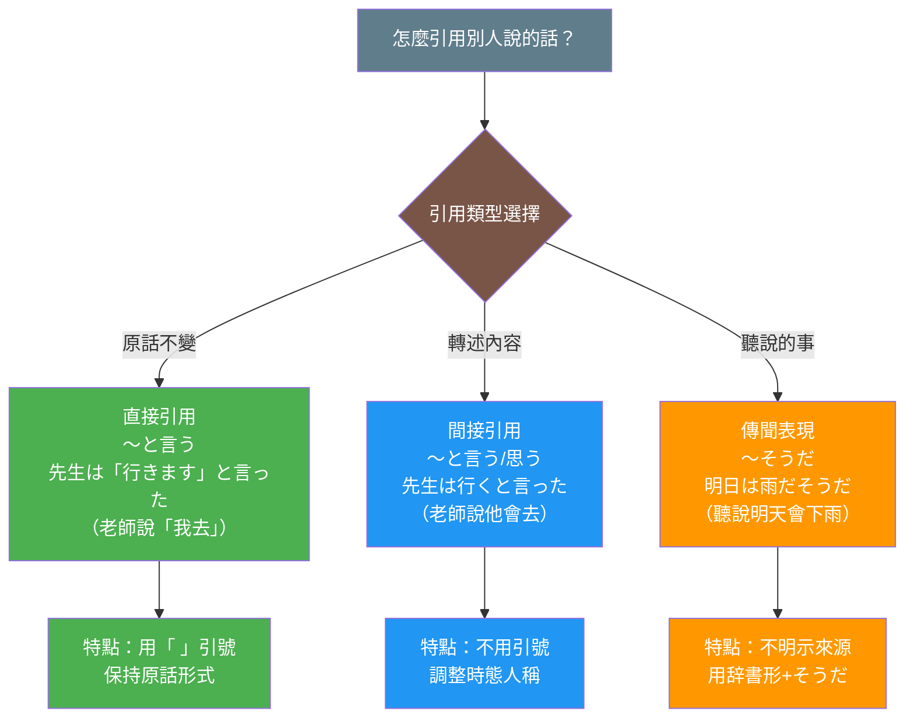

## 日文

引用表現（いんようひょうげん）

**羅馬拼音**：in'you hyougen

**文法類型**：引用模式

### 文法情報

| 項目 | 內容 |
|------|------|
| 文法類型 | 引用表現 |
| JLPT | N4 |
| 使用場面 | 正式、日常、書面、口語 |
| 核心形式 | 〜と言う、〜と思う、〜そうだ、〜という |

### 形成規則

**基本形式**
```
[引用内容] + と + 動詞
[引用内容] + という + 名詞
[引用内容] + そうだ
```

**主要引用動詞**
- 言う（言った）- 說
- 思う（思った）- 想、認為
- 聞く（聞いた）- 聽說
- 伝える（伝えた）- 傳達
- 尋ねる（尋ねた）- 詢問

**基本範例**
```
彼は「行く」と言った。
→ 他說「去」。

彼は行くと言った。
→ 他說要去。

明日は雨だそうだ。
→ 聽說明天會下雨。
```

## 日文解釋

引用表現は、他者の発言や自分の考え、伝聞情報を表す文法パターン[^grammar-pattern]です。日本語では、引用助詞[^particle-to]「と」を用いて、直接引用[^direct-quotation]と間接引用[^indirect-quotation]の両方を表現できます。

直接引用では「 」（かぎかっこ）を使い、話し手の言葉をそのまま引用します。間接引用では、内容を要約したり、時制[^tense]や人称[^person]を調整して伝えます。

また、伝聞表現[^hearsay]「〜そうだ」「〜という」なども引用表現の一種で、情報源[^information-source]を明示せずに情報を伝える際に使われます。これらの表現は、情報の確実性[^certainty]や責任の所在[^responsibility]を示す重要な役割を果たします。

フォーマル[^formal-context]な場面では「〜とのことです」「〜と伺っております」といった丁寧な形式[^polite-form]も用いられ、ビジネス[^business-context]や公式文書[^official-document]で頻繁に使用されます。

## 英文解釋

Quotation expressions[^grammar-pattern] are grammatical patterns used to report others' speech, express one's thoughts, or convey hearsay information. In Japanese, the quotative particle[^particle-to] "と (to)" is used to express both direct quotations[^direct-quotation] and indirect quotations[^indirect-quotation].

Direct quotations use quotation marks「 」(kagikakko) and reproduce the speaker's exact words. Indirect quotations summarize the content and adjust tense[^tense] and person[^person] accordingly.

Hearsay expressions[^hearsay] such as "〜そうだ (sou da)" and "〜という (to iu)" are also types of quotation expressions, used to convey information without specifying the information source[^information-source]. These expressions play an important role in indicating the certainty[^certainty] of information and the locus of responsibility[^responsibility].

In formal contexts[^formal-context], polite forms[^polite-form] such as "〜とのことです (to no koto desu)" and "〜と伺っております (to ukagatte orimasu)" are used, frequently appearing in business[^business-context] and official documents[^official-document].

## 中文解釋

引用表現[^grammar-pattern]是用於轉述他人說話、表達自己想法或傳達聽說資訊的文法模式。在日文中，使用引用助詞[^particle-to]「と」來表達直接引用[^direct-quotation]和間接引用[^indirect-quotation]。

直接引用使用引號「 」（鉤括弧），原封不動地引述說話者的話。間接引用則是總結內容，並調整時態[^tense]和人稱[^person]來傳達。

此外，傳聞表現[^hearsay]「〜そうだ」「〜という」也是引用表現的一種，用於在不明示資訊來源[^information-source]的情況下傳達資訊。這些表現在顯示資訊的確定性[^certainty]和責任歸屬[^responsibility]方面扮演重要角色。

在正式場合[^formal-context]中，會使用「〜とのことです」「〜と伺っております」等禮貌形式[^polite-form]，在商務[^business-context]和公文[^official-document]中頻繁出現。

## 圖解

### 引用表達的三種類型



**圖表說明**：
- **綠色**：直接引用 - 用引號保持原話
- **藍色**：間接引用 - 轉述並調整時態
- **橘色**：傳聞表現 - 表達聽說的資訊

## 核心用法

### 用法 1：直接引用（〜と言う）

使用「 」引號，原封不動引述說話內容。

**例句 1**
```
先生は「明日テストがあります」と言いました。
The teacher said, "There will be a test tomorrow."
老師說「明天有測驗」。
```

**例句 2**
```
彼女は「ありがとう」と言って笑った。
She said "Thank you" and smiled.
她說了「謝謝」並笑了。
```

### 用法 2：間接引用（〜と言う、〜と思う）

不使用引號，總結或轉述內容。

**例句 3**
```
田中さんは明日来ると言っていました。
Tanaka-san said he would come tomorrow.
田中先生說他明天會來。
```

**例句 4**
```
私はこの計画は成功すると思います。
I think this plan will succeed.
我認為這個計畫會成功。
```

### 用法 3：傳聞表現（〜そうだ、〜という）

傳達聽說的資訊，不明示資訊來源。

**例句 5**
```
明日は雨が降るそうです。
I heard it will rain tomorrow.
聽說明天會下雨。
```

**例句 6**
```
あの店はおいしいという話です。
They say that restaurant is delicious.
據說那家店很好吃。
```

### 用法 4：正式場合的引用（〜とのことです）

商務或正式場合使用的禮貌形式。

**例句 7**
```
社長は会議を延期するとのことです。
The president says the meeting will be postponed.
社長表示會議將延期。
```

## 文法規則

### 規則 1：直接引用與間接引用的時態調整

**直接引用**：保持原話的時態
```
彼は「行きます」と言った。（他說「我去」）
```

**間接引用**：根據轉述時間調整時態
```
彼は行くと言った。（他說他會去）
彼は行ったと言った。（他說他去了）
```

### 規則 2：引用助詞「と」的位置

引用助詞「と」必須放在引用內容之後、引用動詞之前：
```
[引用内容] + と + [引用動詞]
```

**正確**：
```
✅ 田中さんは忙しいと言った。
✅ 雨が降ると思う。
```

**錯誤**：
```
❌ 田中さんは言ったと忙しい。
❌ 思うと雨が降る。
```

### 規則 3：「そうだ」的接續

傳聞的「そうだ」根據前接詞性有不同的接續形式：

| 詞性 | 接續形式 | 例子 |
|------|---------|------|
| 動詞 | 辞書形 + そうだ | 行くそうだ |
| い形容詞 | い + そうだ | おいしいそうだ |
| な形容詞 | だ + そうだ | 静かだそうだ |
| 名詞 | だ + そうだ | 学生だそうだ |

### 規則 4：「という」的名詞修飾用法

「という」可以用來修飾名詞，表示「叫做〜的」、「據說〜的」：
```
「山田」という人 - 一個叫山田的人
おいしいという店 - 據說很好吃的店
```

## 常見錯誤

### 錯誤 1：直接引用與間接引用混用

❌ 誤：彼は「行く」と言った。（混淆格式）
✅ 正：彼は「行きます」と言った。（直接引用，保持原話）
✅ 正：彼は行くと言った。（間接引用，不用引號）

說明：直接引用應保持原話的完整形式（如ます形），間接引用則不用引號。

### 錯誤 2：忘記時態調整

❌ 誤：彼は明日「行きます」と言った。（時態不一致）
✅ 正：彼は明日「行きます」と言っています。
✅ 正：彼は明日行くと言いました。

說明：直接引用時，外框動詞的時態要與轉述時間一致。

### 錯誤 3：傳聞「そうだ」與様態「そうだ」混淆

❌ 誤：雨が降りそうだ。（看起來要下雨 - 様態）
✅ 正：雨が降るそうだ。（聽說會下雨 - 傳聞）

說明：傳聞「そうだ」接辞書形，様態「そうだ」接動詞ます形去掉ます。

### 錯誤 4：「という」後面接錯詞性

❌ 誤：彼はという忙しい。
✅ 正：彼は忙しいという話だ。
✅ 正：彼は忙しいと言っている。

說明：「という」後面通常接名詞（如「話」「こと」「人」）。

## 學習要點

1. **掌握直接與間接引用的差異**：直接引用用引號保持原話，間接引用調整時態和人稱。

2. **記住引用助詞「と」的位置**：永遠在引用內容之後、動詞之前。

3. **區分傳聞「そうだ」與様態「そうだ」**：傳聞接辞書形（〜するそうだ），様態接ます形語幹（〜しそうだ）。

4. **正式場合使用禮貌形式**：商務或正式場合用「〜とのことです」「〜と伺っております」。

5. **注意時態的一致性**：轉述時要根據說話時間調整動詞時態。

## 相關連結

### 基礎文法
- [particle_to.md](particle_to.md) - 引用助詞「と」的詳細用法（待建立）
- [hearsay_souda.md](hearsay_souda.md) - 傳聞表現「〜そうだ」（待建立）
- [modal_souda.md](modal_souda.md) - 様態表現「〜そうだ」（待建立）

### 相關動詞
- [iu.md](../verb-u/iu.md) - 言う（說）（待建立）
- [omou.md](../verb-u/omou.md) - 思う（想、認為）（待建立）
- [kiku.md](../verb-u/kiku.md) - 聞く（聽）（待建立）
- [tsutaeru.md](../verb-ru/tsutaeru.md) - 伝える（傳達）（待建立）

### 延伸說明
- [direct_indirect_speech.md](direct_indirect_speech.md) - 直接引用與間接引用的對比（待建立）
- [quotation_in_business.md](quotation_in_business.md) - 商務場合的引用表現（待建立）
- [quotation_polite_forms.md](../honorific/quotation_polite_forms.md) - 引用表現的敬語形式（待建立）

### 相關概念
- [information_source.md](../concept/information_source.md) - 資訊來源與責任歸屬（待建立）
- [evidentiality.md](../concept/evidentiality.md) - 證據性標記（待建立）

---

## 註解

[^grammar-pattern]: **文法模式** - 具有特定結構和功能的文法表達方式。詳見 [grammar_pattern.md](../concept/grammar_pattern.md)

[^particle-to]: **引用助詞「と」** - 用於標示引用內容的助詞，連接引用部分和引用動詞。詳見 [to_quotative.md](../particle/to_quotative.md)

[^direct-quotation]: **直接引用** - 使用引號「 」，原封不動地引述說話者的原話。英文稱為 "direct quotation" 或 "direct speech"。

[^indirect-quotation]: **間接引用** - 不使用引號，總結或轉述說話內容，調整時態和人稱。英文稱為 "indirect quotation" 或 "indirect speech"。

[^tense]: **時態** - 動詞表示動作或狀態發生時間的文法範疇。日文主要有現在形和過去形。詳見 [tense.md](tense.md)

[^person]: **人稱** - 指示說話者、聽話者或第三者的文法範疇。日文的人稱主要透過代詞和語境表現。

[^hearsay]: **傳聞表現** - 表示「聽說」「據說」的文法表現，如「〜そうだ」「〜という」，用於傳達間接獲得的資訊。詳見 [hearsay_expressions.md](hearsay_expressions.md)

[^information-source]: **資訊來源** - 說話者獲得資訊的途徑，可能是親眼所見、聽說、推測等。日文透過不同的表達方式標示資訊來源。

[^certainty]: **確定性** - 資訊的可靠程度或說話者對資訊的確信程度。日文使用不同的表達方式來表示不同程度的確定性。

[^responsibility]: **責任歸屬** - 說話者對所陳述內容承擔責任的程度。使用傳聞表現可以降低說話者的責任。

[^formal-context]: **正式場合** - 商務會議、公開演講、公文等需要使用正式語言的情境。詳見 [formal.md](../context/formal.md)

[^polite-form]: **禮貌形式** - 丁寧語、尊敬語、謙讓語等表示禮貌的語言形式。詳見 [politeness.md](../concept/politeness.md)

[^business-context]: **商務場合** - 工作環境中的正式溝通情境，如會議、報告、商業信函等。詳見 [business.md](../context/business.md)

[^official-document]: **公文** - 政府機關、企業組織等發出的正式文書，使用高度正式的語言。

---

**建立日期**: 2025-10-31
**最後更新**: 2025-10-31
**字數**: ~2,800
**例句數**: 7
