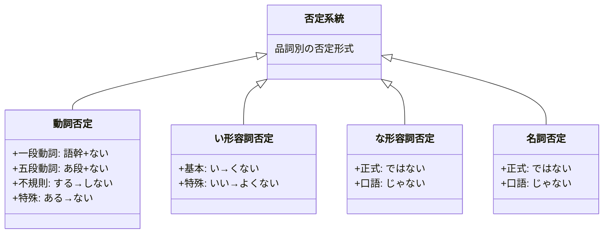

## 日文

否定体系（ひていたいけい）

## 日文解釋

日本語の否定表現は、動詞、形容詞、名詞という品詞によって異なる形式を持つ体系的な文法構造である。否定形は「〜ない」という助動詞を中心に展開され、普通体[^futsutai]と丁寧体[^teiitai]の両方で使用される。この体系を理解することは、日本語の基本的なコミュニケーション能力の根幹をなす。

否定表現には、単純否定だけでなく、禁止[^kinshi]、義務[^gimu]、不必要[^fuhitsuyou]など、さまざまな語用機能[^goyoukinou]が含まれる。さらに、時制[^jisei]（現在・過去）や文体[^buntai]（普通体・丁寧体）によって形式が変化し、話者の意図や社会的関係を反映する。

## 英文解釋

The Japanese negation system is a structured grammatical framework that varies based on parts of speech: verbs, adjectives, and nouns. The negative form centers around the auxiliary "〜ない" (nai) and is used in both plain form[^futsutai] and polite form[^teiitai]. Understanding this system is fundamental to basic Japanese communication skills.

Negation expressions encompass not only simple negation but also various pragmatic functions[^goyoukinou] such as prohibition[^kinshi], obligation[^gimu], and unnecessity[^fuhitsuyou]. Furthermore, forms change according to tense[^jisei] (present/past) and style[^buntai] (plain/polite), reflecting the speaker's intention and social relationships.

## 中文解釋

日文的否定系統是根據詞性（動詞、形容詞、名詞）而有不同形式的結構化文法體系。否定形以助動詞「〜ない」為中心展開，在普通體[^futsutai]和丁寧體[^teiitai]中都會使用。理解這個系統是日文基本溝通能力的根基。

否定表達不僅包含單純否定，還包含禁止[^kinshi]、義務[^gimu]、不必要[^fuhitsuyou]等各種語用功能[^goyoukinou]。此外，形式會根據時態[^jisei]（現在・過去）和文體[^buntai]（普通體・丁寧體）而變化，反映說話者的意圖和社會關係。

---

## 否定系統概覽圖



## 否定系統整合表

### 一、動詞否定

#### 1.1 基本否定形式

| 品詞 | 辞書形 | 普通体否定（現在） | 普通体否定（過去） | 丁寧体否定（現在） | 丁寧体否定（過去） |
|------|--------|------------------|------------------|------------------|------------------|
| 動詞（一段） | 食べる | 食べない | 食べなかった | 食べません | 食べませんでした |
| 動詞（五段） | 書く | 書かない | 書かなかった | 書きません | 書きませんでした |
| 動詞（不規則） | する | しない | しなかった | しません | しませんでした |
| 動詞（不規則） | 来る | 来ない（こない） | 来なかった | 来ません | 来ませんでした |

#### 1.2 動詞否定的形成規則

**一段動詞（る動詞）**
```
語幹 + ない
食べる → 食べ + ない = 食べない
見る → 見 + ない = 見ない
```

**五段動詞（う動詞）**
```
語尾をあ段に変える + ない
書く（ku） → 書か（ka）+ ない = 書かない
飲む（mu） → 飲ま（ma）+ ない = 飲まない
買う（u） → 買わ（wa）+ ない = 買わない  ※特殊
```

**特殊變化**
```
ある → ない（不是 あらない）
```

### 二、形容詞否定

#### 2.1 い形容詞否定

| 原形 | 普通体否定（現在） | 普通体否定（過去） | 丁寧体否定（現在） | 丁寧体否定（過去） |
|------|------------------|------------------|------------------|------------------|
| 高い | 高くない | 高くなかった | 高くないです / 高くありません | 高くなかったです / 高くありませんでした |
| 美味しい | 美味しくない | 美味しくなかった | 美味しくないです | 美味しくなかったです |

**形成規則**
```
い → くない
高い → 高くない
```

**特殊形容詞**
```
いい（良い）→ よくない（不是 いくない）
```

#### 2.2 な形容詞否定

| 原形 | 普通体否定（現在） | 普通体否定（過去） | 丁寧体否定（現在） | 丁寧体否定（過去） |
|------|------------------|------------------|------------------|------------------|
| 静か | 静かではない / 静かじゃない | 静かではなかった / 静かじゃなかった | 静かではありません / 静かじゃありません | 静かではありませんでした |
| 元気 | 元気ではない / 元気じゃない | 元気ではなかった | 元気ではありません | 元気ではありませんでした |

**形成規則**
```
な形容詞語幹 + ではない / じゃない
静か + ではない = 静かではない（正式）
静か + じゃない = 静かじゃない（口語）
```

### 三、名詞否定

| 名詞 | 普通体否定（現在） | 普通体否定（過去） | 丁寧体否定（現在） | 丁寧体否定（過去） |
|------|------------------|------------------|------------------|------------------|
| 学生 | 学生ではない / 学生じゃない | 学生ではなかった | 学生ではありません | 学生ではありませんでした |
| 日本人 | 日本人ではない | 日本人ではなかった | 日本人ではありません | 日本人ではありませんでした |

**形成規則**
```
名詞 + ではない / じゃない
学生 + ではない = 学生ではない（正式）
学生 + じゃない = 学生じゃない（口語）
```

---

## 核心用法

### 用法 1：基本否定表達

否定動作、狀態或事實。

**例句 1**
```
私は肉を食べない。
I don't eat meat.
我不吃肉。
```

**例句 2**
```
今日は寒くない。
It's not cold today.
今天不冷。
```

**例句 3**
```
彼は学生ではない。
He is not a student.
他不是學生。
```

### 用法 2：禁止表達（〜ないでください）

禮貌地請求對方不要做某事。

**例句 4**
```
ここで写真を撮らないでください。
Please don't take photos here.
請不要在這裡拍照。
```

**例句 5**
```
心配しないでください。
Please don't worry.
請不要擔心。
```

### 用法 3：義務表達（〜なければならない）

表示必須做某事的義務。

**例句 6**
```
明日早く起きなければならない。
I must wake up early tomorrow.
我明天必須早起。
```

**例句 7**
```
毎日勉強しなければならない。
I have to study every day.
我每天必須學習。
```

### 用法 4：不必要表達（〜なくてもいい）

表示不需要做某事，可以選擇不做。

**例句 8**
```
明日来なくてもいいです。
You don't need to come tomorrow.
你明天不用來。
```

**例句 9**
```
急がなくてもいい。
You don't need to hurry.
不用急。
```

### 用法 5：連接否定動作（〜ないで）

表示不做某動作而做另一動作。

**例句 10**
```
朝ご飯を食べないで学校に行った。
I went to school without eating breakfast.
我沒吃早餐就去學校了。
```

---

## 文法規則

### 規則 1：否定助動詞「ない」的性質

「ない」本身作為助動詞，具有い形容詞的性質，因此：
- 可以變化：ない → なかった（過去）
- 可以修飾名詞：食べない人（不吃的人）
- 可以連接：なくて、なければ

### 規則 2：普通体與丁寧体的選擇

| 場合 | 使用形式 | 例 |
|------|---------|-----|
| 朋友、家人、親近的人 | 普通体（〜ない） | 食べない |
| 初次見面、上司、客人 | 丁寧体（〜ません） | 食べません |
| 書面、正式文章 | 普通体（〜ない） | 食べない |

### 規則 3：特殊否定形式

**ある的否定**
```
ある → ない（不是 あらない）
時間がない。（沒有時間）
お金がない。（沒有錢）
```

**いい的否定**
```
いい → よくない（不是 いくない）
天気がよくない。（天氣不好）
```

### 規則 4：雙重否定

日文中雙重否定形成肯定意義，常用於委婉表達。

```
行かないわけではない。
It's not that I won't go. (意思是：我會去)
不是我不去。（意思是：我會去）
```

```
食べられなくはない。
It's not that I can't eat it. (意思是：我可以吃)
不是不能吃。（意思是：可以吃）
```

### 規則 5：否定形的連接形式

**〜なくて（連接）**
```
時間がなくて、行けなかった。
I didn't have time, so I couldn't go.
沒有時間，所以去不了。
```

**〜なければ（條件）**
```
勉強しなければ、合格できない。
If you don't study, you can't pass.
如果不學習，就無法合格。
```

---

## 常見錯誤

### 錯誤 1：動詞類型判斷錯誤

❌ 誤：食べらない（誤認為五段動詞）
✅ 正：食べない（一段動詞）

說明：「食べる」是一段動詞，直接去「る」加「ない」

### 錯誤 2：な形容詞使用い形容詞否定方式

❌ 誤：静かくない（誤加「く」）
✅ 正：静かではない / 静かじゃない

說明：な形容詞不能像い形容詞一樣變化

### 錯誤 3：名詞直接加「ない」

❌ 誤：学生ない（直接加「ない」）
✅ 正：学生ではない / 学生じゃない

說明：名詞需要加「では」或「じゃ」才能接「ない」

### 錯誤 4：ある的特殊否定忘記

❌ 誤：あらない（按五段動詞變化）
✅ 正：ない（特殊變化）

說明：「ある」的否定是日文最特殊的變化之一

### 錯誤 5：いい的否定形式錯誤

❌ 誤：いくない（按一般い形容詞變化）
✅ 正：よくない（特殊變化）

說明：「いい」的否定要回到「よい」的語幹

---

## 學習要點

1. **掌握三大品詞的否定方式**：動詞用「ない形」、い形容詞變「くない」、な形容詞和名詞用「ではない/じゃない」

2. **記住特殊變化**：「ある → ない」和「いい → よくない」是最常用的特殊否定形式

3. **區分普通体和丁寧体**：根據對話對象和場合選擇適當的禮貌程度（ない vs ません）

4. **理解否定形的延伸文法**：「〜ないでください」（禁止）、「〜なければならない」（義務）、「〜なくてもいい」（不必要）等重要文法都基於否定形

5. **注意文法連接**：否定形可以用「なくて」「なければ」等形式連接其他句子成分，掌握這些連接方式能表達更複雜的意思

---

## 相關連結

### 動詞否定相關
- [008_nai_form](008_nai_form.md) - ない形基本變化（待建立）
- [044_nai-kei](044_nai-kei.md) - ない形詳細說明（待建立）
- [043_masu-kei](043_masu-kei.md) - ます形與ません（待建立）

### 延伸文法
- [027_nakereba_naranai](027_nakereba_naranai.md) - 義務表達（待建立）
- [028_nakutemo_ii](028_nakutemo_ii.md) - 不必要表達（待建立）
- [019_naide_kudasai](019_naide_kudasai.md) - 禁止表達（待建立）

### 相關概念
- [040_teineitai_vs_futsutai](../concept/040_teineitai_vs_futsutai.md) - 丁寧体與普通体（待建立）
- [041_verb_classification](../concept/041_verb_classification.md) - 動詞分類（待建立）
- [039_obligation_expressions](../concept/039_obligation_expressions.md) - 義務表達概念（待建立）

### 形容詞相關
- [001_takai](../adjective-i/001_takai.md) - い形容詞範例（待建立）
- [001_shizuka](../adjective-na/001_shizuka.md) - な形容詞範例（待建立）

---

## 註解

[^futsutai]: **普通体** - 日文的非敬語形式，用於親密關係或書面語中。對比丁寧体（です・ます形式）。詳見 [040_teineitai_vs_futsutai](../concept/040_teineitai_vs_futsutai.md)

[^teiitai]: **丁寧体** - 日文的禮貌形式，使用「です・ます」結尾，用於一般社交場合。詳見 [040_teineitai_vs_futsutai](../concept/040_teineitai_vs_futsutai.md)

[^kinshi]: **禁止** - 要求或命令對方不要做某事的語氣表達。在日文中常用「〜ないでください」等形式。

[^gimu]: **義務** - 表示必須做某事的語氣，日文中用「〜なければならない」「〜なくてはならない」等形式。詳見 [039_obligation_expressions](../concept/039_obligation_expressions.md)

[^fuhitsuyou]: **不必要** - 表示不需要做某事、可以不做的語氣，用「〜なくてもいい」表達。

[^goyoukinou]: **語用機能** - 語言在實際使用中的功能，包括請求、命令、建議等交際功能。

[^jisei]: **時制** - 表示動作或狀態發生時間的文法範疇，主要有現在、過去、未來等。

[^buntai]: **文體** - 語言表達的風格和禮貌程度，日文主要分為普通体和丁寧体。

---

**建立日期**: 2025-11-03
**最後更新**: 2025-11-03
**字數**: ~3500
**例句數**: 10
