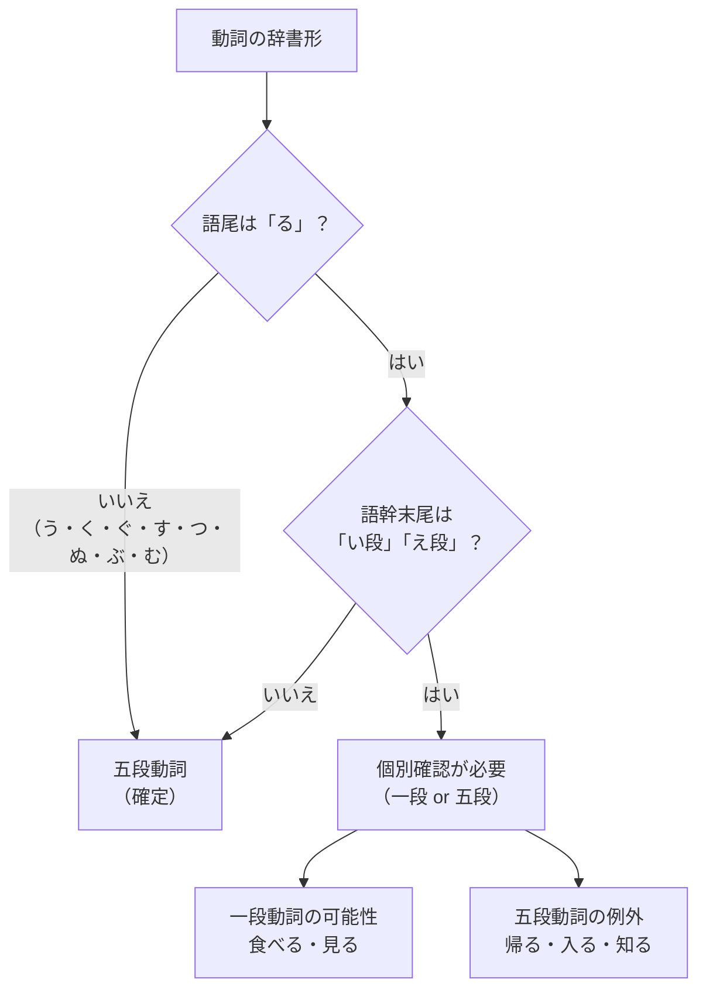

五段動詞是日文中數量最多的動詞類別，特徵是語幹末尾會在う段五個母音間變化。

<!--more-->

## 日文

五段動詞（ごだんどうし）/ Group I 動詞

### 文法情報

| 項目 | 內容 |
|------|------|
| 文法類型 | 動詞分類 |
| JLPT | N5 |
| 使用場面 | 所有場合 |
| 別名 | う動詞、Group I Verbs、Strong Verbs |

### 識別規則

**基本判別**
```
辞書形の終わり方を確認する：
- 「〜う」「〜く」「〜ぐ」「〜す」「〜つ」「〜ぬ」「〜ぶ」「〜む」「〜る」
  → る以外で終わる場合：確実に五段動詞
  → るで終わる場合：語幹の最後の音を確認
```

**「る」で終わる動詞の判別**
```
語幹末尾が「い段」「え段」以外 → 五段動詞
  例：帰る（かえる）→「え」だが例外で五段
      知る（しる）→「い」だが五段

※ 暗記が必要な例外多数
```

## 圖解



## 日文解釋

五段動詞とは、活用する際に語尾が「あ段・い段・う段・え段・お段」の五つの段を使う動詞である。日本語の動詞の中で最も数が多く、基本的な動詞の大部分がこのグループに属する。

「五段」という名称は、否定形（書かない→あ段）、連用形（書きます→い段）、終止形（書く→う段）、仮定形（書けば→え段）、意志形（書こう→お段）のように、語尾が五つの段を移動することに由来する。

英語では「Group I Verbs」「U-verbs」「Consonant-stem Verbs」などと呼ばれる。動詞の語幹が子音で終わることから「子音語幹動詞」とも称される。

## 英文解釋

Group I verbs (godan doushi) are the largest category of Japanese verbs. They are characterized by their stem ending in a consonant, which causes the final vowel to change across the five vowel sounds (a, i, u, e, o) during conjugation.

These verbs are also called "u-verbs" because their dictionary form always ends in -u (though not necessarily -ru). The name "godan" (five levels) comes from the fact that the ending consonant combines with all five Japanese vowels depending on the conjugation form.

Key identification: If a verb ends in anything other than -eru or -iru, it is definitely a Group I verb. However, some -eru and -iru verbs are also Group I (exceptions that must be memorized).

## 中文解釋

五段動詞（又稱 Group I 動詞、う動詞）是日文中數量最多的動詞類別。其特徵是活用時，語尾會在「あ段、い段、う段、え段、お段」五個段之間變化。

「五段」這個名稱來自於：否定形用あ段（書かない）、連用形用い段（書きます）、終止形用う段（書く）、假定形用え段（書けば）、意志形用お段（書こう）。

辨識方法：
1. 以う、く、ぐ、す、つ、ぬ、ぶ、む結尾 → 一定是五段動詞
2. 以る結尾 → 需要個別確認（可能是一段，也可能是五段例外）

常見的五段動詞例外（看起來像一段但實際是五段）：帰る、入る、知る、走る、切る等。

## 核心用法

### 用法 1：基本活用形

五段動詞的活用規則統一，只要掌握語尾變化即可套用所有動詞。

**例句 1**
```
毎日本を読む。読まない日はない。
I read books every day. There is no day I don't read.
我每天讀書。沒有不讀書的日子。
```

**例句 2**
```
彼は手紙を書いて、ポストに入れた。
He wrote a letter and put it in the mailbox.
他寫了信，投進郵筒。
```

### 用法 2：音便變化

五段動詞在接續て形、た形時會產生音便（發音變化），需要特別注意。

**例句 3**
```
友達を待って、一緒に帰った。
I waited for my friend and went home together.
等了朋友，一起回家。
```

### 用法 3：可能形與被動形

五段動詞變成可能形或被動形時，語尾統一變成「〜える」。

**例句 4**
```
この漢字が読める？昨日習ったばかりだよ。
Can you read this kanji? I just learned it yesterday.
這個漢字你會讀嗎？我昨天才學的。
```

**例句 5**
```
電車で足を踏まれて、とても痛かった。
Someone stepped on my foot on the train and it really hurt.
在電車上被踩到腳，很痛。
```

## 活用形一覽

### 五段動詞活用表（以「書く」為例）

| 活用形 | 變化規則 | 例：書く |
|--------|----------|----------|
| 未然形 | う→あ | 書か（ない） |
| 連用形 | う→い | 書き（ます） |
| 終止形 | 原形 | 書く |
| 連体形 | 原形 | 書く（本） |
| 仮定形 | う→え | 書け（ば） |
| 命令形 | う→え | 書け |
| 意志形 | う→おう | 書こう |

### 音便變化表

| 語尾 | て形 | た形 | 例 |
|------|------|------|-----|
| く | いて | いた | 書く→書いて |
| ぐ | いで | いだ | 泳ぐ→泳いで |
| す | して | した | 話す→話して |
| つ・る・う | って | った | 待つ→待って |
| ぬ・ぶ・む | んで | んだ | 読む→読んで |

**例外**
```
行く → 行って（いって）  ※ 不是「いいて」
```

## 常見錯誤

### 錯誤 1：混淆一段與五段

❌ 誤：帰ます（把「帰る」當成一段動詞）
✅ 正：帰ります
說明：「帰る」雖然以「る」結尾且語幹是「え段」，但它是五段動詞例外。

### 錯誤 2：音便變化錯誤

❌ 誤：書きて（直接加て）
✅ 正：書いて（イ音便）
說明：「く」結尾的五段動詞，て形要用イ音便變成「いて」。

### 錯誤 3：忘記「行く」的特殊音便

❌ 誤：行いて
✅ 正：行って
說明：「行く」是唯一不遵循「く→いて」規則的五段動詞，要變成「行って」。

## 學習要點

1. **掌握語尾判別**：除了「る」結尾需要個別確認外，其他語尾的動詞都是五段動詞
2. **熟記音便規則**：て形、た形的音便變化是五段動詞的難點，需要多練習
3. **背誦例外動詞**：帰る、入る、知る、走る、切る等常見例外要特別記憶
4. **理解命名由來**：「五段」指的是活用時使用五個母音段
5. **與一段動詞對比學習**：同時學習一段動詞可以更清楚理解兩者差異

## 相關連結

### 動詞分類
- [一段動詞（Group II 動詞）](grammar/291_group_2_doushi.md)（待建立）
- [不規則動詞（Group III 動詞）](grammar/292_group_3_doushi.md)（待建立）

### 活用相關
- [動詞て形](grammar/001_te_form.md)（待建立）
- [動詞た形](grammar/002_ta_form.md)（待建立）
- [動詞ない形](grammar/003_nai_form.md)（待建立）

### 代表動詞
- [書く](verb-u/004_kaku.md)
- [読む](verb-u/003_yomu.md)
- [行く](verb-u/009_iku.md)

---

**建立日期**: 2025-12-28
**最後更新**: 2025-12-28
**字數**: ~2,800
**例句數**: 5
