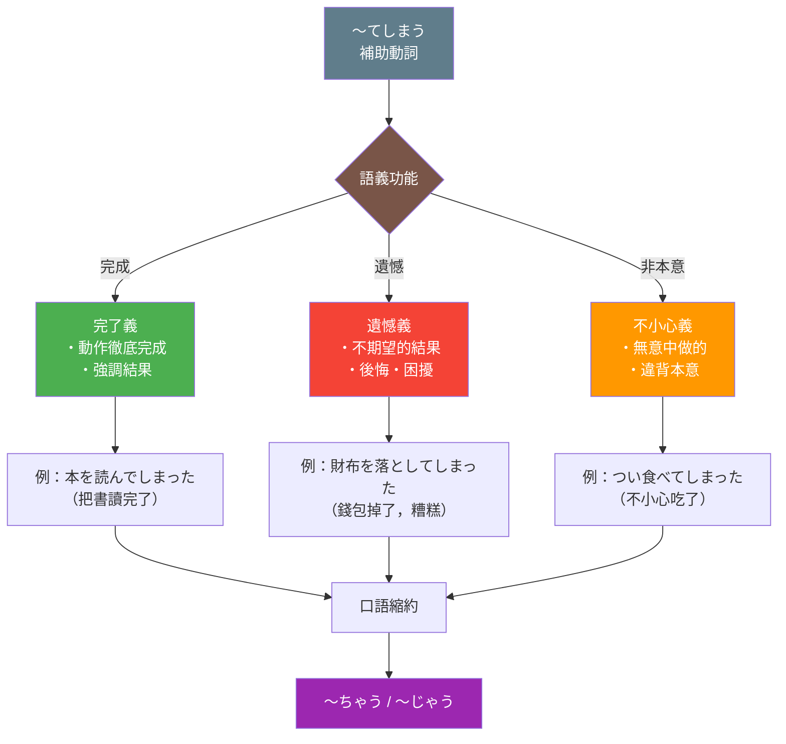

## 日文

補助動詞しまうの用法（ほじょどうし しまう の ようほう）

### 文法情報

| 項目 | 內容 |
|------|------|
| 文法類型 | 補助動詞 |
| JLPT | N3 |
| 使用場面 | 日常會話、書面語 |
| 形成 | 動詞て形 + しまう |

## 日文解釋

「しまう」は本来「仕舞う」と書き、「片付ける」「終わらせる」という意味の動詞である。補助動詞として動詞のて形に接続すると、以下の三つの主要な意味を表す。

**第一義：完了（完全に終わる）**

動作が完全に終了したことを強調する。「すっかり」「完全に」というニュアンスを加える。この用法では、動作の徹底性や完結性が強調され、中途半端ではなく最後まで行われたことを示す。

**第二義：遺憾・後悔（残念な結果）**

望ましくない結果や予期せぬ事態に対する話し手の感情を表す。「残念ながら」「困ったことに」という気持ちが込められる。この用法が最も一般的で、日常会話で頻繁に使われる。

**第三義：不本意・不注意（うっかり）**

意図せずに、または不本意ながら何かをしてしまった状況を表す。「つい」「うっかり」という意味合いで、自分の意志に反して行動してしまったことを示す。

**口語縮約形**

日常会話では「〜てしまう」が「〜ちゃう」に、「〜でしまう」が「〜じゃう」に縮約される。この縮約形は非常に一般的で、特に若い世代や親しい間柄では標準的な形として使われる。

## 英文解釋

The auxiliary verb "shimau" (しまう) originally means "to put away" or "to finish." When attached to the te-form of verbs, it expresses three primary semantic functions:

**1. Completion (Thoroughness)**

Emphasizes that an action has been completely finished. It adds the nuance of "entirely" or "completely," indicating that something was done thoroughly without being left incomplete.

**2. Regret/Unfortunate Result**

Expresses the speaker's emotional response to an undesirable or unexpected outcome. This is the most common usage and conveys feelings of regret, disappointment, or dismay about what happened.

**3. Unintentional Action (Accidentally)**

Indicates that something was done unintentionally, carelessly, or against one's will. It suggests that the action happened despite the speaker's intentions, often used with actions one wishes hadn't occurred.

**Colloquial Contractions**

In spoken Japanese, "〜てしまう" contracts to "〜ちゃう," and "〜でしまう" contracts to "〜じゃう." These shortened forms are extremely common in casual conversation and are considered standard among friends and younger speakers.

## 中文解釋

補助動詞「しまう」原本是「仕舞う」（收拾、結束）的意思。當接在動詞て形後面時，表達三種主要的語義功能：

**1. 完成義（徹底完了）**

強調動作已經完全結束。增添「完全地」「徹底地」的語感，表示事情不是半途而廢，而是做到了最後。

**2. 遺憾義（不期望的結果）**

表達說話者對於不希望發生或意外情況的情感反應。這是最常見的用法，傳達後悔、失望或困擾的心情。

**3. 不小心義（非本意行為）**

表示某事是無意中、不小心或違背本意而做的。暗示行為是在說話者意願之外發生的，常用於描述希望沒發生過的動作。

**口語縮約形**

在日常會話中，「〜てしまう」縮約為「〜ちゃう」，「〜でしまう」縮約為「〜じゃう」。這些縮約形非常普遍，在朋友之間和年輕人中被視為標準用法。

## 核心用法

### 用法 1：完成（完全に終わる）

強調動作完全結束，徹底完成。

**例句 1**
```
この本を一晩で読んでしまった。
I finished reading this book in one night.
我一個晚上就把這本書讀完了。
```

**例句 2**
```
宿題を全部やってしまいましょう。
Let's finish all the homework.
我們把作業全部做完吧。
```

### 用法 2：遺憾・後悔（望ましくない結果）

表達對不希望發生之事的遺憾或後悔。

**例句 3**
```
大切な写真を消してしまった。
I accidentally deleted my precious photos.
我把重要的照片刪掉了。
```

**例句 4**
```
約束の時間に遅れてしまって、すみません。
I'm sorry for being late to our appointment.
很抱歉遲到了。
```

### 用法 3：不小心・非本意（うっかり）

表示無意中或違背本意而做的行為。

**例句 5**
```
つい本音を言ってしまった。
I accidentally said what I really think.
我不小心說出了真心話。
```

**例句 6**
```
電車で寝ちゃって、乗り過ごしちゃった。
I fell asleep on the train and missed my stop.
我在電車上睡著了，坐過站了。
```

## 形成規則

### 基本接續

```
動詞て形 + しまう

食べる → 食べて → 食べてしまう
読む → 読んで → 読んでしまう
する → して → してしまう
来る → 来て → 来てしまう
```

### 口語縮約形

```
〜てしまう → 〜ちゃう
食べてしまう → 食べちゃう
見てしまう → 見ちゃう
してしまう → しちゃう

〜でしまう → 〜じゃう
読んでしまう → 読んじゃう
飲んでしまう → 飲んじゃう
死んでしまう → 死んじゃう
```

### 活用變化

```
食べてしまう（辞書形）
食べてしまいます（ます形）
食べてしまった（た形）
食べてしまって（て形）
食べてしまえば（条件形）

口語：
食べちゃう → 食べちゃった → 食べちゃって
```

## 常見錯誤

### 錯誤 1：接續形式錯誤

❌ 誤：食べるしまう
✅ 正：食べてしまう
說明：「しまう」必須接在て形後面，不能直接接辞書形。

### 錯誤 2：縮約形混淆

❌ 誤：読んでちゃった
✅ 正：読んじゃった
說明：「〜でしまう」縮約為「〜じゃう」，不是「〜ちゃう」。以「で」結尾的て形使用「じゃ」，以「て」結尾的使用「ちゃ」。

### 錯誤 3：語境不當

❌ 不自然：試験に合格してしまいました！（慶祝場面）
✅ 自然：試験に合格しました！
說明：在純粹慶祝好事時使用「〜てしまう」會帶有遺憾的語感，除非是「終於完成了」的釋然感，否則應避免。

## 圖解



## 學習要點

1. **三重語義**：「〜てしまう」可表示完成、遺憾、不小心三種意義，需根據上下文判斷。

2. **遺憾義最常見**：日常會話中，表達遺憾或後悔的用法占絕大多數，是核心功能。

3. **縮約形必學**：「〜ちゃう/〜じゃう」在口語中極為普遍，不會使用會顯得生硬不自然。

4. **注意語境**：同一句子在不同語境下可能有不同解讀，語調和情境是關鍵。

5. **時態組合**：「〜てしまった」表示已經發生且無法挽回的既成事實，強調結果的終局性。

## 相關連結

### 相關文法
- [て形](002_te_form.md) - て形的基本用法和形成規則
- [〜てしまう](078_te_shimau.md) - 〜てしまう基礎文法
- [〜ておく](080_te_oku.md) - 〜ておく（事前準備）
- [補助動詞](315_hojo_doushi.md) - 補助動詞系統概論

---

**建立日期**: 2025-12-27
**最後更新**: 2025-12-27
**字數**: ~2,500
**例句數**: 6
