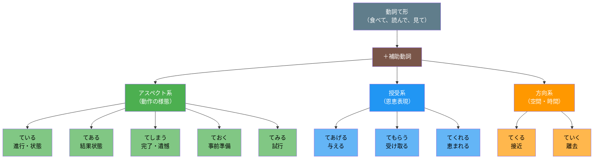

## 日文

補助動詞（ほじょどうし）

### 文法情報

| 項目 | 內容 |
|------|------|
| 文法類型 | 文法範疇 |
| JLPT | N3 |
| 使用場面 | 日常會話、書面語 |
| 形成 | 動詞て形 + 補助動詞 |

### 形成規則

**基本形式**
```
動詞て形 + 補助動詞
```

**主要補助動詞一覽**
```
〜ている    (進行・状態)
〜てある    (結果状態の持続)
〜てしまう  (完了・遺憾)
〜ておく    (事前準備・放置)
〜てみる    (試行)
〜てくる    (接近・変化の発生)
〜ていく    (離去・変化の継続)
〜てあげる  (恩恵の授与)
〜てもらう  (恩恵の受領)
〜てくれる  (恩恵の付与)
```

## 圖解



## 日文解釋

補助動詞とは、動詞のて形に接続して、本来の動詞の意味に文法的な意味を付け加える動詞のことである。本動詞としての具体的な意味は薄れ、主に文法的機能を担う。

補助動詞の最も重要な特徴は、**本動詞から文法化**したものが多いという点である。例えば、「いる」は本動詞として「存在する」という意味を持つが、「〜ている」という補助動詞として使われると、動作の進行や結果状態の持続という文法的意味を表す。同様に、「しまう」は本動詞として「片付ける」という意味を持つが、「〜てしまう」では完了や遺憾の意味を表す。

補助動詞は大きく三つのグループに分類できる。第一はアスペクト（動作の様態）を表すもので、「ている」「てある」「てしまう」「ておく」「てみる」がある。第二は授受表現を表すもので、「てあげる」「てもらう」「てくれる」がある。第三は方向性（空間的・時間的）を表すもので、「てくる」「ていく」がある。

日本語学習において、補助動詞の習得は極めて重要である。これらは日常会話で非常に頻繁に使われ、ニュアンスの細かい表現に不可欠である。特に「〜ている」は最も基本的かつ重要な補助動詞であり、N5レベルから学習が始まる。

## 英文解釋

Auxiliary verbs (hojo doushi) in Japanese are verbs that attach to the te-form of other verbs to add grammatical meaning. They have lost much of their original concrete meaning and primarily serve grammatical functions.

The most important characteristic of auxiliary verbs is that many have undergone **grammaticalization from main verbs**. For example, "iru" as a main verb means "to exist," but as an auxiliary verb in "〜ている," it expresses progressive action or resultant state. Similarly, "shimau" means "to put away" as a main verb, but "〜てしまう" expresses completion or regret.

Auxiliary verbs can be classified into three main groups. The first group expresses aspect (manner of action) and includes "ている," "てある," "てしまう," "ておく," and "てみる." The second group expresses giving and receiving of benefits, including "てあげる," "てもらう," and "てくれる." The third group expresses direction (spatial or temporal) and includes "てくる" and "ていく."

Mastering auxiliary verbs is crucial for Japanese learners. They are used extremely frequently in daily conversation and are essential for nuanced expression. Particularly, "〜ている" is the most fundamental auxiliary verb, with learning beginning at the N5 level.

## 中文解釋

補助動詞是指接在動詞て形後面，為原本動詞添加語法意義的動詞。這些動詞作為本動詞的具體意義已經淡化，主要承擔語法功能。

補助動詞最重要的特徵是，許多都是**從本動詞語法化**而來的。例如，「いる」作為本動詞意思是「存在」，但作為「〜ている」的補助動詞使用時，則表達動作進行或結果狀態持續的語法意義。同樣地，「しまう」作為本動詞意思是「收拾」，但「〜てしまう」則表示完了或遺憾。

補助動詞可大致分為三個群組。第一組表達體貌（動作的樣態），包括「ている」「てある」「てしまう」「ておく」「てみる」。第二組表達授受表現（恩惠的給予和接受），包括「てあげる」「てもらう」「てくれる」。第三組表達方向性（空間上或時間上），包括「てくる」「ていく」。

對日語學習者來說，掌握補助動詞極為重要。它們在日常會話中使用頻率極高，是細膩表達不可或缺的要素。特別是「〜ている」是最基本且最重要的補助動詞，從 N5 級別就開始學習。

## 核心用法

### 用法 1：アスペクト系（體貌類）

表達動作的進行方式、完成狀態、準備狀態等。

**例句 1：〜ている（進行・狀態）**
```
今、本を読んでいる。
I am reading a book now.
我現在正在看書。
```

**例句 2：〜てしまう（完了・遺憾）**
```
宿題を忘れてしまった。
I forgot my homework (and I regret it).
我把作業忘記了（遺憾）。
```

### 用法 2：授受系（授受類）

表達動作中恩惠的給予和接受關係。

**例句 3：〜てあげる（為他人做某事）**
```
妹に英語を教えてあげた。
I taught English to my younger sister (for her benefit).
我教了妹妹英文（為她好）。
```

**例句 4：〜てもらう（請某人為自己做某事）**
```
友達に手伝ってもらった。
I had my friend help me.
我請朋友幫忙了。
```

### 用法 3：方向系（方向類）

表達動作的空間方向或時間變化方向。

**例句 5：〜てくる（接近・變化產生）**
```
雨が降ってきた。
It has started to rain.
開始下雨了。
```

**例句 6：〜ていく（離去・變化持續）**
```
これからも勉強していく。
I will continue studying from now on.
今後也會繼續學習下去。
```

## 文法規則

### 規則 1：必須接在て形後面

所有補助動詞都必須接在動詞的て形後面，不能直接接辞書形或其他形式。

**正確接續**
```
食べる → 食べて + いる → 食べている ✅
読む → 読んで + しまう → 読んでしまう ✅
書く → 書いて + おく → 書いておく ✅
```

**錯誤接續**
```
食べるいる ❌
読むしまう ❌
書くおく ❌
```

### 規則 2：補助動詞本身可以活用

補助動詞雖然語法化了，但仍保持動詞的活用能力。

**活用示例**
```
〜ている   → 〜ていた（過去）→ 〜ていない（否定）
〜てしまう → 〜てしまった → 〜てしまわない
〜ておく   → 〜ておいた → 〜ておかない
〜てみる   → 〜てみた → 〜てみない
```

### 規則 3：可以組合使用

多個補助動詞可以組合使用，但有順序限制。

**組合示例**
```
食べてしまっておく（吃完後放著）
読んでみている（正在試著讀）
買ってきてくれた（買來了給我）
```

### 規則 4：口語縮約形

日常會話中，部分補助動詞有縮約形式。

**縮約規則**
```
〜ている → 〜てる
〜ておく → 〜とく
〜てしまう → 〜ちゃう／〜じゃう
〜ていく → 〜てく
〜てくる → 〜てくる（較少縮約）
```

## 常見錯誤

### 錯誤 1：直接接辞書形

❌ 誤：食べるいます。
✅ 正：食べています。
說明：補助動詞必須接在て形後面，不能接辞書形。

### 錯誤 2：混淆「いる」和「ある」

❌ 誤：窓が開いてある。（自動詞接てある）
✅ 正：窓が開けてある。（他動詞接てある）
✅ 正：窓が開いている。（自動詞接ている）
說明：「〜てある」只能接他動詞，自動詞要用「〜ている」。

### 錯誤 3：授受表現的方向錯誤

❌ 誤：先生が私に教えてもらった。
✅ 正：先生に教えてもらった。
✅ 正：先生が私に教えてくれた。
說明：「てもらう」的動作者用「に」標記；「てくれる」的動作者是主語。

### 錯誤 4：誤用縮約形

❌ 誤：読んでちゃった。
✅ 正：読んじゃった。
說明：「でしまう」縮約為「じゃう」，不是「ちゃう」。「てしまう」才縮約為「ちゃう」。

## 學習要點

1. **系統理解**：將補助動詞分為三大類（體貌、授受、方向）來記憶，有助於系統理解。

2. **本動詞對照**：理解每個補助動詞的本動詞意義，有助於掌握其語法化後的意義。

3. **口語縮約**：日常會話中縮約形極為常見，必須熟悉各種縮約規則。

4. **組合使用**：進階階段要學習補助動詞的組合使用，這能表達更複雜的意義。

5. **語境判斷**：某些補助動詞（如「〜てしまう」）根據語境有不同意義，需要培養語感。

## 相關連結

### 主要補助動詞

- [〜ている](079_te_iru.md) - 進行・狀態持續
- [〜てある](077_te_aru.md) - 結果狀態的持續
- [〜てしまう](078_te_shimau.md) - 完了・遺憾
- [〜ておく](080_te_oku.md) - 事前準備・放置
- [〜てみる](081_te_miru.md) - 試行

### 授受表現

- [〜てあげる](137_te_ageru.md) - 恩惠的給予（對下或平輩）
- [〜てもらう](054_te_morau.md) - 恩惠的接受
- [〜てくれる](053_te_kureru.md) - 恩惠的付與

### 方向表現

- [〜てくる・〜ていく](035_tekuru_teiku.md) - 方向性補助動詞

### 相關概念

- [て形](002_te_form.md) - 補助動詞的接續基礎

---

**建立日期**: 2025-12-27
**最後更新**: 2025-12-27
**字數**: ~3,500
**例句數**: 6
