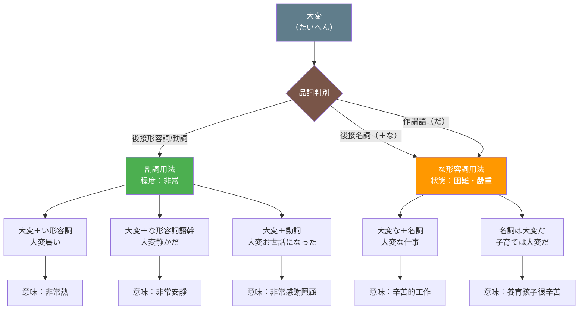

## 日文

大変の多義用法（たいへん の たぎ ようほう）

### 文法情報

| 項目 | 內容 |
|------|------|
| 文法類型 | 副詞 / な形容詞 |
| JLPT | N4 |
| 使用場面 | 日常會話、書面語、新聞報導 |
| 漢字表記 | 大変 |

## 日文解釋

「大変」は二つの異なる品詞として機能する多義語である。

**第一義：副詞（程度を表す）**

程度が非常に高いことを表す副詞。「とても」「非常に」と同義で、形容詞や動詞を修飾する。やや改まった印象があり、「とても」より硬い文体で使われることが多い。肯定的な場面でも否定的な場面でも使用可能。

**第二義：な形容詞（状態を表す）**

困難な状況や深刻な事態を表すな形容詞。「大変な」の形で名詞を修飾したり、「大変だ」の形で述語として機能する。この用法では、主に否定的・困難な状況を描写するのに使われ、「辛い」「困った」「重大な」といった意味合いを持つ。

**用法の区別**

副詞用法とな形容詞用法は文中の位置と接続で区別できる。副詞は「大変＋形容詞/動詞」の形をとり、な形容詞は「大変な＋名詞」または「大変だ」の形をとる。

## 英文解釋

"Taihen" (大変) is a polysemous word that functions as two different parts of speech in Japanese.

**1. Adverb (Degree Modifier)**

As an adverb, "taihen" expresses a high degree or intensity, similar to "very" or "extremely" in English. It modifies adjectives and verbs to emphasize their intensity. This usage is slightly more formal than "totemo" (とても) and can be used in both positive and negative contexts.

**2. Na-adjective (State Descriptor)**

As a na-adjective, "taihen" describes difficult situations, serious matters, or challenging circumstances. In the form "taihen na" (大変な), it modifies nouns, and in the form "taihen da" (大変だ), it functions as a predicate. This usage primarily conveys negative connotations such as "hard," "difficult," "serious," or "troublesome."

**Distinguishing the Two Uses**

The adverb usage appears before adjectives or verbs (taihen + adjective/verb), while the na-adjective usage appears with "na" before nouns (taihen na + noun) or as a predicate (taihen da).

## 中文解釋

「大変」是一個具有多重意義的多義詞，在日文中可作為兩種不同詞性使用。

**1. 副詞用法（表示程度）**

作為副詞時，「大変」表示程度非常高，相當於中文的「非常」「很」「極為」。用來修飾形容詞和動詞，強調其程度。這個用法比「とても」稍顯正式，在肯定和否定的語境中都可使用。

**2. な形容詞用法（表示狀態）**

作為な形容詞時，「大変」描述困難的情況、嚴重的事態或艱辛的狀況。以「大変な」的形式修飾名詞，或以「大変だ」的形式作謂語。這個用法主要傳達負面含義，如「辛苦的」「困難的」「嚴重的」「麻煩的」等。

**如何區分兩種用法**

副詞用法出現在形容詞或動詞之前（大変＋形容詞/動詞），而な形容詞用法則是「大変な＋名詞」或作為謂語「大変だ」的形式。

## 核心用法

### 用法 1：副詞（程度副詞）

表示程度非常高，修飾形容詞或動詞。

**例句 1**
```
今日は大変暑いですね。
It's extremely hot today, isn't it?
今天非常熱呢。
```

**例句 2**
```
この映画は大変面白かった。
This movie was very interesting.
這部電影非常有趣。
```

**例句 3**
```
先生のお話を聞いて、大変勉強になりました。
I learned a lot from listening to the teacher's talk.
聽了老師的話，受益良多。
```

**例句 4**
```
お忙しいところ、大変申し訳ございません。
I'm terribly sorry to bother you when you're busy.
在您百忙之中打擾，非常抱歉。
```

### 用法 2：な形容詞（表示困難・嚴重）

描述困難或嚴重的情況。

**例句 5**
```
一人で引っ越しするのは大変だ。
Moving by yourself is tough.
一個人搬家很辛苦。
```

**例句 6**
```
子育ては大変な仕事です。
Raising children is a demanding job.
養育孩子是很辛苦的工作。
```

**例句 7**
```
大変なことになった！財布を忘れてきた。
This is terrible! I left my wallet behind.
糟糕了！我忘了帶錢包。
```

**例句 8**
```
地震で大変な被害が出た。
The earthquake caused serious damage.
地震造成了嚴重的災害。
```

## 用法比較

### 副詞 vs な形容詞 對比

| 用法 | 結構 | 意義 | 例句 |
|------|------|------|------|
| 副詞 | 大変 + 形容詞/動詞 | 非常、很 | 大変嬉しい（非常高興） |
| な形容詞 | 大変な + 名詞 | 辛苦的、困難的 | 大変な仕事（辛苦的工作） |
| な形容詞 | 大変だ | 很辛苦、很嚴重 | 今日は大変だった（今天很辛苦） |

### 「大変」vs「とても」vs「非常に」

| 詞彙 | 正式程度 | 使用場面 | 備註 |
|------|---------|---------|------|
| とても | 普通 | 日常會話 | 最常用 |
| 大変 | 稍正式 | 會話、文章 | 有書面語感 |
| 非常に | 正式 | 書面語、演講 | 最正式 |

## 常見錯誤

### 錯誤 1：誤用「大変い」

❌ 誤：この仕事は大変い。
✅ 正：この仕事は大変だ。
說明：「大変」是な形容詞，不是い形容詞。謂語形式是「大変だ」，不是「大変い」。

### 錯誤 2：副詞與な形容詞混淆

❌ 誤：大変な面白い映画
✅ 正：大変面白い映画
說明：修飾形容詞時用副詞「大変」，不加「な」。「大変な」只用於修飾名詞。

### 錯誤 3：語境誤用

❌ 不自然：今日は大変だ。（無上下文，對方不理解）
✅ 自然：今日は仕事が忙しくて大変だった。
說明：單獨使用「大変だ」時，需要有上下文或具體說明什麼事情困難。

## 圖解



## 學習要點

1. **區分詞性是關鍵**：看「大変」後面接什麼來判斷詞性。接形容詞或動詞是副詞，接「な＋名詞」或作謂語「だ」是な形容詞。

2. **語境決定意義**：副詞「大変」中性，可用於正面或負面；な形容詞「大変」通常帶有負面或困難的含義。

3. **正式程度**：「大変」比「とても」正式，在商業場合或書面語中更常見。

4. **慣用表達**：「大変お世話になりました」「大変申し訳ございません」是常見的禮貌表達，需整體記憶。

5. **感嘆用法**：「大変だ！」可單獨作為感嘆句，表示「糟了！」「不得了！」的意思。

## 相關連結

### 相關文法
- [副詞](../vocabulary/adverbs/index.md) - 日文副詞系統概論
- [な形容詞](../vocabulary/adjectives/na-adjectives/index.md) - な形容詞的用法
- [程度副詞](323_jikan_fukushi.md) - 程度與時間副詞

---

**建立日期**: 2025-12-27
**最後更新**: 2025-12-27
**字數**: ~2,200
**例句數**: 8
