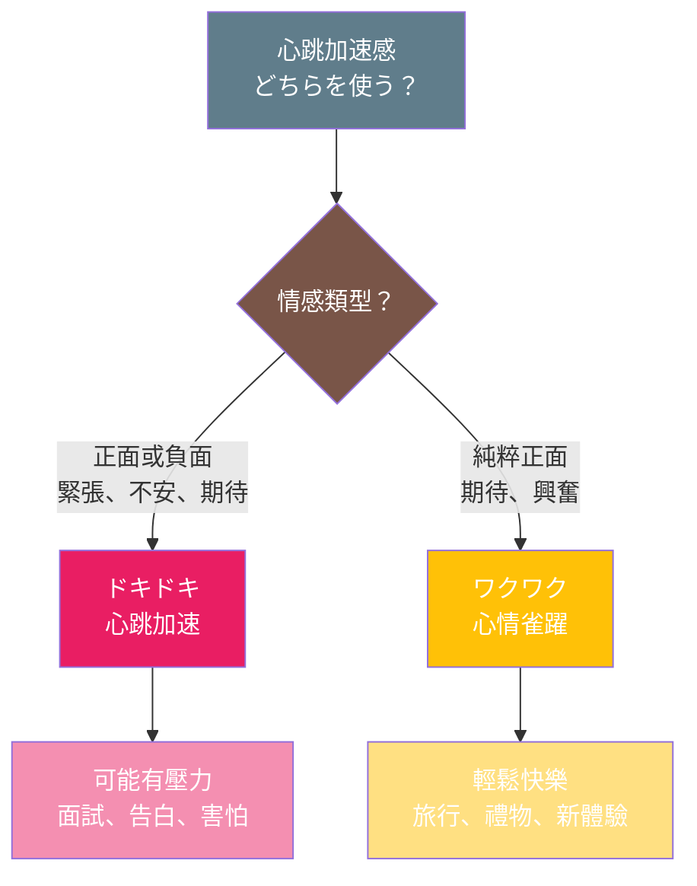

## 日文
ドキドキ

**羅馬拼音**：dokidoki

**詞性**：擬態詞（gitaigo）

## 日文解釋

心臓が速く強く打つ様子を表す擬態語。緊張や不安、期待、恋愛感情などで胸が高鳴る心理状態を描写する。心臓の鼓動音を直接的に表現するのではなく、その感覚や心理的な興奮状態を表す。主に感情的な場面で使われ、日常会話で非常によく用いられる表現。

## 英文解釋

**Equivalent**: heart-pounding, heart-thumping, palpitating

A mimetic word (gitaigo) that describes the feeling of one's heart beating fast and hard. It expresses psychological states of nervousness, anxiety, anticipation, or romantic excitement. Unlike onomatopoeia that directly imitates sound, this word captures the sensation and emotional experience of a racing heartbeat. Commonly used in everyday conversation to describe emotionally charged situations.

## 中文解釋

**擬態詞（gitaigo）**

描述心臟快速強烈跳動的感覺。表達緊張、不安、期待或戀愛情感等心理狀態下的心跳加速感受。這個詞不是直接模擬心跳聲音，而是捕捉那種心跳加速的感覺和情緒體驗。在日常對話中非常常用，用來描述情緒激動的場面。

**使用場景**：
- 緊張情境（面試、考試、發表）
- 期待興奮（約會前、重要時刻）
- 運動後心跳加速
- 驚嚇或害怕的反應

## ドキドキ vs ワクワク 比較圖

**關鍵區別**：
- **ドキドキ**：情感範圍廣，可正面可負面
- **ワクワク**：只有正面期待的情緒

## 例句

### 例句 1
**日文**：明日の試験のことを考えると、ドキドキして眠れない。

**羅馬拼音**：Ashita no shiken no koto o kangaeru to, dokidoki shite nemurenai.

**英文**：When I think about tomorrow's exam, my heart pounds and I can't sleep.

**中文**：一想到明天的考試，就緊張得心跳加速，睡不著覺。

---

### 例句 2
**日文**：好きな人に告白する前、ドキドキが止まらなかった。

**羅馬拼音**：Suki na hito ni kokuhaku suru mae, dokidoki ga tomaranakatta.

**英文**：Before confessing to my crush, my heart wouldn't stop pounding.

**中文**：在向喜歡的人告白之前，心跳一直停不下來。

---

### 例句 3
**日文**：初めての海外旅行で、空港に着いた時からドキドキしていた。

**羅馬拼音**：Hajimete no kaigai ryokō de, kūkō ni tsuita toki kara dokidoki shite ita.

**英文**：On my first overseas trip, my heart was pounding from the moment I arrived at the airport.

**中文**：第一次出國旅行，從到達機場那刻起就興奮得心跳加速。

---

### 例句 4
**日文**：面接の結果を待っている間、ずっとドキドキしている。

**羅馬拼音**：Mensetsu no kekka o matte iru aida, zutto dokidoki shite iru.

**英文**：While waiting for the interview results, my heart keeps pounding.

**中文**：在等待面試結果的期間，一直緊張得心跳不已。

---

## 註解

### 擬態詞 vs 擬聲詞

**ドキドキ**是擬態詞（gitaigo），表達的是心跳加速的**感覺和心理狀態**，而非直接模擬心跳的聲音。雖然日文中「どきん」可以表示心跳的聲音（擬聲詞），但「ドキドキ」更側重於描述情緒激動時的內心感受。

### 語感與用法

- **重複形式**：「ドキドキ」採用重複結構，強化持續性和強度
- **動詞形**：常與「する」搭配使用：「ドキドキする」（心跳加速）
- **情感色彩**：可以是正面（期待、興奮）或負面（緊張、不安）
- **搭配詞**：
  - ドキドキが止まらない（心跳停不下來）
  - ドキドキ感（心跳加速的感覺）
  - 胸がドキドキする（胸口怦怦跳）

### 相似表現

- **わくわく**：更偏向期待和興奮的正面情緒
- **そわそわ**：坐立不安，較為焦慮
- **はらはら**：擔心緊張，觀看時的心情

---

## 相關連結

（待補充）
