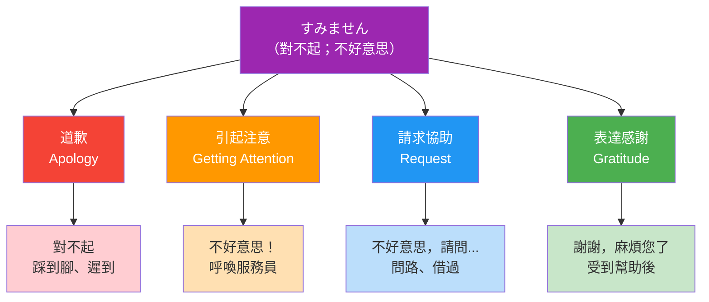

## 日文

すみません

**基本形式**：
- 動詞原形：済む（すむ）＝完結、結束
- 否定形：済まない（すまない）＝沒能完結、對不起
- 丁寧形：すみません
- 更禮貌：申し訳ございません（もうしわけございません）
- 過去式：すみませんでした

**基本意義**：
「すみません」源自動詞「済む」的否定形「済まない」，原意為「事情沒有完結」、「心裡過不去」，引申為對他人造成麻煩或需要幫助時的道歉或請求表達。這是日文中最多功能的禮貌用語之一，可以表達道歉、感謝、請求注意等多種意思。

**使用場景**：
1. **道歉**：對自己的過失或給他人添麻煩表達歉意
2. **引起注意**：呼喚服務員、詢問路人前的開場
3. **請求幫助**：需要打擾他人或請求協助時
4. **表達感謝**：對他人的幫助表達謝意（帶有「給您添麻煩了」的歉意）

## すみません 四大功能圖

## English

sumimasen

**Definition**:
"Sumimasen" derives from the negative form of the verb "sumu" (to be finished/settled), literally meaning "it's not settled" or "I can't let this pass." It has evolved into one of the most versatile polite expressions in Japanese, serving multiple functions including apology, gratitude, getting attention, and requesting help.

**Usage**:
- Apologizing (expressing regret for mistakes or inconveniences)
- Getting attention (calling a waiter, asking strangers for help)
- Requesting assistance (when you need to trouble someone)
- Expressing gratitude with humility (thanking while acknowledging the trouble caused)

**Key points**:
This multifunctional phrase reflects Japanese cultural values of humility and consideration for others. Unlike Western "excuse me" or "sorry," it carries a deeper sense of not wanting to burden others and maintaining social harmony.

## 中文解釋

すみません（對不起；不好意思）

**詳細說明**：
「すみません」是日文中功能最多樣化的禮貌用語，源自動詞「済む」（完結、了結）的否定形。字面意思是「沒能了結」、「心裡過意不去」，體現了日本文化中不願給他人添麻煩的謙遜態度。這個短語在日常生活中使用頻率極高，是日語學習者必須熟練掌握的基本用語。

**多重功能**：
1. **道歉功能**：
   - 輕微過失：碰到人、遲到、打擾他人
   - 表達歉意的同時保持禮貌距離

2. **引起注意**：
   - 呼喚服務員、店員
   - 向陌生人問路或請教

3. **請求協助**：
   - 需要他人幫忙時的開場白
   - 表達「不好意思打擾您」的意思

4. **表達感謝**：
   - 謝謝對方的幫助（帶有「給您添麻煩了」的歉意）
   - 比單純的「ありがとう」更謙遜

**與其他道歉表達的區別**：
- 「すみません」：日常最常用，多功能
- 「ごめんなさい」：主要用於道歉，較直接
- 「申し訳ございません」：正式道歉，商務或嚴重過失時使用
- 「失礼します」：離開或打擾前的禮貌用語

## 例句

### 例句 1：
**日**: すみません、ちょっと道を教えていただけますか。
**英**: Excuse me, could you tell me the way?
**中**: 不好意思，能不能請您告訴我路怎麼走？

**情境**：向陌生人問路時使用，「すみません」用來引起對方注意並表達「不好意思打擾您」的意思。這是最典型的請求協助用法。

### 例句 2：
**日**: あ、すみません！足を踏んでしまいました。
**英**: Oh, I'm sorry! I stepped on your foot.
**中**: 啊，對不起！我踩到您的腳了。

**情境**：意外踩到別人的腳時立即道歉，這是典型的道歉功能。語調要誠懇，表達真誠的歉意。

### 例句 3：
**日**: 昨日は手伝ってくれて、すみませんでした。
**英**: Thank you for helping me yesterday. / Sorry for the trouble yesterday.
**中**: 昨天麻煩您幫忙了，真不好意思。

**情境**：感謝對方昨天的幫助，使用過去式「すみませんでした」。這種用法同時包含感謝和歉意，體現「給您添麻煩了」的謙遜態度，是日本文化的特色表達。

## 學習要點

1. **發音要點**：
   - 「す」要清晰，不要發成「しゅ」
   - 重音在「み」：su-MI-ma-sen
   - 語調要根據情境調整（道歉時下降，呼喚時上揚）

2. **四大功能記憶法**：
   - 道歉：すみません（對不起）
   - 呼喚：すみませーん（不好意思，服務員！）
   - 請求：すみませんが...（不好意思，請問...）
   - 感謝：すみません（謝謝，不好意思麻煩您了）

3. **正式程度選擇**：
   - 朋友間道歉：ごめん、ごめんね
   - 一般道歉：すみません
   - 正式道歉：申し訳ございません
   - 最正式：大変申し訳ございませんでした

4. **常見搭配**：
   - すみませんが...：不好意思，但是...（用於提出請求）
   - 本当にすみません：真的很抱歉
   - どうもすみません：非常抱歉
   - すみませんでした：對不起（過去式，更正式）

5. **文化注意事項**：
   - 日本人常用「すみません」代替「ありがとう」，強調「給您添麻煩了」
   - 過度使用在某些文化中可能顯得不自信，但在日本是禮貌和謙遜的表現
   - 服務業中，顧客和店員都會使用「すみません」，體現相互尊重

---

## 相關連結

### 相關短語
（待建立）

### 相關文法
（待建立）

---

**建立日期**: 2025-12-18
**最後更新**: 2025-12-18
